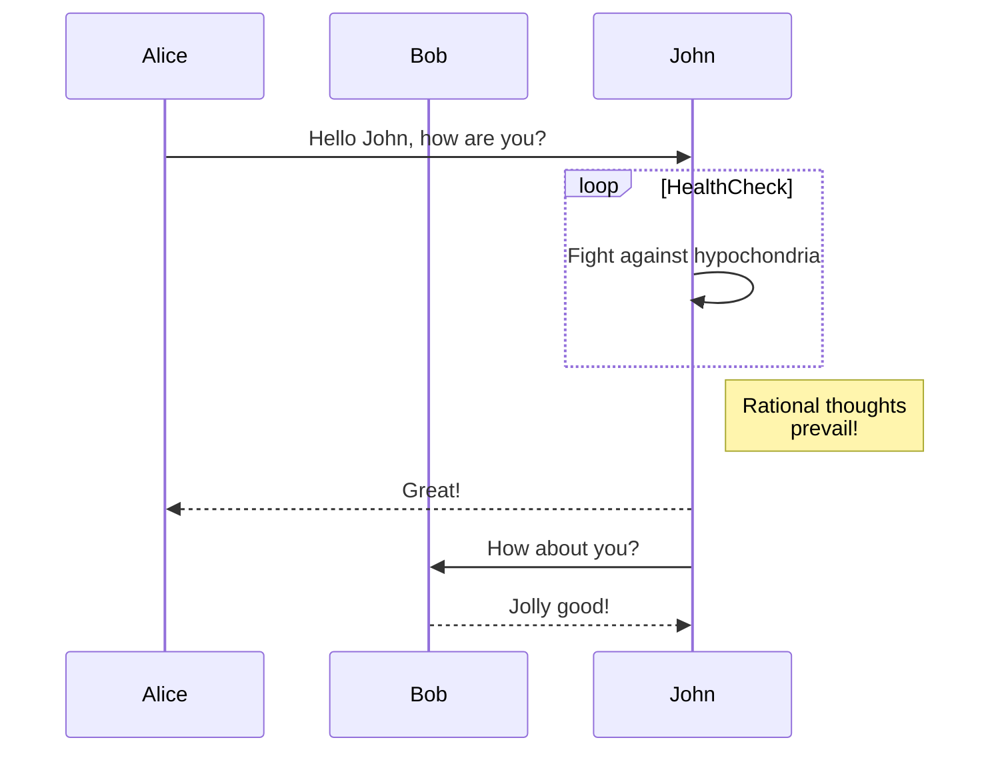
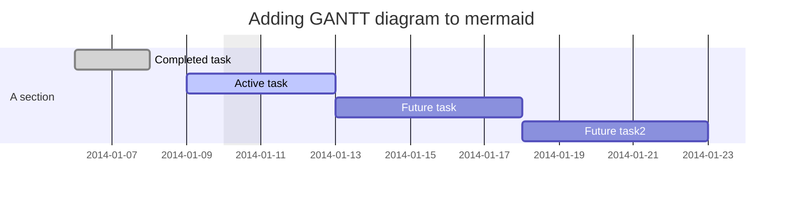
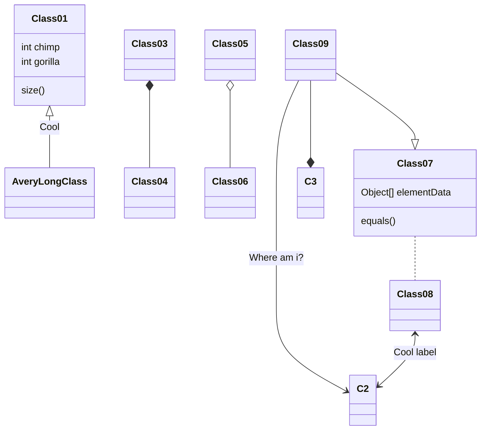
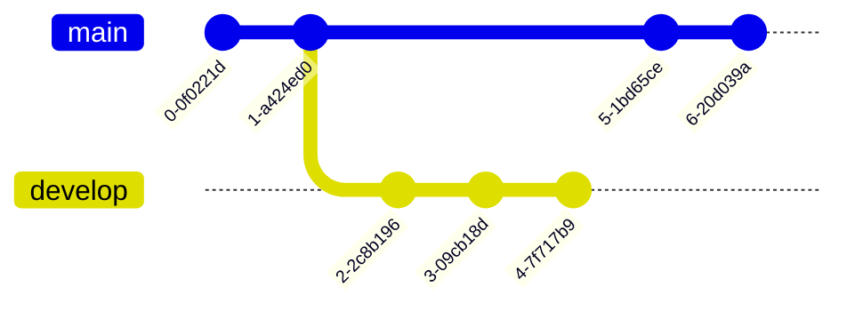
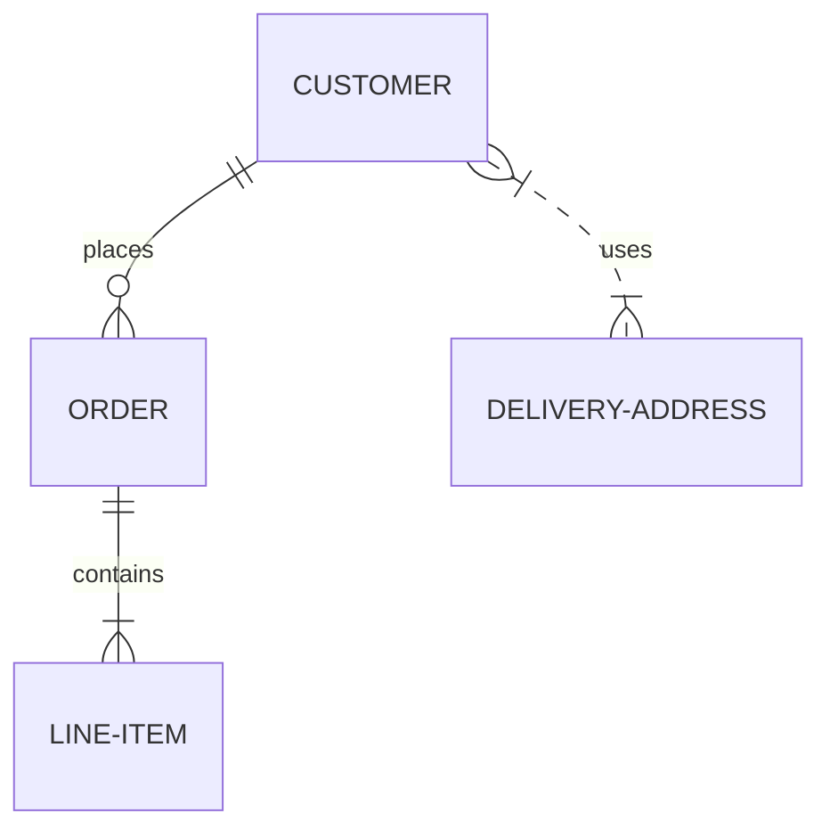
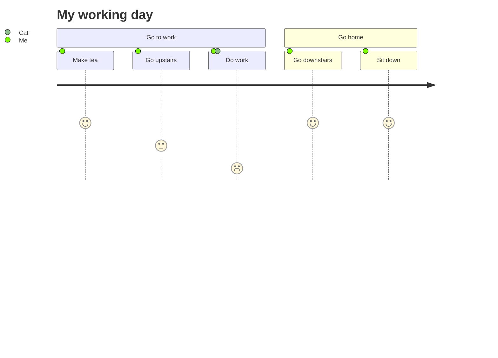
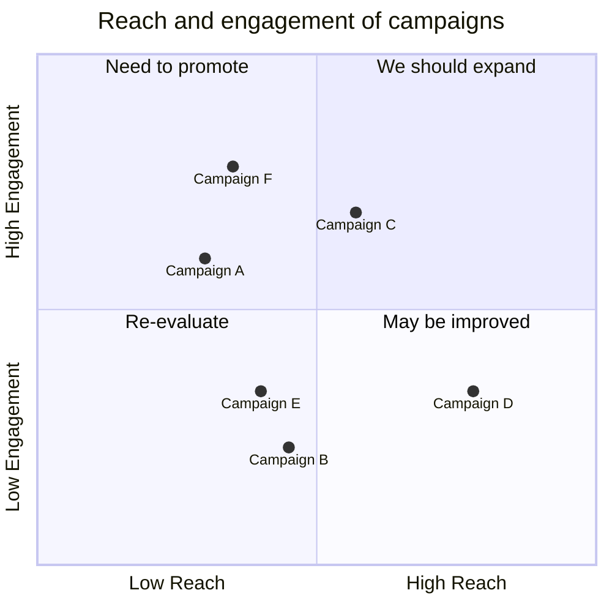
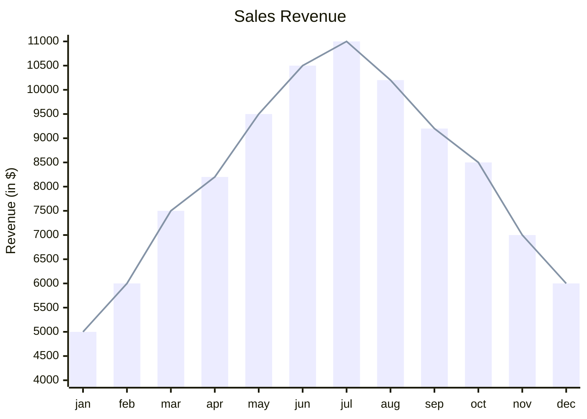

# Mermaid – Text‑Based Diagramming Library

Mermaid lets you create diagrams and visualizations using plain text.  
It is a JavaScript‑based tool that renders Markdown‑style definitions into SVG charts and diagrams.  
If you are familiar with Markdown, learning Mermaid is straightforward.

---

## Table of Contents

1. [Introduction](#introduction)
2. [Getting Started](#getting-started)
3. [Diagram Syntax](#diagram-syntax)
4. [Diagram Types](#diagram-types)
5. [Installation & Deployment](#installation--deployment)
6. [Mermaid API](#mermaid-api)
7. [Security](#security)
8. [Contributing](#contributing)
9. [References](#references)

---

## 1. Introduction

Mermaid is a JavaScript library that renders diagrams from text definitions.  
It is useful for:

* Keeping documentation up‑to‑date
* Embedding diagrams in Markdown, wikis, blogs, and web pages
* Automating diagram generation in CI/CD pipelines

---

## 2. Getting Started

### 2.1 CDN

```html
<script type="module">
  import mermaid from 'https://cdn.jsdelivr.net/npm/mermaid@11/dist/mermaid.esm.min.mjs';
  mermaid.initialize({ startOnLoad: true });
</script>
```

Mermaid will automatically render any `<div>` or `<pre>` with `class="mermaid"`.

### 2.2 NPM / Yarn / Pnpm

```bash
# npm
npm i mermaid

# yarn
yarn add mermaid

# pnpm
pnpm add mermaid
```

---

## 3. Diagram Syntax

Mermaid uses a Markdown‑inspired syntax.  
Each diagram type has its own keyword (e.g., `graph`, `sequenceDiagram`, `gantt`, etc.).

### 3.1 Flowchart


### 3.2 Sequence Diagram



### 3.3 Gantt Diagram



### 3.4 Class Diagram



### 3.5 Git Graph



### 3.6 Entity Relationship Diagram (Experimental)



### 3.7 User Journey Diagram



### 3.8 Quadrant Chart



### 3.9 XY Chart (Beta)



---

## 4. Diagram Types

| Diagram | Keyword | Description |
|--------|--------|------------|
| Flowchart | `graph` | Directed or undirected graphs |
| Sequence Diagram | `sequenceDiagram` | Interaction between participants |
| Gantt | `gantt` | Project timelines |
| Class Diagram | `classDiagram` | UML class relationships |
| Git Graph | `gitGraph` | Git commit history |
| ER Diagram | `erDiagram` | Entity‑Relationship models |
| User Journey | `journey` | User experience flows |
| Quadrant Chart | `quadrantChart` | 2‑D quadrant visualisation |
| XY Chart | `xychart-beta` | Scatter/line/bar plots |

---

## 5. Installation & Deployment

### 5.1 Node Environment

```bash
# Install Node 16+ (recommended via volta)
volta install node
volta install pnpm
```

### 5.2 Clone & Build

```bash
git clone https://github.com/mermaid-js/mermaid.git
cd mermaid
pnpm install
pnpm test
```

### 5.3 Linting

```bash
pnpm lint
```

### 5.4 Publishing

```bash
# Update version in package.json
npm publish
```

---

## 6. Mermaid API

```js
import mermaid from 'https://cdn.jsdelivr.net/npm/mermaid@11/dist/mermaid.esm.min.mjs';
mermaid.initialize({ startOnLoad: true });
```

Mermaid will parse `<div class="mermaid">` or `<pre class="mermaid">` tags and render SVG.

---

## 7. Security

Mermaid sanitises diagram code, but user‑supplied content can still contain malicious scripts.  
For high‑risk environments, render diagrams inside a sandboxed `<iframe>` to block JavaScript execution.

---

## 8. Contributing

* Add new diagram types (mindmaps, ER‑diagrams, etc.)
* Improve existing diagrams
* Fix bugs, improve docs

See the [contribution guidelines](https://github.com/mermaid-js/mermaid/blob/main/CONTRIBUTING.md).

---

## 9. References

* [Mermaid Live Editor](https://mermaid.live)
* [Mermaid CLI](https://github.com/mermaid-js/mermaid-cli)
* [Mermaid Tiny](https://github.com/mermaid-js/mermaid-tiny)
* [Mermaid Webpack Demo](https://github.com/mermaid-js/mermaid-webpack-demo)
* [Mermaid Parcel Demo](https://github.com/mermaid-js/mermaid-parcel-demo)

---