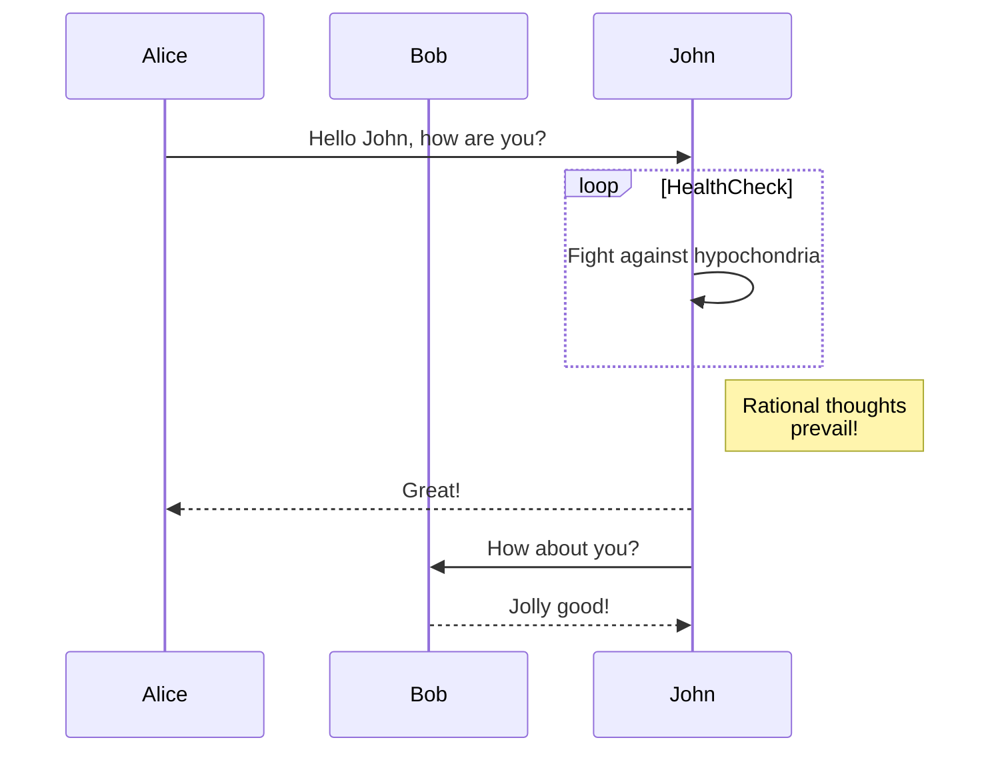
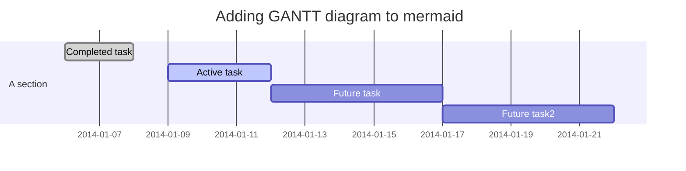

# Mermaid – Text‑Based Diagramming Library

Mermaid lets you create diagrams and visualisations using plain text.  
It is a JavaScript‑based renderer that turns Markdown‑style definitions into SVG charts.

> **Why Mermaid?**  
> Documentation that changes with code is hard to maintain.  
> Mermaid keeps diagrams in sync with your source by letting you write them in the same language you already use.

---

## 1. Getting Started

### 1.1 Install

| Package manager | Command |
|----------------|--------|
| npm | `npm i mermaid` |
| yarn | `yarn add mermaid` |
| pnpm | `pnpm add mermaid` |

### 1.2 CDN

```html
<script type="module">
  import mermaid from 'https://cdn.jsdelivr.net/npm/mermaid@11/dist/mermaid.esm.min.mjs';
  mermaid.initialize({ startOnLoad: true });
</script>
```

Mermaid will automatically render any `<div>` or `<pre>` with `class="mermaid"`.

---

## 2. Diagram Types & Syntax

Below are the most common diagram types with a minimal example for each.  
All examples are runnable in the Mermaid Live Editor.

| Diagram | Syntax | Example |
|--------|-------|--------|
| **Flowchart** | `graph TD;` | ```mermaid graph TD; A-->B; A-->C; B-->D; C-->D;``` |
| **Sequence Diagram** | `sequenceDiagram` | ```mermaid sequenceDiagram participant Alice participant Bob Alice->>John: Hello John, how are you?``` |
| **Gantt** | `gantt` | ```mermaid gantt dateFormat YYYY-MM-DD title Adding GANTT diagram to mermaid section A section Completed task :done, des1, 2014-01-06,2014-01-08``` |
| **Class Diagram** | `classDiagram` | ```mermaid classDiagram Class01 <|-- AveryLongClass : Cool``` |
| **Git Graph** | `gitGraph` | ```mermaid gitGraph commit commit branch develop commit``` |
| **Entity‑Relationship Diagram** | `erDiagram` | ```mermaid erDiagram CUSTOMER ||--o{ ORDER : places``` |
| **User Journey** | `journey` | ```mermaid journey title My working day section Go to work Make tea: 5: Me``` |
| **Quadrant Chart** | `quadrantChart` | ```mermaid quadrantChart title Reach and engagement of campaigns x-axis Low Reach --> High Reach y-axis Low Engagement --> High Engagement``` |
| **XY Chart** | `xychart-beta` | ```mermaid xychart-beta title "Sales Revenue" x-axis [jan, feb, mar] y-axis "Revenue (in $)" 4000 --> 11000 bar [5000, 6000, 7500]``` |

> **Tip** – All examples can be copied into the Mermaid Live Editor (Ctrl + Enter) to see the rendered diagram.

---

## 3. Configuration

```js
mermaid.initialize({
  startOnLoad: true,
  theme: 'default',
  // other options...
});
```

See the full list of options in the [Mermaid API documentation](https://mermaid.js.org/api/mermaid.html).

---

## 4. Security

Mermaid sanitises diagram code, but for public sites you can enable a sandboxed iframe to block any embedded JavaScript:

```js
mermaid.initialize({
  securityLevel: 'sandboxed',
});
```

> **Note** – Interactive features may be disabled in sandbox mode.

---

## 5. Development

```bash
# Clone
git clone https://github.com/mermaid-js/mermaid.git
cd mermaid

# Install
pnpm install

# Run tests
pnpm test

# Lint
pnpm lint
```

---

## 6. Contributing

- Add new diagram types (mindmaps, ER‑diagrams, etc.)
- Improve existing diagrams
- Fix bugs / security issues

See the [contribution guidelines](https://github.com/mermaid-js/mermaid/blob/main/CONTRIBUTING.md).

---

## 7. Resources

| Resource | Link |
|---------|------|
| Live Editor | https://mermaid.live |
| CLI | https://github.com/mermaid-js/mermaid-cli |
| Documentation | https://mermaid.js.org |
| Community Integrations | https://github.com/mermaid-js/mermaid/tree/main/integrations |

---

### Example: Flowchart


### Example: Sequence Diagram



### Example: Gantt Diagram



*(All examples above are fully runnable in the Mermaid Live Editor.)*