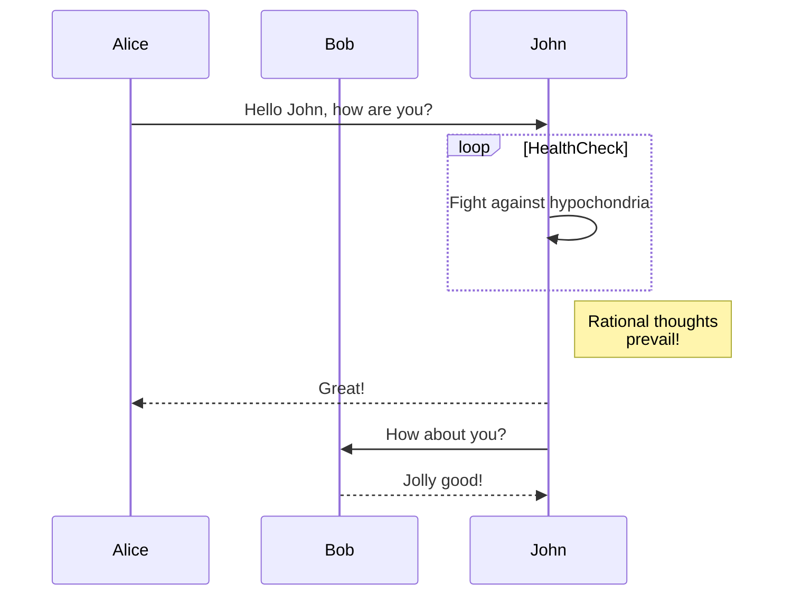
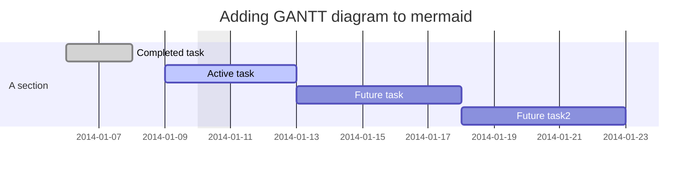
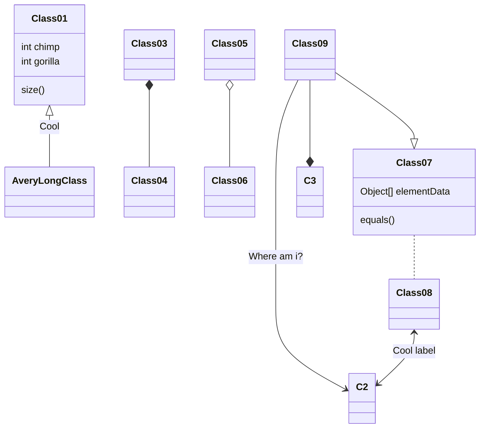
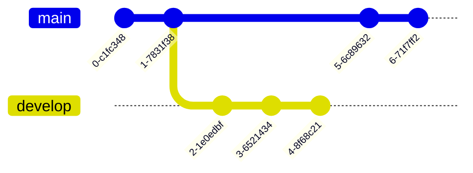
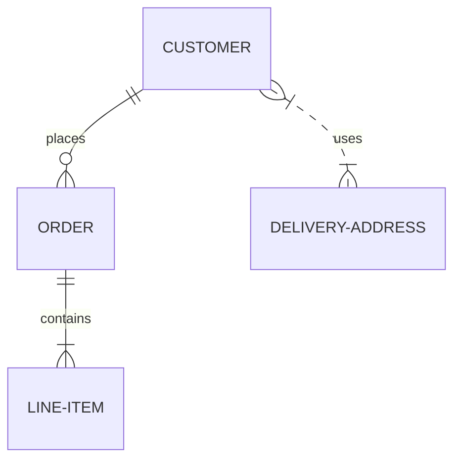
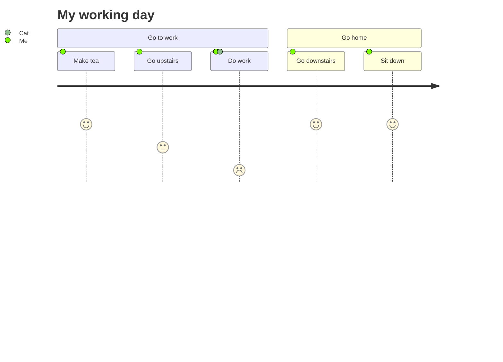
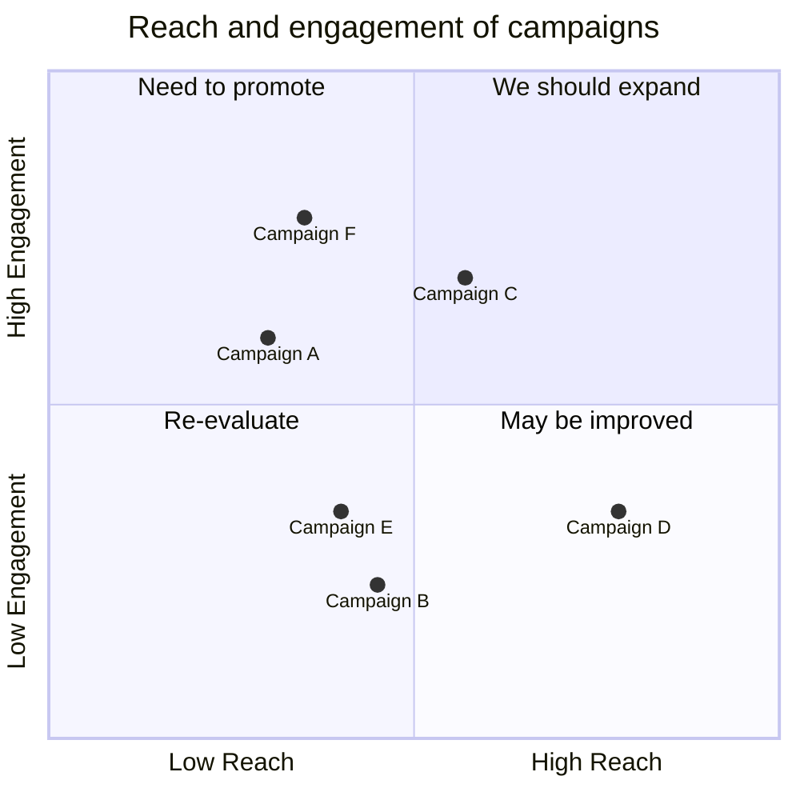
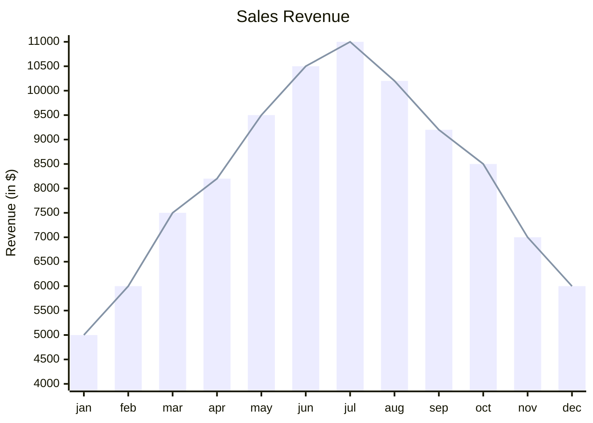

# Mermaid – Text‑Based Diagramming Library

Mermaid lets you create diagrams and visualizations using plain text.  
It is a JavaScript‑based tool that renders Markdown‑style definitions into SVG charts and diagrams.  
If you are familiar with Markdown, learning Mermaid is almost trivial.

---

## Table of Contents

1. [Introduction](#introduction)  
2. [Getting Started](#getting-started)  
3. [Syntax & Configuration](#syntax--configuration)  
4. [Diagram Types](#diagram-types)  
5. [Installation](#installation)  
6. [Deployment](#deployment)  
7. [Security](#security)  
8. [Contributing](#contributing)  

---

## 1. Introduction

Mermaid is a lightweight, JavaScript‑based diagramming tool that renders Markdown‑inspired text definitions into SVG charts.  
It is designed to keep documentation up‑to‑date by allowing diagrams to be edited alongside code.

---

## 2. Getting Started

### 2.1 CDN

```html
<script type="module">
  import mermaid from 'https://cdn.jsdelivr.net/npm/mermaid@11/dist/mermaid.esm.min.mjs';
  mermaid.initialize({ startOnLoad: true });
</script>
```

Mermaid will automatically render any `<div>` or `<pre>` tags with `class="mermaid"`.

### 2.2 Node Installation

```bash
# Using npm
npm i mermaid

# Using yarn
yarn add mermaid

# Using pnpm
pnpm add mermaid
```

---

## 3. Syntax & Configuration

Mermaid uses a simple, Markdown‑like syntax.  
Below are the most common diagram types with full examples.

### 3.1 Flowchart


### 3.2 Sequence Diagram



### 3.3 Gantt Diagram



### 3.4 Class Diagram



### 3.5 Git Graph



### 3.6 Entity Relationship Diagram (Experimental)



### 3.7 User Journey Diagram



### 3.8 Quadrant Chart



### 3.9 XY Chart (Beta)



---

## 4. Diagram Types

| Diagram | Description |
|--------|------------|
| Flowchart | Directed graphs |
| Sequence Diagram | Interaction between participants |
| Gantt | Project timelines |
| Class Diagram | UML class relationships |
| Git Graph | Git commit history |
| ER Diagram | Entity‑Relationship |
| User Journey | User flow |
| Quadrant Chart | 2‑D quadrant analysis |
| XY Chart | Scatter/line/bar plots |

---

## 5. Installation

### 5.1 CDN

```text
https://cdn.jsdelivr.net/npm/mermaid@<version>/dist/
```

Replace `<version>` with the desired release (e.g., `11`).

### 5.2 Node

```bash
# npm
npm i mermaid

# yarn
yarn add mermaid

# pnpm
pnpm add mermaid
```

---

## 6. Deployment

1. Install Node v16+ (recommended via `volta`).
2. Install Mermaid (`npm i mermaid`).
3. Add the script tag shown in **Getting Started** to your HTML.

---

## 7. Security

Mermaid sanitizes diagram code, but because diagrams contain many characters that are also HTML, sanitization is non‑trivial.  
For public sites, consider rendering diagrams in a sandboxed `<iframe>` to prevent execution of malicious scripts.

---

## 8. Contributing

Mermaid is an open‑source project.  
If you want to help:

1. Fork the repo: `git clone https://github.com/mermaid-js/mermaid.git`
2. Install dependencies: `pnpm install`
3. Run tests: `pnpm test`
4. Submit a pull request.

For more details, see the [Contribution Guidelines](https://github.com/mermaid-js/mermaid/blob/main/CONTRIBUTING.md).

---

### Acknowledgements

- d3 & dagre-d3 for layout libraries  
- js‑sequence‑diagram for sequence grammar  
- Jessica Peter for inspiration  
- Tyler Long for long‑term collaboration  

---