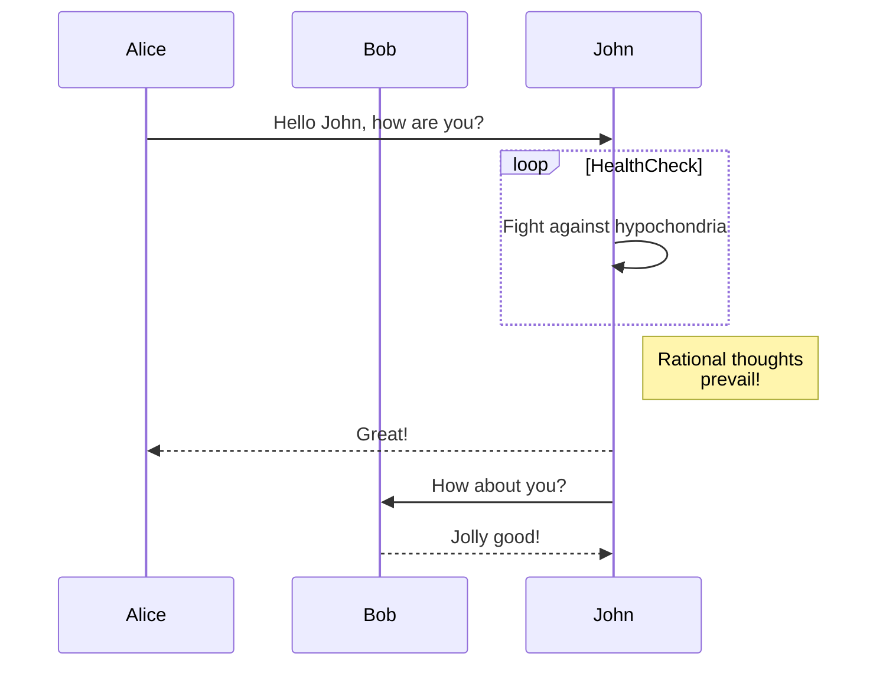
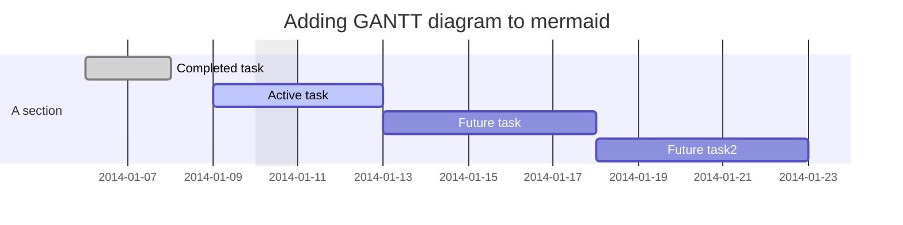
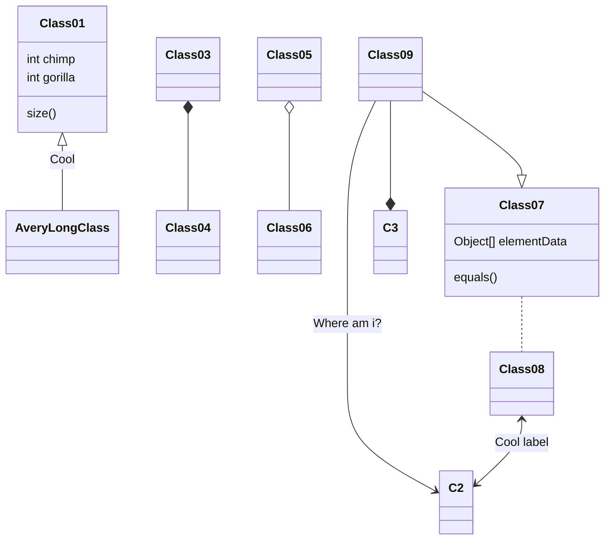
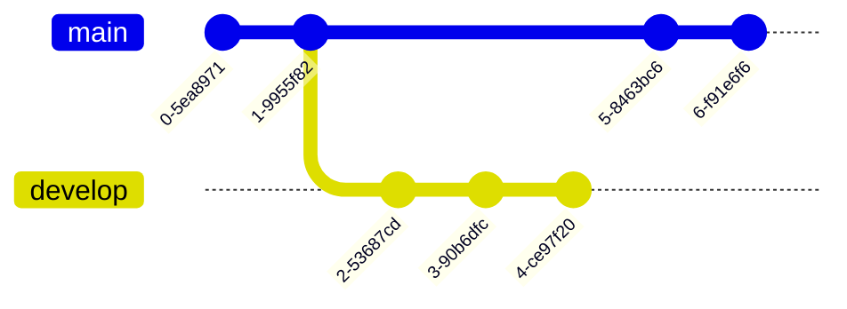
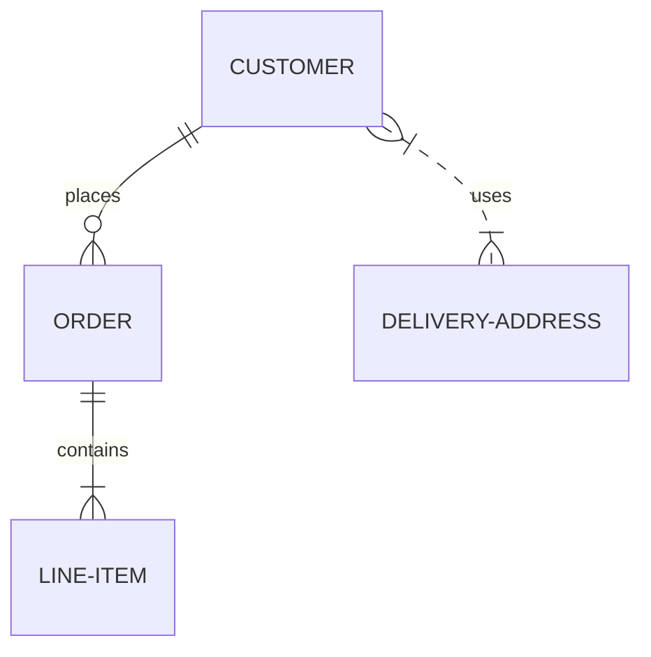
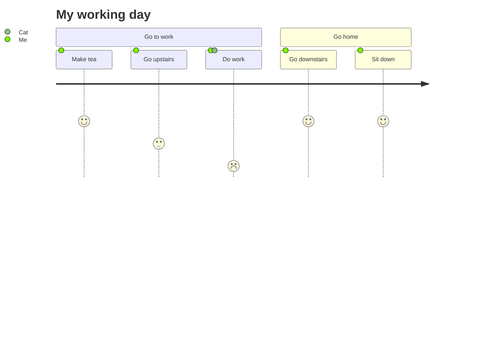
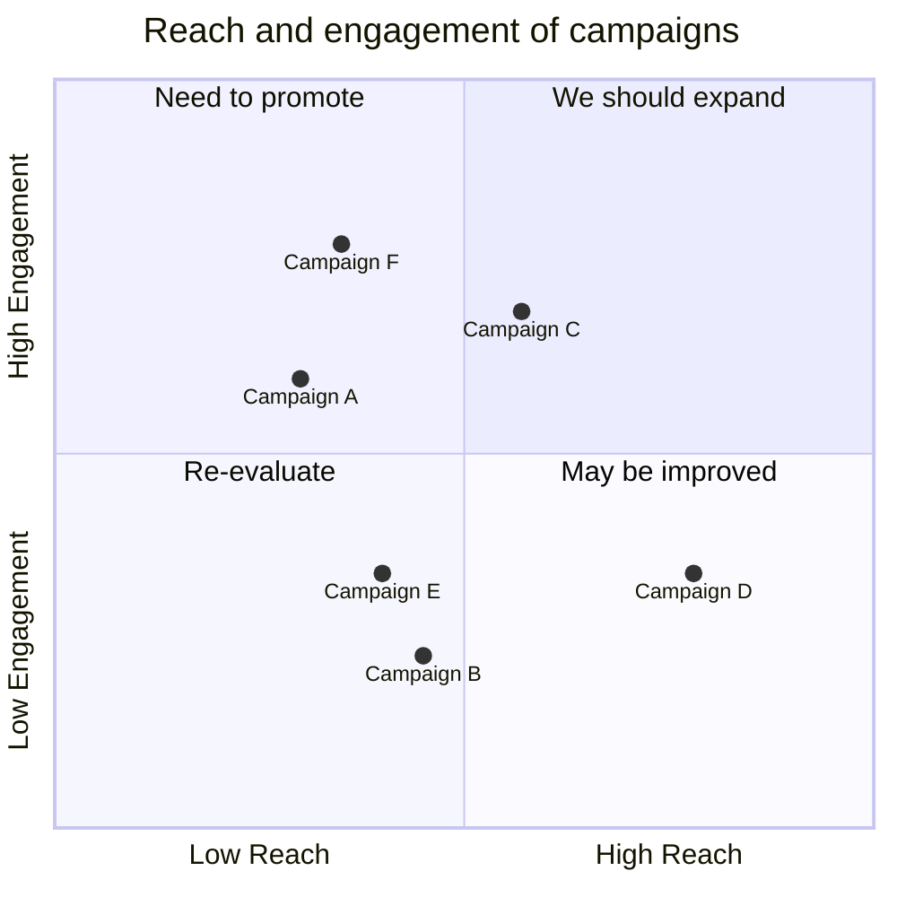
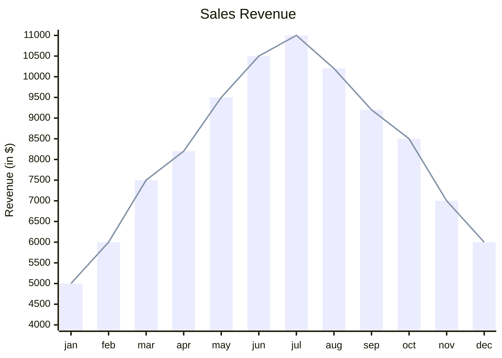

# Mermaid – Text‑Based Diagramming Library

Mermaid lets you create diagrams and visualizations using plain text.  
It is a JavaScript‑based renderer that turns Markdown‑style definitions into SVG charts.

> **Why Mermaid?**  
> Documentation that grows with code, keeps diagrams up‑to‑date, and can be embedded in Markdown, HTML, or any JavaScript project.

---

## Table of Contents

| Section | Description |
|--------|------------|
| [Getting Started](#getting-started) | Install, CDN, and basic usage |
| [Diagram Types](#diagram-types) | Overview of supported diagrams |
| [Syntax & Configuration](#syntax-and-configuration) | How to write Mermaid code |
| [Examples](#examples) | Full code snippets for each diagram |
| [Deployment](#deployment) | How to embed Mermaid in a web page |
| [Security](#security) | Sandbox rendering and sanitisation |
| [Contribution](#contributing) | How to help the project |

---

## Getting Started

### Install

```bash
# npm
npm i mermaid

# yarn
yarn add mermaid

# pnpm
pnpm add mermaid
```

### CDN

```html
<script type="module">
  import mermaid from 'https://cdn.jsdelivr.net/npm/mermaid@11/dist/mermaid.esm.min.mjs';
  mermaid.initialize({ startOnLoad: true });
</script>
```

Mermaid will automatically render any `<div>` or `<pre>` with `class="mermaid"`.

---

## Diagram Types

| Diagram | Typical Use |
|--------|------------|
| **Flowchart** | Process flows |
| **Sequence Diagram** | Interaction between actors |
| **Gantt** | Project timelines |
| **Class Diagram** | UML class relationships |
| **Git Graph** | Git commit history |
| **ER Diagram** | Entity‑Relationship |
| **Journey** | User journey |
| **Quadrant Chart** | Four‑quadrant analysis |
| **XY Chart** | Scatter / line charts |

---

## Syntax & Configuration

Mermaid uses a Markdown‑inspired syntax.  
A diagram starts with a keyword (`graph`, `sequenceDiagram`, `gantt`, etc.) followed by the diagram body.


Configuration options are passed to `mermaid.initialize()`:

```js
mermaid.initialize({
  startOnLoad: true,
  theme: 'forest',
  // …other options
});
```

---

## Examples

Below are complete, runnable snippets for each diagram type.  
Copy the code into a file with a `.md` or `.html` extension and open it in a browser that has Mermaid loaded.

### 1. Flowchart


### 2. Sequence Diagram



### 3. Gantt Diagram



### 4. Class Diagram



### 5. Git Graph



### 6. Entity‑Relationship Diagram



### 7. User Journey Diagram



### 8. Quadrant Chart



### 9. XY Chart (Beta)



---

## Deployment

Embed Mermaid in any HTML page:

```html
<div class="mermaid">
  <!-- Mermaid code goes here -->
</div>
```

Or use the CLI to generate SVGs:

```bash
npx mermaid-cli -i diagram.mmd -o diagram.svg
```

---

## Security

Mermaid sanitises diagram code, but for public sites you can enable sandboxed rendering:

```js
mermaid.initialize({
  securityLevel: 'sandbox',
  // other options
});
```

This prevents any JavaScript in the diagram from executing.

---

## Contributing

- Fork the repo: `git clone https://github.com/mermaid-js/mermaid.git`
- Install dependencies: `pnpm install`
- Run tests: `pnpm test`
- Submit PRs with linted code (`pnpm lint`)

See the [Contribution Guidelines](https://github.com/mermaid-js/mermaid/blob/main/CONTRIBUTING.md) for details.

---

## References

- [Mermaid Live Editor](https://mermaid.live)
- [Mermaid CLI](https://github.com/mermaid-js/mermaid-cli)
- [Mermaid Docs](https://mermaid-js.github.io/mermaid/#/)

---