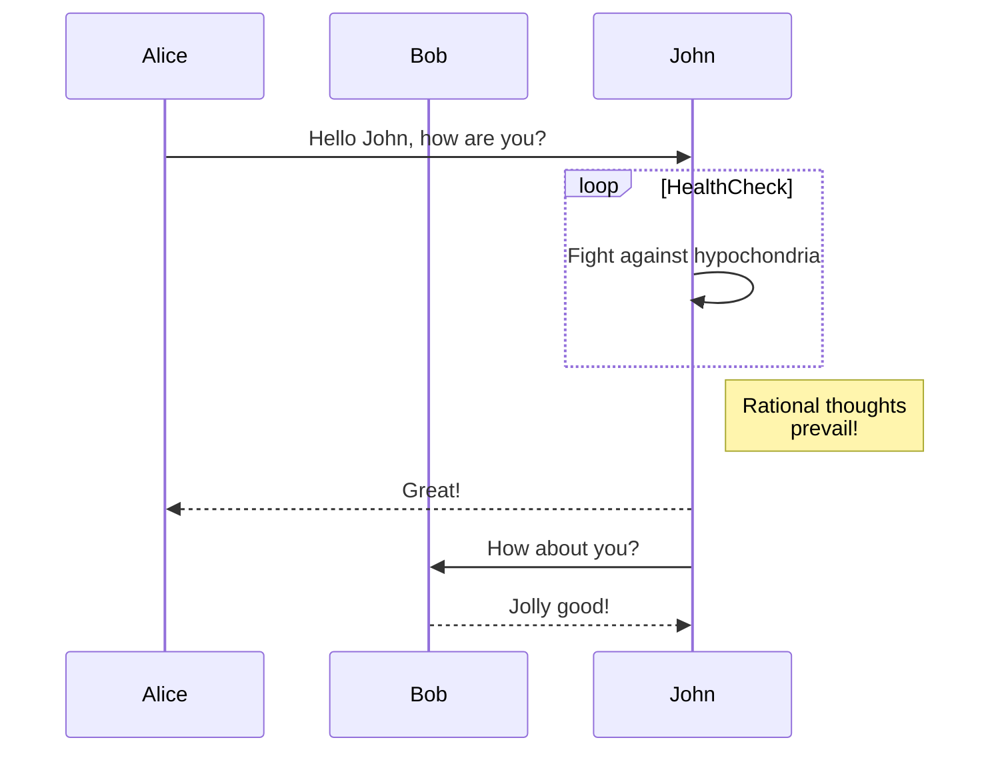
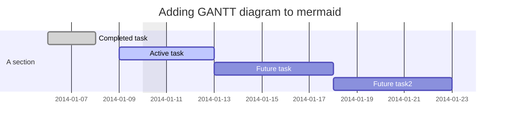
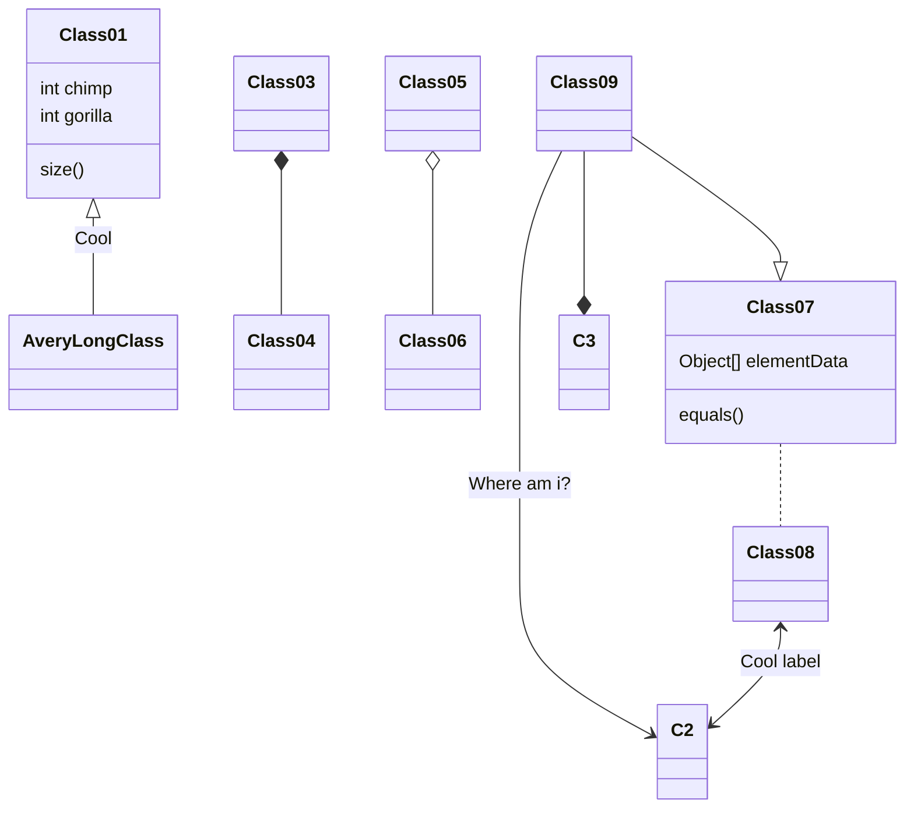
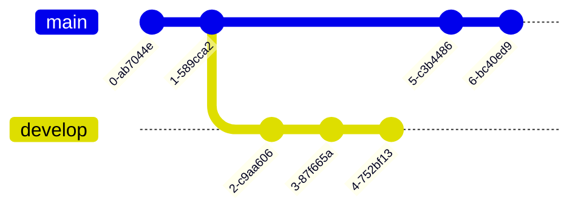
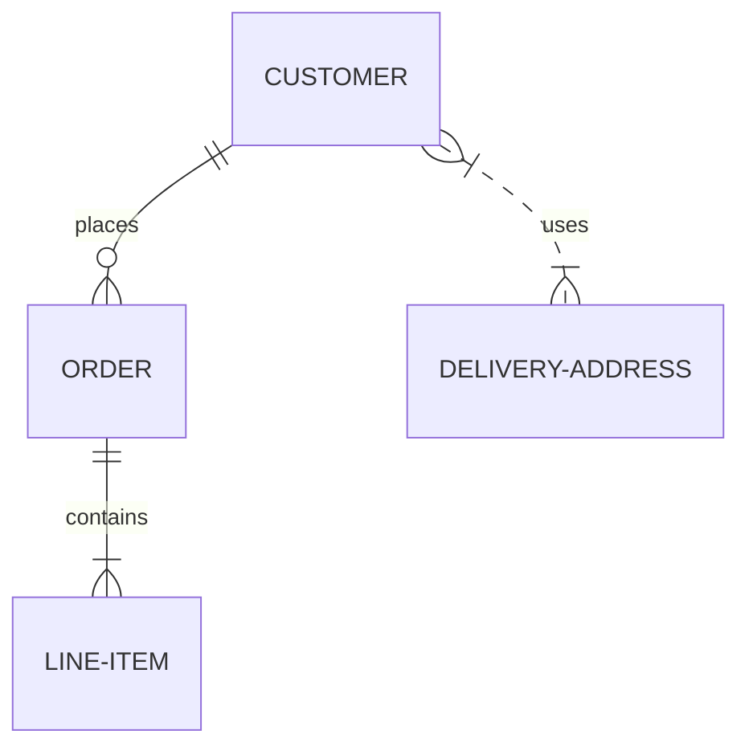
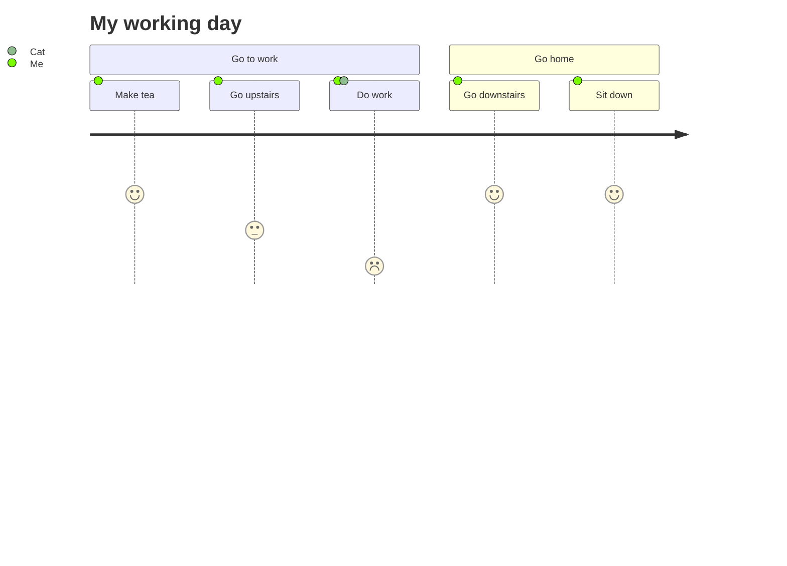
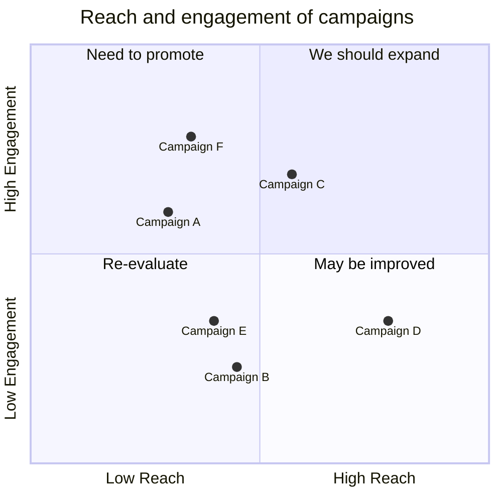
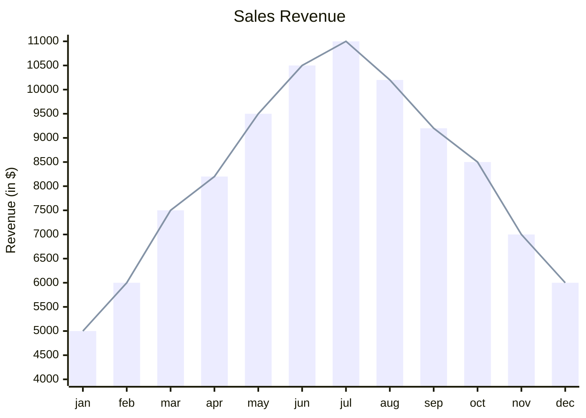

# Mermaid – Text‑Based Diagramming Library

Mermaid is a JavaScript‑based diagramming tool that turns plain‑text definitions into SVG charts.  
It is inspired by Markdown, so anyone familiar with Markdown can start writing diagrams immediately.

> **Why Mermaid?**  
> Documentation that is out‑of‑date is costly. Mermaid lets you keep diagrams in sync with code, making them easy to edit, version‑control, and embed in any web page or documentation system.

---

## Table of Contents

| Section | Description |
|--------|------------|
| [Installation](#installation) | CDN, npm, yarn, pnpm |
| [Getting Started](#getting-started) | Quick example |
| [Diagram Types](#diagram-types) | Flowchart, Sequence, Gantt, Class, Git Graph, ER, Journey, Quadrant, XY |
| [Configuration](#configuration) | `mermaid.initialize` options |
| [Security](#security) | Sandbox rendering |
| [Contributing](#contributing) | How to help |
| [License](#license) | MIT |

---

## Installation

### CDN

```html
<script type="module">
  import mermaid from 'https://cdn.jsdelivr.net/npm/mermaid@11/dist/mermaid.esm.min.mjs';
  mermaid.initialize({ startOnLoad: true });
</script>
```

### npm / yarn / pnpm

```bash
# npm
npm i mermaid

# yarn
yarn add mermaid

# pnpm
pnpm add mermaid
```

---

## Getting Started

Create a `<div class="mermaid">` or `<pre class="mermaid">` block and write your diagram:

```html
<div class="mermaid">
graph TD;
    A-->B;
    A-->C;
    B-->D;
    C-->D;
</div>
```

Mermaid will automatically render the diagram on page load.

---

## Diagram Types

Below are the supported diagram types with full examples.  
Copy the code blocks into a `<pre class="mermaid">` element or the Mermaid Live Editor.

### 1. Flowchart


### 2. Sequence Diagram



### 3. Gantt Diagram



### 4. Class Diagram



### 5. Git Graph



### 6. Entity‑Relationship Diagram (experimental)



### 7. User Journey Diagram



### 8. Quadrant Chart



### 9. XY Chart (beta)



---

## Configuration

```js
mermaid.initialize({
  startOnLoad: true,          // Render diagrams on page load
  theme: 'default',         // 'default', 'forest', 'dark', 'neutral'
  themeVariables: {          // Override theme colors
    primaryColor: '#ff0000'
  },
  securityLevel: 'strict',  // 'strict', 'loose', 'sandbox'
  // ... other options
});
```

- **`securityLevel`**  
  *`strict`* – sanitizes input.  
  *`loose`* – minimal sanitization.  
  *`sandbox`* – renders diagrams inside a sandboxed iframe (no JS execution).

---

## Security

Mermaid sanitizes diagram code to prevent XSS.  
For public sites, you can enable the sandbox mode:

```js
mermaid.initialize({
  securityLevel: 'sandbox'
});
```

This renders the diagram in an iframe that blocks JavaScript execution from the diagram code.

---

## Contributing

- Fork the repo: `git clone https://github.com/mermaid-js/mermaid.git`
- Install dependencies:  
  ```bash
  pnpm install
  ```
- Run tests: `pnpm test`
- Submit PRs with tests and linting (`pnpm lint`).

See the [CONTRIBUTING.md](https://github.com/mermaid-js/mermaid/blob/main/CONTRIBUTING.md) for details.

---

## License

MIT © Knut Sveidqvist and contributors

---