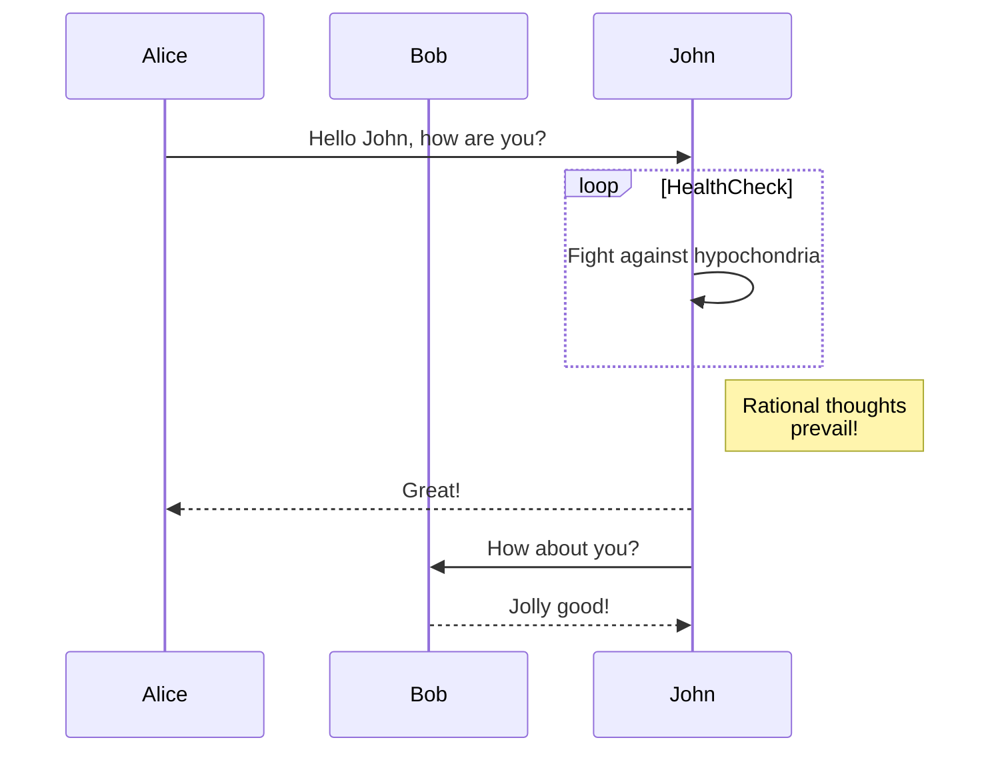
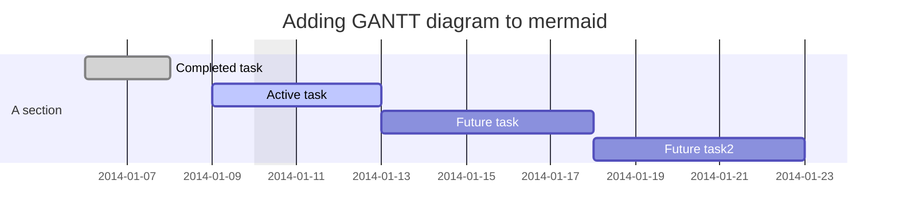
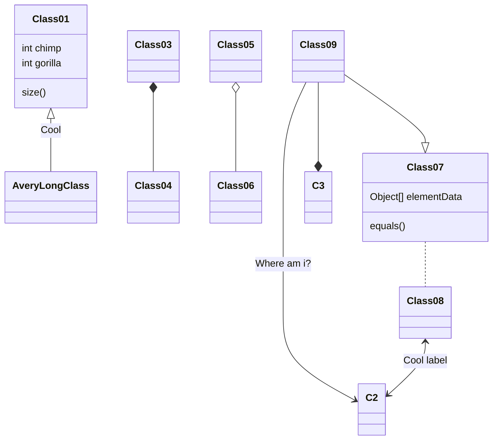
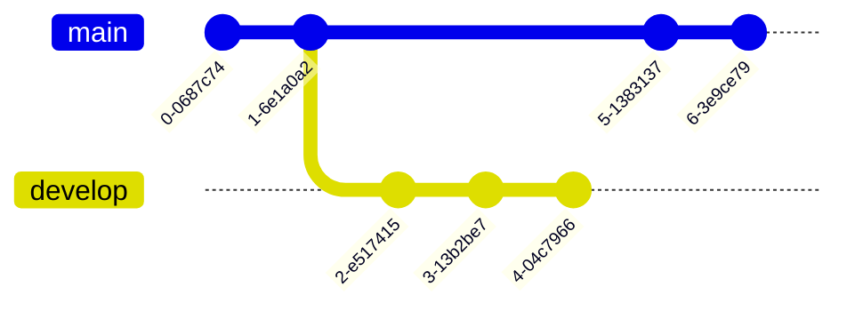
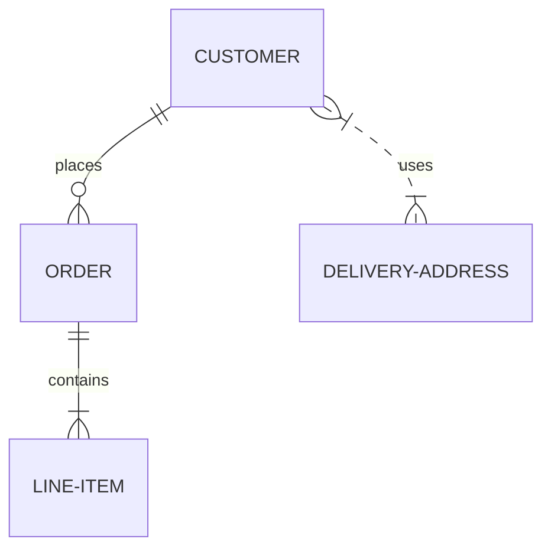
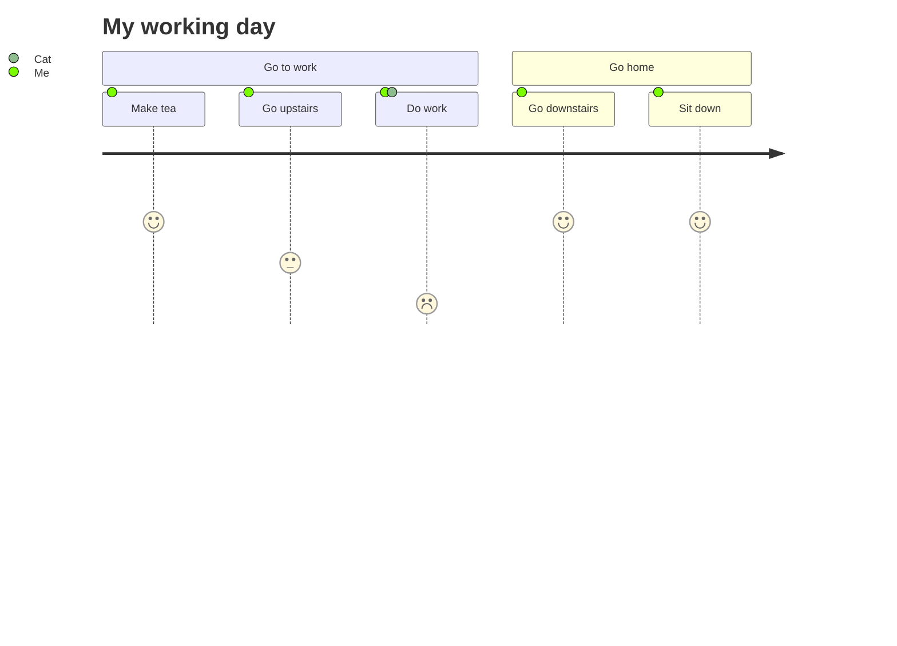
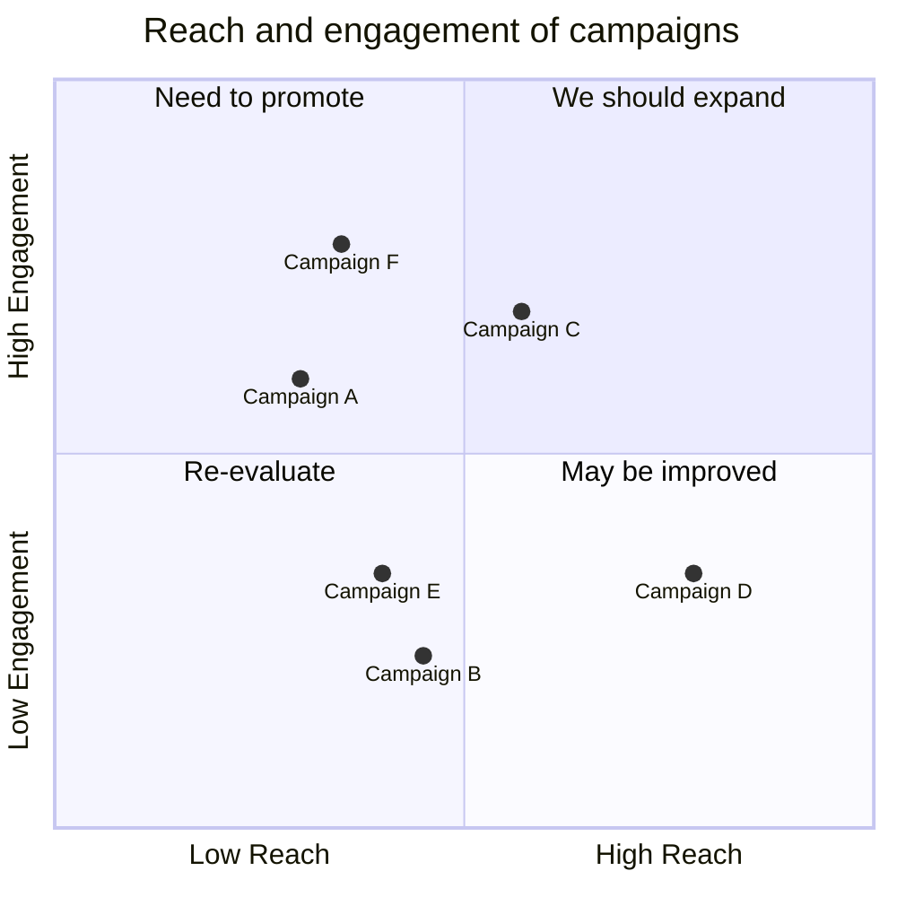
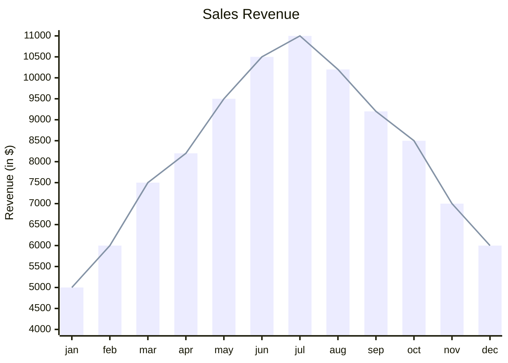

# Mermaid – Text‑Based Diagramming Library

Mermaid lets you create diagrams and visualizations using plain text.  
It is a JavaScript‑based renderer that turns Markdown‑style definitions into SVG charts.

> **Why Mermaid?**  
> Documentation that changes with code is hard to maintain.  
> Mermaid keeps diagrams in sync with the source by letting you write them in the same language you already use.

---

## Table of Contents

| Section | Description |
|--------|------------|
| [Getting Started](#getting-started) | Install, CDN, CLI |
| [Diagram Types](#diagram-types) | Flowchart, Sequence, Gantt, Class, Git Graph, ER, Journey, Quadrant, XY |
| [Syntax & Configuration](#syntax--configuration) | Basic syntax, theming, API |
| [Examples](#examples) | Full code snippets for each diagram |
| [Security](#security) | Sandbox rendering, sanitization |
| [Contributing](#contributing) | How to help |
| [Resources](#resources) | Live editor, CLI, docs |

---

## Getting Started

### Install

```bash
# npm
npm i mermaid

# yarn
yarn add mermaid

# pnpm
pnpm add mermaid
```

### CDN

```html
<script type="module">
  import mermaid from 'https://cdn.jsdelivr.net/npm/mermaid@11/dist/mermaid.esm.min.mjs';
  mermaid.initialize({ startOnLoad: true });
</script>
```

### CLI

```bash
npm i -g @mermaid-js/mermaid-cli
mmdc -i diagram.mmd -o diagram.svg
```

---

## Diagram Types

| Diagram | Code | Rendered |
|--------|------|---------|
| **Flowchart** | `graph TD; A-->B;` |  |
| **Sequence** | `sequenceDiagram ...` |  |
| **Gantt** | `gantt ...` |  |
| **Class** | `classDiagram ...` |  |
| **Git Graph** | `gitGraph ...` |  |
| **ER Diagram** | `erDiagram ...` |  |
| **Journey** | `journey ...` |  |
| **Quadrant** | `quadrantChart ...` |  |
| **XY Chart** | `xychart-beta ...` |  |

> **Tip** – Use the *Mermaid Live Editor* to preview diagrams instantly.

---

## Syntax & Configuration

### Basic Syntax


### Theming

```js
mermaid.initialize({
  theme: 'forest',
  themeVariables: {
    primaryColor: '#ff0000'
  }
});
```

### API

```js
mermaid.initialize({
  startOnLoad: true,
  securityLevel: 'strict', // or 'loose'
  logLevel: 'debug'
});
```

---

## Full Examples

### Flowchart


### Sequence Diagram



### Gantt Diagram



### Class Diagram



### Git Graph



### Entity Relationship Diagram



### User Journey Diagram



### Quadrant Chart



### XY Chart



---

## Security

Mermaid sanitizes diagram code but it can still contain malicious scripts.  
Use the sandboxed rendering mode:

```js
mermaid.initialize({
  securityLevel: 'sandboxed'
});
```

> **Note** – Sandbox mode disables some interactive features.

---

## Contributing

- Fork the repo: `git clone https://github.com/mermaid-js/mermaid.git`
- Install dependencies: `pnpm install`
- Run tests: `pnpm test`
- Submit PRs – we welcome new diagram types, bug fixes, and documentation improvements.

---

## Resources

- **Live Editor** – https://mermaid.live
- **CLI** – https://github.com/mermaid-js/mermaid-cli
- **Docs** – https://mermaid-js.github.io/mermaid/#/
- **Community** – Discord, GitHub Discussions

---

*Mermaid was created by Knut Sveidqvist.  
Thanks to the community for keeping the project alive.*