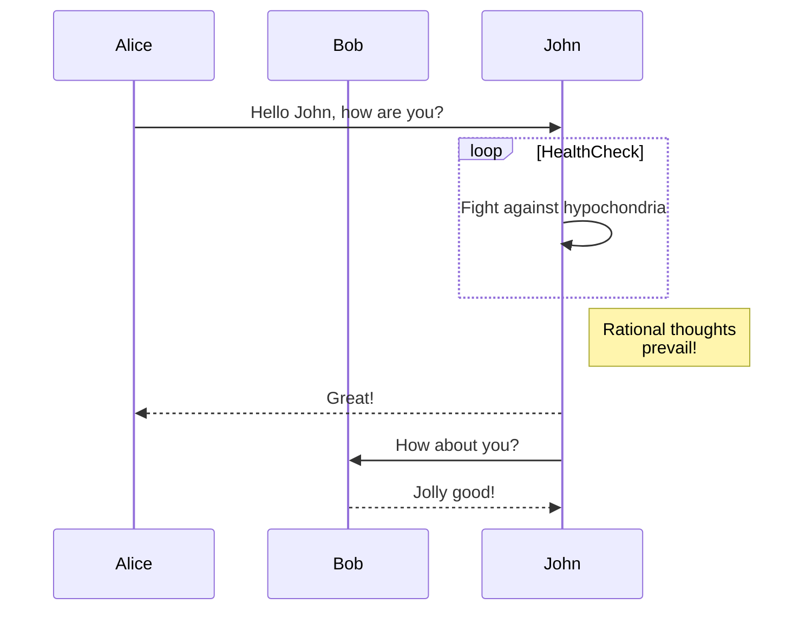
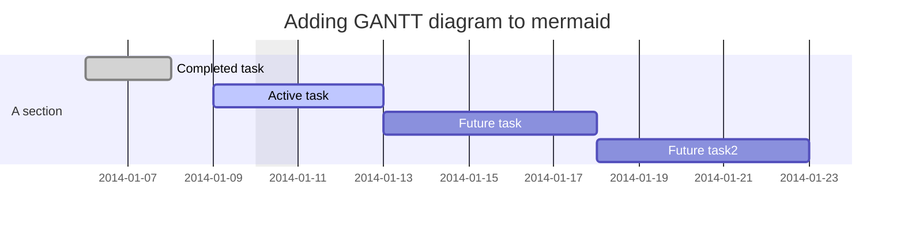
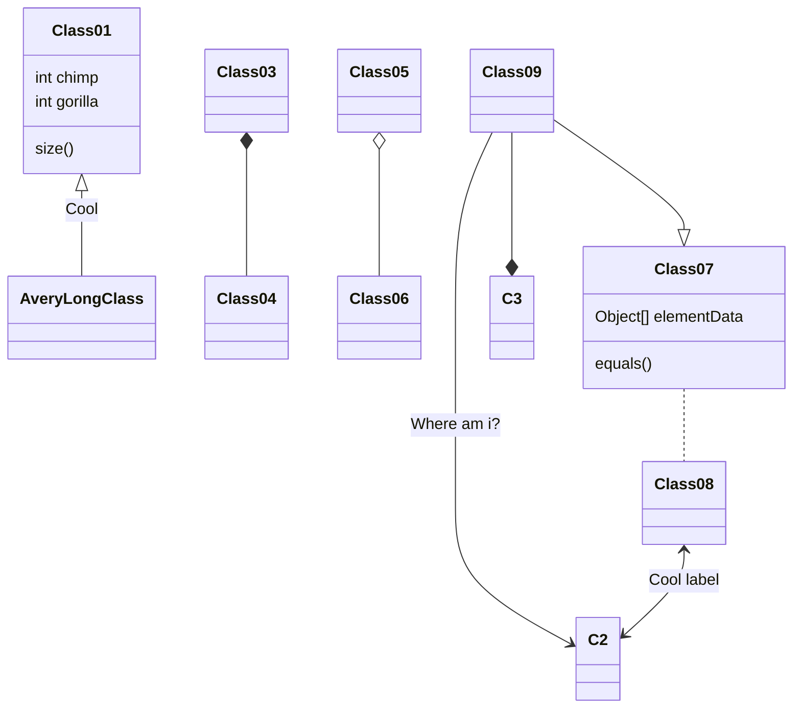
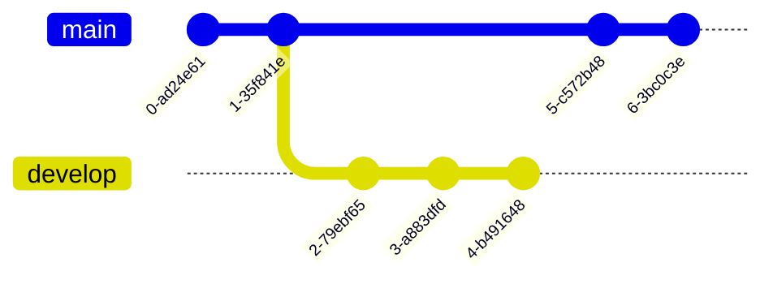
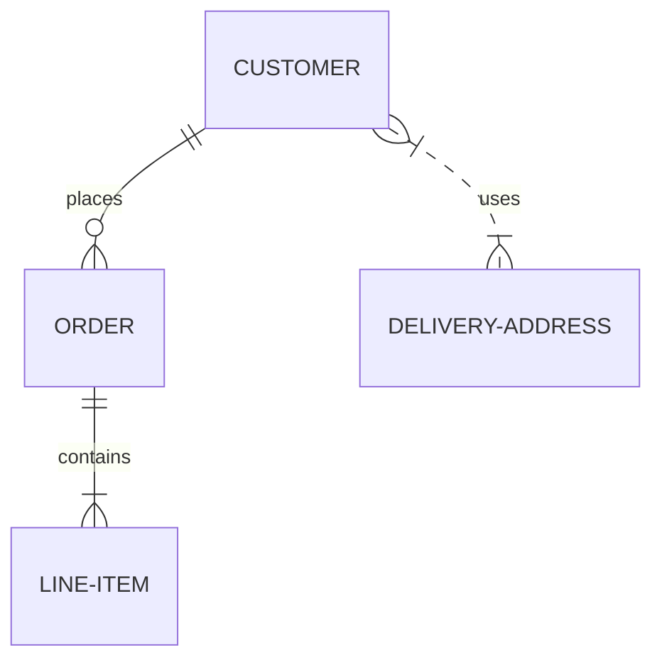
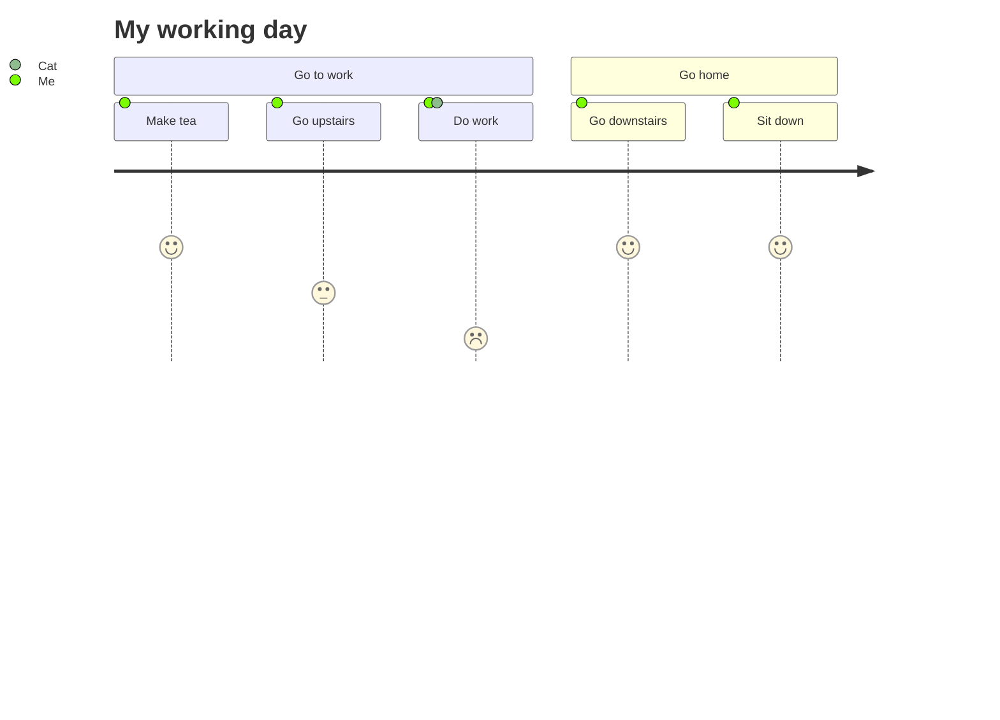
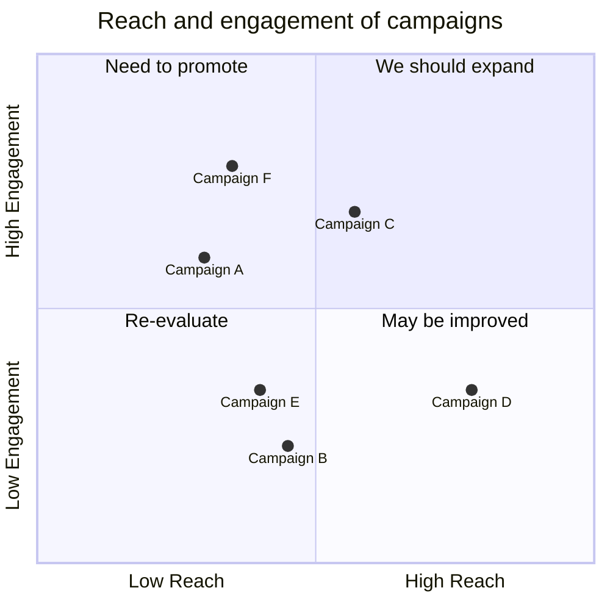
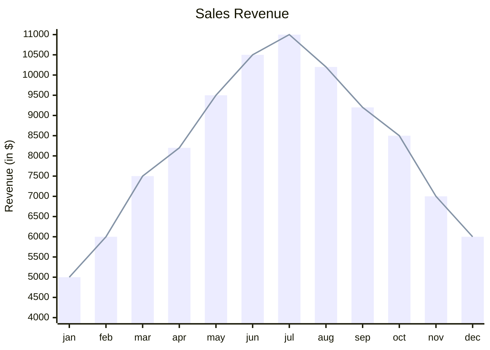

# Mermaid – Text‑Based Diagramming Library

Mermaid is a JavaScript‑based diagramming and charting tool that renders Markdown‑style text definitions into SVG diagrams.  
It is designed to keep documentation in sync with code, to be embeddable in web pages, static sites, and documentation generators.

---

## Table of Contents

1. [Getting Started](#getting-started)  
2. [Installation](#installation)  
3. [Configuration](#configuration)  
4. [Diagram Types & Examples](#diagram-types)  
5. [API Usage](#api-usage)  
6. [Security](#security)  
7. [Contributing](#contributing)  

---

## 1. Getting Started

```bash
# Install via npm
npm i mermaid
```

```html
<script type="module">
  import mermaid from 'https://cdn.jsdelivr.net/npm/mermaid@11/dist/mermaid.esm.min.mjs';
  mermaid.initialize({ startOnLoad: true });
</script>
```

Mermaid will automatically render any `<div>` or `<pre>` element with `class="mermaid"`.

---

## 2. Installation

| Method | Command |
|-------|--------|
| **npm** | `npm i mermaid` |
| **yarn** | `yarn add mermaid` |
| **pnpm** | `pnpm add mermaid` |
| **CDN** | `https://cdn.jsdelivr.net/npm/mermaid@<version>/dist/` (replace `<version>` with the desired release) |

---

## 3. Configuration

```js
mermaid.initialize({
  startOnLoad: true,          // Render diagrams on page load
  theme: 'default',         // 'default', 'forest', 'dark', 'neutral'
  // ...other options
});
```

See the full list of options in the [Configuration Guide](https://mermaid.js.org/configuration.html).

---

## 4. Diagram Types & Examples

Below are the supported diagram types. Each example is wrapped in a fenced code block with the `mermaid` language identifier.

### 4.1 Flowchart


### 4.2 Sequence Diagram



### 4.3 Gantt Diagram



### 4.4 Class Diagram



### 4.5 Git Graph



### 4.6 Entity Relationship Diagram (Experimental)



### 4.7 User Journey Diagram



### 4.8 Quadrant Chart



### 4.9 XY Chart (Beta)



---

## 5. API Usage

```js
import mermaid from 'mermaid';

mermaid.initialize({
  startOnLoad: true,
  theme: 'forest',
  // other options
});
```

Mermaid exposes a `render` method for programmatic rendering:

```js
mermaid.render('diagramId', 'graph TD; A-->B;', (svgCode, bindFunctions) => {
  document.getElementById('diagramContainer').innerHTML = svgCode;
});
```

---

## 6. Security

Mermaid sanitizes diagram code to prevent XSS. For highly untrusted input, consider rendering inside a sandboxed `<iframe>`:

```html
<iframe sandbox="allow-scripts" srcdoc="..."></iframe>
```

---

## 7. Contributing

- Fork the repo: `git clone https://github.com/mermaid-js/mermaid.git`
- Install dependencies: `pnpm install`
- Run tests: `pnpm test`
- Submit PRs with linted code (`pnpm lint`)

For more details, see the [Contribution Guide](https://mermaid.js.org/contributing.html).

---

**Mermaid** – *Make documentation easier to write, maintain, and share.*