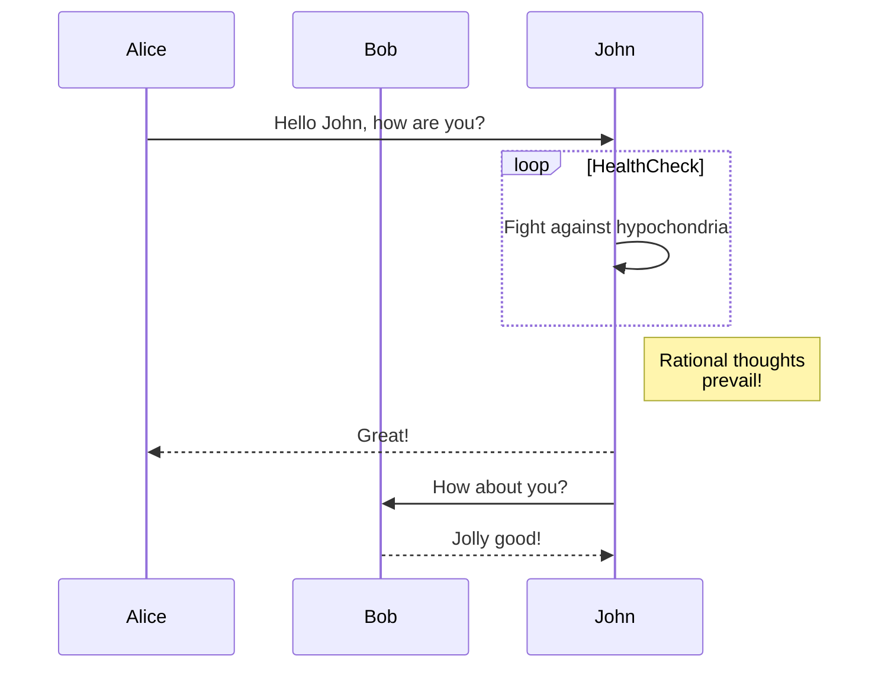
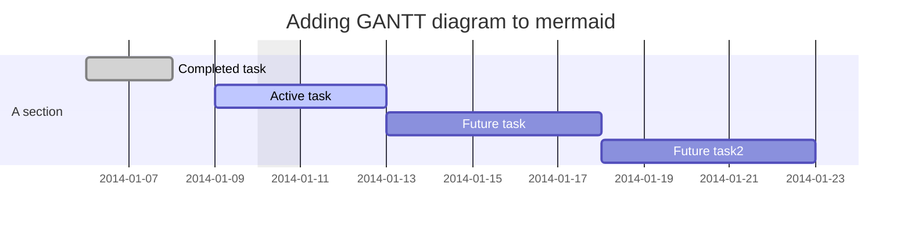
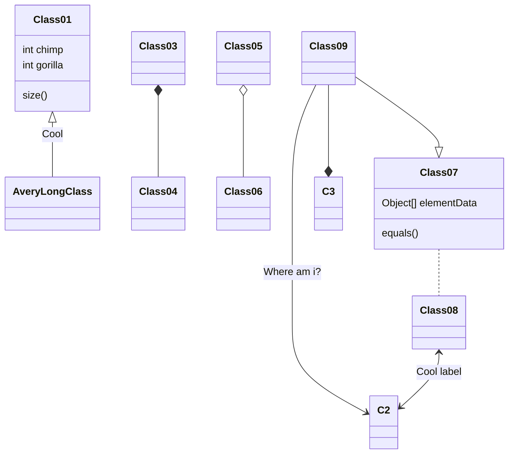
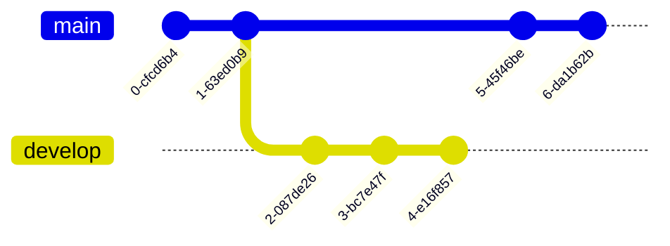
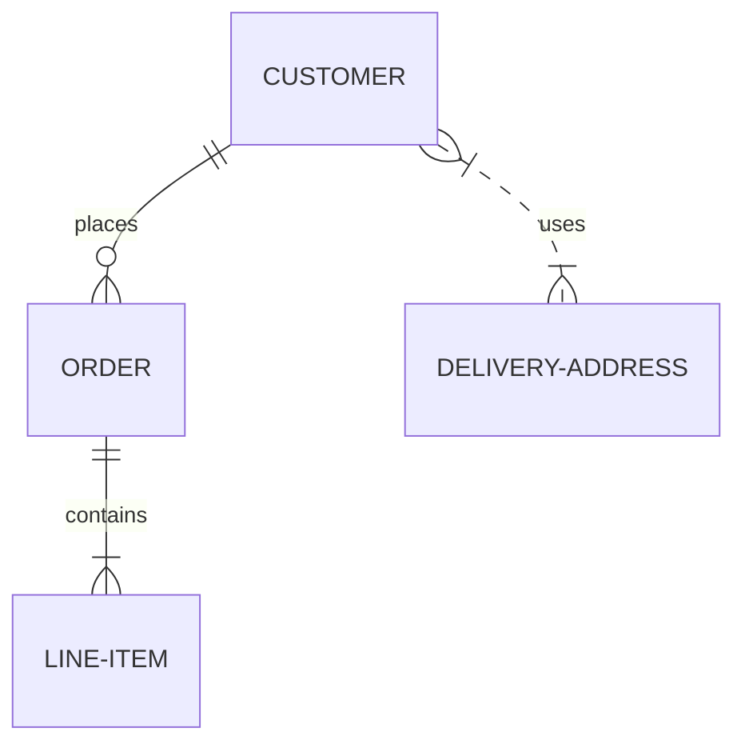
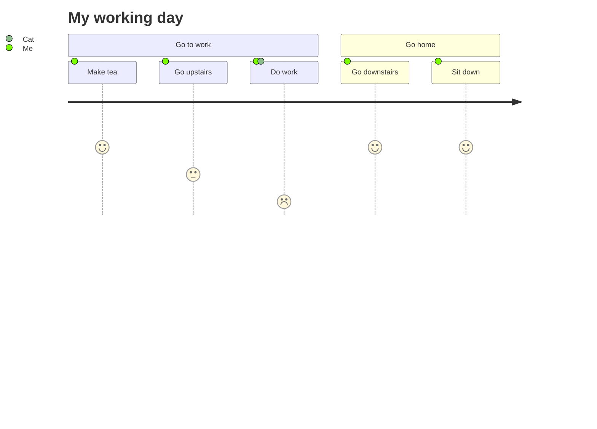
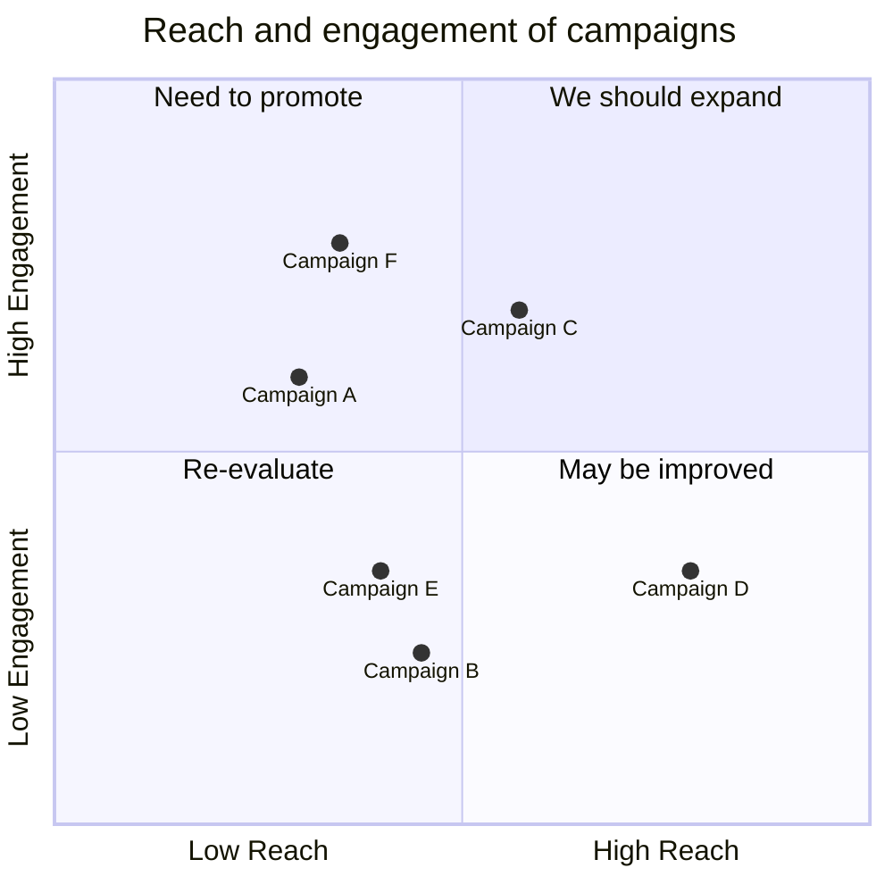
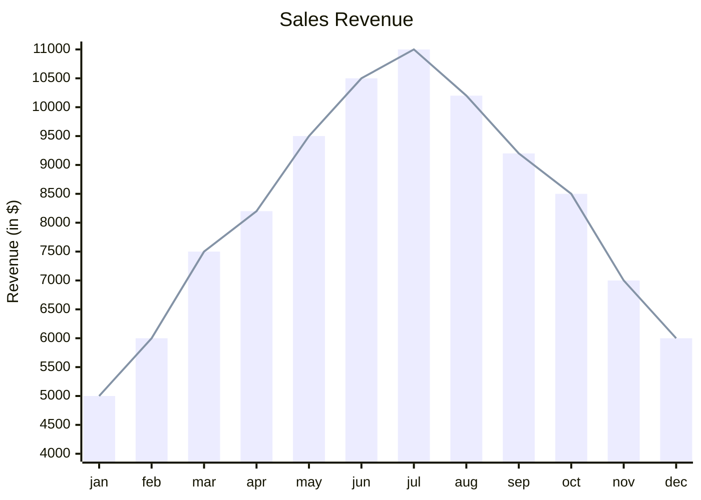

# Mermaid – Text‑Based Diagramming Library

Mermaid lets you create diagrams and visualizations using plain text.  
It is a JavaScript‑based renderer that turns Markdown‑style definitions into SVG charts.

> **Why Mermaid?**  
> * Keeps documentation up‑to‑date.  
> * Works in Markdown, HTML, VS Code, GitHub, GitLab, etc.  
> * Extensible – add new diagram types or plug‑ins.

---

## 1. Installation

| Method | Command |
|-------|--------|
| **CDN** | `https://cdn.jsdelivr.net/npm/mermaid@<version>/dist/` |
| **npm** | `npm i mermaid` |
| **yarn** | `yarn add mermaid` |
| **pnpm** | `pnpm add mermaid` |

> Replace `<version>` with the desired release (e.g. `11`).

### Quick CDN Example

```html
<script type="module">
  import mermaid from 'https://cdn.jsdelivr.net/npm/mermaid@11/dist/mermaid.esm.min.mjs';
  mermaid.initialize({ startOnLoad: true });
</script>
```

Mermaid will automatically render any `<div>` or `<pre>` with `class="mermaid"`.

---

## 2. Basic Usage

Add a diagram definition inside a `<pre class="mermaid">` block:

```html
<pre class="mermaid">
graph TD;
    A-->B;
    A-->C;
    B-->D;
    C-->D;
</pre>
```

Mermaid will parse the text and replace the block with an SVG diagram.

---

## 3. Diagram Types & Examples

Below are the supported diagram types.  
Each example is wrapped in a fenced code block (`mermaid`) so it can be copied directly.

### 3.1 Flowchart


### 3.2 Sequence Diagram



### 3.3 Gantt Diagram



### 3.4 Class Diagram



### 3.5 Git Graph



### 3.6 Entity‑Relationship Diagram (experimental)



### 3.7 User Journey Diagram



### 3.8 Quadrant Chart



### 3.9 XY Chart (beta)



---

## 4. Security

Mermaid sanitizes diagram code, but for public sites you can enable sandboxed rendering:

```js
mermaid.initialize({
  startOnLoad: true,
  securityLevel: 'sandboxed'
});
```

> **Note:** Interactive features may be limited in sandboxed mode.

---

## 5. Development & Contribution

* **Repo:** https://github.com/mermaid-js/mermaid  
* **Tests:** `pnpm test`  
* **Lint:** `pnpm lint`  
* **Release:** bump `package.json`, `npm publish`

Feel free to open issues, submit PRs, or join the community.

---

## 6. Resources

| Resource | Link |
|---------|------|
| Live Editor | https://mermaid.live |
| CLI | https://github.com/mermaid-js/mermaid-cli |
| Documentation | https://mermaid-js.github.io/mermaid/ |
| Community Integrations | https://github.com/mermaid-js/mermaid/tree/main/packages |

---