# Mermaid Flowchart Documentation (v11.9.0)

> This document is a cleaned‑up, code‑centric reference for Mermaid flowcharts.  
> All examples from the original Mermaid docs are preserved and grouped by topic.

---

## 1.  Overview

Mermaid flowcharts are built from **nodes** (geometric shapes) and **edges** (arrows or lines).  
The Mermaid syntax defines how nodes and edges are rendered, supports multiple arrow types, multi‑directional arrows, and linking to/from subgraphs.

> **Warning**  
> * `end` in a node must be capitalised (`End`, `END`) or escaped.  
> * If a node starts with `o` or `x`, add a space or capitalize the letter (`dev--- Ops`).

---

## 2.  Basic Syntax

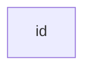

> `id` is the text shown in the box.

### 2.1  Node with Text

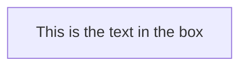

### 2.2  Unicode Text

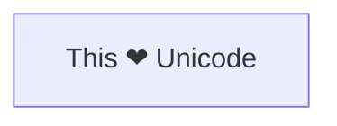

### 2.3  Markdown Formatting

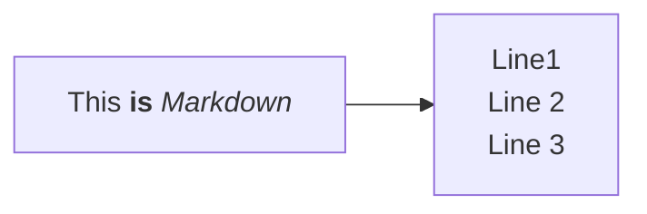

### 2.4  Direction

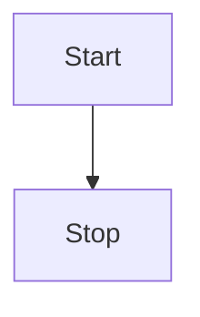

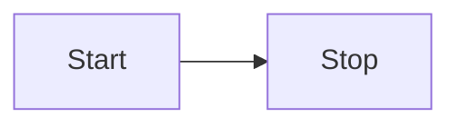

Possible orientations: `TB`, `TD`, `BT`, `RL`, `LR`.

---

## 3.  Node Shapes

| Shape | Syntax | Example |
|------|-------|--------|
| Round edges | `id1(This is the text in the box)` | `This is the text in the box` |
| Stadium | `id1([This is the text in the box])` | `This is the text in the box` |
| Subroutine | `id1[[This is the text in the box]]` | `This is the text in the box` |
| Cylinder | `id1[(Database)]` | `Database` |
| Circle | `id1((This is the text in the circle))` | `This is the text in the circle` |
| Asymmetric | `id1>This is the text in the box]` | `This is the text in the box` |
| Rhombus | `id1{This is the text in the box}` | `This is the text in the box` |
| Hexagon | `id1{{This is the text in the box}}` | `This is the text in the box` |
| Parallelogram | `id1[/This is the text in the box/]` | `This is the text in the box` |
| Parallelogram alt | `id1[\This is the text in the box\]` | `This is the text in the box` |
| Trapezoid | `A[/Christmas\]` | `Christmas` |
| Trapezoid alt | `B[\Go shopping/]` | `Go shopping` |
| Double circle | `id1(((This is the text in the circle)))` | `This is the text in the circle` |

---

## 4.  Expanded Node Shapes (v11.3.0+)

Mermaid now supports **30 new shapes**.  
Use the syntax:

```mermaid
A@{ shape: rect }
```

### 4.1  Shape List

| Semantic | Shape | Short | Alias |
|---------|------|------|-------|
| Card | `notch-rect` | `card` | `notched-rectangle` |
| Collate | `hourglass` | `collate` | `hourglass` |
| Com Link | `bolt` | `com-link` | `lightning-bolt` |
| Comment | `brace` | `comment` | `brace-l` |
| Comment Right | `brace-r` | `comment` | `brace-r` |
| Comment with braces | `braces` | `comment` | `braces` |
| Data Input/Output Lean Right | `lean-r` | `in-out` | `lean-right` |
| Data Input/Output Lean Left | `lean-l` | `out-in` | `lean-left` |
| Database Cylinder | `cyl` | `database` | `db` |
| Decision | `diam` | `decision` | `diamond` |
| Delay | `delay` | `delay` | `half-rounded-rectangle` |
| Direct Access Storage | `h-cyl` | `das` | `horizontal-cylinder` |
| Disk Storage | `lin-cyl` | `lin-cyl` | `lined-cylinder` |
| Display | `curv-trap` | `display` | `curved-trapezoid` |
| Divided Process | `div-rect` | `div-proc` | `divided-process` |
| Document | `doc` | `document` | `doc` |
| Event | `rounded` | `event` | `rounded-rectangle` |
| Extract | `tri` | `extract` | `triangle` |
| Fork/Join | `fork` | `fork` | `join` |
| Internal Storage | `win-pane` | `win-pane` | `window-pane` |
| Junction | `f-circ` | `junction` | `filled-circle` |
| Lined Document | `lin-doc` | `lined-document` | `lined-document` |
| Lined/Shaded Process | `lin-rect` | `lined-process` | `lined-rectangle` |
| Loop Limit | `notch-pent` | `loop-limit` | `notched-pentagon` |
| Manual File | `flip-tri` | `manual-file` | `flipped-triangle` |
| Manual Input | `sl-rect` | `manual-input` | `sloped-rectangle` |
| Manual Operation | `trap-t` | `manual-operation` | `trapezoid-top` |
| Multi-Document | `docs` | `multiple-documents` | `stacked-document` |
| Multi-Process | `st-rect` | `multiple-processes` | `stacked-rectangle` |
| Paper Tape | `flag` | `paper-tape` | `flag` |
| Prepare Conditional | `hex` | `prepare` | `hexagon` |
| Priority Action | `trap-b` | `priority-action` | `trapezoid-bottom` |
| Process | `rect` | `process` | `rectangle` |
| Start Circle | `circle` | `start` | `circle` |
| Start Small Circle | `sm-circ` | `small-start` | `small-circle` |
| Stop Double Circle | `dbl-circ` | `stop` | `double-circle` |
| Stop Framed Circle | `fr-circ` | `stop` | `framed-circle` |
| Stored Data | `bow-rect` | `stored-data` | `bow-tie-rectangle` |
| Subprocess | `fr-rect` | `subprocess` | `subroutine` |
| Summary | `cross-circ` | `summary` | `crossed-circle` |
| Tagged Document | `tag-doc` | `tagged-document` | `tag-doc` |
| Tagged Process | `tag-rect` | `tagged-process` | `tag-rect` |
| Terminal Point | `stadium` | `terminal` | `stadium` |
| Text Block | `text` | `text` | `text` |

### 4.2  Example Flowchart with New Shapes

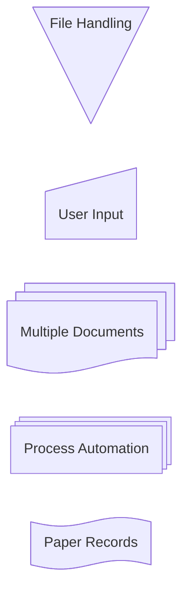

### 4.3  Individual Shape Examples

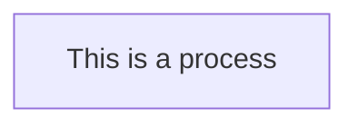

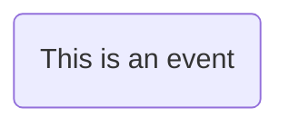

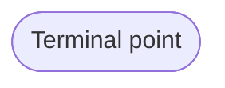

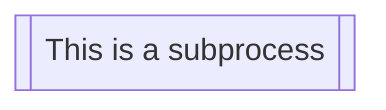

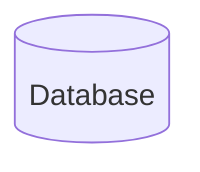

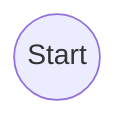

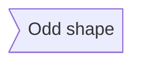

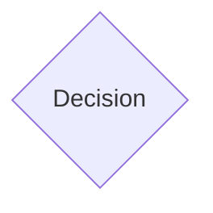

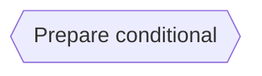

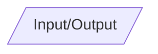

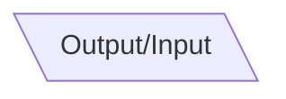

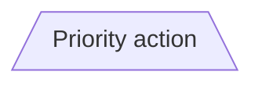

```mermaid
flowchart TD
    A@{ shape: trap-t, label: "Manual operation" }
```

```mermaid
flowchart TD
    A@{ shape: dbl-circ, label: "Stop" }
```

```mermaid
flowchart TD
    A@{ shape: text, label: "This is a text block" }
```

```mermaid
flowchart TD
    A@{ shape: notch-rect, label: "Card" }
```

```mermaid
flowchart TD
    A@{ shape: lin-rect, label: "Lined process" }
```

```mermaid
flowchart TD
    A@{ shape: sm-circ, label: "Small start" }
```

```mermaid
flowchart TD
    A@{ shape: framed-circle, label: "Stop" }
```

```mermaid
flowchart TD
    A@{ shape: fork, label: "Fork or Join" }
```

```mermaid
flowchart TD
    A@{ shape: hourglass, label: "Collate" }
```

```mermaid
flowchart TD
    A@{ shape: brace, label: "Comment" }
```

```mermaid
flowchart TD
    A@{ shape: brace-r, label: "Comment" }
```

```mermaid
flowchart TD
    A@{ shape: braces, label: "Comment" }
```

```mermaid
flowchart TD
    A@{ shape: bolt, label: "Communication link" }
```

```mermaid
flowchart TD
    A@{ shape: doc, label: "Document" }
```

```mermaid
flowchart TD
    A@{ shape: delay, label: "Delay" }
```

```mermaid
flowchart TD
    A@{ shape: das, label: "Direct access storage" }
```

```mermaid
flowchart TD
    A@{ shape: lin-cyl, label: "Disk storage" }
```

```mermaid
flowchart TD
    A@{ shape: curv-trap, label: "Display" }
```

```mermaid
flowchart TD
    A@{ shape: div-rect, label: "Divided process" }
```

```mermaid
flowchart TD
    A@{ shape: tri, label: "Extract" }
```

```mermaid
flowchart TD
    A@{ shape: win-pane, label: "Internal storage" }
```

```mermaid
flowchart TD
    A@{ shape: f-circ, label: "Junction" }
```

```mermaid
flowchart TD
    A@{ shape: lin-doc, label: "Lined document" }
```

```mermaid
flowchart TD
    A@{ shape: notch-pent, label: "Loop limit" }
```

```mermaid
flowchart TD
    A@{ shape: flip-tri, label: "Manual file" }
```

```mermaid
flowchart TD
    A@{ shape: sl-rect, label: "Manual input" }
```

```mermaid
flowchart TD
    A@{ shape: docs, label: "Multiple documents" }
```

```mermaid
flowchart TD
    A@{ shape: processes, label: "Multiple processes" }
```

```mermaid
flowchart TD
    A@{ shape: flag, label: "Paper tape" }
```

```mermaid
flowchart TD
    A@{ shape: bow-rect, label: "Stored data" }
```

```mermaid
flowchart TD
    A@{ shape: cross-circ, label: "Summary" }
```

```mermaid
flowchart TD
    A@{ shape: tag-doc, label: "Tagged document" }
```

```mermaid
flowchart TD
    A@{ shape: tag-rect, label: "Tagged process" }
```

---

## 5.  Special Shapes

### 5.1  Icon Shape

```mermaid
flowchart TD
    A@{ icon: "fa:user", form: "square", label: "User Icon", pos: "t", h: 60 }
```

| Parameter | Description |
|----------|------------|
| `icon` | Icon name from registered pack |
| `form` | Background shape (`square`, `circle`, `rounded`) |
| `label` | Text label |
| `pos` | Label position (`t`, `b`, `h`) |
| `h` | Height (default 48) |

### 5.2  Image Shape

```mermaid
flowchart TD
    A@{ img: "https://example.com/image.png", label: "Image Label", pos: "t", w: 60, h: 60, constraint: "off" }
```

| Parameter | Description |
|----------|------------|
| `img` | Image URL |
| `label` | Text label |
| `pos` | Label position (`t`, `b`) |
| `w` | Width |
| `h` | Height |
| `constraint` | `on` / `off` (maintain aspect ratio) |

---

## 6.  Links Between Nodes

| Type | Syntax | Example |
|------|-------|--------|
| Arrow head | `A-->B` | `A` → `B` |
| Open link | `A --- B` | `A` – `B` |
| Text on link | `A-- This is the text! ---B` | `This is the text!` |
| Arrow head + text | `A-->|text|B` | `text` |
| Dotted | `A-.->B` | `A` → `B` |
| Thick | `A ==> B` | `A` → `B` |
| Invisible | `A ~~~ B` | `A` → `B` |
| Chaining | `A -- text --> B -- text2 --> C` | `text` → `text2` |
| Multiple nodes | `a --> b & c--> d` | `a` → `b`, `c` → `d` |
| Edge ID | `A e1@--> B` | Edge `e1` connects `A` to `B` |

---

## 7.  Animations

Assign an ID to an edge and enable animation:

```mermaid
flowchart LR
  A e1@==> B
  e1@{ animate: true }
```

Or use `animation: fast` / `slow`:

```mermaid
flowchart LR
  A e1@--> B
  e1@{ animation: fast }
```

Class‑based animation:

```mermaid
flowchart LR
  A e1@--> B
  classDef animate stroke-dasharray: 9,5,stroke-dashoffset: 900,animation: dash 25s linear infinite;
  class e1 animate
```

---

## 8.  Arrow Types

| Arrow | Syntax | Example |
|-------|-------|--------|
| Circle edge | `A --o B` | `A` → `B` |
| Cross edge | `A --x B` | `A` × `B` |
| Multi‑directional | `A o--o B` | `A` ↔︎ `B` |
| `B <--> C` | `B` ↔︎ `C` |
| `C x--x D` | `C` ×× `D` |

---

## 9.  Link Length

Add dashes to increase length:

```mermaid
flowchart TD
    A[Start] --> B{Is it?}
    B -->|Yes| C[OK]
    C --> D[Rethink]
    D --> B
    B ---->|No| E[End]
```

For dotted/thick links