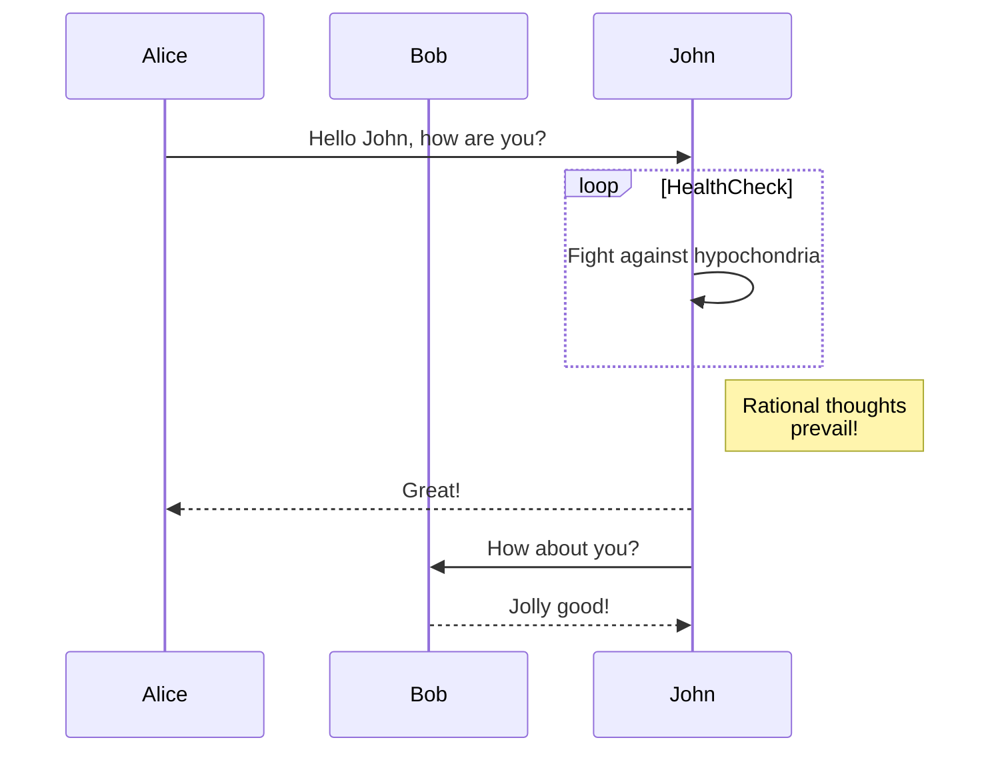
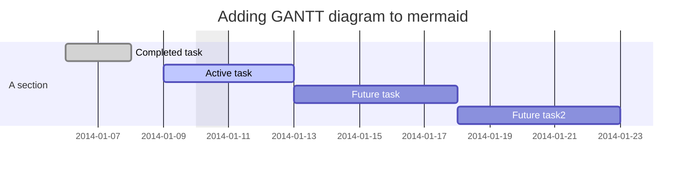
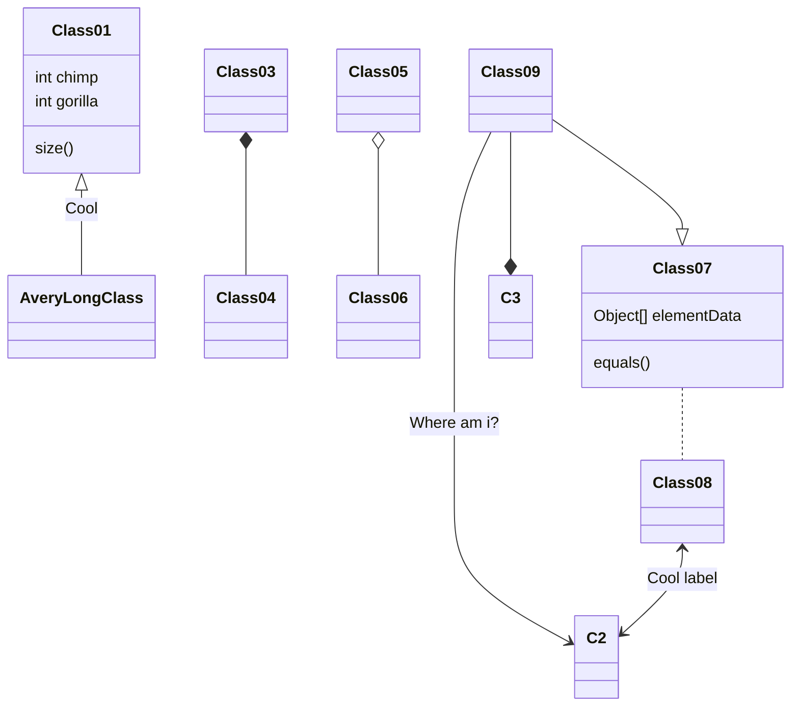
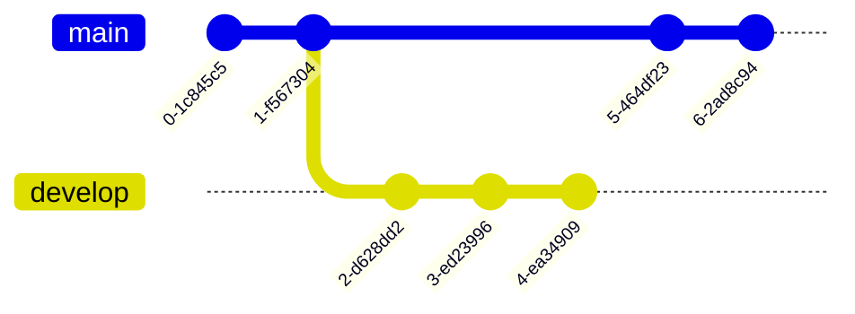
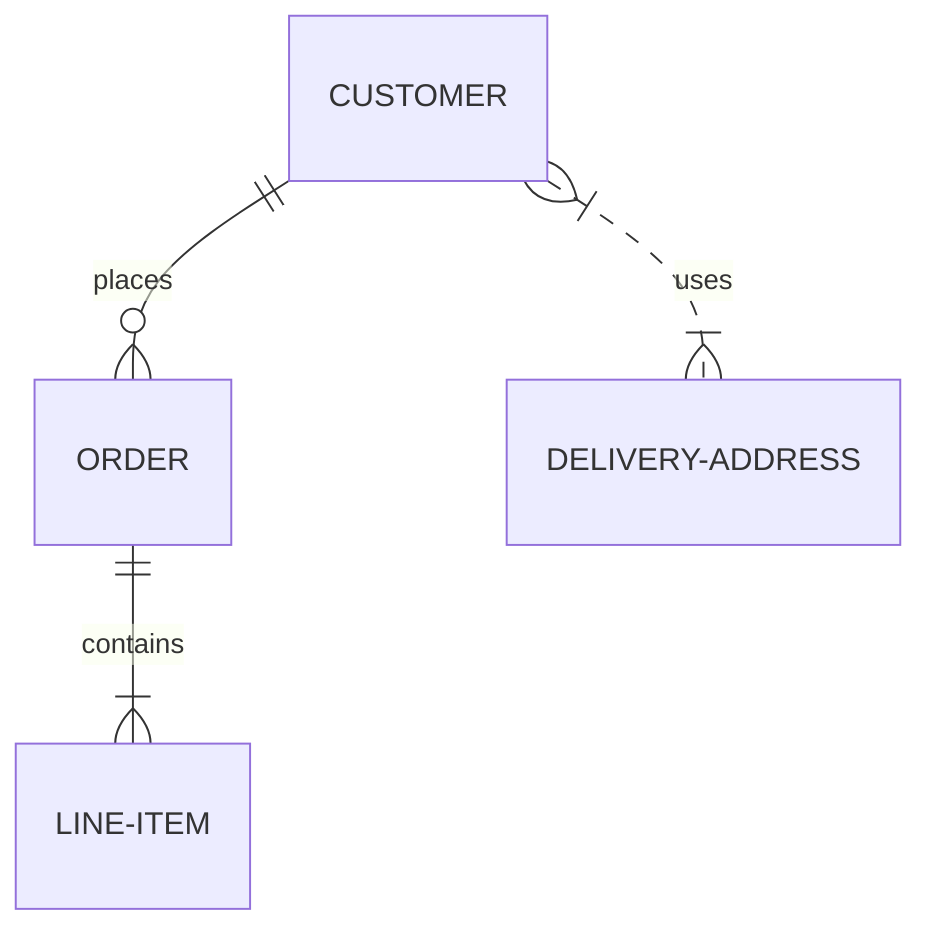
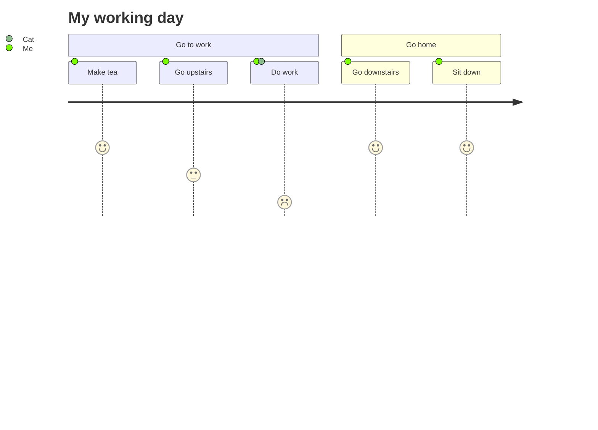
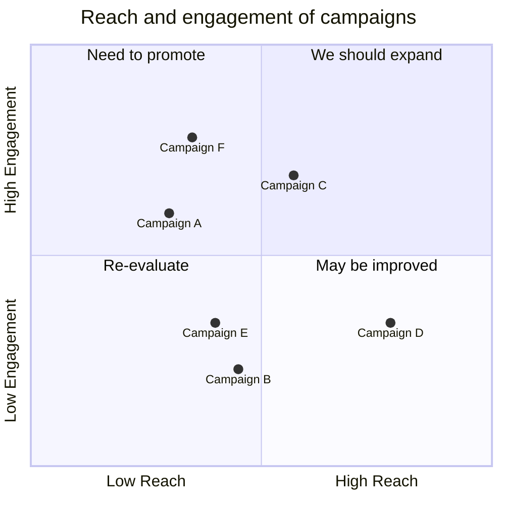
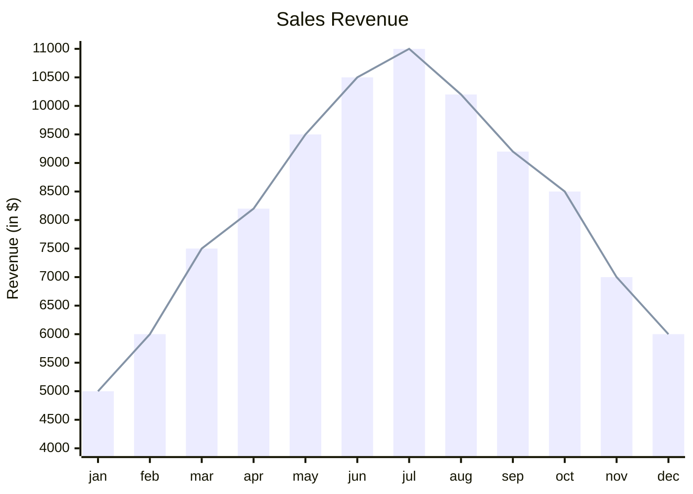

# Mermaid – Text‑Based Diagramming Library

Mermaid lets you create diagrams and visualizations using plain text.  
It is a JavaScript‑based renderer that turns Markdown‑style definitions into SVG charts, making documentation easier to maintain and share.

> **Why Mermaid?**  
> Documentation that is out‑of‑date costs developers time. Mermaid keeps diagrams in sync with code by letting you edit them in the same place as your source.

---

## Table of Contents

1. [Getting Started](#getting-started)  
2. [Diagram Types](#diagram-types)  
3. [Syntax & Configuration](#syntax--configuration)  
4. [Installation](#installation)  
5. [Mermaid API](#mermaid-api)  
6. [Security](#security)  
7. [Contributing](#contributing)  

---

## 1. Getting Started

Mermaid is inspired by Markdown. If you know Markdown, you’ll pick up Mermaid quickly.


> **Tip** – Use the [Mermaid Live Editor](https://mermaid.live) to experiment interactively.

---

## 2. Diagram Types

Below are the supported diagram types with a minimal example for each.

| Diagram | Example |
|--------|--------|
| **Flowchart** | `graph TD; A-->B;` |
| **Sequence Diagram** | `sequenceDiagram ...` |
| **Gantt** | `gantt ...` |
| **Class Diagram** | `classDiagram ...` |
| **Git Graph** | `gitGraph ...` |
| **Entity‑Relationship Diagram** | `erDiagram ...` |
| **User Journey** | `journey ...` |
| **Quadrant Chart** | `quadrantChart ...` |
| **XY Chart** | `xychart-beta ...` |

### 2.1 Flowchart


### 2.2 Sequence Diagram



### 2.3 Gantt Diagram



### 2.4 Class Diagram



### 2.5 Git Graph



### 2.6 Entity‑Relationship Diagram



### 2.7 User Journey Diagram



### 2.8 Quadrant Chart



### 2.9 XY Chart



---

## 3. Syntax & Configuration

Mermaid uses a simple, Markdown‑like syntax.  
All diagrams are wrapped in a `<div class="mermaid">` or `<pre class="mermaid">` tag, or you can embed them directly in Markdown with triple backticks and the `mermaid` language hint.

```html
<div class="mermaid">
graph TD;
    A-->B;
</div>
```

### 3.1 Configuration Options

```js
mermaid.initialize({
    startOnLoad: true,
    theme: 'default',
    // other options...
});
```

Available options include:

| Option | Description |
|-------|------------|
| `startOnLoad` | Auto‑render diagrams on page load |
| `theme` | `default`, `dark`, `forest`, `neutral` |
| `themeVariables` | Override theme colors |
| `securityLevel` | `strict`, `loose`, `sandbox` |

---

## 4. Installation

### 4.1 CDN

```html
<script type="module">
  import mermaid from 'https://cdn.jsdelivr.net/npm/mermaid@11/dist/mermaid.esm.min.mjs';
  mermaid.initialize({ startOnLoad: true });
</script>
```

### 4.2 npm / Yarn / pnpm

```bash
npm i mermaid
# or
yarn add mermaid
# or
pnpm add mermaid
```

### 4.3 Node & CLI

```bash
# Install Node (v16+ recommended)
npx pnpm install
pnpm test
```

---

## 5. Mermaid API

Mermaid can be used programmatically:

```js
import mermaid from 'mermaid';

mermaid.render('diagramId', 'graph TD; A-->B;', (svgCode) => {
    document.getElementById('diagramContainer').innerHTML = svgCode;
});
```

---

## 6. Security

Mermaid sanitizes diagram code, but for public sites you can enable a sandboxed iframe:

```js
mermaid.initialize({
    securityLevel: 'sandbox'
});
```

> **Note** – Some interactive features may be disabled in sandbox mode.

---

## 7. Contributing

Mermaid is open source. Contributions are welcome!  
- **Add new diagram types** (mindmaps, ER diagrams, etc.)  
- **Improve existing diagrams**  
- **Fix bugs**  
- **Write documentation**  

See the [contribution guidelines](https://github.com/mermaid-js/mermaid/blob/main/CONTRIBUTING.md) for details.

---

## 8. Resources

- **Mermaid Live Editor** – https://mermaid.live  
- **Mermaid CLI** – https://github.com/mermaid-js/mermaid-cli  
- **Mermaid Tiny** – https://github.com/mermaid-js/mermaid-tiny  
- **Mermaid Webpack Demo** – https://github.com/mermaid-js/mermaid-webpack-demo  

---

*Mermaid was created by Knut Sveidqvist. Thanks to the community for their contributions.*