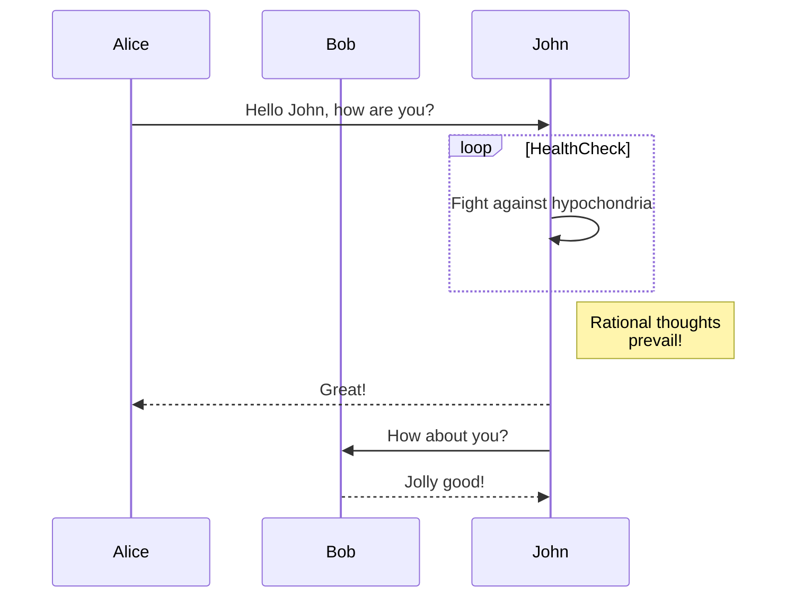
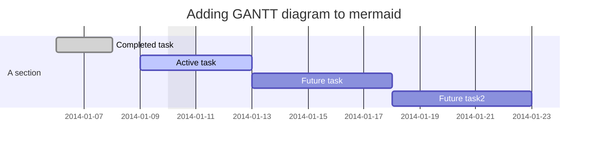
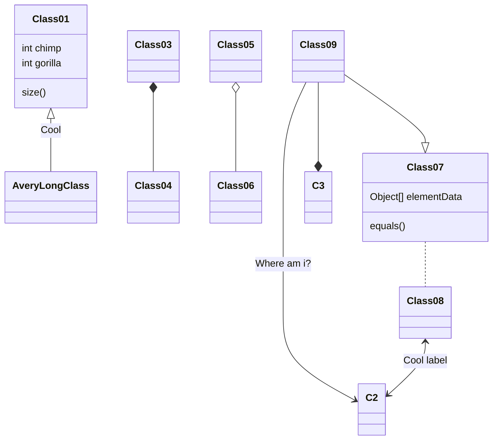
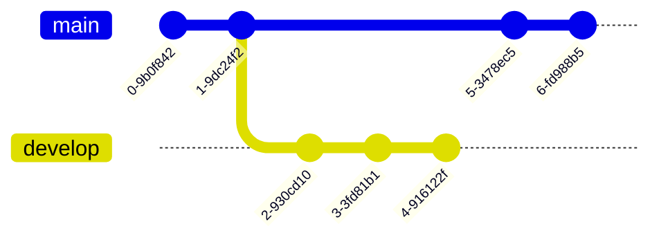
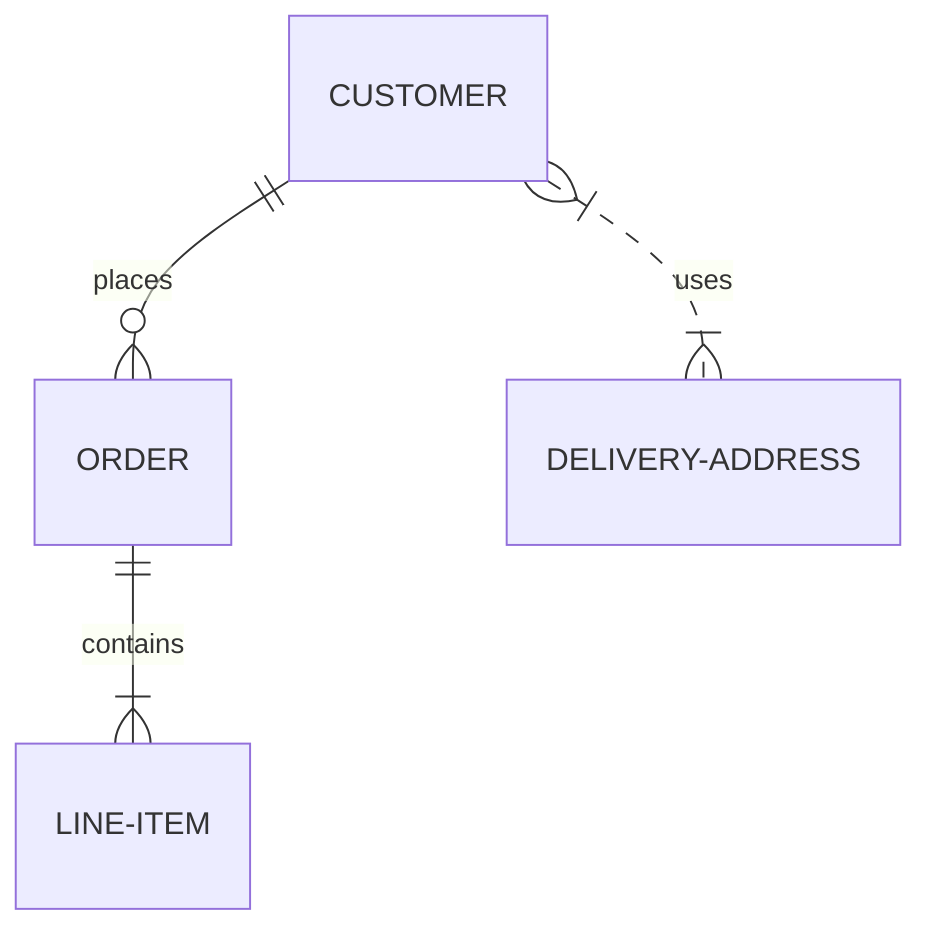
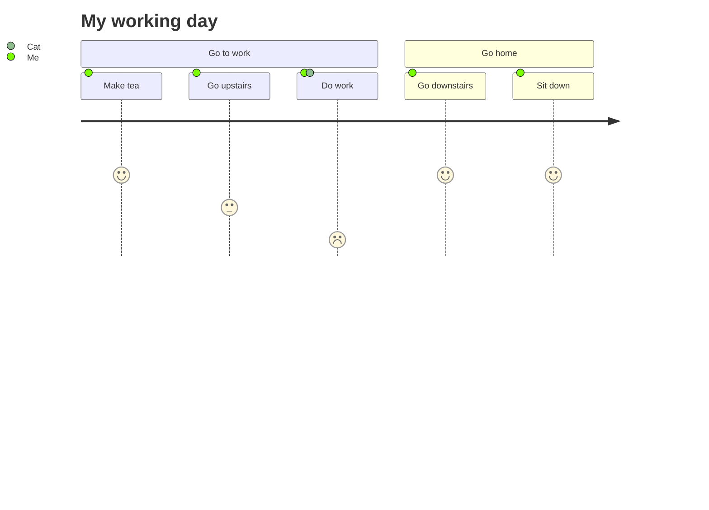
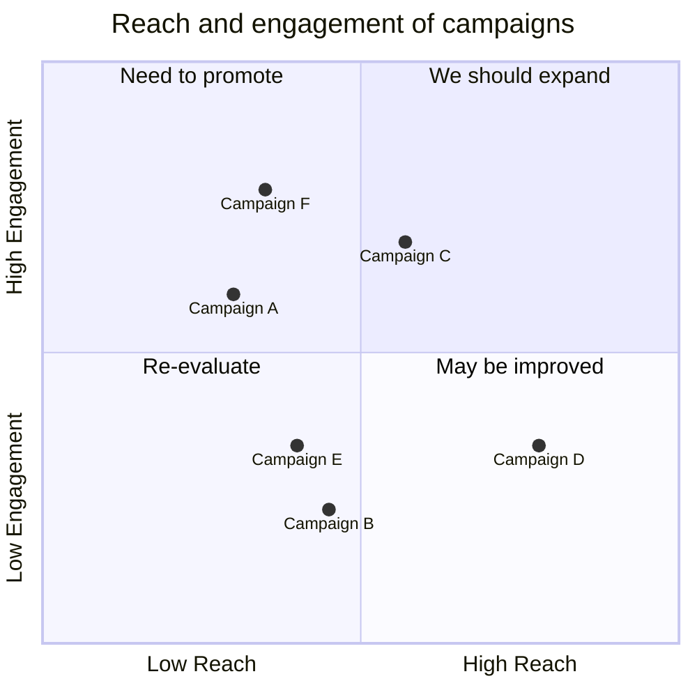
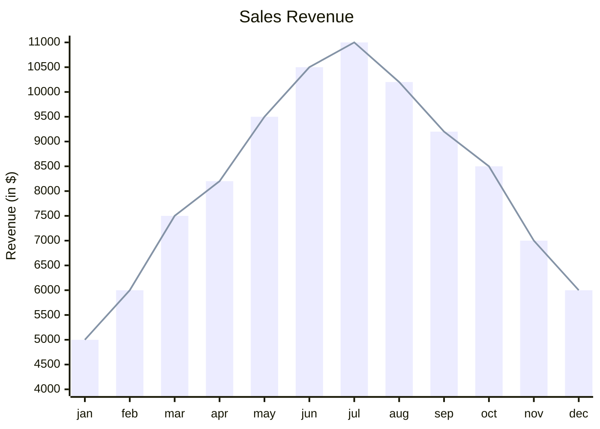

# Mermaid – Text‑Based Diagramming Library

Mermaid is a JavaScript‑based diagramming and charting tool that renders Markdown‑inspired text definitions into SVG visualisations.  
It is designed to keep documentation in sync with code, to be embeddable in web pages, static sites, and CI pipelines.

---

## Table of Contents

| Section | Description |
|--------|------------|
| [Getting Started](#getting-started) | Quick installation and first diagram |
| [Diagram Types](#diagram-types) | Overview of supported diagram types |
| [Syntax & Configuration](#syntax--configuration) | Basic syntax, configuration options |
| [Examples](#examples) | Full code snippets for each diagram |
| [Installation](#installation) | CDN, npm, yarn, pnpm |
| [API Usage](#api-usage) | Embedding Mermaid in a page |
| [Security](#security) | Sanitisation & sandboxing |
| [Contributing](#contributing) | How to help |
| [FAQ & Resources](#faq--resources) | Links to docs, community, etc. |

---

## Getting Started

```bash
# Using npm
npm i mermaid

# Using yarn
yarn add mermaid

# Using pnpm
pnpm add mermaid
```

```html
<!-- Example: Embedding Mermaid in a static page -->
<script type="module">
  import mermaid from 'https://cdn.jsdelivr.net/npm/mermaid@11/dist/mermaid.esm.min.mjs';
  mermaid.initialize({ startOnLoad: true });
</script>
```

Mermaid will automatically render any `<div>` or `<pre>` element with `class="mermaid"`.

---

## Diagram Types

| Diagram | Typical Use |
|--------|------------|
| **Flowchart** | Process flows |
| **Sequence Diagram** | Interaction between actors |
| **Gantt** | Project timelines |
| **Class Diagram** | UML class relationships |
| **Git Graph** | Git commit history |
| **ER Diagram** | Entity‑Relationship |
| **Journey** | User journey |
| **Quadrant Chart** | Four‑quadrant analysis |
| **XY Chart** | Scatter / line / bar |
| **Mindmap, Gantt, etc.** | Experimental / community extensions |

---

## Syntax & Configuration

Mermaid syntax is Markdown‑like.  
A diagram starts with a keyword (`graph`, `sequenceDiagram`, `gantt`, etc.) followed by diagram‑specific statements.


Configuration options are passed to `mermaid.initialize()`:

```js
mermaid.initialize({
  startOnLoad: true,
  theme: 'forest',
  // ...other options
});
```

See the full list of options in the [Mermaid API Configuration](https://mermaid.js.org/api/mermaid.html#mermaidinitialize) docs.

---

## Examples

Below are complete, runnable snippets for each diagram type.  
Copy the code into a file with a `.md` extension or a `<pre class="mermaid">` block and run it in the Mermaid Live Editor or any page that loads Mermaid.

### Flowchart


### Sequence Diagram



### Gantt Diagram



### Class Diagram



### Git Graph



### Entity Relationship Diagram (experimental)



### User Journey Diagram



### Quadrant Chart



### XY Chart (beta)



---

## Installation

### CDN

```html
<script type="module">
  import mermaid from 'https://cdn.jsdelivr.net/npm/mermaid@11/dist/mermaid.esm.min.mjs';
  mermaid.initialize({ startOnLoad: true });
</script>
```

### npm / yarn / pnpm

```bash
npm i mermaid
# or
yarn add mermaid
# or
pnpm add mermaid
```

---

## API Usage

```js
import mermaid from 'mermaid';

mermaid.initialize({
  startOnLoad: true,
  theme: 'forest',
  // other options
});
```

Mermaid will automatically parse `<div class="mermaid">` or `<pre class="mermaid">` tags.

---

## Security

Mermaid sanitises diagram code to prevent XSS.  
For extra safety, you can render diagrams in a sandboxed `<iframe>`:

```html
<iframe sandbox="allow-scripts" srcdoc="
  <script type='module'>
    import mermaid from 'https://cdn.jsdelivr.net/npm/mermaid@11/dist/mermaid.esm.min.mjs';
    mermaid.initialize({ startOnLoad: true });
  </script>
  <pre class='mermaid'>graph TD; A-->B;</pre>
"></iframe>
```

---

## Contributing

- Fork the repo: `git clone https://github.com/mermaid-js/mermaid.git`
- Install dependencies: `pnpm install`
- Run tests: `pnpm test`
- Submit PRs with linted code (`pnpm lint`)

See the [Contribution Guidelines](https://github.com/mermaid-js/mermaid/blob/main/CONTRIBUTING.md) for details.

---

## FAQ & Resources

- **Docs**: https://mermaid.js.org
- **Live Editor**: https://mermaid.live
- **CLI**: https://github.com/mermaid-js/mermaid-cli
- **Community Integrations**: https://mermaid.js.org/integrations
- **Security**: email `security@mermaid.live`

---

*Mermaid was created by Knut Sveidqvist. Thanks to the community for continuous contributions.*