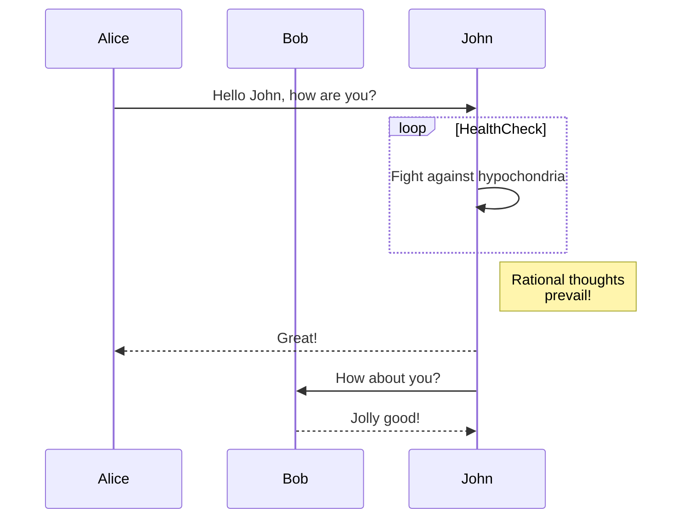
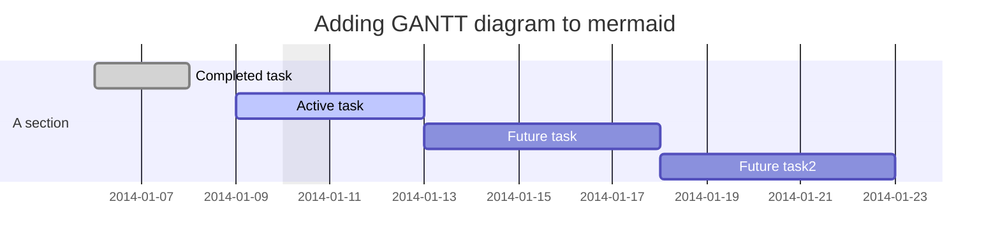
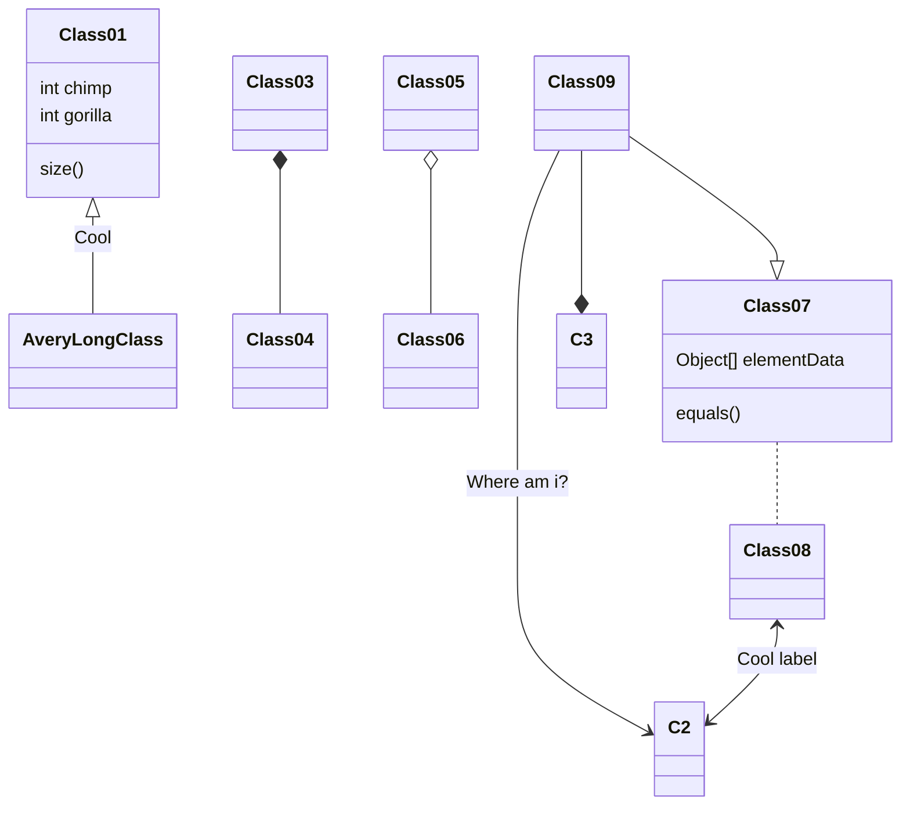
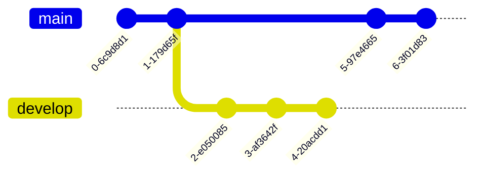
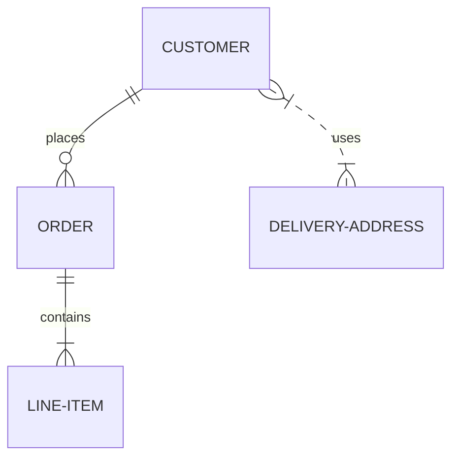
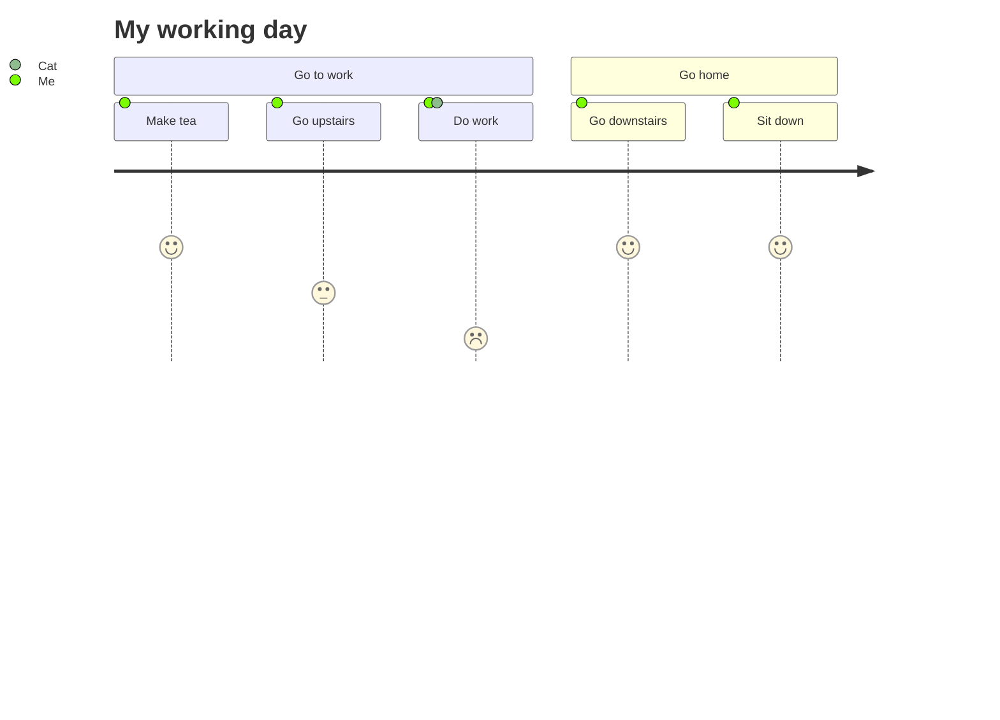
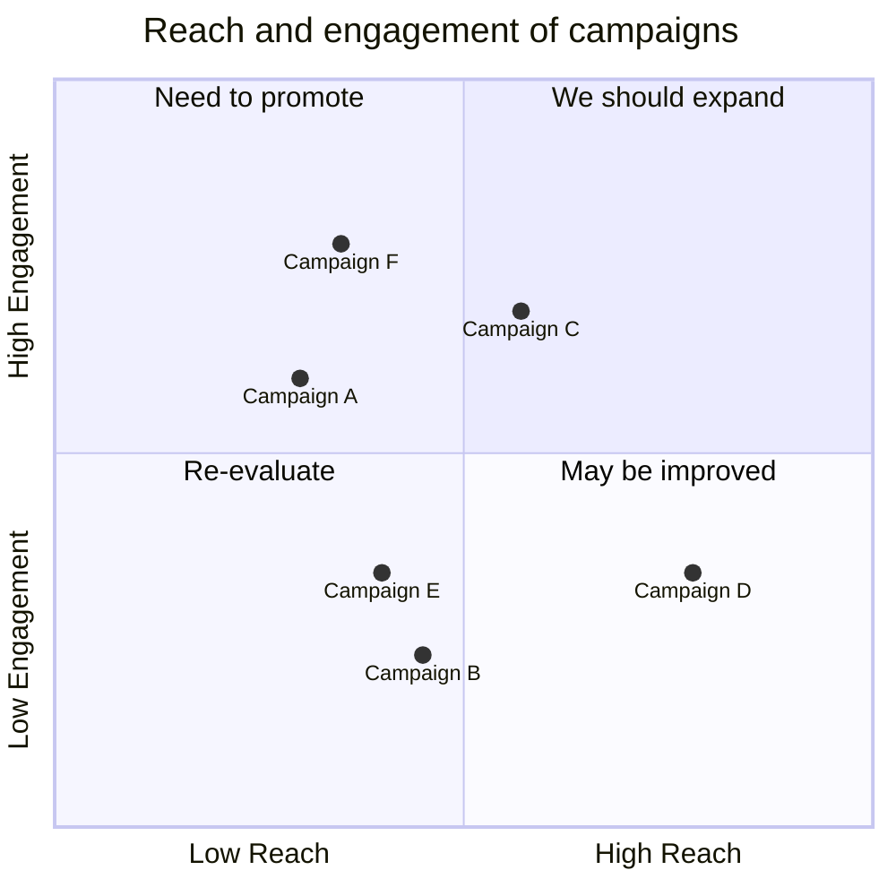
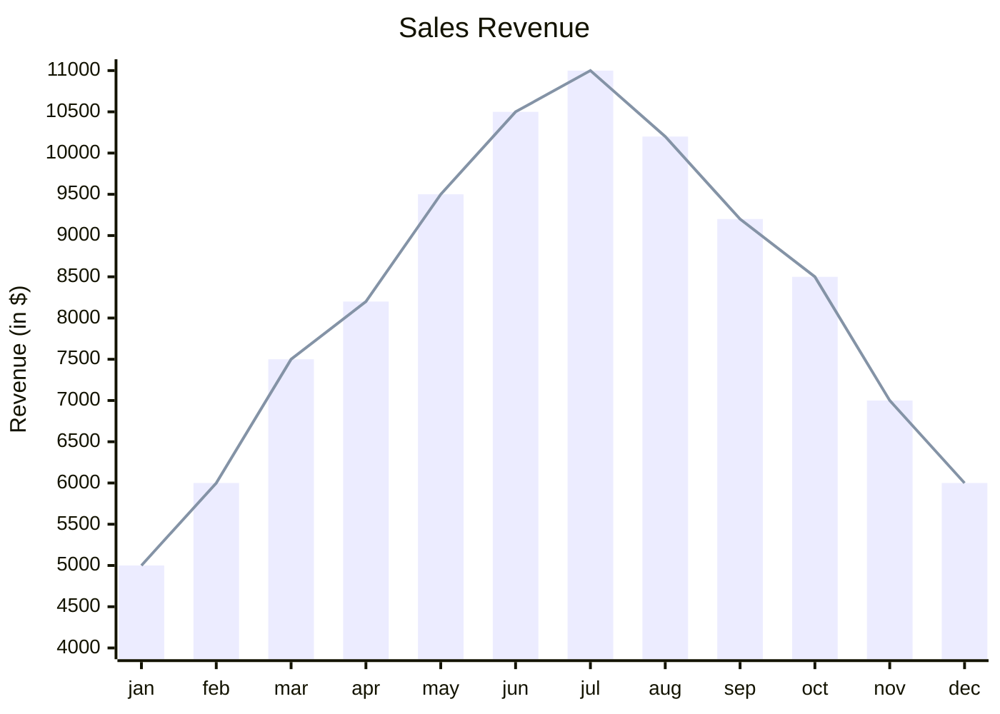

# Mermaid – Text‑Based Diagramming Library

Mermaid lets you create diagrams and visualizations using plain text.  
It is a JavaScript‑based tool that renders Markdown‑style definitions into SVG charts.  
If you are familiar with Markdown, Mermaid is almost a drop‑in replacement for the diagram syntax.

---

## Table of Contents

1. [Introduction](#introduction)
2. [Getting Started](#getting-started)
3. [Diagram Types](#diagram-types)
4. [Syntax & Configuration](#syntax--configuration)
5. [Installation](#installation)
6. [Deployment](#deployment)
7. [Examples](#examples)
8. [Security](#security)
9. [Contributing](#contributing)
10. [License](#license)

---

## 1. Introduction

Mermaid is a JavaScript library that renders diagrams from text definitions.  
It is useful for:

* Keeping documentation up‑to‑date
* Embedding diagrams in Markdown, wikis, blogs, etc.
* Automating diagram generation in CI/CD pipelines

---

## 2. Getting Started

### 2.1 CDN

```html
<script type="module">
  import mermaid from 'https://cdn.jsdelivr.net/npm/mermaid@11/dist/mermaid.esm.min.mjs';
  mermaid.initialize({ startOnLoad: true });
</script>
```

Mermaid will automatically render any `<div>` or `<pre>` with `class="mermaid"`.

### 2.2 Node / NPM

```bash
npm i mermaid          # npm
yarn add mermaid       # yarn
pnpm add mermaid       # pnpm
```

---

## 3. Diagram Types

| Diagram | Syntax |
|--------|-------|
| Flowchart | `graph TD; ...` |
| Sequence Diagram | `sequenceDiagram` |
| Gantt | `gantt` |
| Class Diagram | `classDiagram` |
| Git Graph | `gitGraph` |
| Entity‑Relationship | `erDiagram` |
| User Journey | `journey` |
| Quadrant Chart | `quadrantChart` |
| XY Chart | `xychart-beta` |
| … | (see full list in the original docs) |

---

## 4. Syntax & Configuration

Mermaid uses a Markdown‑inspired syntax.  
Configuration is done via `mermaid.initialize({ ... })`.  
See the full API reference for options such as theming, icons, directives, etc.

---

## 5. Installation

### 5.1 CDN

```text
https://cdn.jsdelivr.net/npm/mermaid@<version>/dist/
```

Replace `<version>` with the desired release (e.g. `11`).

### 5.2 Node

```bash
# Node 16+ required
npm i mermaid
```

---

## 6. Deployment

Insert the script tag shown in **2.1** into your HTML.  
Mermaid will parse `<div class="mermaid">` or `<pre class="mermaid">` tags.

---

## 7. Examples

Below are the core diagram types with working code snippets.

### 7.1 Flowchart


### 7.2 Sequence Diagram



### 7.3 Gantt Diagram



### 7.4 Class Diagram



### 7.5 Git Graph



### 7.6 Entity‑Relationship Diagram



### 7.7 User Journey Diagram



### 7.8 Quadrant Chart



### 7.9 XY Chart



---

## 8. Security

Mermaid sanitizes diagram code, but because diagrams contain many HTML‑like characters, sanitization is non‑trivial.  
For public sites, you can enable a sandboxed iframe rendering mode to prevent JavaScript execution inside diagrams.

---

## 9. Contributing

* Fork the repo: `git clone https://github.com/mermaid-js/mermaid.git`
* Install dependencies:  
  ```bash
  pnpm install
  ```
* Run tests: `pnpm test`
* Submit PRs – we welcome new diagram types, bug fixes, and documentation improvements.

---

## 10. License

Mermaid is released under the MIT license.  
See the `LICENSE` file in the repository for details.

---