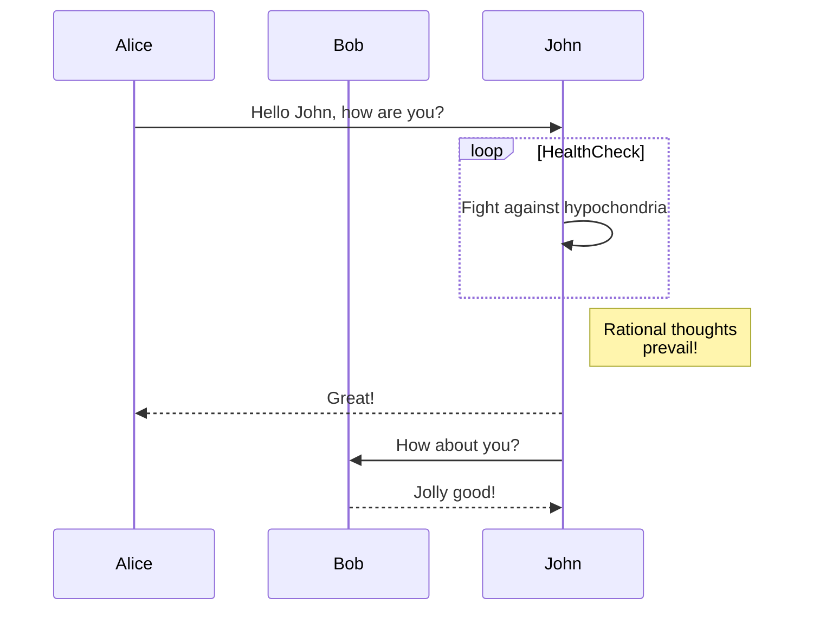
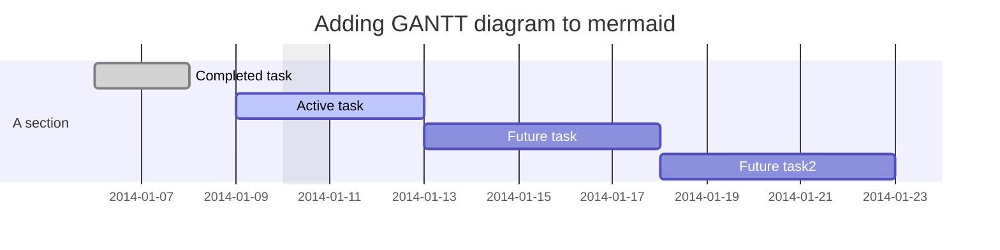
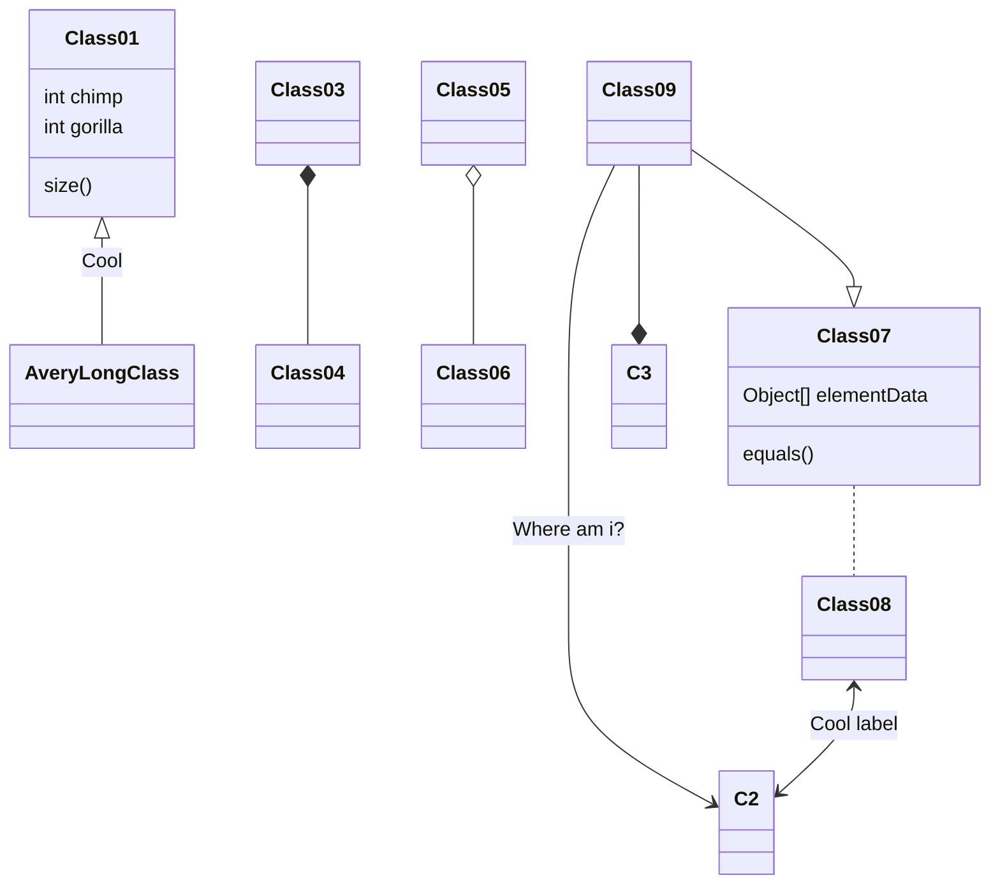
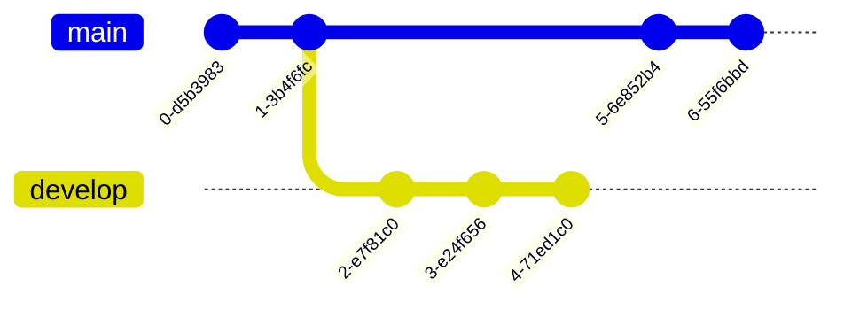
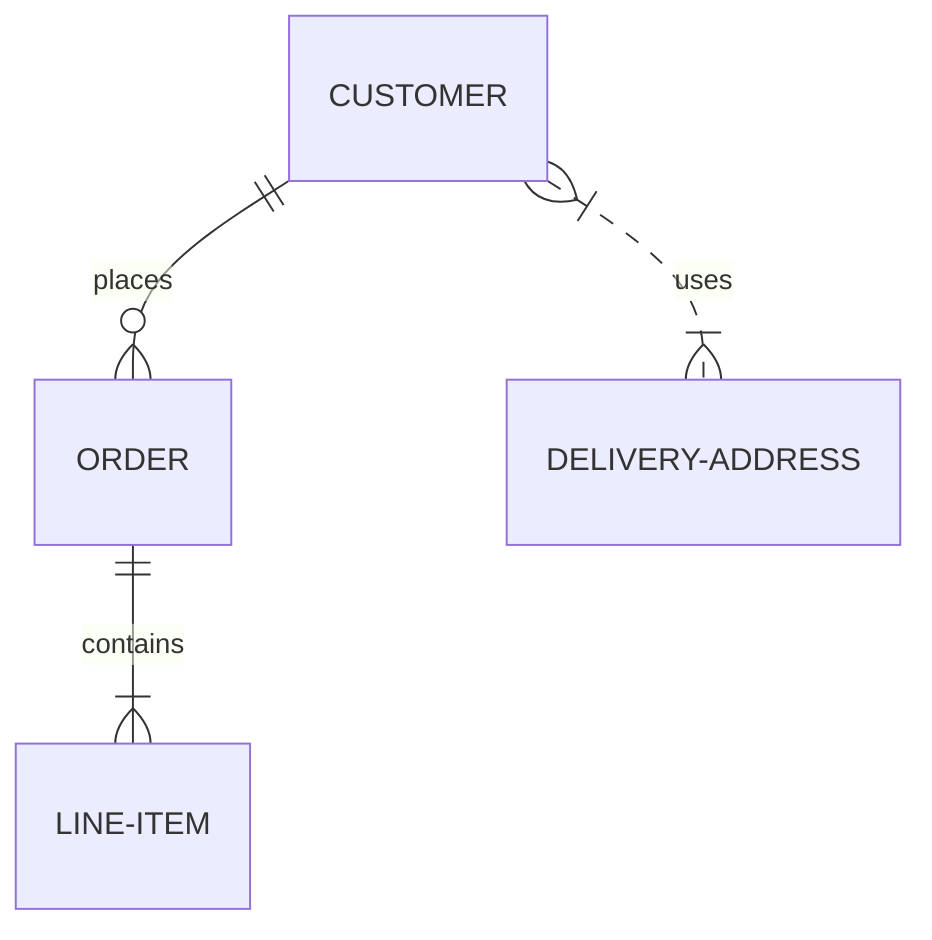
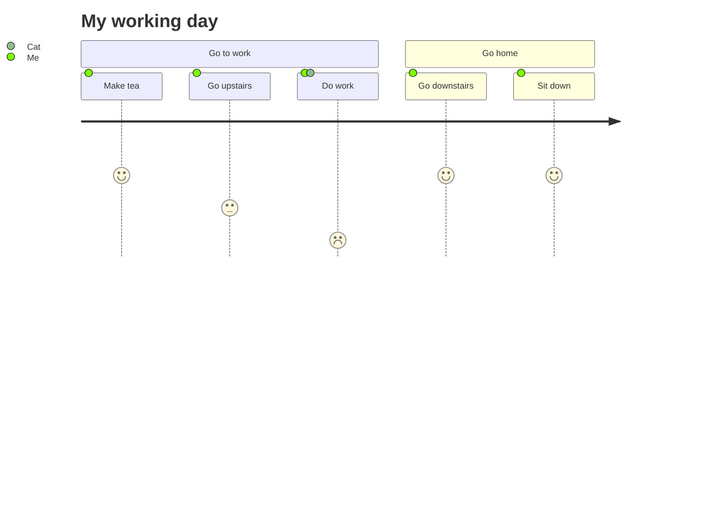
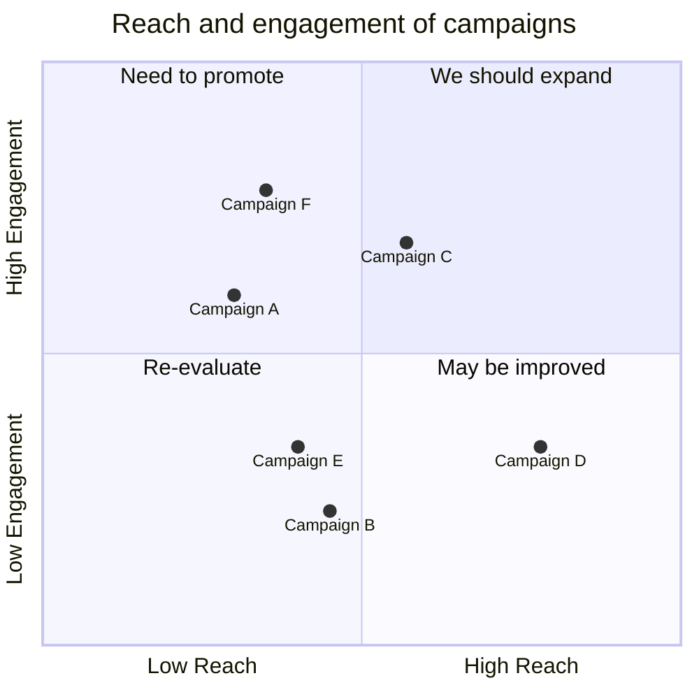
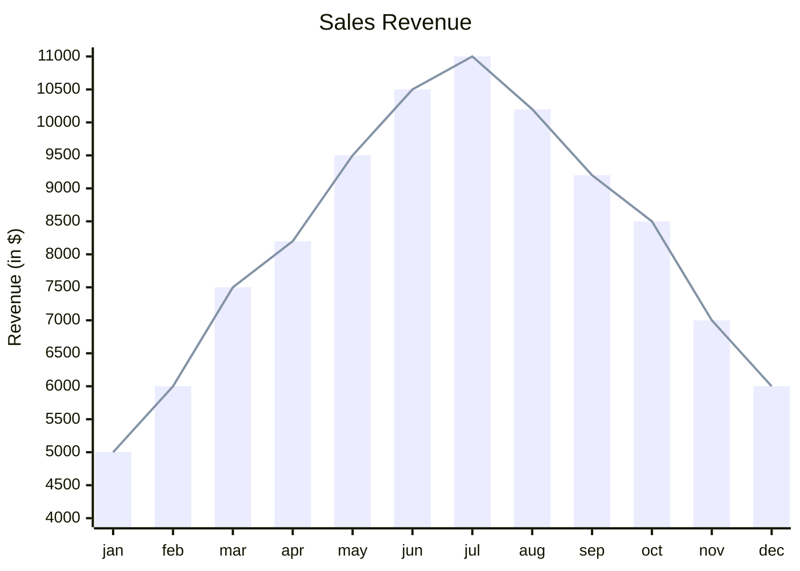

# Mermaid – Text‑Based Diagramming Library

Mermaid lets you create diagrams and visualizations using plain text.  
It is a JavaScript‑based renderer that turns Markdown‑style definitions into SVG charts.

> **Why Mermaid?**  
> • Keeps documentation in sync with code.  
> • Works in Markdown, HTML, VS Code, GitHub, GitLab, etc.  
> • Extensible – add new diagram types or plug‑ins.

---

## 1. Getting Started

### 1.1 Installation

| Package Manager | Command |
|----------------|--------|
| npm | `npm i mermaid` |
| yarn | `yarn add mermaid` |
| pnpm | `pnpm add mermaid` |

### 1.2 CDN

```html
<script type="module">
  import mermaid from 'https://cdn.jsdelivr.net/npm/mermaid@11/dist/mermaid.esm.min.mjs';
  mermaid.initialize({ startOnLoad: true });
</script>
```

The script looks for `<div>` or `<pre>` tags with `class="mermaid"` and renders the diagram inside.

---

## 2. Diagram Types & Syntax

Below are the supported diagram types with minimal examples.  
All examples are runnable in the Mermaid Live Editor or any environment that loads Mermaid.

### 2.1 Flowchart


### 2.2 Sequence Diagram



### 2.3 Gantt Diagram



### 2.4 Class Diagram



### 2.5 Git Graph



### 2.6 Entity‑Relationship Diagram (experimental)



### 2.7 User Journey Diagram



### 2.8 Quadrant Chart



### 2.9 XY Chart (beta)



---

## 3. Security & Sandbox

Mermaid sanitizes diagram code, but for public sites you can enable sandboxed rendering:

```js
mermaid.initialize({
  startOnLoad: true,
  securityLevel: 'sandboxed'   // prevents JS execution inside diagrams
});
```

> **Note:** Sandbox mode disables interactive features.

---

## 4. Contributing

- Fork the repo: `git clone https://github.com/mermaid-js/mermaid.git`
- Install dependencies: `pnpm install`
- Run tests: `pnpm test`
- Lint: `pnpm lint`

See the [Contribution Guidelines](https://github.com/mermaid-js/mermaid/blob/main/CONTRIBUTING.md) for details.

---

## 5. Resources

- **Live Editor:** https://mermaid.live
- **CLI:** `npm i -g @mermaid-js/mermaid-cli`
- **Documentation:** https://mermaid.js.org
- **Community Integrations:** Search the repo for plug‑ins.

---

*Mermaid is maintained by Knut Sveidqvist and a growing community of contributors.*