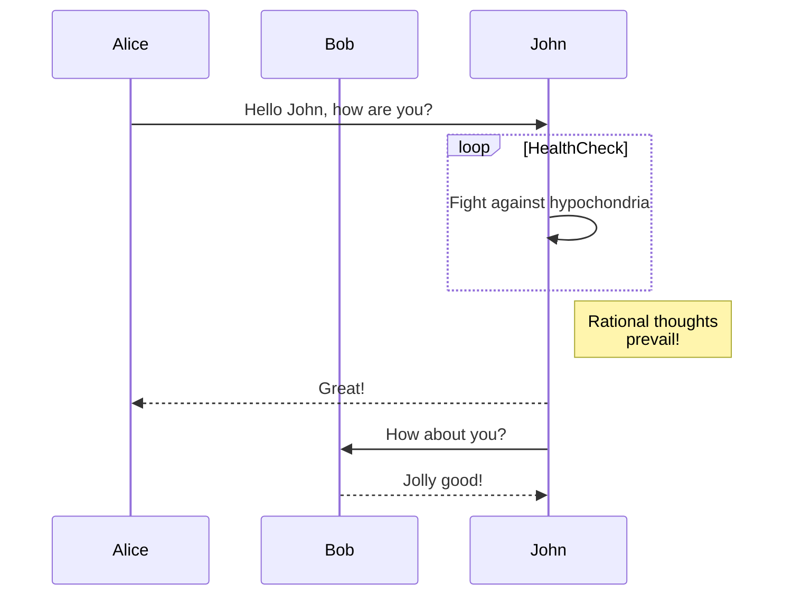
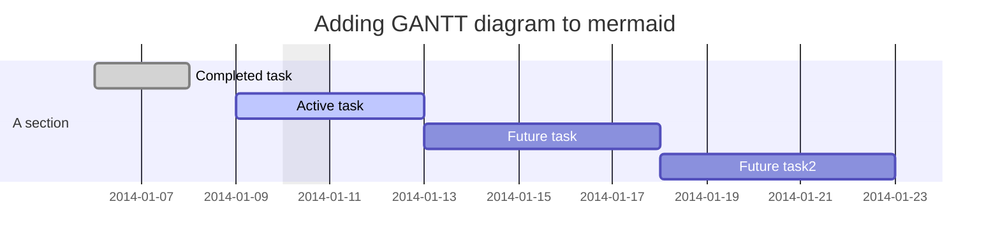
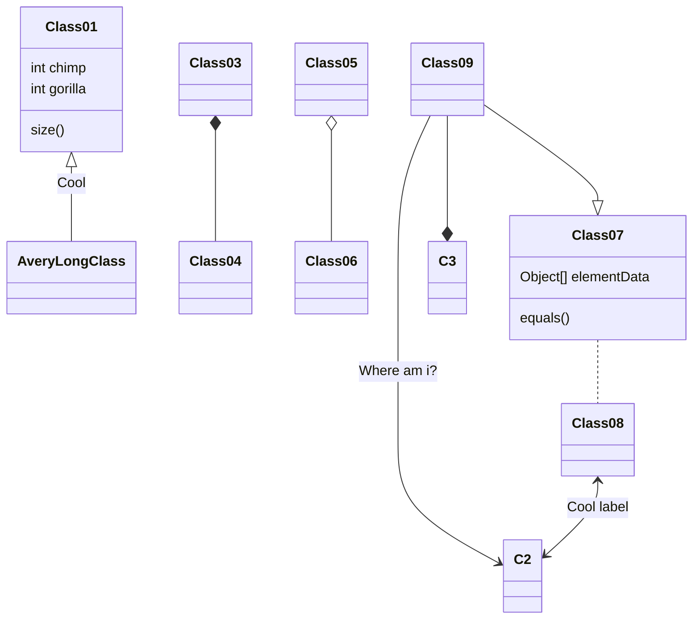
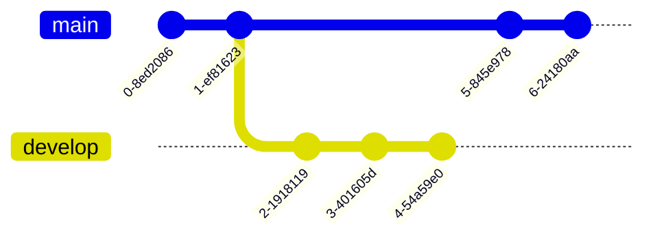
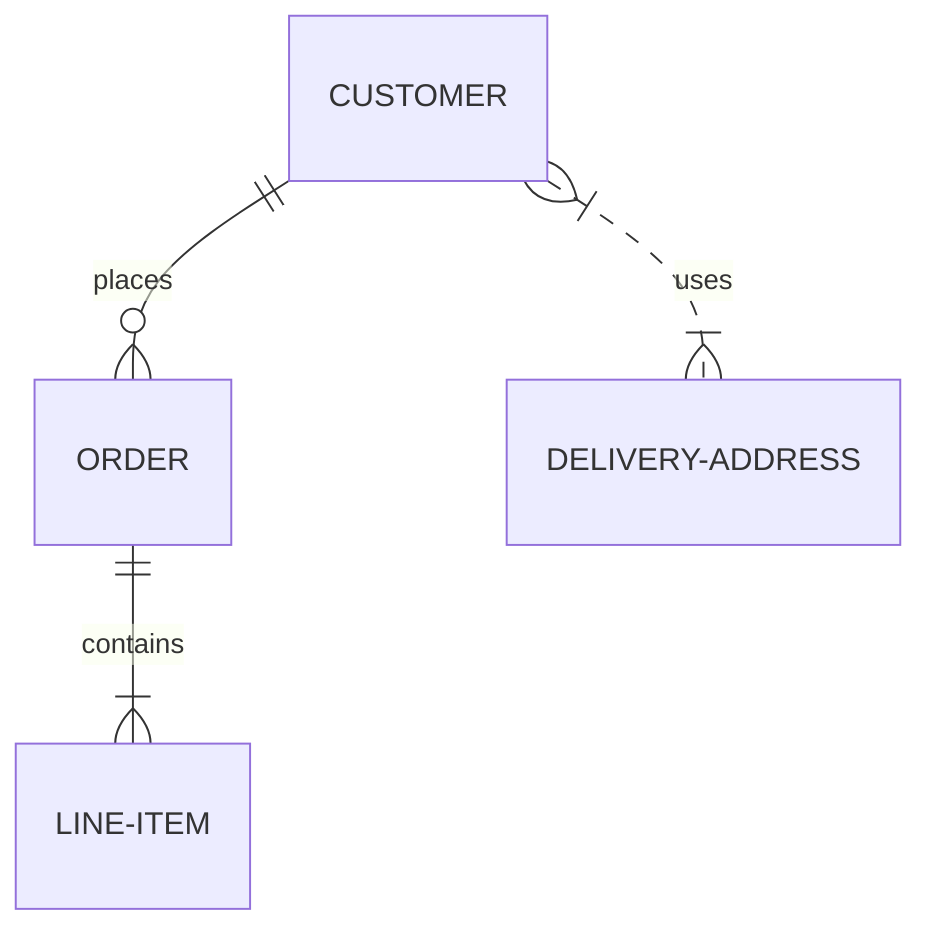
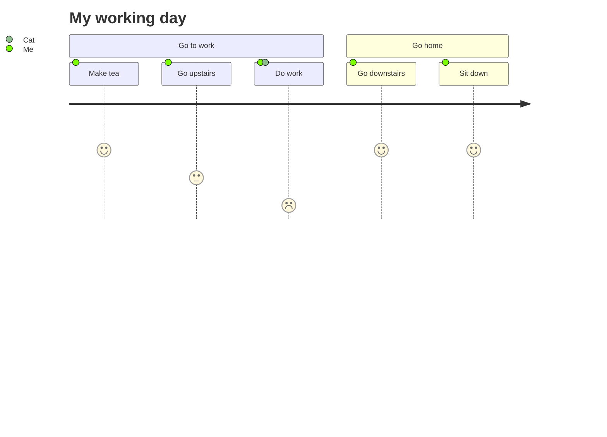
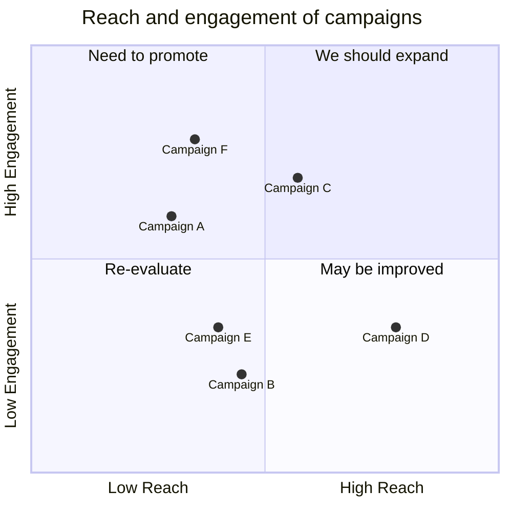
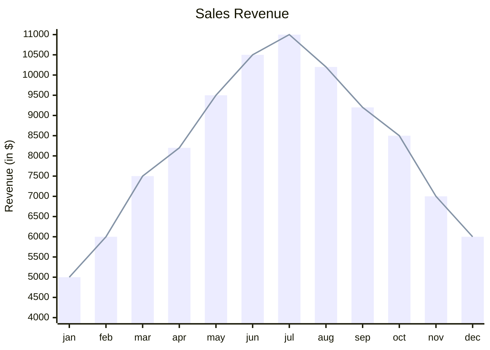

# Mermaid – Text‑Based Diagramming Library

Mermaid is a JavaScript‑based diagramming and charting tool that renders Markdown‑style text definitions into SVG diagrams.  
It is designed to keep documentation in sync with code, to be embeddable in web pages, Markdown files, and CI pipelines.

---

## Table of Contents

| Section | Description |
|--------|------------|
| [Getting Started](#getting-started) | Quick start, CDN, npm |
| [Diagram Types](#diagram-types) | Overview of supported diagrams |
| [Installation](#installation) | CDN, npm, Yarn, pnpm |
| [Usage](#usage) | How to embed diagrams |
| [Examples](#examples) | Full code snippets for each diagram |
| [Security](#security) | Sandbox rendering |
| [Contributing](#contributing) | How to help |
| [License](#license) | MIT |

---

## Getting Started

```bash
# CDN
<script type="module">
  import mermaid from 'https://cdn.jsdelivr.net/npm/mermaid@11/dist/mermaid.esm.min.mjs';
  mermaid.initialize({ startOnLoad: true });
</script>
```

Mermaid will automatically render any `<div>` or `<pre>` element with `class="mermaid"`.

---

## Diagram Types

| Diagram | Syntax | Example |
|--------|-------|--------|
| **Flowchart** | `graph TD;` | See below |
| **Sequence Diagram** | `sequenceDiagram` | See below |
| **Gantt** | `gantt` | See below |
| **Class Diagram** | `classDiagram` | See below |
| **Git Graph** | `gitGraph` | See below |
| **Entity‑Relationship** | `erDiagram` | See below |
| **User Journey** | `journey` | See below |
| **Quadrant Chart** | `quadrantChart` | See below |
| **XY Chart** | `xychart-beta` | See below |

---

## Installation

| Method | Command |
|-------|--------|
| **CDN** | `https://cdn.jsdelivr.net/npm/mermaid@<version>/dist/` |
| **npm** | `npm i mermaid` |
| **Yarn** | `yarn add mermaid` |
| **pnpm** | `pnpm add mermaid` |

> Replace `<version>` with the desired version number (e.g. `11`).

---

## Usage

Add a `<div>` or `<pre>` with `class="mermaid"` and put the diagram definition inside.

```html
<div class="mermaid">
  graph TD;
    A-->B;
    A-->C;
    B-->D;
    C-->D;
</div>
```

Mermaid will parse the text and render an SVG.

---

## Examples

Below are the full code snippets for each diagram type.  
Copy the code into a file with `class="mermaid"` or run it in the Mermaid Live Editor.

### 1. Flowchart


### 2. Sequence Diagram



### 3. Gantt Diagram



### 4. Class Diagram



### 5. Git Graph



### 6. Entity‑Relationship Diagram



### 7. User Journey Diagram



### 8. Quadrant Chart



### 9. XY Chart



---

## Security

Mermaid sanitizes diagram code, but for public sites you can enable sandboxed rendering:

```js
mermaid.initialize({
  startOnLoad: true,
  securityLevel: 'sandbox'
});
```

This renders diagrams inside a sandboxed `<iframe>` to prevent execution of malicious scripts.

---

## Contributing

- Fork the repo: `git clone https://github.com/mermaid-js/mermaid.git`
- Install dependencies: `pnpm install`
- Run tests: `pnpm test`
- Submit PRs with linted code (`pnpm lint`)

See the [CONTRIBUTING.md](https://github.com/mermaid-js/mermaid/blob/main/CONTRIBUTING.md) for details.

---

## License

MIT © Mermaid

---