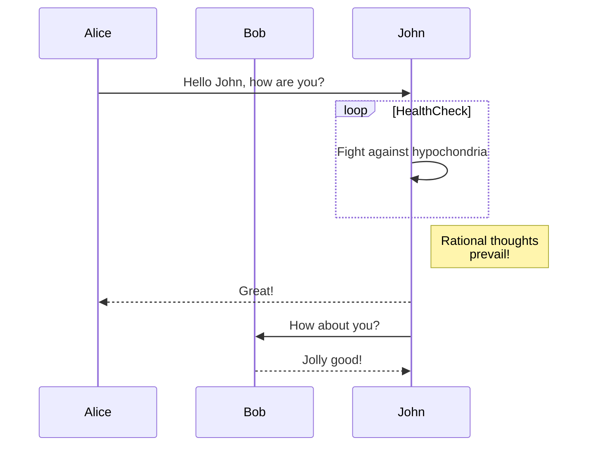
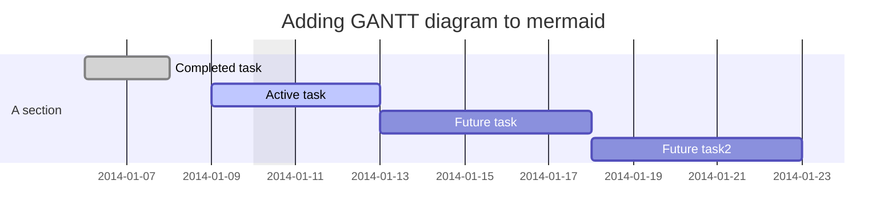
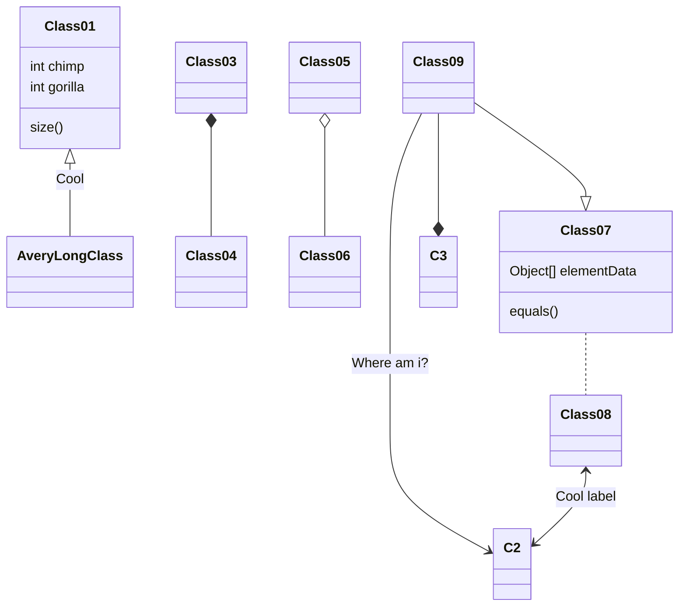
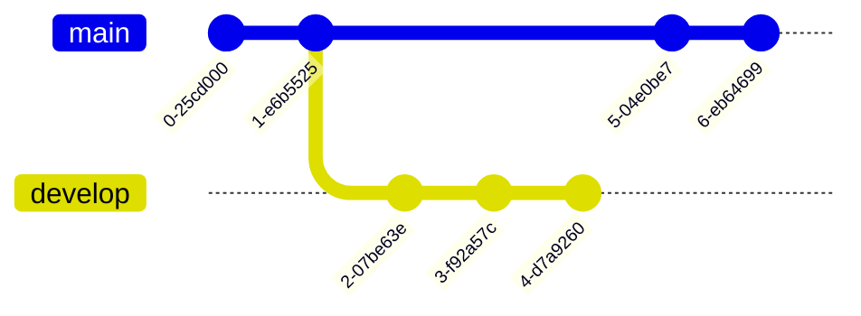
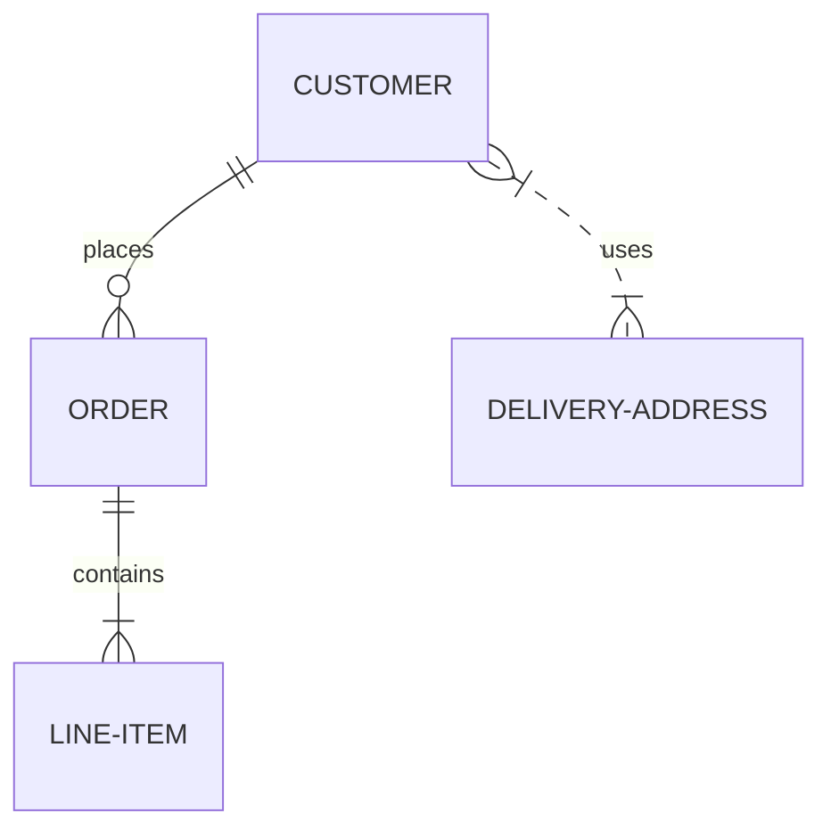
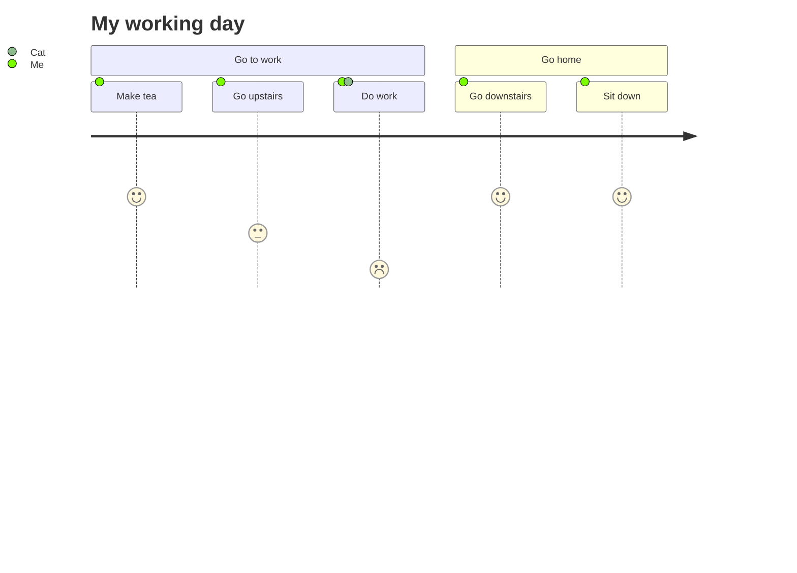
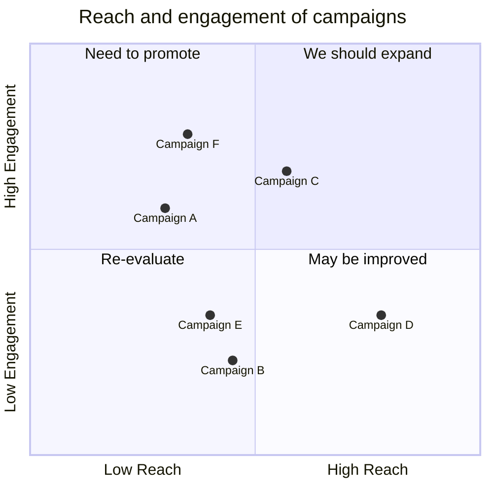
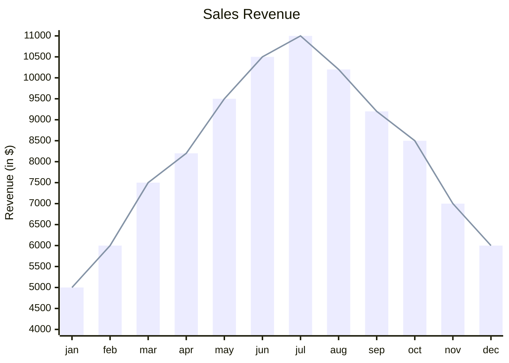

# Mermaid – Text‑Based Diagramming Library

Mermaid is a JavaScript‑based tool that turns plain‑text diagram definitions into SVG visualisations.  
It is inspired by Markdown, so anyone familiar with that syntax can start drawing diagrams immediately.

> **Why Mermaid?**  
> Documentation that grows with code, keeps diagrams up‑to‑date, and can be embedded in Markdown, HTML, or any JavaScript project.

---

## Table of Contents

| Section | Description |
|--------|-------------|
| [Installation](#installation) | CDN, npm, yarn, pnpm |
| [Getting Started](#getting-started) | Quick examples |
| [Diagram Types](#diagram-types) | Flowchart, Sequence, Gantt, Class, Git, ER, Journey, Quadrant, XY |
| [Configuration](#configuration) | `mermaid.initialize`, themes, directives |
| [Security](#security) | Sanitisation, sandboxed rendering |
| [Contribution](#contribution) | How to help |
| [References](#references) | Links to docs, live editor, CLI |

---

## Installation

### CDN

```html
<script type="module">
  import mermaid from 'https://cdn.jsdelivr.net/npm/mermaid@11/dist/mermaid.esm.min.mjs';
  mermaid.initialize({ startOnLoad: true });
</script>
```

### npm / yarn / pnpm

```bash
# npm
npm i mermaid

# yarn
yarn add mermaid

# pnpm
pnpm add mermaid
```

---

## Getting Started

Mermaid looks for `<div>` or `<pre>` tags with `class="mermaid"` and renders the diagram inside.

```html
<div class="mermaid">
  graph TD;
    A-->B;
    A-->C;
    B-->D;
    C-->D;
</div>
```

---

## Diagram Types

Below are the most common diagram types with full examples.  
Copy the code block into a `<pre class="mermaid">` tag or the Mermaid Live Editor.

### 1. Flowchart


### 2. Sequence Diagram



### 3. Gantt Diagram



### 4. Class Diagram



### 5. Git Graph



### 6. Entity‑Relationship Diagram (experimental)



### 7. User Journey Diagram



### 8. Quadrant Chart



### 9. XY Chart (beta)



---

## Configuration

```js
mermaid.initialize({
  startOnLoad: true,
  theme: 'default',          // 'dark', 'forest', 'neutral', etc.
  themeVariables: {          // Override theme colours
    primaryColor: '#ff0000'
  },
  // Directives
  // e.g. %%{init: {'theme': 'dark'}}%%
});
```

- **Themes** – `default`, `dark`, `forest`, `neutral`, `base`, `base2`, `base3`.
- **Directives** – Inline YAML to override settings per diagram.

---

## Security

Mermaid sanitises diagram code before rendering.  
For sites that accept user‑generated diagrams, you can enable sandboxed rendering:

```js
mermaid.initialize({
  securityLevel: 'sandboxed'   // Prevents JS execution inside diagrams
});
```

> **Note**: Sandbox mode disables interactive features (e.g., zoom).

---

## Contribution

- **Issues** – Report bugs or request features on GitHub.
- **Pull Requests** – Add new diagram types, improve existing ones, or fix bugs.
- **Documentation** – Help keep the docs up‑to‑date.

See the [Contribution Guidelines](https://github.com/mermaid-js/mermaid/blob/main/CONTRIBUTING.md).

---

## References

- **Live Editor** – https://mermaid.live
- **CLI** – `npx mermaid-cli`
- **Docs** – https://mermaid-js.github.io/mermaid/#/
- **Community Integrations** – Plugins for VS Code, Obsidian, etc.

---

*Mermaid was created by Knut Sveidqvist. It is maintained by a growing community of contributors.*