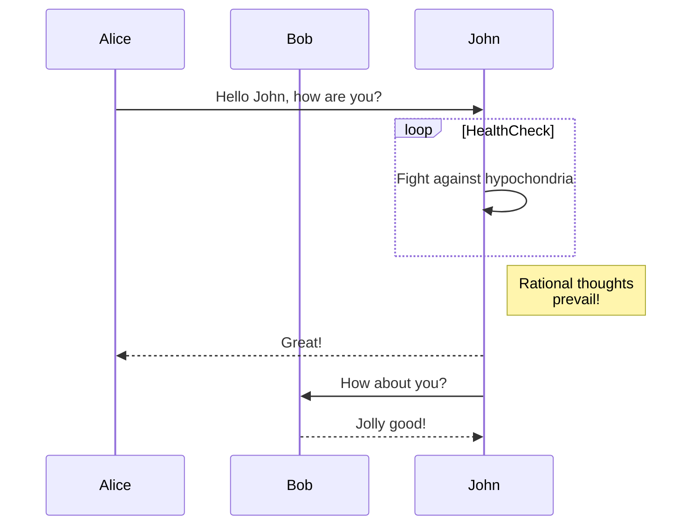
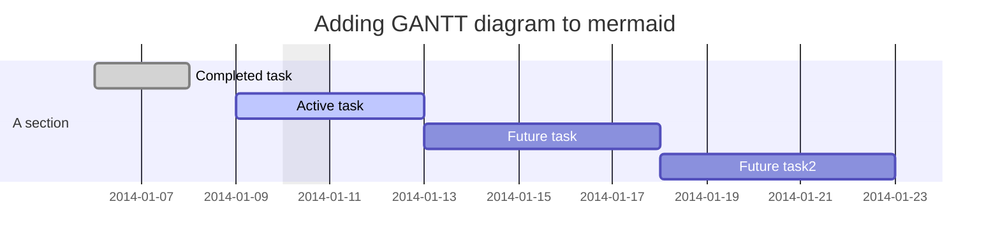
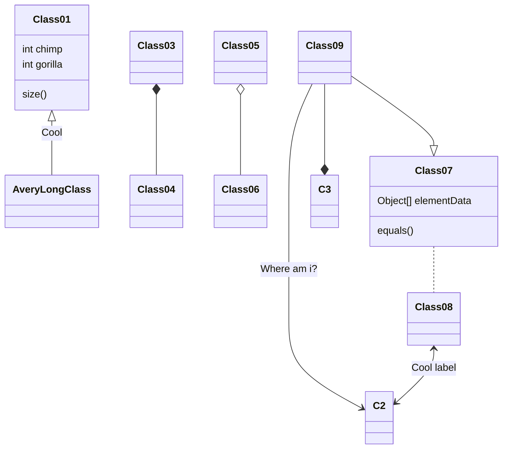
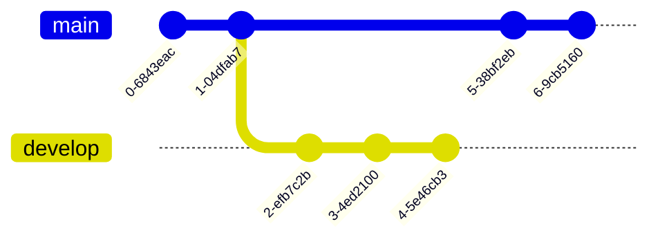
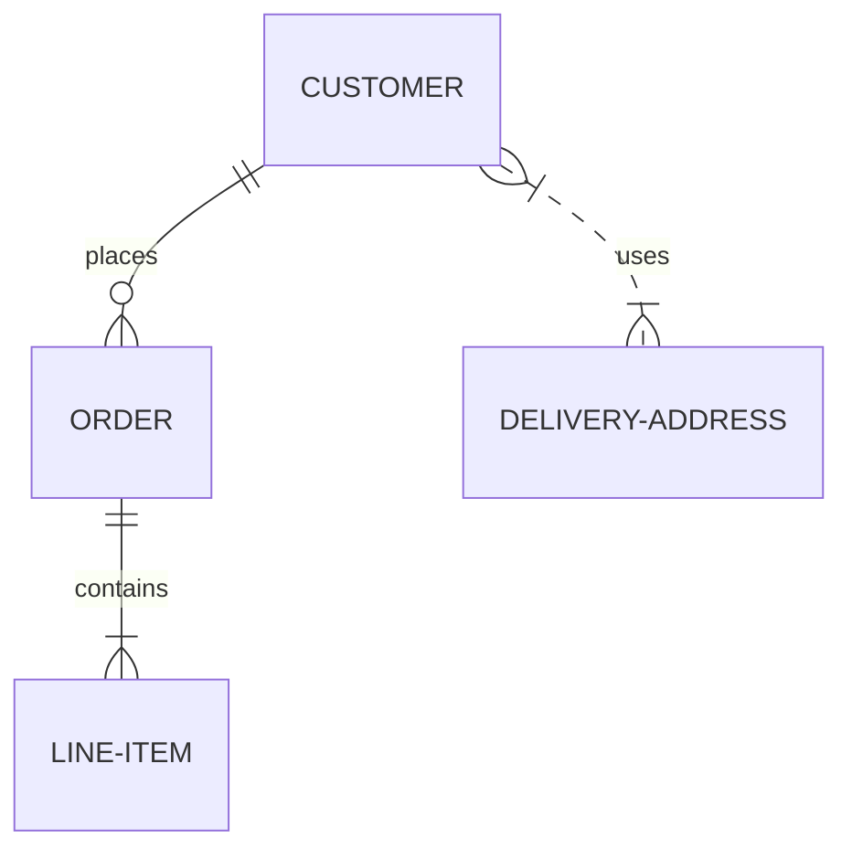
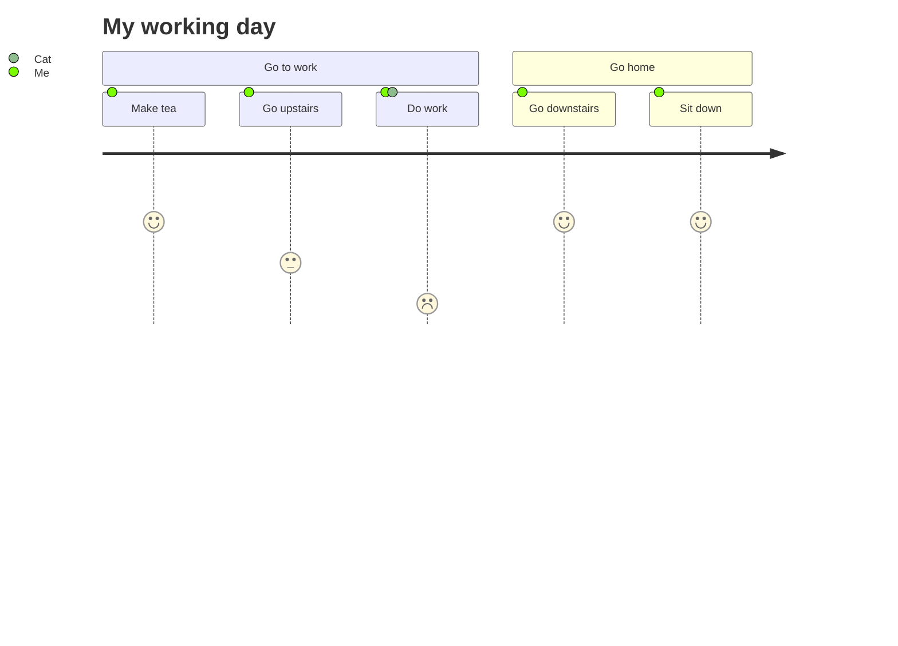
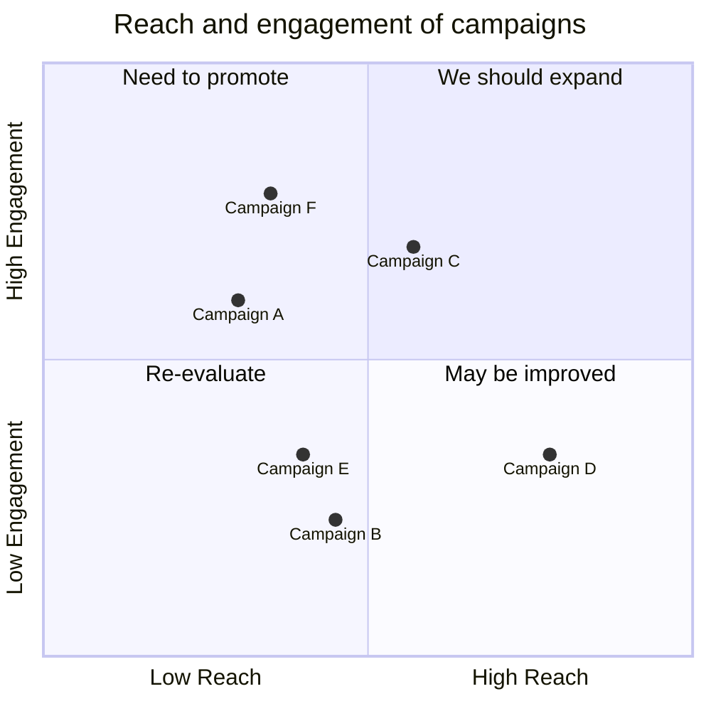
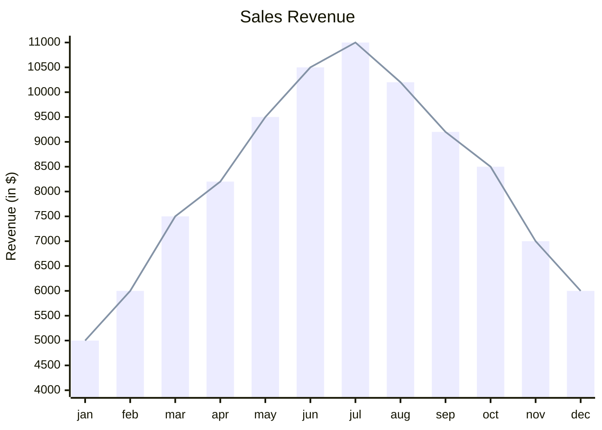

# Mermaid – Text‑Based Diagramming Library

Mermaid lets you create diagrams and visualizations using plain text.  
It is a JavaScript‑based renderer that turns Markdown‑style definitions into SVG charts.

> **Why Mermaid?**  
> * Keeps documentation up‑to‑date.  
> * Works in Markdown, code comments, docs sites, CI pipelines, etc.  
> * Extensible – add new diagram types or integrate with your favourite editor.

---

## 1. Getting Started

### 1.1 Install

| Package manager | Command |
|----------------|--------|
| npm | `npm i mermaid` |
| yarn | `yarn add mermaid` |
| pnpm | `pnpm add mermaid` |

### 1.2 CDN

```html
<script type="module">
  import mermaid from 'https://cdn.jsdelivr.net/npm/mermaid@11/dist/mermaid.esm.min.mjs';
  mermaid.initialize({ startOnLoad: true });
</script>
```

Mermaid will automatically render any `<div>` or `<pre>` with `class="mermaid"`.

---

## 2. Diagram Types & Syntax

Below are the most common diagram types with full examples.  
Copy the code blocks into a file with a `.md` extension or a Markdown editor that supports Mermaid.

### 2.1 Flowchart


### 2.2 Sequence Diagram



### 2.3 Gantt Diagram



### 2.4 Class Diagram



### 2.5 Git Graph



### 2.6 Entity Relationship Diagram (experimental)



### 2.7 User Journey Diagram



### 2.8 Quadrant Chart



### 2.9 XY Chart (beta)



---

## 3. Security

Mermaid sanitizes diagram code, but for public sites you can enable sandboxed rendering:

```js
mermaid.initialize({
  startOnLoad: true,
  securityLevel: 'sandbox'
});
```

> **Note:** Sandbox mode disables JavaScript execution inside diagrams.

---

## 4. Development & Contribution

1. **Clone**  
   `git clone https://github.com/mermaid-js/mermaid.git`
2. **Install**  
   `pnpm install`
3. **Run tests**  
   `pnpm test`
4. **Lint**  
   `pnpm lint`

Feel free to open issues or pull requests. See the [contribution guide](https://github.com/mermaid-js/mermaid/blob/main/CONTRIBUTING.md) for details.

---

## 5. Resources

| Resource | Link |
|---------|------|
| Documentation | https://mermaid.js.org |
| Live Editor | https://mermaid.live |
| CLI | https://github.com/mermaid-js/mermaid-cli |
| Community Integrations | https://mermaid.js.org/integrations |

---

**Happy diagramming!**