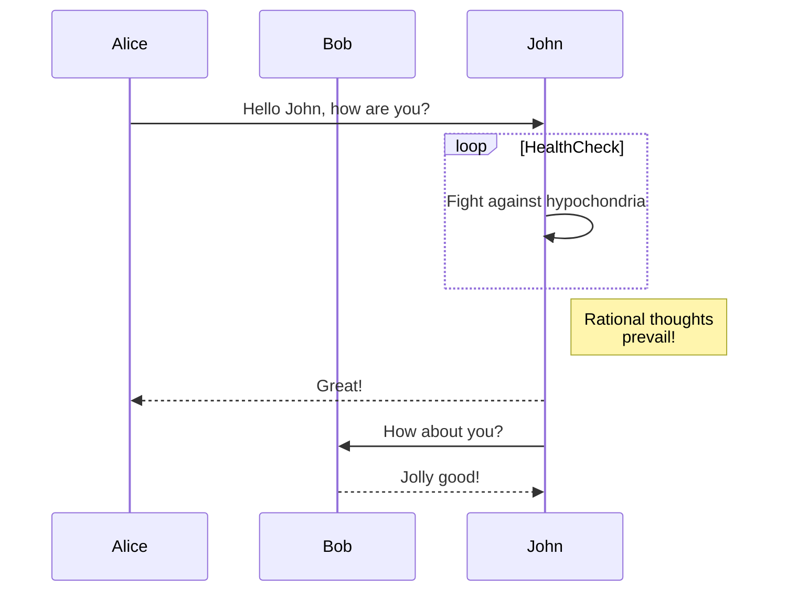
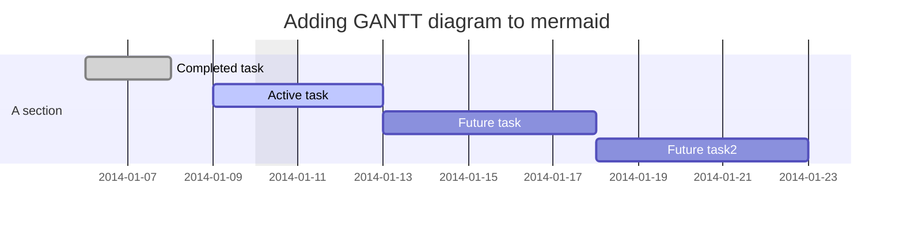
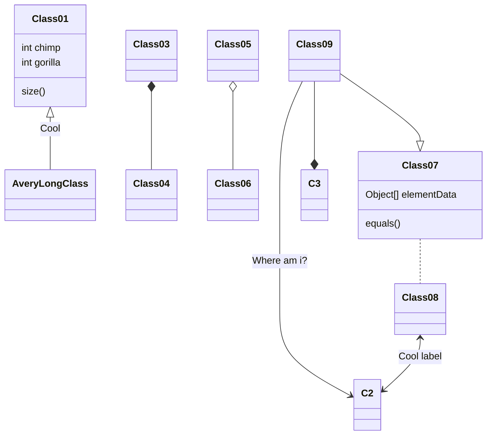
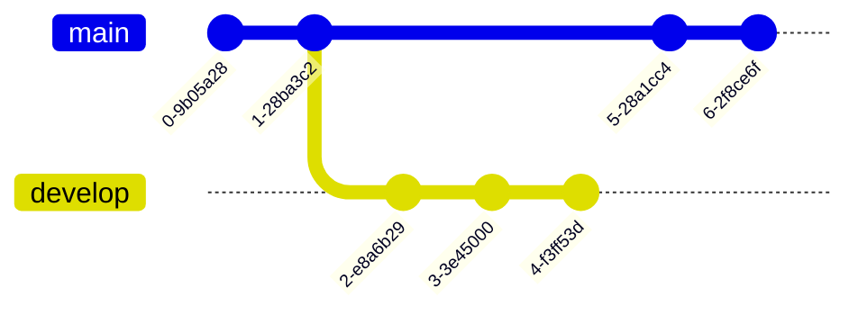
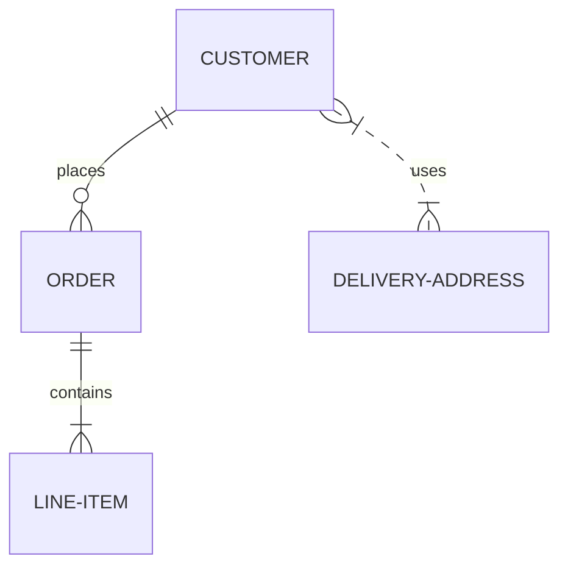
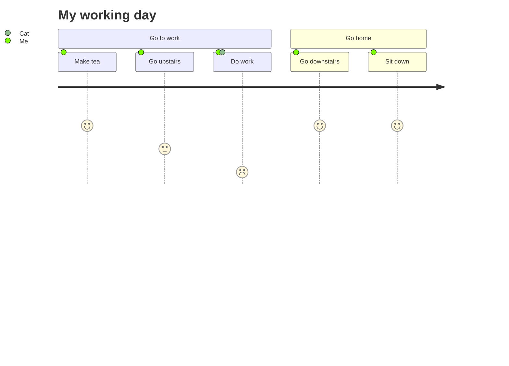
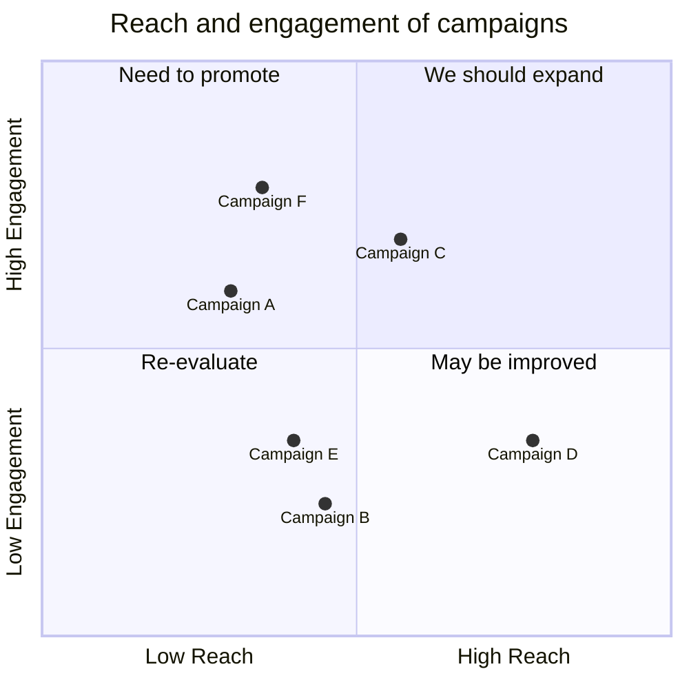
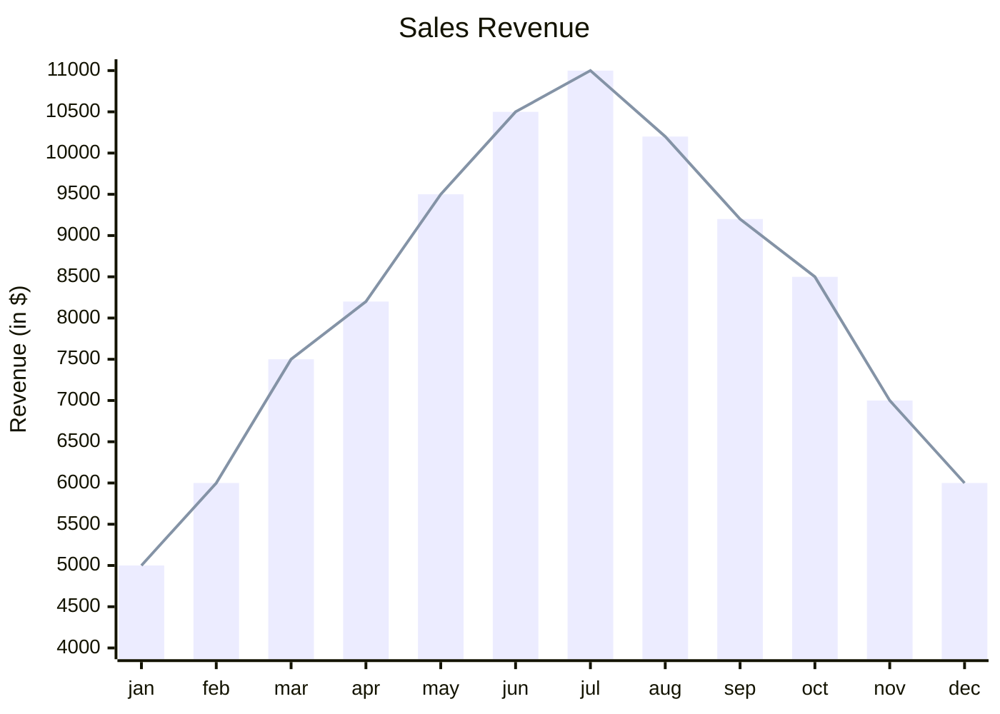

# Mermaid – Text‑Based Diagramming Library

Mermaid lets you create diagrams and visualizations using plain text.  
It is a JavaScript‑based tool that renders Markdown‑style definitions into SVG charts, making it easy to keep documentation up‑to‑date and shareable.

> **Why Mermaid?**  
> Documentation that is out of sync with code is a productivity killer.  
> Mermaid solves this by letting you write diagrams in the same language you use for code – plain text – and embed them directly in Markdown, HTML, or any other text‑based format.

---

## Table of Contents

1. [Getting Started](#getting-started)  
2. [Diagram Types](#diagram-types)  
   - [Flowchart](#flowchart)  
   - [Sequence Diagram](#sequence-diagram)  
   - [Gantt Diagram](#gantt-diagram)  
   - [Class Diagram](#class-diagram)  
   - [Git Graph](#git-graph)  
   - [Entity‑Relationship Diagram](#entity-relationship-diagram)  
   - [User Journey Diagram](#user-journey-diagram)  
   - [Quadrant Chart](#quadrant-chart)  
   - [XY Chart](#xy-chart)  
3. [Installation](#installation)  
4. [Configuration](#configuration)  
5. [Security](#security)  
6. [Contributing](#contributing)  
7. [License](#license)

---

## Getting Started

Mermaid can be used in three main ways:

1. **Via CDN** – Add a `<script>` tag to your page.  
2. **Node package** – `npm i mermaid` (or `yarn add mermaid`).  
3. **CLI** – `npx mermaid-cli` for generating SVGs from the command line.

### CDN Example

```html
<script type="module">
  import mermaid from 'https://cdn.jsdelivr.net/npm/mermaid@11/dist/mermaid.esm.min.mjs';
  mermaid.initialize({ startOnLoad: true });
</script>
```

Mermaid will automatically render any `<div>` or `<pre>` with `class="mermaid"`.

---

## Diagram Types

Below are the supported diagram types with minimal syntax and a working example for each.

### Flowchart


### Sequence Diagram



### Gantt Diagram



### Class Diagram



### Git Graph



### Entity‑Relationship Diagram



### User Journey Diagram



### Quadrant Chart



### XY Chart



---

## Installation

### CDN

```text
https://cdn.jsdelivr.net/npm/mermaid@<version>/dist/
```

Replace `<version>` with the desired release (e.g. `11`).

### Node Package

```bash
npm i mermaid
# or
yarn add mermaid
# or
pnpm add mermaid
```

### CLI

```bash
npx mermaid-cli -i input.mmd -o output.svg
```

---

## Configuration

Mermaid can be configured via `mermaid.initialize({ ... })`.  
Common options:

| Option | Description |
|-------|------------|
| `startOnLoad` | Auto‑render diagrams on page load |
| `theme` | `default`, `forest`, `dark`, `neutral` |
| `themeVariables` | Override theme colors |
| `securityLevel` | `strict`, `loose`, `sandbox` |

Example:

```js
mermaid.initialize({
  startOnLoad: true,
  theme: 'dark',
  securityLevel: 'sandbox'
});
```

---

## Security

Mermaid sanitizes diagram code to prevent XSS.  
For highly untrusted input, set `securityLevel: 'sandbox'` to render diagrams inside a sandboxed iframe, disabling JavaScript execution in the diagram code.

---

## Contributing

Mermaid is an open‑source project.  
If you’d like to contribute:

1. Fork the repo: `git clone https://github.com/mermaid-js/mermaid.git`
2. Install dependencies: `pnpm install`
3. Run tests: `pnpm test`
4. Submit a pull request.

See the [CONTRIBUTING.md](https://github.com/mermaid-js/mermaid/blob/main/CONTRIBUTING.md) for details.

---

## License

Mermaid is released under the MIT license.  
See the [LICENSE](https://github.com/mermaid-js/mermaid/blob/main/LICENSE) file for details.