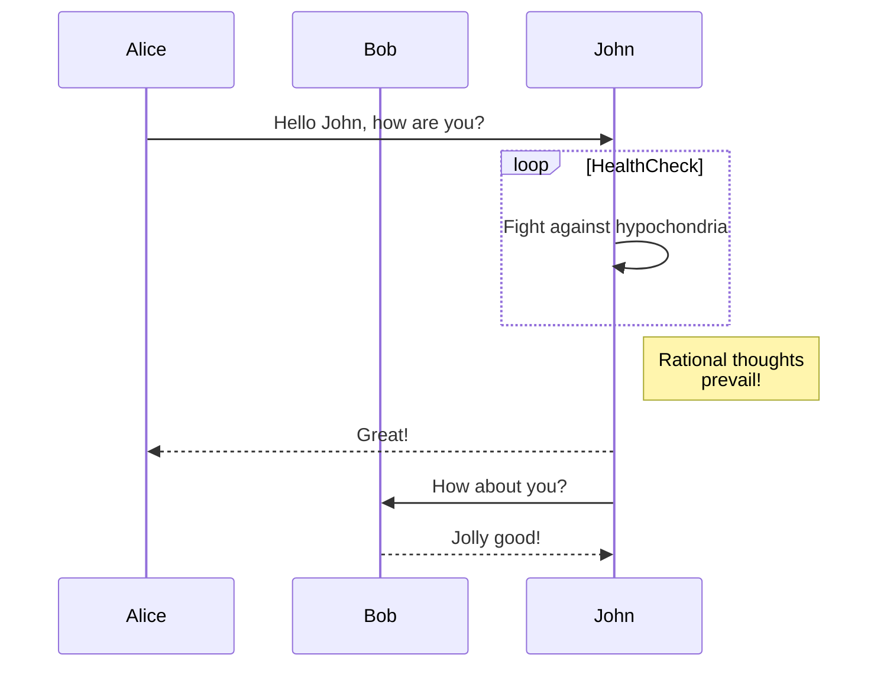
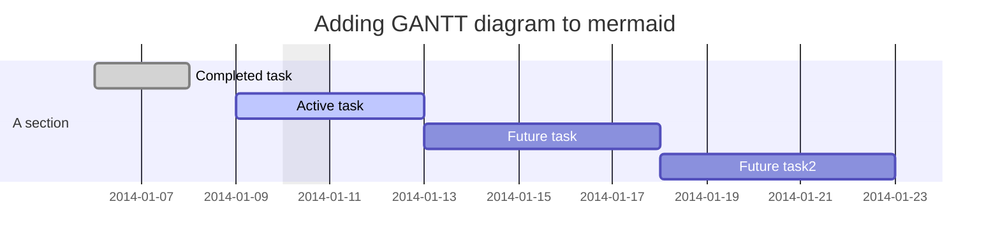
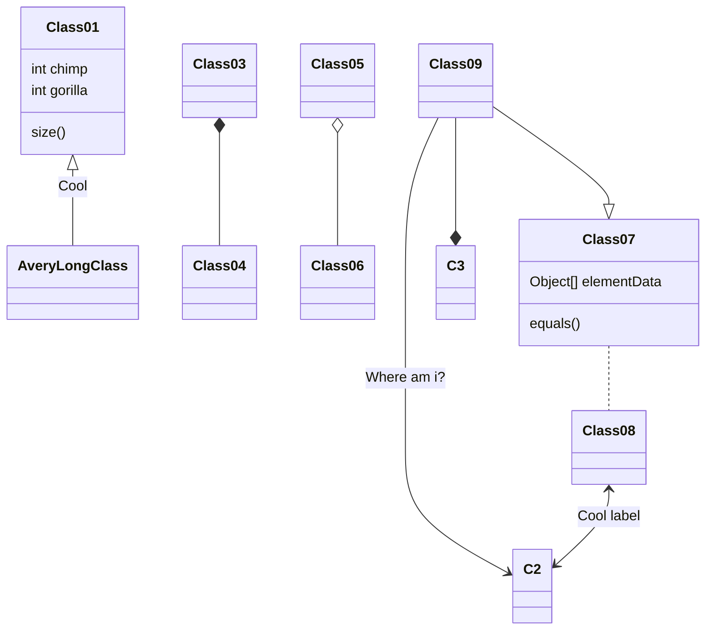
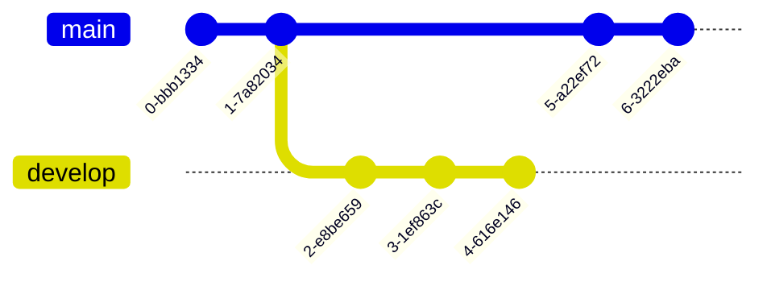
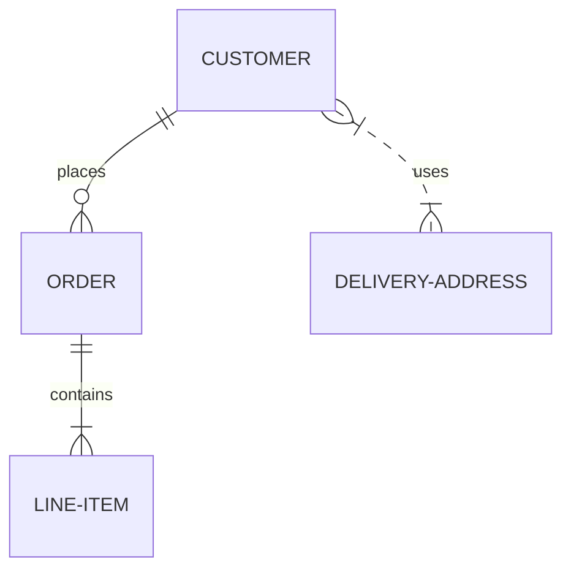
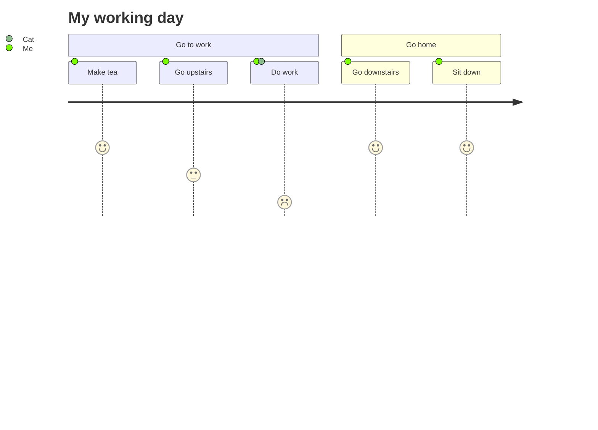
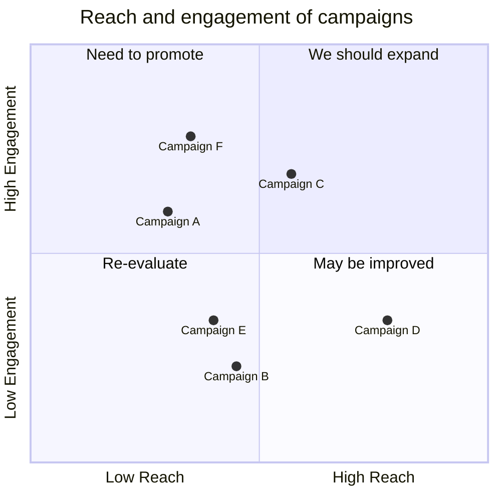
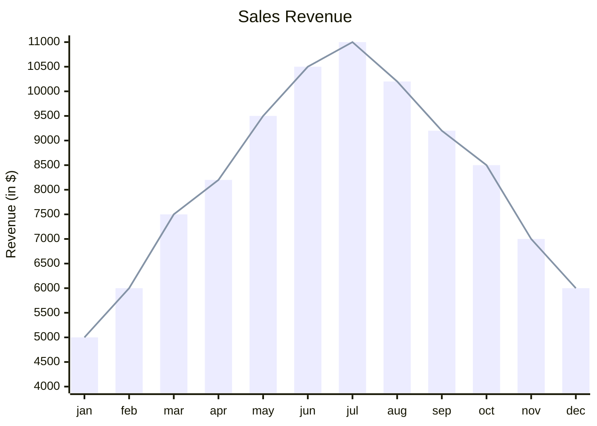

# Mermaid – Text‑Based Diagramming Library

Mermaid is a JavaScript‑based diagramming tool that turns plain‑text definitions into SVG charts.  
It is inspired by Markdown, so anyone familiar with Markdown can start writing diagrams immediately.

> **Why Mermaid?**  
> Documentation that is out‑of‑date is costly. Mermaid lets you keep diagrams in sync with code, making them easy to edit, version‑control, and embed in any web page or documentation system.

---

## Table of Contents

| Section | Description |
|--------|------------|
| [Installation](#installation) | CDN, npm, yarn, pnpm |
| [Getting Started](#getting-started) | Quick example |
| [Configuration](#configuration) | `mermaid.initialize` options |
| [Diagram Types](#diagram-types) | Flowchart, Sequence, Gantt, Class, Git Graph, ER, Journey, Quadrant, XY |
| [Examples](#examples) | Full code snippets for each diagram |
| [Security](#security) | Sandbox rendering |
| [Contribution](#contribution) | How to help |
| [License](#license) | MIT |

---

## Installation

### CDN

```html
<script type="module">
  import mermaid from 'https://cdn.jsdelivr.net/npm/mermaid@11/dist/mermaid.esm.min.mjs';
  mermaid.initialize({ startOnLoad: true });
</script>
```

### npm / yarn / pnpm

```bash
# npm
npm i mermaid

# yarn
yarn add mermaid

# pnpm
pnpm add mermaid
```

---

## Getting Started

Add a `<div class="mermaid">` or `<pre class="mermaid">` to your page and write Mermaid syntax inside.

```html
<div class="mermaid">
graph TD;
    A-->B;
    A-->C;
    B-->D;
    C-->D;
</div>
```

Mermaid will automatically render the diagram on page load.

---

## Configuration

```js
mermaid.initialize({
  startOnLoad: true,          // Render diagrams on page load
  theme: 'default',         // 'default', 'forest', 'dark', 'neutral'
  themeVariables: {          // Override theme colors
    primaryColor: '#ff0000'
  },
  securityLevel: 'strict',  // 'strict', 'loose', 'sandbox'
  // ... other options
});
```

- **`securityLevel`**  
  *`strict`* – sanitizes input.  
  *`loose`* – minimal sanitization.  
  *`sandbox`* – renders diagrams inside a sandboxed iframe (no JS execution).

---

## Diagram Types

| Diagram | Syntax | Example |
|--------|-------|--------|
| **Flowchart** | `graph TD; ...` | See below |
| **Sequence Diagram** | `sequenceDiagram` | See below |
| **Gantt** | `gantt` | See below |
| **Class Diagram** | `classDiagram` | See below |
| **Git Graph** | `gitGraph` | See below |
| **Entity‑Relationship** | `erDiagram` | See below |
| **User Journey** | `journey` | See below |
| **Quadrant Chart** | `quadrantChart` | See below |
| **XY Chart** | `xychart-beta` | See below |

---

## Examples

### Flowchart


### Sequence Diagram



### Gantt Diagram



### Class Diagram



### Git Graph



### Entity‑Relationship Diagram



### User Journey Diagram



### Quadrant Chart



### XY Chart



---

## Security

Mermaid sanitizes diagram code to prevent XSS.  
For sites that accept user‑generated diagrams, you can enable sandbox rendering:

```js
mermaid.initialize({
  securityLevel: 'sandbox'
});
```

This renders each diagram inside a sandboxed `<iframe>`, blocking any JavaScript execution from the diagram code.

---

## Contribution

- Fork the repo: `git clone https://github.com/mermaid-js/mermaid.git`
- Install dependencies:  
  ```bash
  pnpm install
  ```
- Run tests: `pnpm test`
- Submit PRs – we welcome new diagram types, bug fixes, and documentation improvements.

---

## License

MIT © Mermaid

---