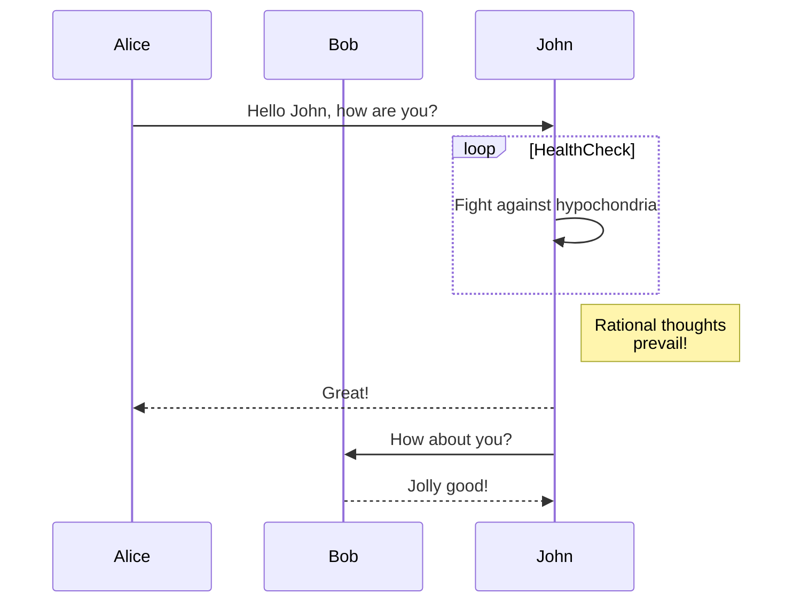
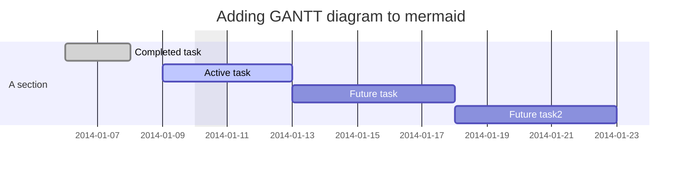
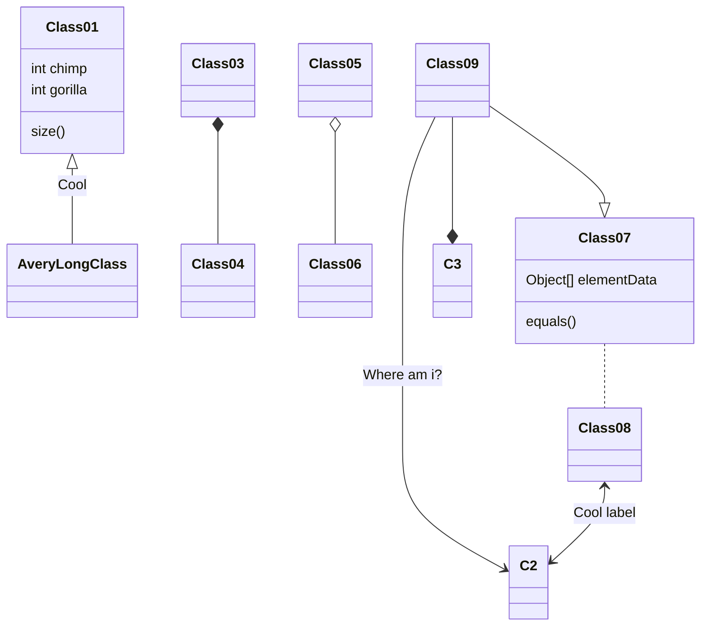
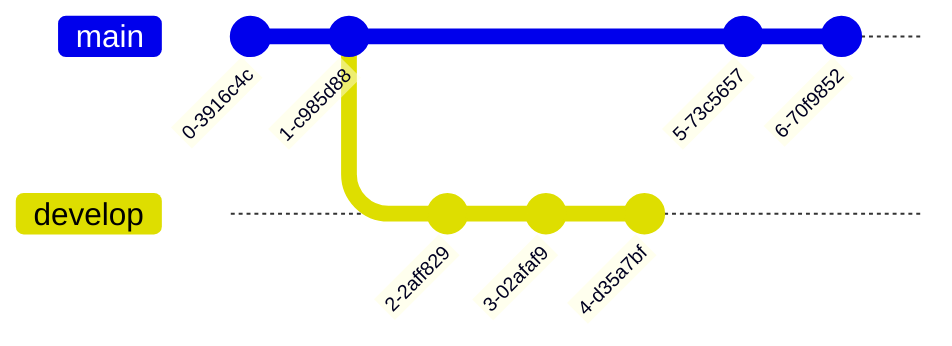
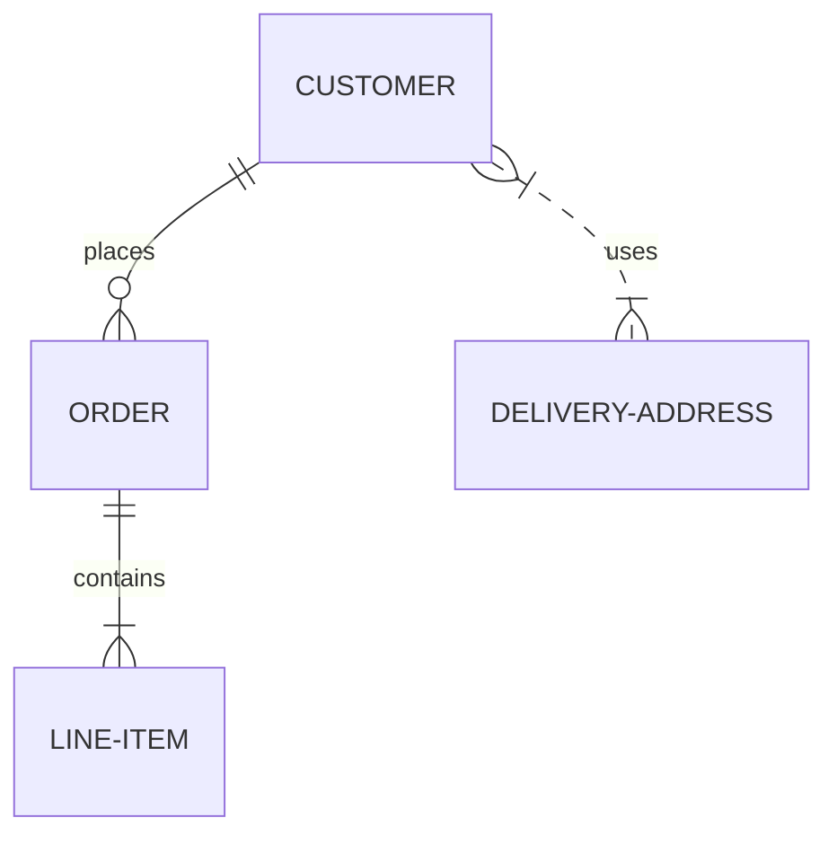
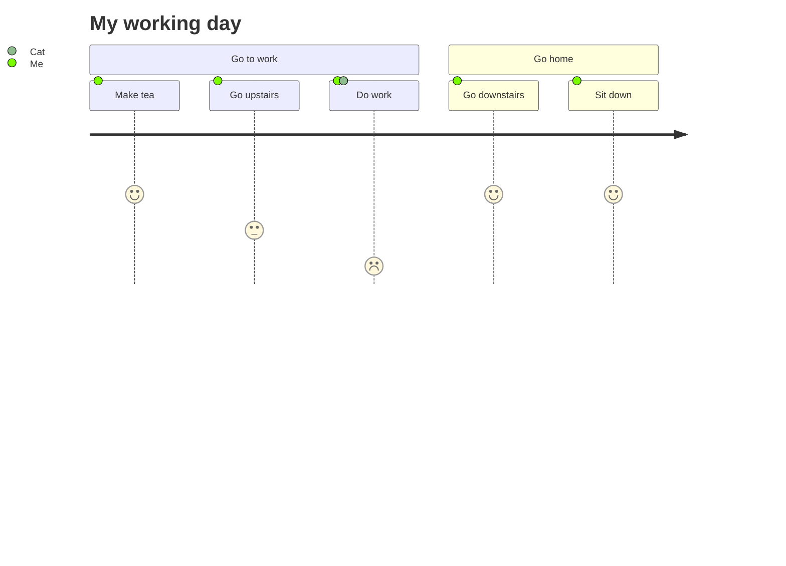
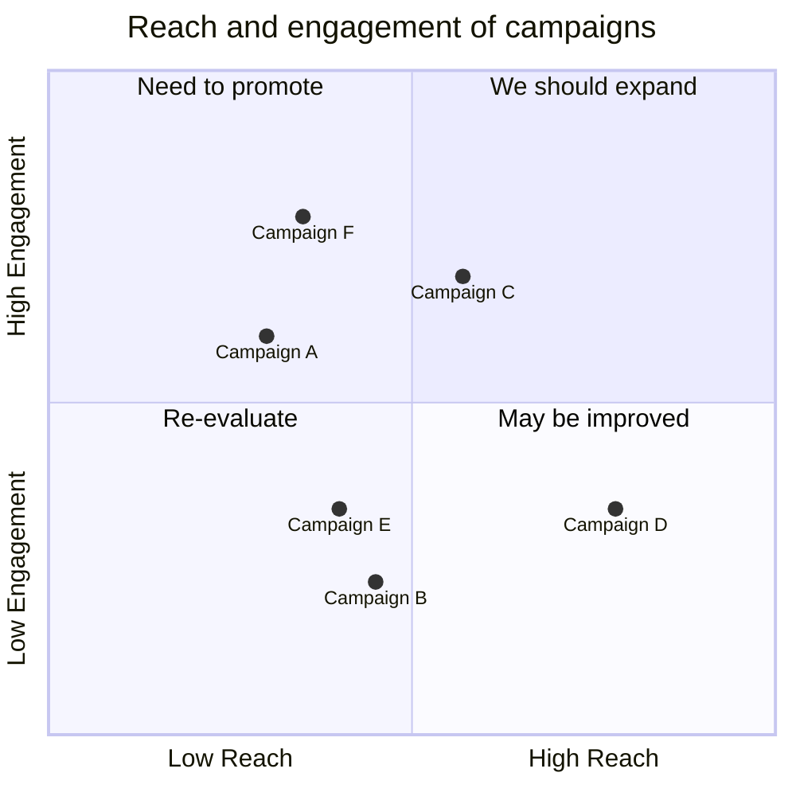
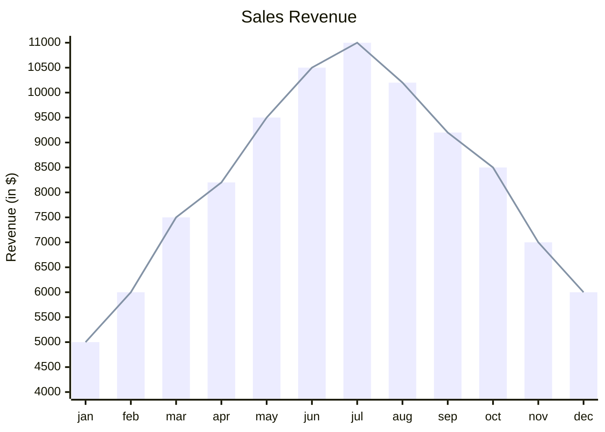

# Mermaid – Text‑Based Diagramming Library  
*(Sanitized & Reformatted Documentation)*  

---

## 1. Overview  

Mermaid is a **JavaScript‑based** diagramming tool that turns plain‑text definitions into SVG visualisations.  
It is inspired by Markdown, so anyone familiar with Markdown can pick it up quickly.

> **Why Mermaid?**  
> • Keeps documentation in sync with code.  
> • Enables non‑programmers to author diagrams.  
> • Can be embedded in CI/CD pipelines, static site generators, or any web page.

---

## 2. Getting Started

### 2.1 Install

| Package Manager | Command |
|----------------|--------|
| npm | `npm i mermaid` |
| yarn | `yarn add mermaid` |
| pnpm | `pnpm add mermaid` |

### 2.2 CDN

```html
<script type="module">
  import mermaid from 'https://cdn.jsdelivr.net/npm/mermaid@11/dist/mermaid.esm.min.mjs';
  mermaid.initialize({ startOnLoad: true });
</script>
```

Mermaid will automatically render any `<div>` or `<pre>` with `class="mermaid"`.

---

## 3. Diagram Types & Syntax

Below are the supported diagram types with **complete examples**.  
Copy the code blocks into a file with a `.mmd` extension or wrap them in a `<pre class="mermaid">` tag.

### 3.1 Flowchart


### 3.2 Sequence Diagram



### 3.3 Gantt Diagram



### 3.4 Class Diagram



### 3.5 Git Graph



### 3.6 Entity‑Relationship Diagram (Experimental)



### 3.7 User Journey Diagram



### 3.8 Quadrant Chart



### 3.9 XY Chart (Beta)



---

## 4. Security & Sanitisation

Mermaid sanitises incoming diagram code, but for public sites it is recommended to:

1. Render diagrams inside a sandboxed `<iframe>`.  
2. Disable interactive features that could execute malicious scripts.

---

## 5. Development & Contribution

### 5.1 Development Setup

```bash
git clone https://github.com/mermaid-js/mermaid.git
cd mermaid
npx pnpm install
pnpm test
pnpm lint
```

### 5.2 Contributing

- Fork the repo.  
- Create a feature branch.  
- Submit a pull request.  
- Follow the [contribution guidelines](https://github.com/mermaid-js/mermaid/blob/main/CONTRIBUTING.md).

---

## 6. Release & Publishing

```bash
# Update version in package.json
npm publish
```

---

## 7. Contact & Security

- **Security**: `security@mermaid.live`  
- **General**: `contact@mermaid.live`

---

## 8. Acknowledgements

- d3 & dagre-d3 for layout engines.  
- js‑sequence‑diagram for sequence grammar.  
- Contributors: Knut Sveidqvist, Tyler Long, and many others.

---