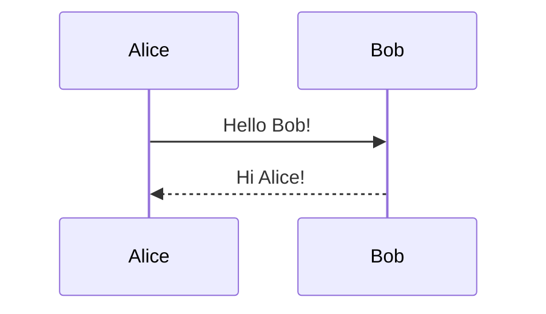

# Mermaid – A Markdown‑Inspired Diagramming Library

Mermaid is a lightweight, JavaScript‑based diagramming tool that turns plain‑text definitions into interactive SVG diagrams. It is designed to be embedded in Markdown, documentation sites, and any web page that can run JavaScript.

---

## Table of Contents

1. [Overview](#overview)
2. [Getting Started](#getting-started)
3. [Core Features](#core-features)
4. [Integrations](#integrations)
5. [Community & Contributors](#community--contributors)
6. [License & Awards](#license--awards)

---

## 1. Overview

Mermaid renders diagrams from concise, Markdown‑style syntax. It supports a wide range of diagram types, including:

- Flowcharts
- Sequence diagrams
- Gantt charts
- Class diagrams
- State machines
- Entity‑Relationship diagrams
- And many more

Because the diagram source is plain text, it is version‑controlled, searchable, and easy to edit.

---

## 2. Getting Started

### 2.1 Install via CDN

```html
<script src="https://cdn.jsdelivr.net/npm/mermaid/dist/mermaid.min.js"></script>
<script>
  mermaid.initialize({ startOnLoad: true });
</script>
```

### 2.2 Install via npm

```bash
npm install mermaid
```

```js
import mermaid from 'mermaid';
mermaid.initialize({ startOnLoad: true });
```

### 2.3 Basic Usage

Add a `<div>` with a `mermaid` class and the diagram definition inside:

```html
<div class="mermaid">
graph TD;
    A-->B;
    A-->C;
    B-->D;
    C-->D;
</div>
```

Mermaid will automatically parse and render the diagram when the page loads.

---

## 3. Core Features

| Feature | Description |
|--------|------------|
| **Markdown‑style syntax** | Easy to read and write. |
| **Live Editor** | Interactive editor that renders diagrams in real time. |
| **Extensible** | Supports custom diagram types via plugins. |
| **Responsive** | Diagrams scale with the viewport. |
| **Accessibility** | Generates SVG with proper ARIA attributes. |
| **Open Source** | MIT‑licensed, community‑maintained. |

---

## 4. Integrations

Mermaid can be embedded in a variety of platforms:

| Platform | Integration |
|---------|------------|
| **GitHub / GitLab** | Rendered in Markdown files. |
| **MkDocs / MkDocs‑Material** | Built‑in support. |
| **Docusaurus** | Plugin available. |
| **Jupyter Notebooks** | Rendered via IPython display. |
| **VS Code** | Live preview extension. |
| **Notion** | Third‑party integration. |

---

## 5. Community & Contributors

Mermaid is maintained by a vibrant community of developers and contributors. Key contributors include:

- **Knut Sveidqvist** – Creator
- **Sidharth Vinod** – Developer
- **Ashish Jain** – Developer
- **Neil Cuzon** – Developer
- **Tyler Liu** – Developer
- **Alois Klink** – Developer
- **Reda Al Sulais** – Developer
- **Nikolay Rozhkov** – Developer
- **Justin Greywolf** – Developer
- **Steph Huynh** – Developer
- **Matthieu Morel** – Developer
- **Marc Faber** – Developer
- **Yash Singh** – Developer
- **Nacho Orlandoni** – Developer
- **Per Brolin** – Developer
- **Mindaugas Laganeckas** – Developer

Feel free to join the community, contribute, or report issues on the [GitHub repository](https://github.com/mermaid-js/mermaid).

---

## 6. License & Awards

- **License**: MIT
- **Awards**: 2019 JavaScript Open Source Award – “The Most Exciting Use of Technology”

---

### Quick Reference



> **Tip**: Use the Mermaid Live Editor to experiment with diagram syntax in real time.

---