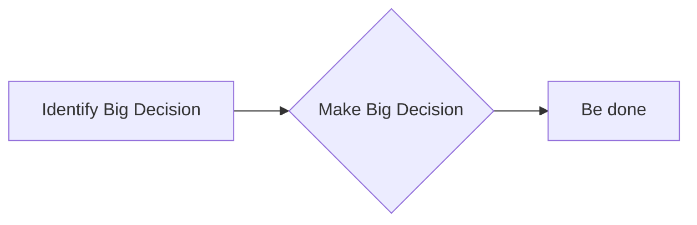
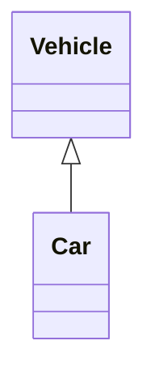
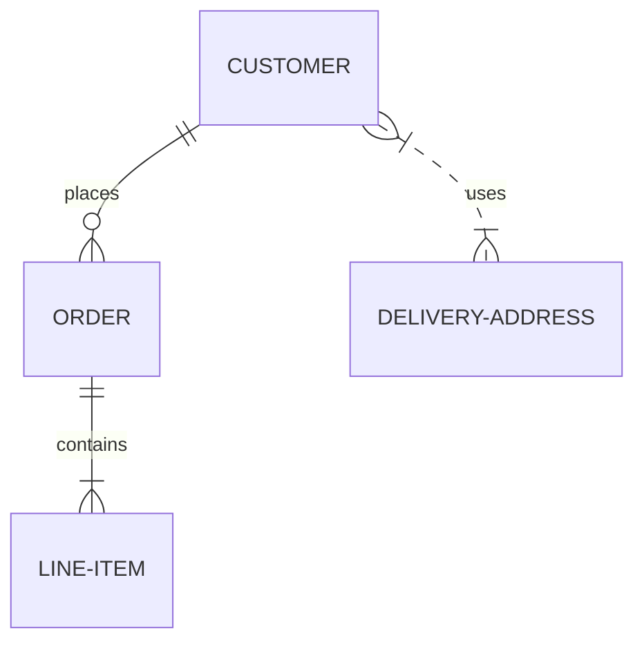
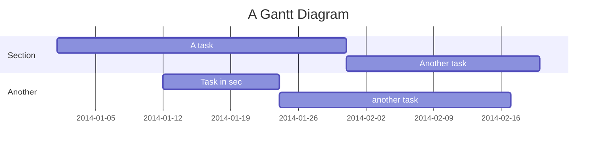
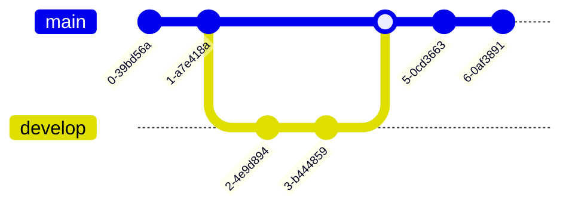
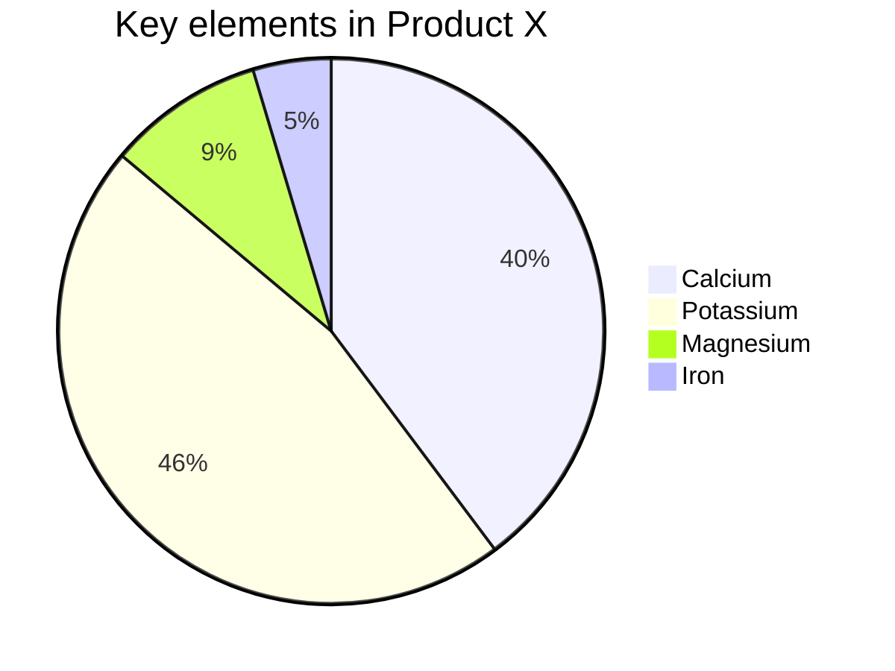
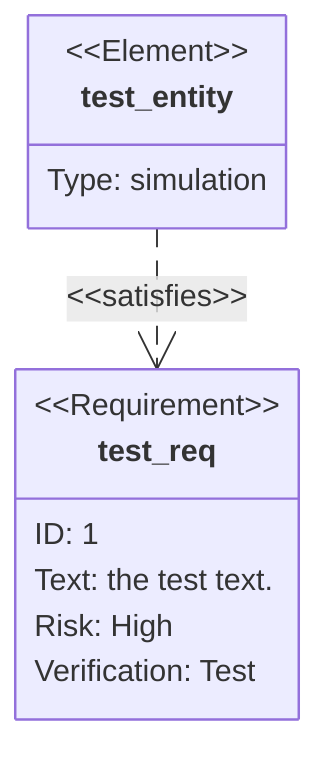
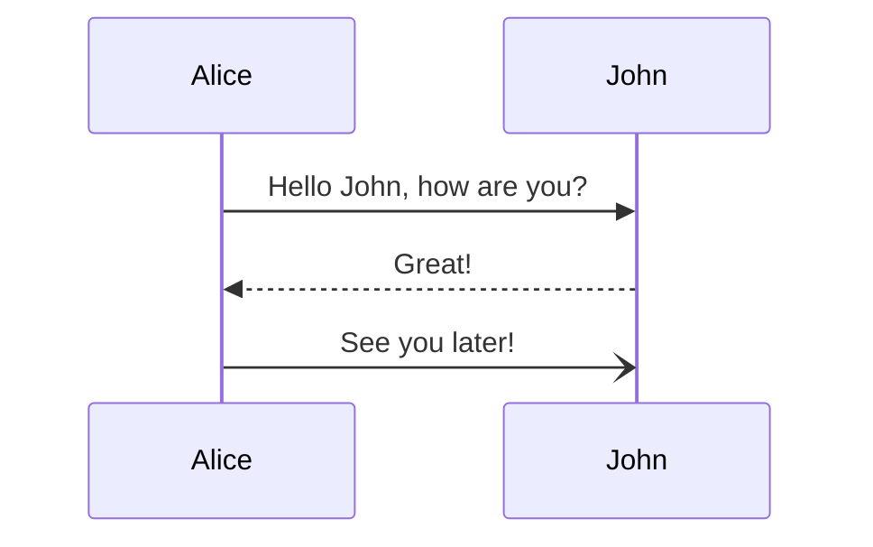
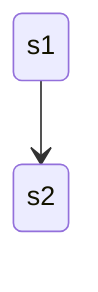
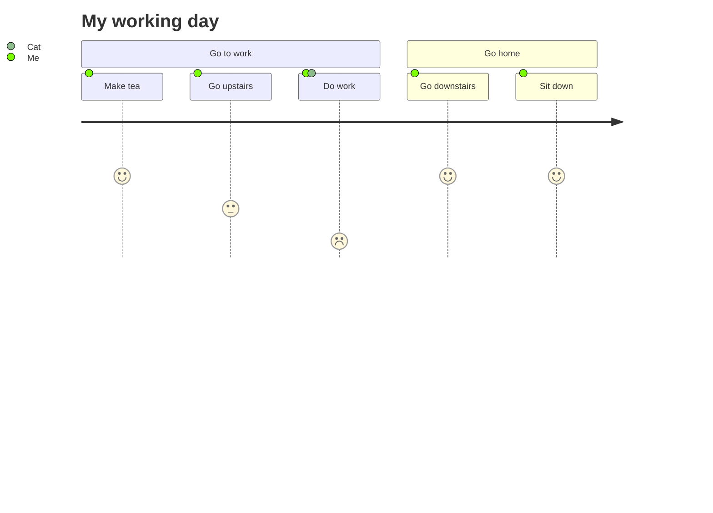

# Mermaid Accessibility Documentation

Mermaid now supports **Accessible Rich Internet Applications (ARIA)** features so that diagrams can be consumed by assistive technologies and search engines.  
The following sections describe the available options, how to use them, and the resulting HTML.

---

## 1.  Overview

| Feature | What it does | Where it appears |
|--------|-------------|-----------------|
| `aria-roledescription` | Automatically added to the `<svg>` element. | `<svg aria-roledescription="flowchart-v2">` |
| Accessible **Title** | Adds a `<title>` element and `aria-labelledby`. | `<svg aria-labelledby="chart-title-…">` |
| Accessible **Description** | Adds a `<desc>` element and `aria-describedby`. | `<svg aria-describedby="chart-desc-…">` |

---

## 2.  Syntax

### 2.1 Accessible Title

```mermaid
accTitle: <single‑line title>
```

* Must be on its own line.  
* Ends at the end of the line.  
* Example: `accTitle: Big Decisions`

### 2.2 Accessible Description

| Single‑line | Multi‑line |
|------------|-----------|
| `accDescr: <single‑line description>` | `accDescr {`<br>`<multi‑line description>`<br>`}` |

* **Single‑line**: same syntax as title.  
* **Multi‑line**: no colon, wrapped in `{}`.

---

## 3.  Example Diagrams

Below are the same diagrams that were originally in the Mermaid docs, rewritten for clarity.  
All examples are runnable in the Mermaid Live Editor.

### 3.1 Flowchart



**Generated HTML**

```html
<svg
  aria-labelledby="chart-title-mermaid_382ee221"
  aria-describedby="chart-desc-mermaid_382ee221"
  aria-roledescription="flowchart-v2"
  xmlns="http://www.w3.org/2000/svg"
  width="100%"
  id="mermaid_382ee221">
  <title id="chart-title-mermaid_382ee221">Big decisions</title>
  <desc id="chart-desc-mermaid_382ee221">Bob's Burgers process for making big decisions</desc>
</svg>
```

---

### 3.2 Flowchart (Multi‑line Description)


---

### 3.3 Class Diagram



---

### 3.4 Entity Relationship Diagram



---

### 3.5 Gantt Chart



---

### 3.6 GitGraph



---

### 3.7 Pie Chart



---

### 3.8 Requirement Diagram



---

### 3.9 Sequence Diagram



---

### 3.10 State Diagram



---

### 3.11 User Journey Diagram



---

## 4.  Resulting SVG Structure

All diagrams will contain the following attributes and elements:

```html
<svg
  aria-roledescription="diagram-type"
  aria-labelledby="chart-title-<id>"
  aria-describedby="chart-desc-<id>"
  xmlns="http://www.w3.org/2000/svg"
  width="100%"
  id="mermaid_<id>">
  <title id="chart-title-<id>">Accessible Title</title>
  <desc id="chart-desc-<id>">Accessible Description</desc>
  <!-- diagram content -->
</svg>
```

---

## 5.  Tips & Gotchas

| Issue | Fix |
|-------|-----|
| **Title/Description not showing** | Ensure `accTitle`/`accDescr` are on their own lines and not indented with spaces that break the parser. |
| **Multi‑line description** | Do **not** put a colon after `accDescr`. Wrap the text in `{}`. |
| **Special characters** | Escape single quotes in titles/descriptions if needed. |

---

## 6.  Summary

- Use `accTitle` and `accDescr` to add accessible titles and descriptions.  
- The generated SVG will automatically include ARIA attributes and `<title>`/`<desc>` elements.  
- All diagram types support these options.  

Happy diagramming!