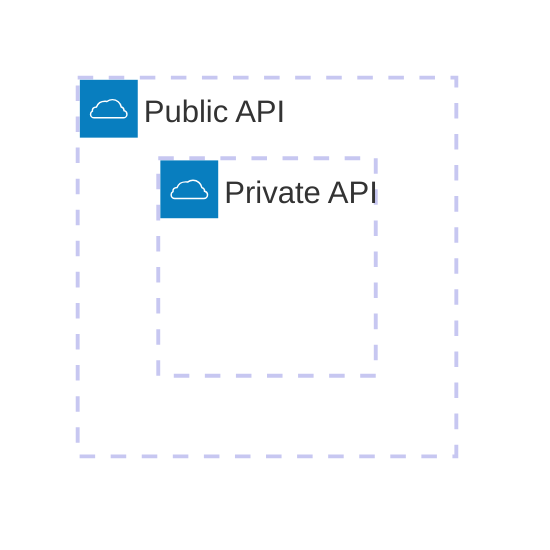
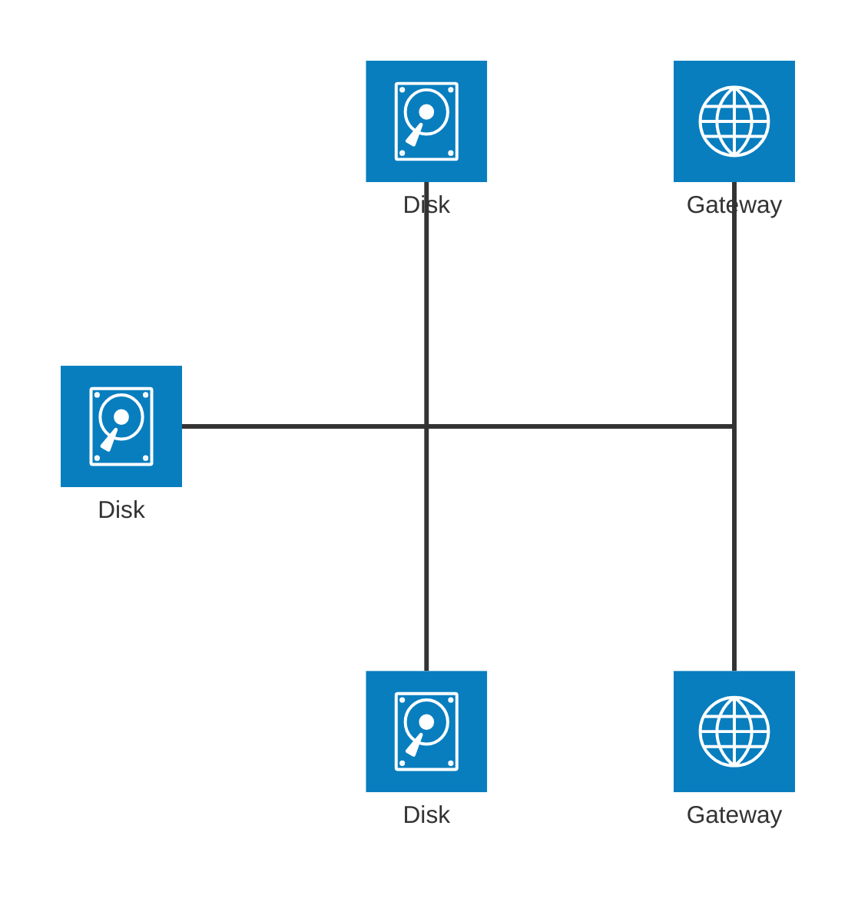

# Mermaid Architecture Diagram Documentation (v11.1.0+)

Mermaid’s **architecture diagram** (`architecture-beta`) is a lightweight way to describe the relationships between services, resources, and groups in a cloud or CI/CD deployment.  
The diagram is composed of four building blocks:

| Building block | Purpose | Syntax |
|---------------|--------|-------|
| **Group** | Logical container for services | `group {id}({icon})[{title}] (in {parent})?` |
| **Service** | Node that represents a resource | `service {id}({icon})[{title}] (in {parent})?` |
| **Edge** | Connection between services | `{serviceId}{{group}}?:{T|B|L|R} {<}?--{>}? {T|B|L|R}:{serviceId}{{group}}?` |
| **Junction** | 4‑way split point | `junction {id} (in {parent})?` |

> **Tip** – All identifiers (`{id}`) must be declared before they are referenced.

---

## 1. Groups



* `group {id}({icon})[{title}]` – creates a group with an optional icon and title.  
* `in {parent}` – nests the group inside another group.

---

## 2. Services

```mermaid
architecture-beta
    service database1(database)[My Database]
    service database1(database)[My Database] in private_api
```

* `service {id}({icon})[{title}]` – declares a service.  
* `in {parent}` – places the service inside a group.

---

## 3. Edges

### Syntax

```
{serviceId}{{group}}?:{T|B|L|R} {<}?--{>}? {T|B|L|R}:{serviceId}{{group}}?
```

* **Side** – `T` (top), `B` (bottom), `L` (left), `R` (right).  
* **Arrow** – `<` before the left side, `>` after the right side.  
* **Group modifier** – `{group}` after a service id to reference a service inside a group.

### Examples


#### Edge from a Group

```mermaid
architecture-beta
    service server[Server] in groupOne
    service subnet[Subnet] in groupTwo

    server{group}:B --> T:subnet{group}
```

> **Note** – `{group}` can only be used for services that belong to a group.

---

## 4. Junctions

Junctions act as a 4‑way split point.



---

## 5. Icons

By default the following icons are available:

| Icon | Description |
|------|------------|
| `cloud` | Cloud |
| `database` | Database |
| `disk` | Disk |
| `internet` | Internet |
| `server` | Server |

You can also use any icon from **iconify.design**. Register the icon pack and use the format `name:icon-name`.

```mermaid
architecture-beta
    group api(logos:aws-lambda)[API]

    service db(logos:aws-aurora)[Database] in api
    service disk1(logos:aws-glacier)[Storage] in api
    service disk2(logos:aws-s3)[Storage] in api
    service server(logos:aws-ec2)[Server] in api

    db:L -- R:server
    disk1:T -- B:server
    disk2:T -- B:db
```



---

## 6. Full Example


Running the above code in Mermaid will render a diagram with the services and edges as described.