# Mermaid Block Diagrams – Documentation

> **Note**  
> All examples shown below are valid Mermaid code.  
> Copy the code blocks into a Mermaid‑enabled editor (e.g. the Mermaid Live Editor) to see the rendered diagram.

---

## 1. Introduction

Block diagrams are a concise way to represent systems, processes, or architectures.  
They consist of **blocks** (the components) and **connectors** (the relationships).  
Mermaid’s `block-beta` syntax gives you full control over layout, sizing, and styling.

---

## 2. Basic Syntax

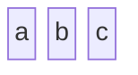

Produces a horizontal row of three blocks.

### 2.1 Columns

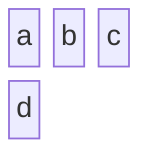

Arranges the blocks in three columns, wrapping to the next row when needed.

---

## 3. Advanced Block Configuration

### 3.1 Block Width

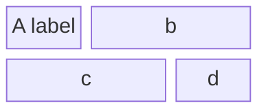

* `b:2` and `c:2` span two columns each.

### 3.2 Composite (Nested) Blocks

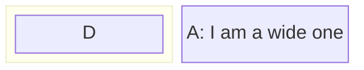

`D` is nested inside a larger block.

### 3.3 Dynamic Column Widths

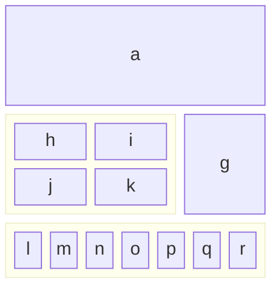

Mermaid automatically adjusts column widths to fit the widest block.

---

## 4. Block Shapes

| Shape | Syntax | Example |
|------|-------|--------|
| Round‑Edged | `id1("text")` | `id1("Round")` |
| Stadium | `id1(["text"])` | `id1(["Stadium"])` |
| Subroutine | `id1[["text"]]` | `id1[["Subroutine"]]` |
| Cylindrical | `id1[("Database")]` | `id1[("Database")]` |
| Circle | `id1(("text"))` | `id1(("Circle"))` |
| Asymmetric | `id1>"text"` | `id1>"Asym"` |
| Rhombus | `id1{"text"}` | `id1{"Decision"}` |
| Hexagon | `id1{{"text"}}` | `id1{{"Hex"}}` |
| Parallelogram | `id1[/"text"/]` | `id1[/"Input"/]` |
| Trapezoid | `id1[\"text\"]` | `id1[\"Output\"]` |
| Double Circle | `id1((("text")))` | `id1((("Double"))` |

---

## 5. Block Arrows & Space Blocks

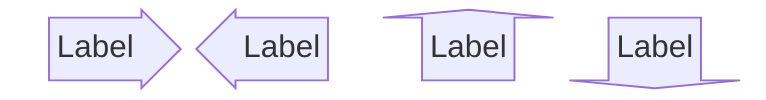

Space blocks:

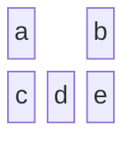

or

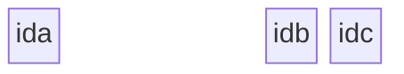

---

## 6. Connecting Blocks

### 6.1 Basic Links

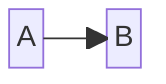

### 6.2 Text on Links

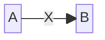

---

## 7. Styling & Classes

### 7.1 Individual Block Styling

### 7.2 Class Styling

```mermaid
block-beta
  A space B
  A-->B
  classDef blue fill:#6e6ce6,stroke:#333,stroke-width:4px;
  class A blue
  style B fill:#bbf,stroke:#f66,stroke-width:2px,color:#fff,stroke-dasharray: 5 5
```

---

## 8. Practical Examples

### 8.1 System Architecture

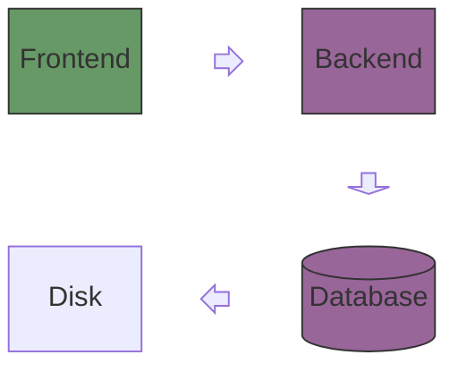

### 8.2 Business Process Flow

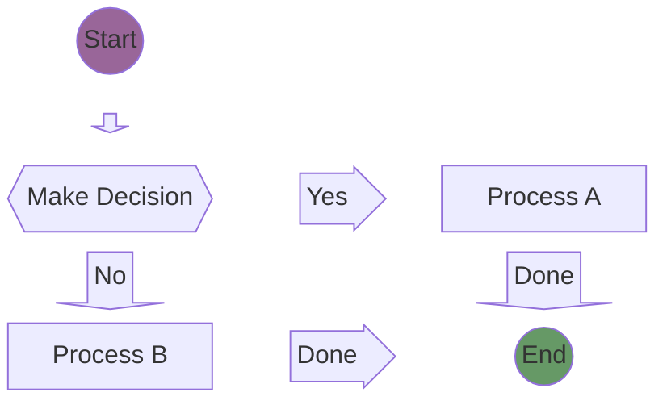

---

## 9. Troubleshooting

| Issue | Fix |
|-------|-----|
| **Incorrect Linking** | Use `-->` or `---` instead of `-` |
| **Misplaced Styling** | Separate CSS properties with commas and use `:` after the property name |

Example of a correct link:

Example of correct styling:

```mermaid
block-beta
  A
  style A fill:#969,stroke:#333;
```

---

## 10. Tips for Complex Diagrams

1. **Modular Design** – Break large diagrams into smaller sub‑diagrams.  
2. **Consistent Styling** – Use classes for shared styles.  
3. **Documentation** – Add comments with `%%` to explain sections.

---

### End of Documentation

Feel free to copy, modify, and extend these examples to suit your own diagrams. Happy diagramming!