# Mermaid Class Diagram Documentation

Mermaid is a lightweight diagramming tool that can render UML class diagrams.  
Below is a cleaned‑up reference that covers the syntax, examples, and styling options.  
All examples from the original source are preserved.

---

## 1. Overview

A **class diagram** shows:

* **Classes** (nodes)
* **Attributes** (middle compartment)
* **Operations** (bottom compartment)
* **Relationships** (edges)

Mermaid follows UML conventions but uses a simple textual syntax.

---

## 2. Basic Syntax

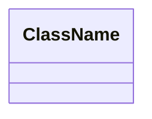

### 2.1 Defining a Class

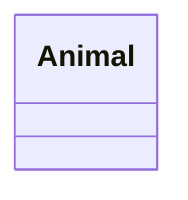

### 2.2 Adding Members

| Syntax | Description |
|-------|------------|
| `ClassName : +member` | Adds a single member (attribute or method). |
| `ClassName{ ... }` | Adds multiple members inside `{}`. |

**Examples**

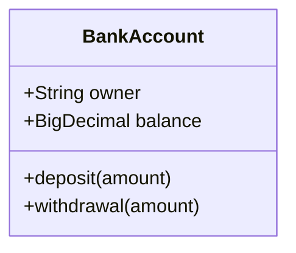


---

## 3. Member Types

* **Attributes** – no parentheses.
* **Methods** – parentheses present.

Return types can be appended after a space:

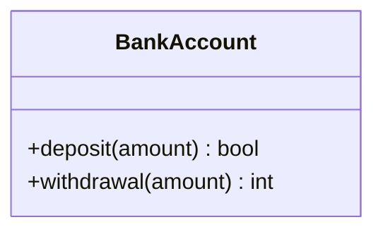

---

## 4. Visibility & Classifiers

| Symbol | Meaning |
|-------|--------|
| `+` | Public |
| `-` | Private |
| `#` | Protected |
| `~` | Package / Internal |

Additional classifiers can be appended after the method/attribute:

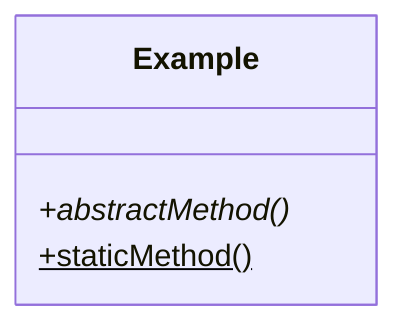

---

## 5. Generics

Use `~` to denote generic types:

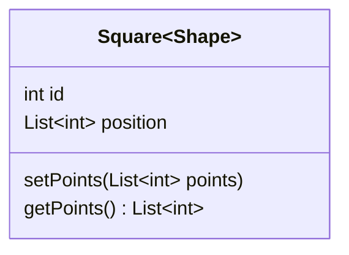

---

## 6. Relationships

| Arrow | UML Relation |
|------|-------------|
| `<|--` | Inheritance |
| `*--` | Composition |
| `o--` | Aggregation |
| `-->` | Association |
| `--` | Link (solid) |
| `..>` | Dependency |
| `..|>` | Realization |
| `..` | Link (dashed) |

**Example**

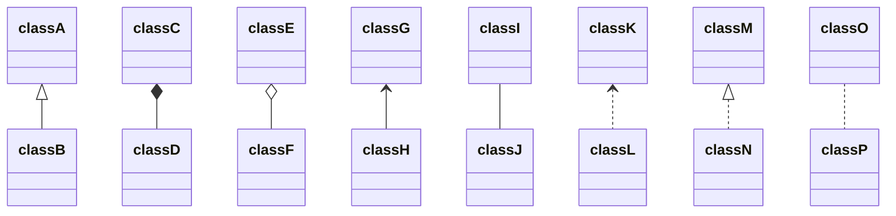

---

## 7. Labels on Relations

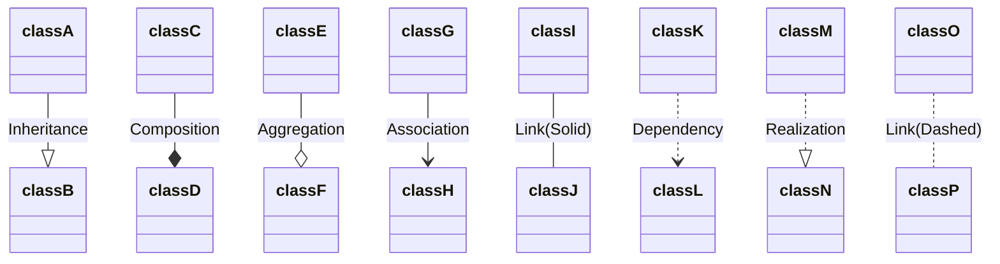

---

## 8. Cardinality / Multiplicity

Place quoted text near the arrow:

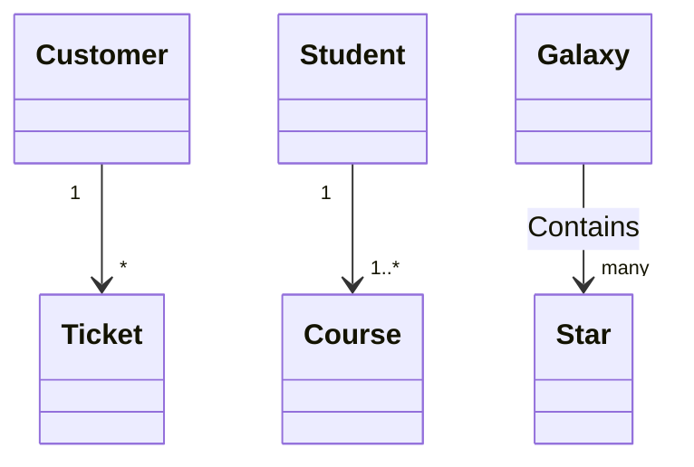

---

## 9. Annotations

Use `<<annotation>>`:

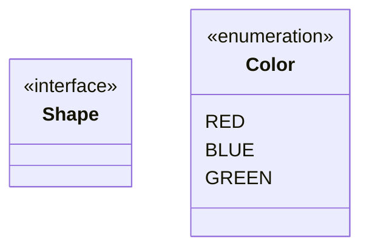

---

## 10. Notes

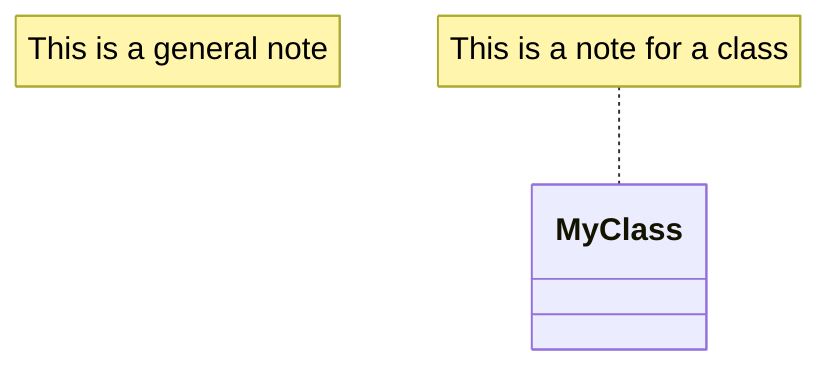

---

## 11. Namespaces

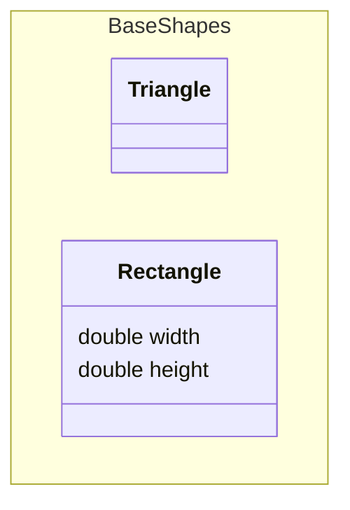

---

## 12. Direction

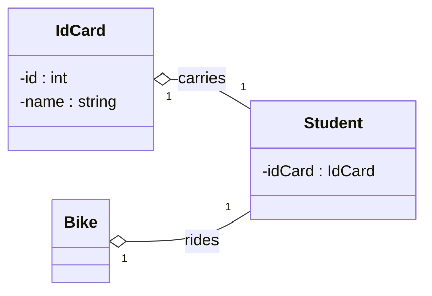

---

## 13. Interaction (Links & Callbacks)

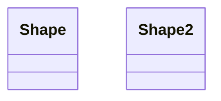

**Callback Example**

```html
<script>
  const callbackFunction = function () {
    alert('A callback was triggered');
  };
</script>
```

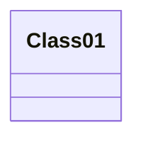

---

## 14. Styling

### 14.1 Individual Node

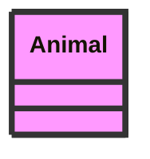

### 14.2 Class Definitions

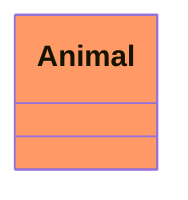

### 14.3 Default Styling

```mermaid
classDef default fill:#f9f,stroke:#333,stroke-width:4px;
```

---

## 15. Configuration

Hide empty member boxes:

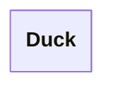

---

## 16. Full Example

```mermaid
classDiagram
    title Animal example
    note "From Duck till Zebra"
    Animal <|-- Duck
    note for Duck "can fly\ncan swim\ncan dive\ncan help in debugging"
    Animal <|-- Fish
    Animal <|-- Zebra
    Animal : +int age
    Animal : +String gender
    Animal: +isMammal()
    Animal: +mate()
    class Duck{
        +String beakColor
        +swim()
        +quack()
    }
    class Fish{
        -int sizeInFeet
        -canEat()
    }
    class Zebra{
        +bool is_wild
        +run()
    }
```

---

### End of Documentation

All examples from the original Mermaid documentation are included above.  
Feel free to copy the snippets into your Mermaid-enabled environment.