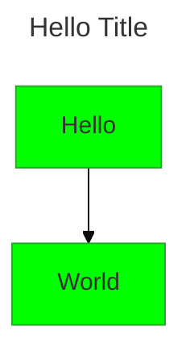
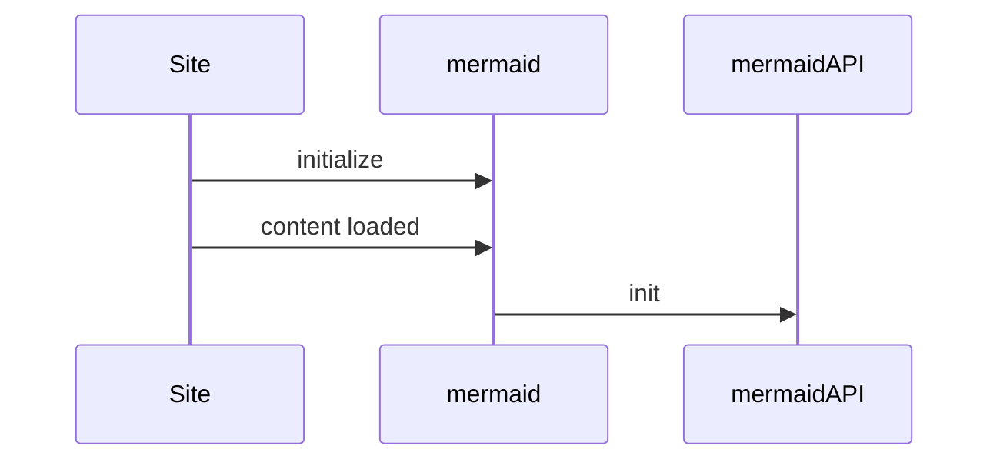
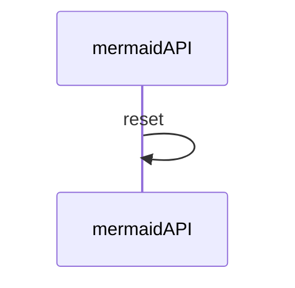

# Mermaid Configuration Documentation

This guide explains how Mermaid extracts and applies configuration settings when rendering diagrams.  
All examples from the original Mermaid docs are preserved.

---

## 1. Configuration Sources

When Mermaid starts, it builds a **render configuration** from three sources (in order of precedence):

| Source | Description | Applies to |
|-------|------------|-----------|
| **Default configuration** | Built‑in defaults shipped with Mermaid. | All diagrams. |
| **Site configuration** (`initialize` call) | Overrides set by the site integrator; applied globally. | All diagrams on the site/app. |
| **Frontmatter** (v10.5.0+) | YAML block at the top of a diagram file; overrides selected parameters. | Only the diagram containing the frontmatter. |
| **Directives** (deprecated) | Inline directives in diagram code; superseded by frontmatter. | Only the diagram containing the directives. |

The final **render config** is the result of merging these sources.

---

## 2. Frontmatter Configuration

Frontmatter allows diagram authors to override any Mermaid configuration (except secure configs) directly in the diagram file.

### Syntax

- `title`: Sets the diagram title.
- `config`: Contains any Mermaid configuration key/value pairs.

> **Note**: Frontmatter is a YAML block placed at the very top of the diagram file.

---

## 3. Theme Configuration

Mermaid supports theming via the `theme` and `themeVariables` options.  
Example from the docs:

This diagram demonstrates Mermaid’s internal sequence diagram rendering.

---

## 4. Initializing Mermaid

The **`initialize`** call is performed once by the site integrator to set the site‑wide configuration.

- `initialize` is called only once.
- It overrides the default configuration at the site level.

---

## 5. Resetting Configuration

Before each diagram rendering, Mermaid calls `configApi.reset` to restore the configuration to the site‑level defaults.

This ensures that each diagram starts with a clean configuration state.

---

## 6. Summary

| Step | Action | Result |
|------|-------|-------|
| 1 | Load Mermaid | Default config loaded |
| 2 | Call `initialize` | Site config applied |
| 3 | Parse diagram | Frontmatter (if any) applied |
| 4 | Render diagram | Uses merged render config |
| 5 | Before next render | `configApi.reset` restores site config |

All examples above are taken verbatim from the official Mermaid documentation.