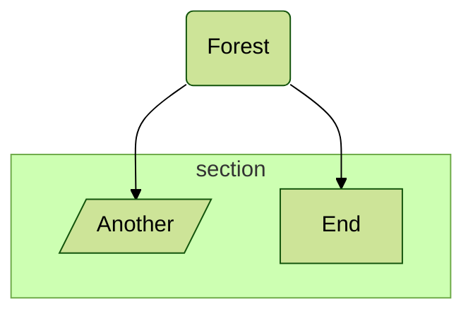
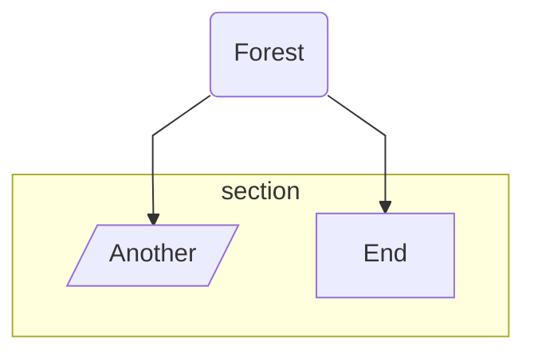
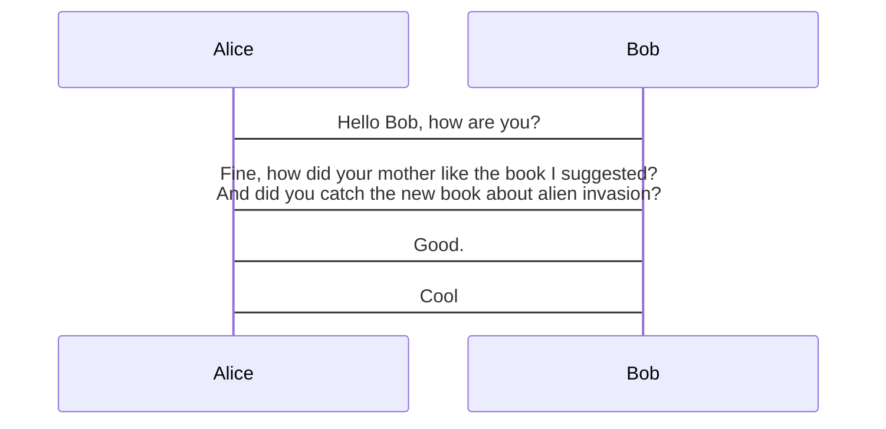

# Mermaid Directives – Quick Reference

> **⚠️ Deprecated** – Directives were removed in Mermaid v10.5.0.  
> Use the `config` key in front‑matter instead.  
> (See the *Configuration* section for the modern approach.)

---

## What are Directives?

Directives let you tweak Mermaid’s rendering *before* a diagram is drawn.  
They are written inside `%%{ … }%%` blocks and can change:

| Scope | Options |
|------|--------|
| **Global** | `theme`, `fontFamily`, `logLevel`, `securityLevel`, `startOnLoad`, `secure` |
| **Diagram‑specific** | e.g. `flowchart.htmlLabels`, `sequence.wrap`, etc. |

> **Security note** – Some options are blocked for safety.  
> You can whitelist which options are allowed in your own build.

---

## Syntax

```mermaid
%%{ init: { <config‑object> } }%%
```

* `init` (or `initialize`) is the key.  
* The value is a **JSON‑like** object – keys **must** be quoted.  
* Multiple directives are merged; the last value wins.

### Multi‑line

```mermaid
%%{
  init: {
    "theme": "dark",
    "fontFamily": "monospace",
    "logLevel": "info",
    "flowchart": {
      "htmlLabels": true,
      "curve": "linear"
    },
    "sequence": {
      "mirrorActors": true
    }
  }
}%%
```

### One‑liner

```mermaid
%%{init: { "sequence": { "wrap": true } }}%%
```

---

## Merging Example

```mermaid
%%{init: { 'logLevel': 'debug', 'theme': 'dark' } }%%
%%{initialize: { 'logLevel': 'fatal', "theme":'dark', 'startOnLoad': true } }%%
```

Resulting JSON:

```json
{
  "logLevel": "fatal",
  "theme": "dark",
  "startOnLoad": true
}
```

---

## Common Directive Examples

### 1. Change Theme



*Possible values:* `default`, `base`, `dark`, `forest`, `neutral`.

---

### 2. Change Font Family


---

### 3. Change Log Level


| Value | Meaning |
|------|--------|
| 1 | debug |
| 2 | info |
| 3 | warn |
| 4 | error |
| 5 | fatal (default) |

---

### 4. Flowchart Configuration



*Common flowchart options:* `htmlLabels`, `curve`, `diagramPadding`, `useMaxWidth`.

---

### 5. Sequence Diagram Configuration



*Common sequence options:* `width`, `height`, `messageAlign`, `mirrorActors`, `rightAngles`, `showSequenceNumbers`, `wrap`.

---

## Summary

| Feature | Directive | Example |
|--------|----------|--------|
| Theme | `%%{init: { "theme": "forest" } }%%` | Changes diagram theme |
| Font | `%%{init: { "fontFamily": "Trebuchet MS, Verdana, Arial, Sans-Serif" } }%%` | Sets font stack |
| Log Level | `%%{init: { "logLevel": 2 } }%%` | Sets verbosity |
| Flowchart | `%%{init: { "flowchart": { "htmlLabels": true } } }%%` | Enables HTML labels |
| Sequence | `%%{init: { "sequence": { "wrap": true } } }%%` | Enables text wrapping |

> **Tip:** Combine multiple directives in a single block or merge them as shown above.

---

**Next step:** Switch to the modern *front‑matter* configuration for new projects.  
For more details, see the *Configuration* section of the Mermaid docs.