# Mermaid Entity‑Relationship Diagram (ERD) Documentation

Mermaid can render Entity‑Relationship diagrams using a concise, PlantUML‑compatible syntax.  
The following guide explains the syntax, cardinality notation, styling, and configuration options.  
All examples from the original source are preserved.

---

## 1. Overview

An ER diagram describes **entity types** (e.g. `CUSTOMER`) and the **relationships** between them.  
Mermaid supports:

* Unicode and Markdown in names, labels, and attributes  
* Crow’s‑foot cardinality notation  
* Identifying vs. non‑identifying relationships  
* Attribute blocks with types, keys, and comments  
* Styling via `style`, `classDef`, and shorthand `:::` syntax  
* Diagram orientation (`direction`)  
* Layout configuration (`dagre` or `elk`)

---

## 2. Basic Syntax

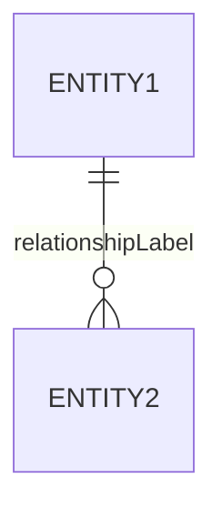

* **ENTITY1** – first entity (mandatory)  
* **relationship** – cardinality and identifying flag  
* **ENTITY2** – second entity  
* **relationshipLabel** – optional label from the perspective of ENTITY1

### Example

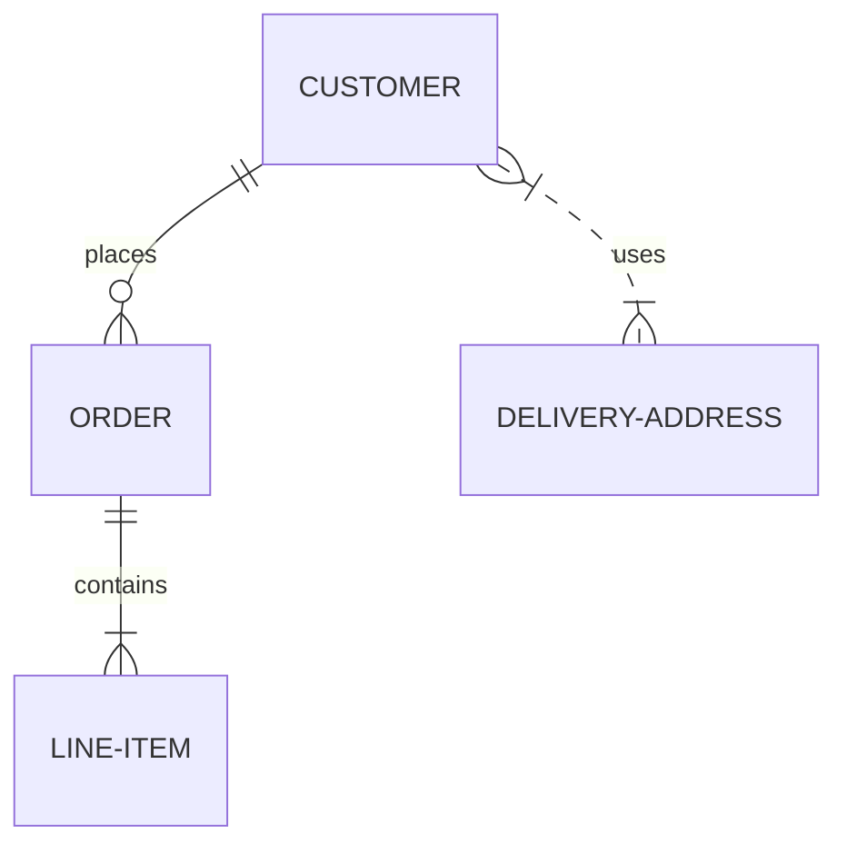

---

## 3. Cardinality

| Symbol | Meaning | Alias |
|-------|--------|-------|
| `|o` | Zero or one | `zero or one` |
| `||` | Exactly one | `only one` |
| `}o` | Zero or more | `zero or many` |
| `}|` | One or more | `one or many` |

The two characters represent **maximum** (outer) and **minimum** (inner) values.

### Identifying vs. Non‑Identifying

* Solid line (`--`) → **identifying**  
* Dashed line (`..`) → **non‑identifying**

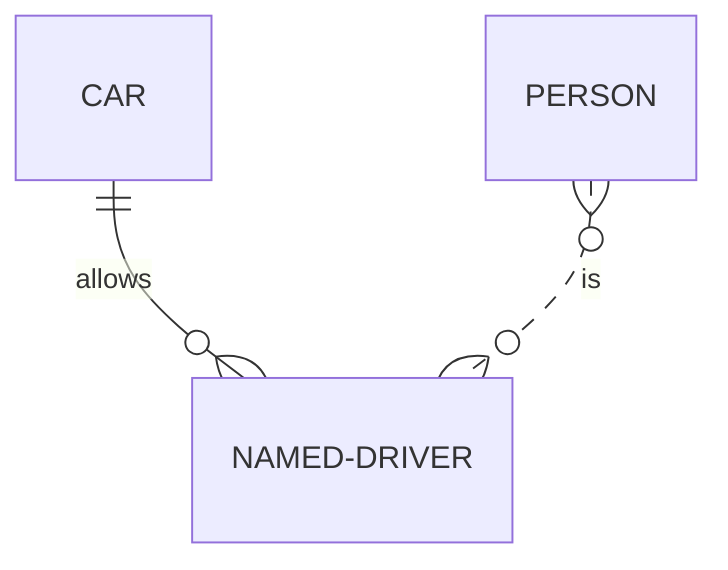

---

## 4. Attributes

Define attributes inside `{}` after the entity name.

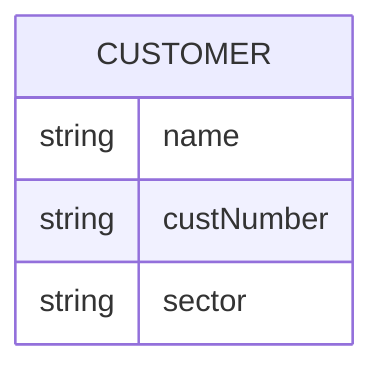

* **Type** – alphabetic start, may contain digits, hyphens, underscores, parentheses, brackets.  
* **Name** – same format; may start with `*` to indicate a primary key.  
* **Keys** – `PK`, `FK`, `UK` (comma‑separated).  
* **Comments** – double‑quoted string at the end of the line (no embedded quotes).

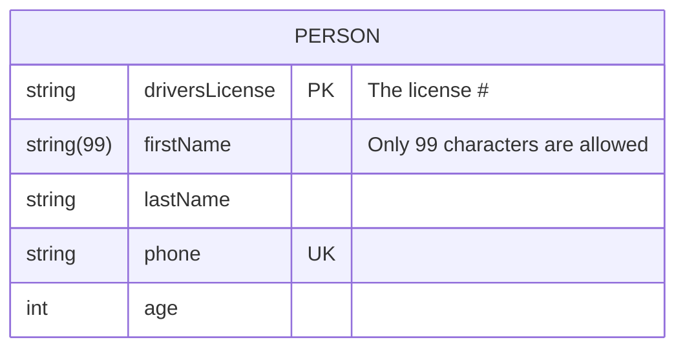

---

## 5. Entity Name Aliases

Use square brackets to display an alias instead of the entity name.

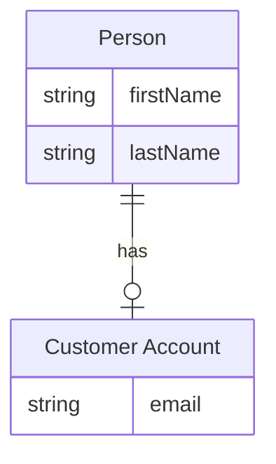

---

## 6. Diagram Orientation

```mermaid
erDiagram
    direction TB   // Top to Bottom
    direction LR   // Left to Right
    direction BT   // Bottom to Top
    direction RL   // Right to Left
```

---

## 7. Styling

### 7.1 Inline `style`

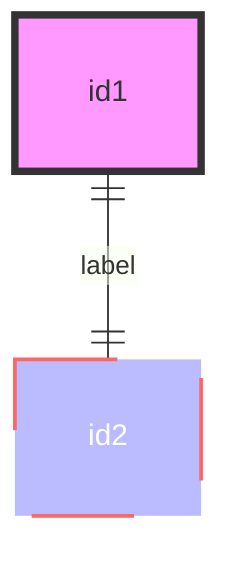

### 7.2 `classDef` and `class`

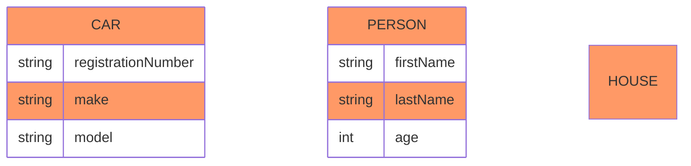

### 7.3 Shorthand `:::` Syntax

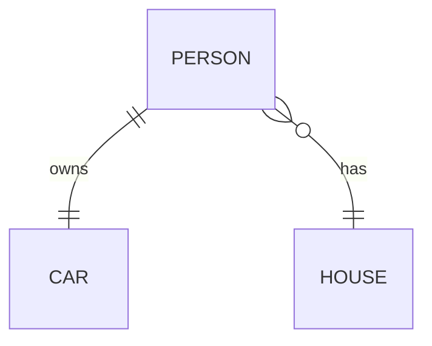

### 7.4 Default Class

```mermaid
classDef default fill:#f9f,stroke-width:4px
```

---

## 8. Configuration & Layout

Mermaid uses the `dagre` layout by default.  
For larger diagrams, switch to the Eclipse Layout Kernel (`elk`) via YAML front‑matter.

```yaml
---
title: Order example
config:
    layout: elk
---
```

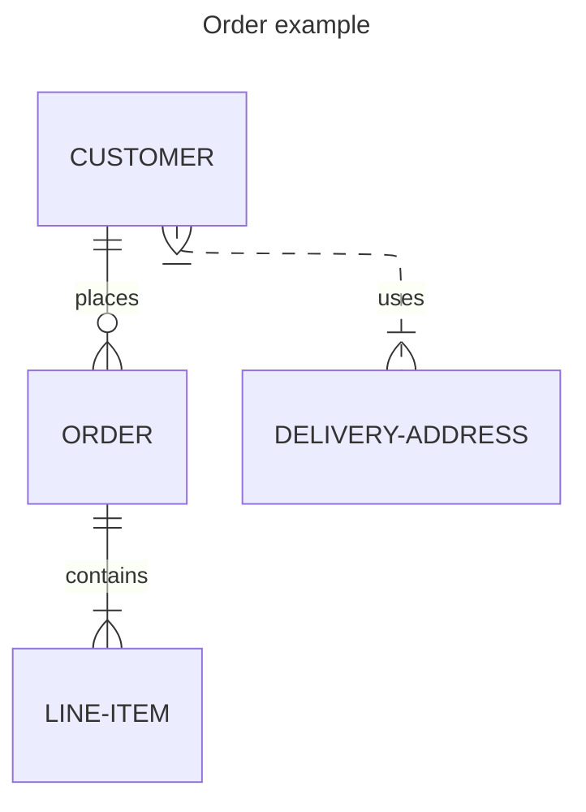

> **Note**: The site must use Mermaid v9.4+ and enable lazy‑loading for ELK.

---

## 9. Full Example

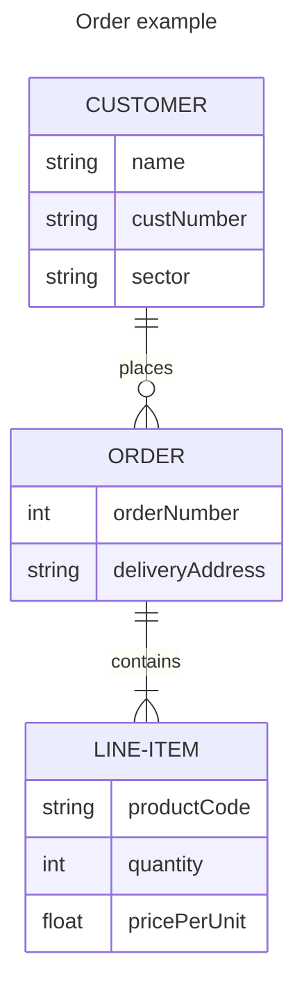

---

## 10. Summary

* **Entities** – singular nouns, optional aliases.  
* **Relationships** – cardinality + identifying flag.  
* **Attributes** – type, name, keys, comments.  
* **Styling** – `style`, `classDef`, `:::` shorthand.  
* **Orientation** – `direction` keyword.  
* **Layout** – `dagre` (default) or `elk` via YAML.

All examples above are fully functional Mermaid ER diagrams. Use them as templates for your own data models.