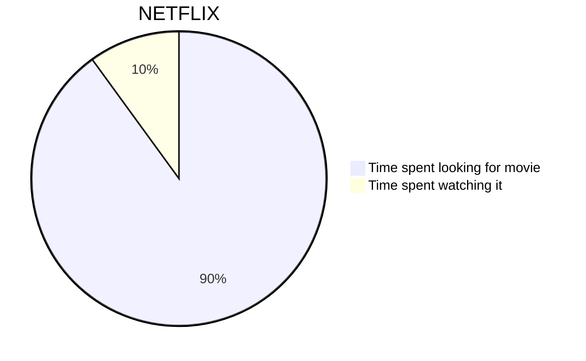
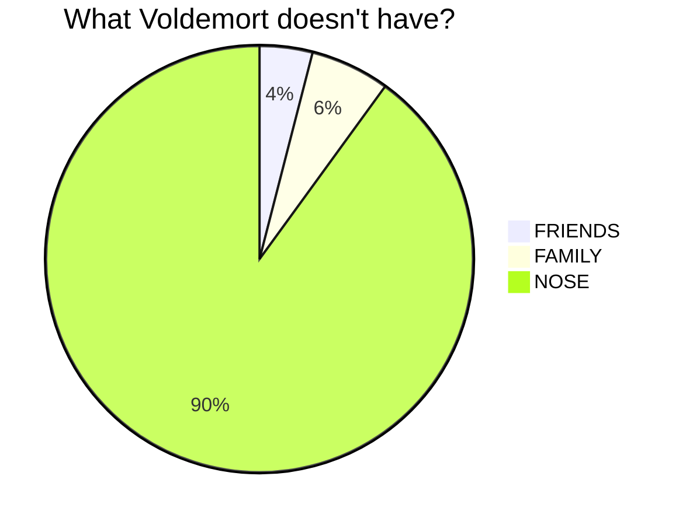
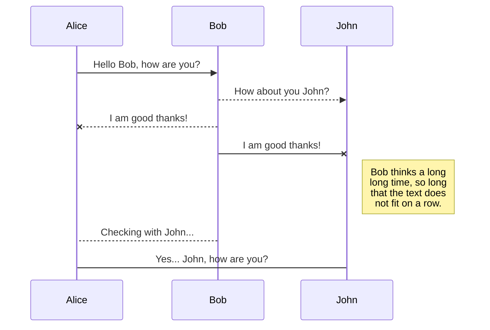
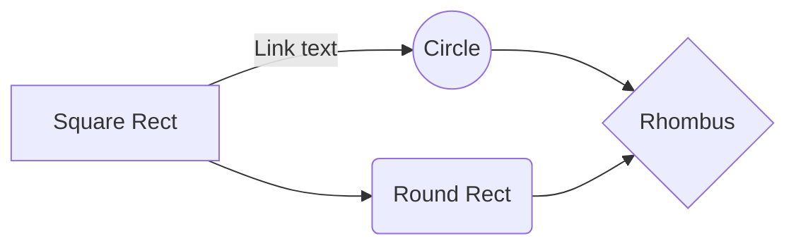
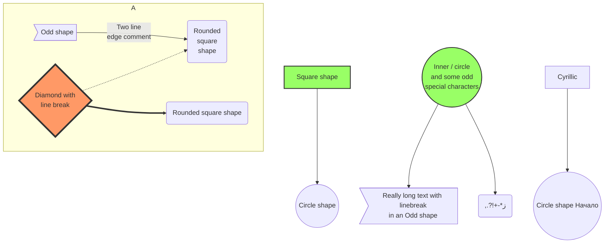
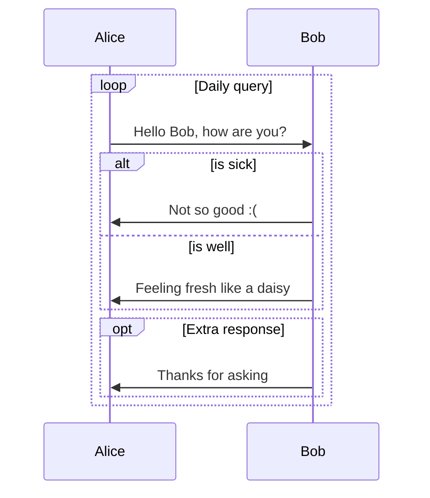
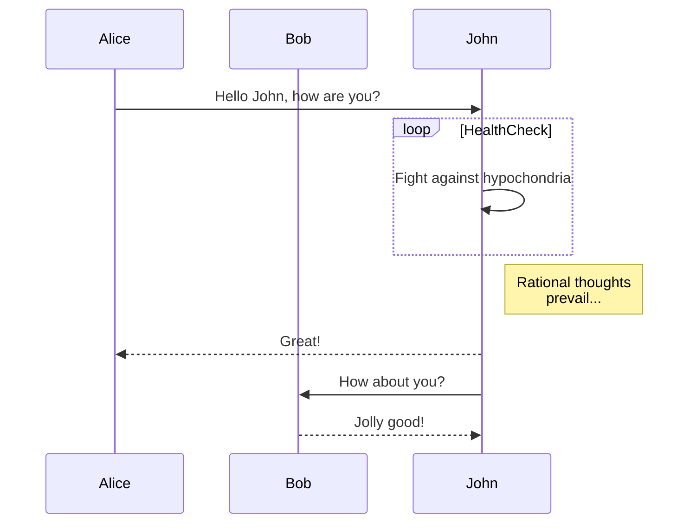
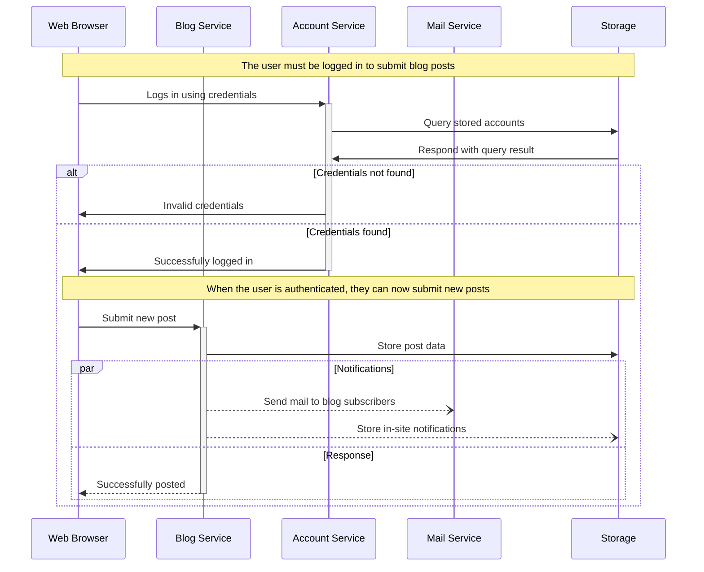
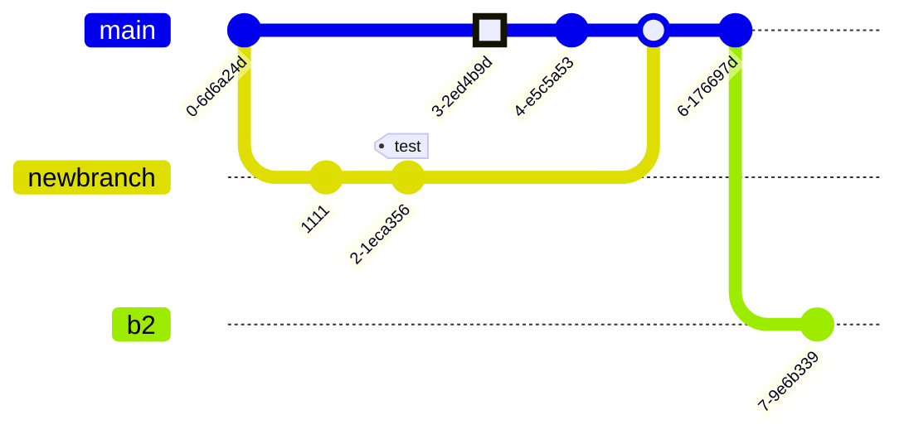

# Mermaid – A Quick‑Start Documentation

> **Mermaid** is a JavaScript‑based diagramming and charting tool that renders Markdown‑style text into SVG diagrams.  
> This guide gives you a concise reference to the most common diagram types, together with the exact source code you can copy‑paste into any Mermaid‑enabled editor (e.g. VS Code, GitHub, Notion, etc.).

---

## 1. Basic Pie Chart

---

## 2. Basic Sequence Diagram

---

## 3. Basic Flowchart

---

## 4. Larger Flowchart with Styling

---

## 5. Sequence Diagram – Loops, `alt` and `opt`

---

## 6. Sequence Diagram – Message to Self in Loop

---

## 7. Sequence Diagram – Blogging App Service Communication

---

## 8. Commit Flow Diagram (GitGraph)

---

### How to Use

1. **Copy** any of the code blocks above.
2. **Paste** it into a Mermaid‑enabled editor (e.g. VS Code with the Mermaid Preview extension, GitHub Markdown, Notion, etc.).
3. **Render** the diagram – you’ll see the SVG output instantly.

---

### Quick Reference

| Diagram Type | Syntax Keyword | Example |
|-------------|---------------|--------|
| Pie Chart | `pie` | `pie title ...` |
| Sequence Diagram | `sequenceDiagram` | `sequenceDiagram ...` |
| Flowchart | `graph LR` / `graph TB` | `graph LR ...` |
| Git Graph | `gitGraph:` | `gitGraph: ...` |
| Class Diagram | `classDiagram` | `classDiagram ...` |
| ... | | |

Feel free to extend these examples or mix diagram types in a single Markdown file. Happy diagramming!