# Mermaid – Code Documentation

> **Mermaid** is a JavaScript-based diagramming and charting tool that renders Markdown‑style text definitions into SVG diagrams.  
> This documentation provides a concise, code‑centric view of Mermaid’s features, syntax, configuration, and usage.

---

## Table of Contents

1. [Introduction](#introduction)
2. [Getting Started](#getting-started)
3. [Syntax and Configuration](#syntax-and-configuration)
4. [Diagram Syntax](#diagram-syntax)
   - [Flowchart](#flowchart)
   - [Sequence Diagram](#sequence-diagram)
   - [Class Diagram](#class-diagram)
   - [State Diagram](#state-diagram)
   - [Entity‑Relationship Diagram](#entity-relationship-diagram)
   - [User Journey](#user-journey)
   - [Gantt](#gantt)
   - [Pie Chart](#pie-chart)
   - [Quadrant Chart](#quadrant-chart)
   - [Requirement Diagram](#requirement-diagram)
   - [GitGraph (Git) Diagram](#gitgraph-git-diagram)
   - [C4 Diagram](#c4-diagram)
   - [Mindmaps](#mindmaps)
   - [Timeline](#timeline)
   - [ZenUML](#zenuml)
   - [Sankey](#sankey)
   - [XY Chart](#xy-chart)
   - [Block Diagram](#block-diagram)
   - [Packet](#packet)
   - [Kanban](#kanban)
   - [Architecture](#architecture)
   - [Radar](#radar)
   - [Treemap](#treemap)
5. [Ecosystem](#ecosystem)
6. [Mermaid CLI](#mermaid-cli)
7. [Configuration](#configuration)
   - [Mermaid API Configuration](#mermaid-api-configuration)
   - [Mermaid Configuration Options](#mermaid-configuration-options)
   - [Registering Icons](#registering-icons)
   - [Directives](#directives)
   - [Theming](#theming)
   - [Math](#math)
   - [Accessibility](#accessibility)
8. [FAQ](#faq)
9. [Contributing](#contributing)

---

## Introduction

Mermaid allows you to create diagrams and visualizations from plain text. It is ideal for documentation, wikis, and any Markdown‑friendly environment.

---

## Getting Started

1. **Install Mermaid**  
   ```bash
   npm install mermaid
   ```
2. **Render a diagram**  
   ```js
   const mermaid = require('mermaid');
   mermaid.initialize({ startOnLoad: true });
   ```
3. **Embed in Markdown**  
   ```markdown
   ```mermaid
   graph TD;
     A-->B;
   ```
   ```

---

## Syntax and Configuration

Mermaid diagrams are defined using a simple, declarative syntax. Configuration options can be passed via `mermaid.initialize()` or a global `mermaid` object.

---

## Diagram Syntax

Below is a list of supported diagram types. Each section contains a minimal example (code fences) and a brief description.

### Flowchart

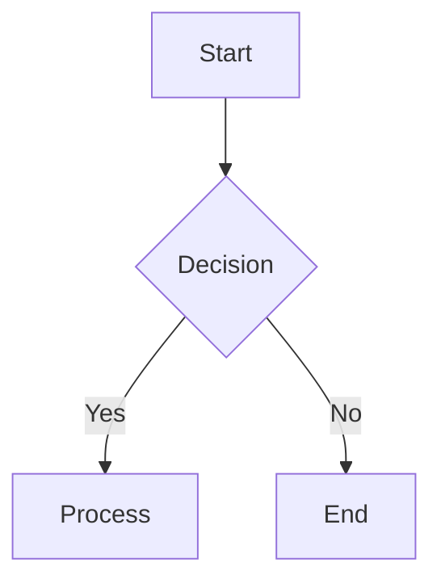

### Sequence Diagram

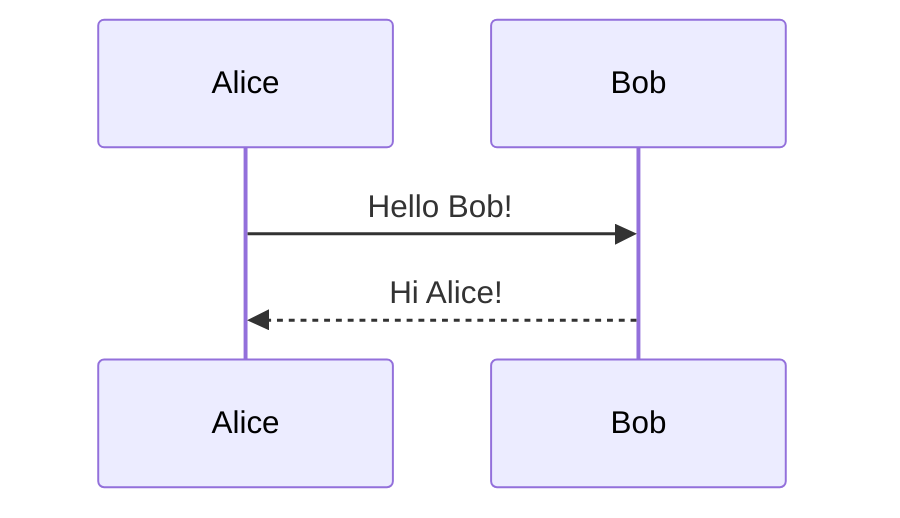

### Class Diagram

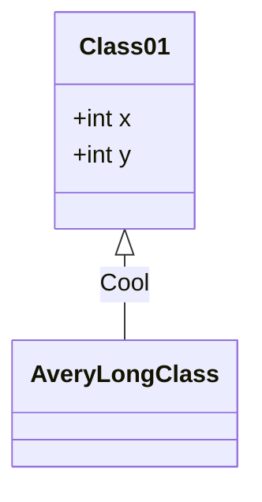

### State Diagram

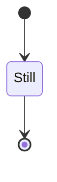

### Entity‑Relationship Diagram

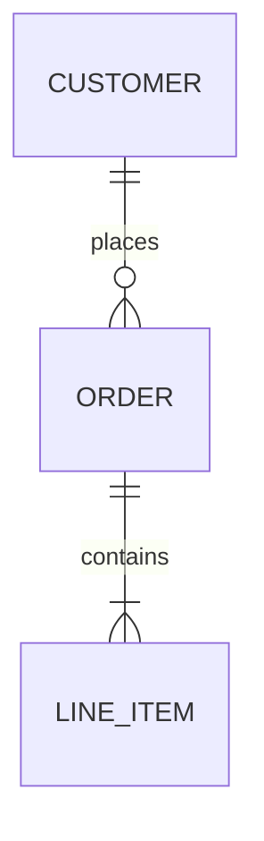

### User Journey

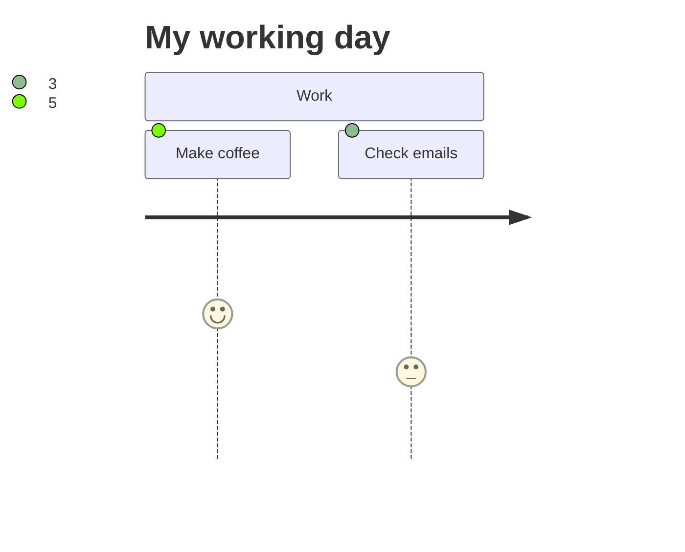

### Gantt

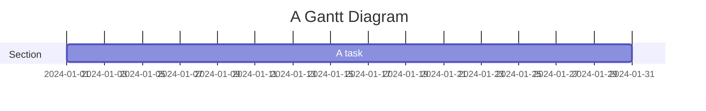

### Pie Chart

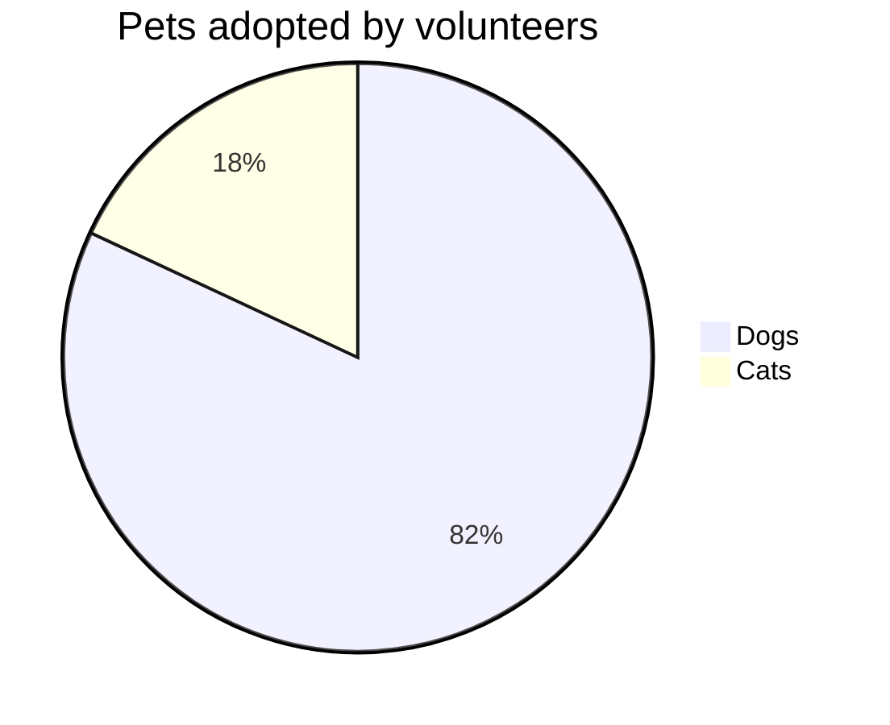

### Quadrant Chart

```mermaid
quadrantChart
    title Quadrant Chart
    "Quadrant 1" : 10
    "Quadrant 2" : 20
```

### Requirement Diagram

```mermaid
requirementDiagram
    title Requirements
    Req1 : "Requirement 1"
    Req2 : "Requirement 2"
```

### GitGraph (Git) Diagram

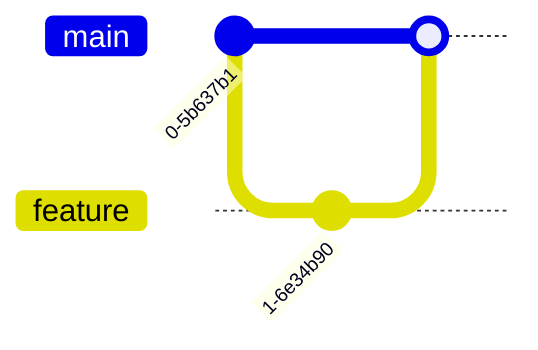

### C4 Diagram

```mermaid
c4Context
    Person(user, "User")
    System(system, "System")
    Rel(user, system, "Uses")
```

### Mindmaps

```mermaid
mindmap
    root((Root))
    root --> child1
    root --> child2
```

### Timeline

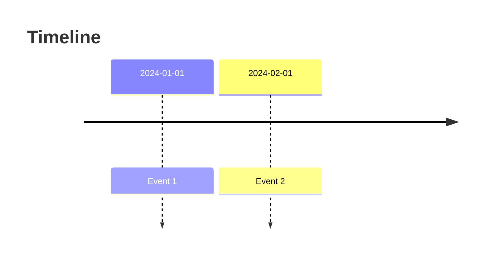

### ZenUML

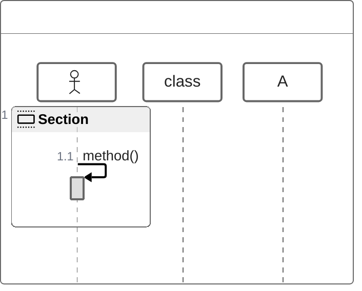

### Sankey

```mermaid
sankey
    source1 --> target1
    source2 --> target2
```

### XY Chart

```mermaid
xychart
    title XY Chart
    x: 1, 2, 3
    y: 4, 5, 6
```

### Block Diagram

```mermaid
blockDiagram
    block1 --> block2
```

### Packet


### Kanban

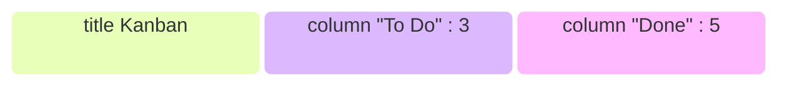

### Architecture

```mermaid
architecture
    component A
    component B
    A --> B
```

### Radar

```mermaid
radar
    title Radar
    "Metric 1" : 70
    "Metric 2" : 80
```

### Treemap

```mermaid
treemap
    title Treemap
    "Folder A" : 10
    "Folder B" : 20
```

---

## Ecosystem

Mermaid integrates with:

- Markdown editors (VS Code, Obsidian, etc.)
- Static site generators (Jekyll, Hugo)
- Documentation platforms (GitHub Pages, ReadTheDocs)
- CI/CD pipelines

---

## Mermaid CLI

The CLI allows you to render diagrams to SVG or PNG.

```bash
# Render a diagram file to SVG
npx mmdc -i diagram.mmd -o diagram.svg

# Render to PNG
npx mmdc -i diagram.mmd -o diagram.png
```

---

## Configuration

### Mermaid API Configuration

```js
mermaid.initialize({
    startOnLoad: true,
    theme: 'dark',
    logLevel: 1
});
```

### Mermaid Configuration Options

| Option | Description | Default |
|-------|------------|--------|
| `theme` | Theme name (`default`, `dark`, `forest`, `neutral`) | `default` |
| `logLevel` | Logging verbosity | `0` |
| `flowchart` | Flowchart specific options | `{}` |

### Registering Icons

```js
mermaid.registerIcon('custom', {
    svg: '<svg>...</svg>',
    width: 24,
    height: 24
});
```

### Directives

Use `%%{init: {...}}%%` to set options inline.

```mermaid
%%{init: {'theme': 'dark'}}%%
graph TD
    A --> B
```

### Theming

Custom themes can be defined via CSS or JavaScript.

```css
/* Example theme */
.mermaid .node rect {
    fill: #f0f0f0;
}
```

### Math

Mermaid supports LaTeX math via `$...$` or `$$...$$`.

```mermaid
graph TD
    A[Equation: $E=mc^2$] --> B
```

### Accessibility

- Use `aria-label` on nodes.
- Ensure sufficient color contrast.
- Provide keyboard navigation.

---

## FAQ

- **How to add title to flowchart?**  
  Use `title` keyword before the diagram definition.

- **How to specify custom CSS file?**  
  Include the CSS file in your HTML or import it in your build pipeline.

- **How to fix tooltip misplacement issue?**  
  Update to the latest Mermaid version; older versions had a known bug.

- **How to specify gantt diagram xAxis format?**  
  Use `dateFormat` in the gantt definition.

- **How to bind an event?**  
  Use `mermaidAPI.on('diagramRendered', callback)`.

- **How to add newline in the text?**  
  Use `\\n` inside node labels.

- **How to have special characters in link text?**  
  Escape them with `\` or use HTML entities.

- **How to change Flowchart curve style?**  
  Set `flowchart.curve` in configuration.

- **How to create a Flowchart end-Node that says "End"?**  
  Use `End` node type: `End --> ...`.

---

## Contributing

- Fork the repository.
- Submit pull requests with clear descriptions.
- Follow the coding style guidelines.
- Write tests for new features.

---

*This documentation is a distilled, code‑centric view of Mermaid. For the full user guide, visit the official Mermaid website.*