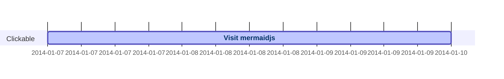
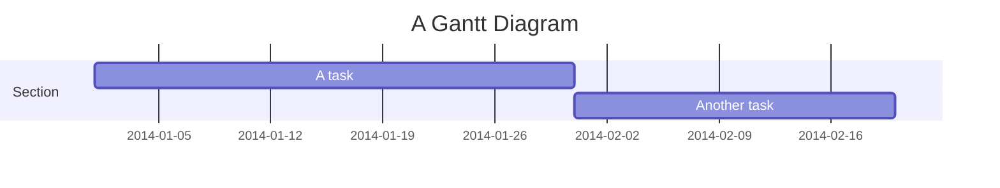
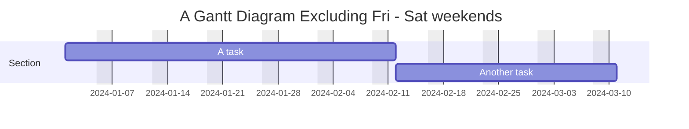
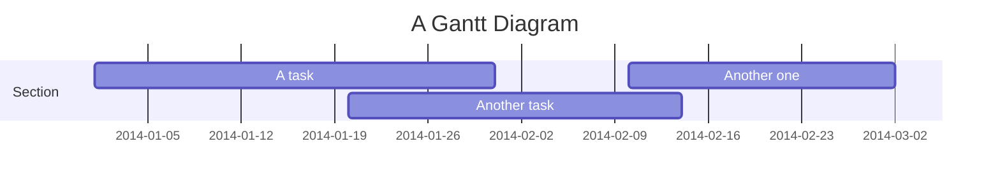
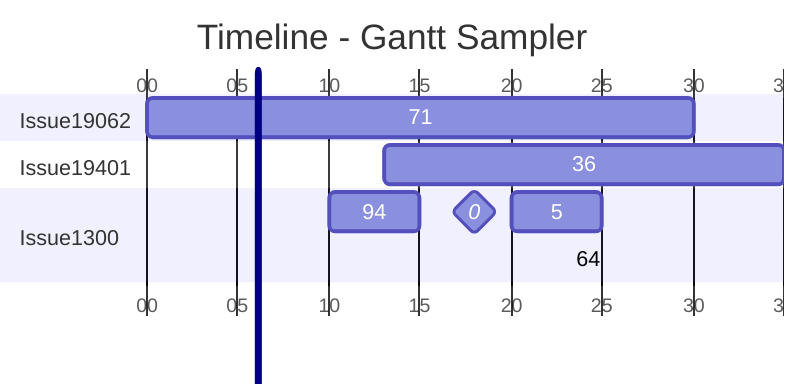

# Mermaid Gantt Diagram Documentation

> This document describes the Mermaid **Gantt** diagram syntax, configuration options, and examples.  
> All examples from the official Mermaid documentation are preserved.

---

## 1. Overview

A **Gantt** diagram is a bar‑chart‑style timeline that shows the duration of tasks in a project.  
Mermaid renders it as SVG, PNG, or a Markdown link.

---

## 2. Syntax

```mermaid
gantt
    title <optional title>
    dateFormat <YYYY-MM-DD>   # input date format
    axisFormat <format>     # output format on the axis
    excludes <dates|weekdays|weekends>   # optional
    weekend <friday|saturday>         # optional (v11.0.0+)
    tickInterval <value>   # optional (v10.3.0+)
    weekday <day>         # optional (v10.3.0+)
    section <name>
        <task title> : <metadata>, <start>, <duration|end>
        ...
```

### 2.1. Sections

```mermaid
section Development
    Task A : a1, 2024-01-01, 30d
    Task B : after a1, 20d
```

### 2.2. Tasks

| Metadata | Meaning |
|---------|--------|
| `active` | Currently running |
| `done` | Completed |
| `crit` | Critical |
| `milestone` | Instantaneous event |
| `tag` | Custom tag (e.g., `#tag`) |

### 2.3. Task Metadata

| Items | Interpretation |
|------|---------------|
| `<end>` | End date or duration |
| `<start>, <end>` | Explicit start & end |
| `after <taskID>, <end>` | Start after referenced task |
| `until <taskID>` | Run until referenced task |
| `<taskID>, <start>, <length>` | ID, start, duration |
| `after <taskID>, <length>` | Start after referenced task, duration |

> **Note**: `until` was added in v10.9.0+.

### 2.4. Excludes

```mermaid
excludes weekends
excludes 2024-01-01, 2024-01-15
```

### 2.5. Weekend Configuration (v11.0.0+)

```mermaid
weekend friday   # Friday & Saturday
```

### 2.6. Milestones

```mermaid
Initial milestone : milestone, m1, 17:49, 2m
```

### 2.7. Vertical Markers

```mermaid
Initial vert : vert, v1, 17:30, 2m
```

---

## 3. Date Formats

### 3.1. Input (`dateFormat`)

| Token | Description |
|------|------------|
| `YYYY` | 4‑digit year |
| `MM` | Month number |
| `DD` | Day of month |
| `HH` | 24‑hour |
| `mm` | Minutes |
| … | See full list in the official docs |

### 3.2. Output (`axisFormat`)

| Token | Description |
|------|------------|
| `%Y` | 4‑digit year |
| `%m` | Month number |
| `%d` | Day of month |
| `%H` | Hour (24‑hour) |
| … | See full list in the official docs |

### 3.3. Tick Interval (v10.3.0+)

```mermaid
tickInterval 1day
tickInterval 1week
weekday monday
```

---

## 4. Configuration

```javascript
mermaid.ganttConfig = {
  titleTopMargin: 25,
  barHeight: 20,
  barGap: 4,
  topPadding: 75,
  rightPadding: 75,
  leftPadding: 75,
  gridLineStartPadding: 10,
  fontSize: 12,
  sectionFontSize: 24,
  numberSectionStyles: 1,
  axisFormat: '%d/%m',
  tickInterval: '1week',
  topAxis: true,
  displayMode: 'compact',
  weekday: 'sunday'
};
```

> **Compact Mode**  
> Enable via YAML front‑matter:

```mermaid
---
displayMode: compact
---
gantt
    ...
```

---

## 5. Styling

Classes are defined in `src/diagrams/gantt/styles.js`.  
Sample stylesheet:

```css
.grid .tick { stroke: lightgrey; opacity: 0.3; }
.grid path { stroke-width: 0; }
.taskText { fill: white; text-anchor: middle; }
.taskTextOutsideRight { fill: black; text-anchor: start; }
.taskTextOutsideLeft { fill: black; text-anchor: end; }
```

Today marker:

```css
todayMarker stroke-width:5px,stroke:#0f0,opacity:0.5
```

---

## 6. Interaction



> Requires `securityLevel: 'loose'`.

---

## 7. Examples

### 7.1. Basic Gantt



### 7.2. Excluding Weekends



### 7.3. Milestones

```mermaid
gantt
    dateFormat HH:mm
    axisFormat %H:%M
    Initial milestone : milestone, m1, 17:49, 2m
    Task A : 10m
    Task B : 5m
    Final milestone : milestone, m2, 18:08, 4m
```



### 7.4. Vertical Markers

```mermaid
gantt
    dateFormat HH:mm
    axisFormat %H:%M
    Initial vert : vert, v1, 17:30, 2m
    Task A : 3m
    Task B : 8m
    Final vert : vert, v2, 17:58, 4m
```



### 7.5. Compact Mode



### 7.6. Bar Chart Using Gantt

```mermaid
gantt
    title Git Issues - days since last update
    dateFormat X
    axisFormat %s
    section Issue19062
    71   : 0, 71
    section Issue19401
    36   : 0, 36
    section Issue193
    34   : 0, 34
    section Issue7441
    9    : 0, 9
    section Issue1300
    5    : 0, 5
```



### 7.7. Timeline with Front‑Matter



---

## 8. Comments


---

### End of Documentation

---