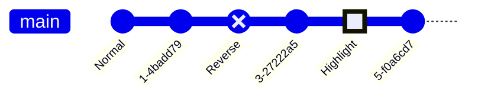

# Mermaid GitGraph Documentation

> This guide covers the **GitGraph** diagram type in Mermaid.  
> All examples from the original source are preserved.

---

## 1. Overview

A **GitGraph** is a pictorial representation of Git commits and actions (branch, checkout, merge, cherry‑pick, etc.).  
It is useful for visualising branching strategies, release flows, and collaboration.

---

## 2. Basic Syntax

* `gitGraph` – declares the diagram type.  
* `commit` – adds a commit to the current branch.  
* By default the diagram starts on the **main** branch.

---

## 3. Customising Commits

### 3.1 Custom Commit ID

### 3.2 Commit Types

| Type | Shape | Usage |
|------|------|------|
| `NORMAL` | solid circle | default |
| `REVERSE` | crossed solid circle | `commit type: REVERSE` |
| `HIGHLIGHT` | filled rectangle | `commit type: HIGHLIGHT` |

### 3.3 Tags

---

## 4. Branch Operations

| Keyword | Description | Example |
|--------|------------|--------|
| `branch <name>` | Create & switch to a new branch | `branch develop` |
| `checkout <name>` | Switch to an existing branch | `checkout develop` |
| `merge <name>` | Merge `<name>` into current branch | `merge develop` |

---

## 5. Cherry‑Pick

* `cherry-pick id: "<commit_id>" parent: "<parent_commit_id>"`

---

## 6. Configuration Options

| Option | Default | Description |
|-------|--------|------------|
| `showBranches` | `true` | Show/hide branch lines |
| `showCommitLabel` | `true` | Show/hide commit labels |
| `mainBranchName` | `"main"` | Custom name for the default branch |
| `mainBranchOrder` | `0` | Position of the main branch |
| `parallelCommits` | `false` | Render commits at the same level |

---

## 7. Orientation

* `LR:` – Left to Right (default)  
* `TB:` – Top to Bottom  
* `BT:` – Bottom to Top (v11.0.0+)

---

## 8. Themes

Mermaid ships with several themes: `base`, `forest`, `dark`, `default`, `neutral`.  
Set the theme via the `theme` config:

---

## 9. Theme Variables

| Variable | Purpose | Example |
|---------|--------|--------|
| `git0` … `git7` | Branch colors | `themeVariables: { 'git0': '#ff0000', ... }` |
| `gitBranchLabel0` … `gitBranchLabel7` | Branch label colors | `themeVariables: { 'gitBranchLabel0': '#ffffff', ... }` |
| `commitLabelColor`, `commitLabelBackground` | Commit label styling | `themeVariables: { commitLabelColor: '#ff0000', commitLabelBackground: '#00ff00' }` |
| `commitLabelFontSize` | Commit label font size | `themeVariables: { commitLabelFontSize: '16px' }` |
| `tagLabelColor`, `tagLabelBackground`, `tagLabelBorder` | Tag label styling | `themeVariables: { tagLabelColor: '#ff0000', tagLabelBackground: '#00ff00', tagLabelBorder: '#0000ff' }` |
| `gitInv0` … `gitInv7` | Highlight commit colors per branch | `themeVariables: { 'gitInv0': '#ff0000' }` |

---

## 10. Example: Full Diagram with Customisation

---

### End of Documentation

All examples from the original source are included verbatim.  
Feel free to copy the code blocks into your Mermaid‑enabled editor to see the diagrams in action.