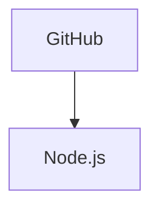

# Registering Icon Packs in Mermaid

Mermaid supports the use of icon packs from [Iconify](https://iconify.design/).  
By registering an icon pack you can:

* Override the default prefix of the icon pack.
* Load a pack only when it is actually used in a diagram.
* Keep your bundle size small by lazy‑loading icons.

Below is a concise guide on how to register icon packs in Mermaid, with all the examples you’ll need.

---

## 1. Overview

* **Icon packs** are collections of SVG icons that can be referenced in Mermaid diagrams.
* The **`name`** field is the identifier you’ll use in your diagram.
* The **`loader`** function (or a static `icons` object) tells Mermaid how to obtain the icons.

> **Tip** – The icon packs available can be found at <https://icones.js.org>.

---

## 2. Using a JSON file directly from a CDN

```js
import mermaid from 'CDN/mermaid.esm.mjs';

mermaid.registerIconPacks([
  {
    name: 'logos',
    loader: () =>
      fetch('https://unpkg.com/@iconify-json/logos@1/icons.json')
        .then((res) => res.json()),
  },
]);
```

* `name: 'logos'` – the prefix you’ll use in diagrams.
* `loader` fetches the JSON file from a CDN and parses it.

---

## 3. Using packages with a bundler

### 3.1 Install the icon pack

```bash
npm install @iconify-json/logos@1
```

### 3.2 Lazy‑loading the pack

```js
import mermaid from 'mermaid';

mermaid.registerIconPacks([
  {
    name: 'logos',
    loader: () =>
      import('@iconify-json/logos').then((module) => module.icons),
  },
]);
```

* The `loader` imports the pack only when it’s needed, keeping the initial bundle small.

### 3.3 Without lazy‑loading

```js
import mermaid from 'mermaid';
import { icons } from '@iconify-json/logos';

mermaid.registerIconPacks([
  {
    name: icons.prefix, // Uses the prefix defined in the icon pack
    icons,
  },
]);
```

* Here the icons are bundled directly, which is simpler but increases bundle size.

---

## 4. Using the icons in a diagram

Once registered, you can reference icons in Mermaid diagrams like so:



* Replace `logos` with whatever `name` you chose.
* The `<i>` tag uses the icon’s prefix and name.

---

## 5. Summary

| Approach | Bundle Size | Load Time | Use‑Case |
|---------|------------|----------|---------|
| CDN JSON | Small | Network fetch | Quick prototyping |
| Lazy‑load | Small | On‑demand | Production builds |
| Direct import | Larger | Immediate | Simple projects |

Feel free to experiment with different icon packs and loading strategies to find the best fit for your Mermaid diagrams. Happy diagramming!