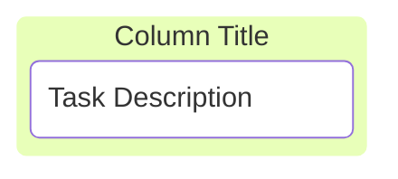
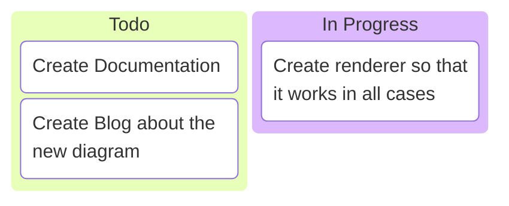
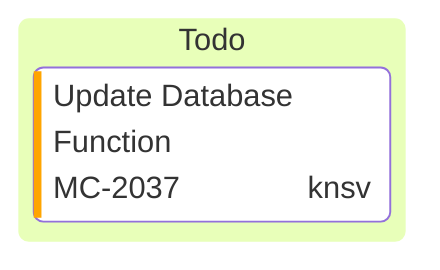
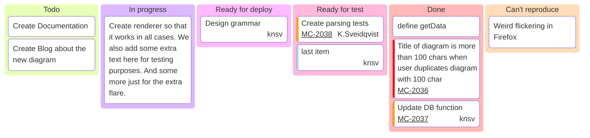

# Mermaid Kanban Diagram – Code Documentation

> This document explains how to create and customize a **Kanban** diagram in Mermaid.  
> All examples from the original guide are preserved.

---

## 1. Overview

A Mermaid Kanban diagram visualises tasks moving through stages of a workflow.  
The diagram starts with the keyword `kanban` followed by column definitions and tasks.



---

## 2. Syntax

| Element | Syntax | Description |
|--------|-------|------------|
| **Column** | `columnId[Column Title]` | `columnId` – unique identifier; `Column Title` – header text |
| **Task** | `taskId[Task Description]` | `taskId` – unique identifier; `Task Description` – task text |
| **Metadata** | `@{ key: value, ... }` | Optional key‑value pairs attached to a task |

> **Indentation** is critical: tasks must be indented under their parent column.

---

## 3. Defining Columns

Columns represent workflow stages (e.g., *Todo*, *In Progress*, *Done*).


---

## 4. Adding Tasks to Columns

Tasks are listed under their respective columns with indentation.



---

## 5. Adding Metadata to Tasks

Metadata is added after the task definition using `@{ ... }`.

| Supported Key | Description |
|--------------|------------|
| `assigned` | Person responsible |
| `ticket` | Ticket or issue number |
| `priority` | `'Very High'`, `'High'`, `'Low'`, `'Very Low'` |



---

## 6. Configuration Options

A configuration block can be placed at the top of the Markdown file to set global options.  
Currently, only `ticketBaseUrl` is supported for Kanban diagrams.

```yaml
---
config:
  kanban:
    ticketBaseUrl: 'https://yourproject.atlassian.net/browse/#TICKET#'
---
```

When a task contains a `ticket` metadata key, the ticket number is linked to the external system using the `ticketBaseUrl`. The placeholder `#TICKET#` is replaced by the ticket value.

---

## 7. Full Example



---

## 8. Summary

1. **Start** with `kanban`.  
2. **Define** columns (`columnId[Title]`).  
3. **Indent** tasks under columns (`taskId[Description]`).  
4. **Add** optional metadata (`@{ key: value }`).  
5. **Configure** global options with a YAML block if needed.

Follow these guidelines to create a clear, customizable Kanban board in Mermaid.