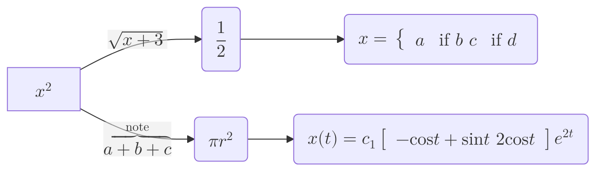
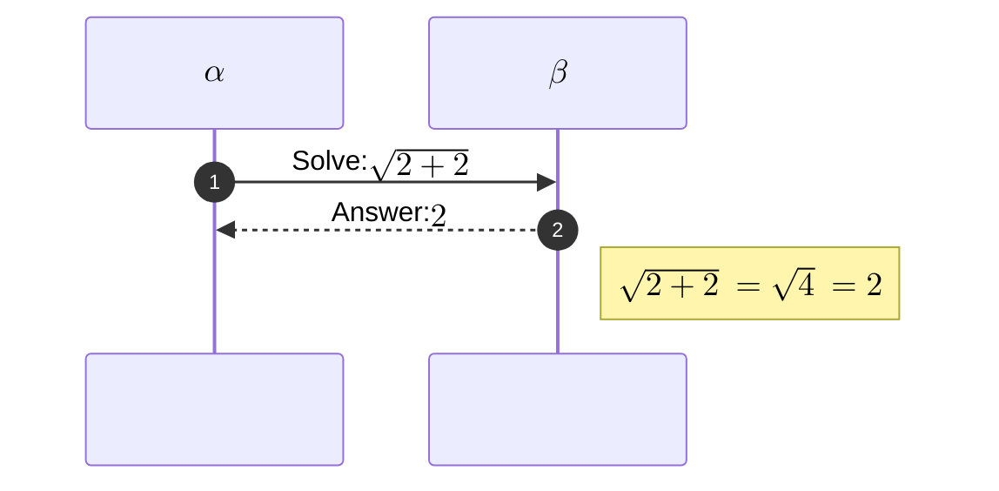

# Mermaid Math Configuration

Mermaid can render mathematical expressions using KaTeX.  
Only **Flowcharts** and **Sequence Diagrams** support math at the moment.

---

## 1. Overview

* Surround the expression with `$$ … $$`.
* KaTeX is used for rendering.
* The default renderer is **MathML**; fall‑back to CSS can be enabled.

---

## 2. Usage

### 2.1 Flowchart Example



### 2.2 Sequence Diagram Example



---

## 3. Legacy Support

If you need to support browsers that lack MathML support, enable `legacyMathML` in the Mermaid configuration.  
You must provide KaTeX’s stylesheet yourself.

```html
<!doctype html>
<html lang="en">
  <head>
    <link
      rel="stylesheet"
      href="https://cdn.jsdelivr.net/npm/katex@<version>/dist/katex.min.css"
      integrity="sha384-<hash>"
      crossorigin="anonymous"
    />
  </head>
  <body>
    <script type="module">
      import mermaid from './mermaid.esm.mjs';
      mermaid.initialize({
        legacyMathML: true,
      });
    </script>
  </body>
</html>
```

---

## 4. Rendering Consistency

Different browsers and OS fonts can cause inconsistent MathML rendering.  
To force KaTeX rendering on all browsers, set `forceLegacyMathML`:

```js
mermaid.initialize({
  forceLegacyMathML: true
});
```

This guarantees consistent output but requires the KaTeX stylesheet to be loaded.

---

## 5. Summary

| Feature | Default | Enable |
|--------|--------|-------|
| MathML | ✔ | – |
| Legacy MathML | – | `legacyMathML: true` |
| Force KaTeX | – | `forceLegacyMathML: true` |

Use the examples above to embed mathematical expressions in your Mermaid diagrams.