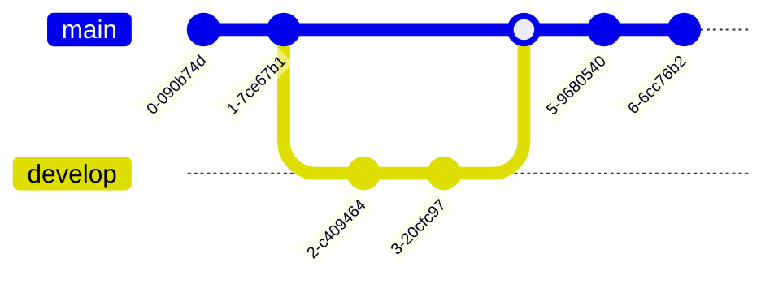

# Mermaid – Diagramming from Markdown‑like Text

Mermaid is a JavaScript‑based diagramming and charting tool that turns simple, Markdown‑style text into rich, interactive diagrams.  
It is designed to keep documentation up‑to‑date while saving developers time.

---

## Table of Contents

1. [Overview](#overview)  
2. [Getting Started](#getting-started)  
3. [Examples](#examples)  
4. [Security](#security)  
5. [Contributing](#contributing)  
6. [License](#license)  

---

## 1. Overview

Mermaid lets you write diagrams in plain text and renders them in the browser or in a Node.js environment.  
Typical use cases:

- Live‑editing in Markdown files  
- Embedding in documentation sites (GitHub, GitLab, etc.)  
- Programmatic generation of diagrams in CI/CD pipelines  

---

## 2. Getting Started

### Install

```bash
npm install mermaid
```

### Basic Usage

```js
import mermaid from 'mermaid';

mermaid.initialize({ startOnLoad: true });

const diagram = `
flowchart LR
  A[Hard] -->|Text| B(Round)
  B --> C{Decision}
  C -->|One| D[Result 1]
  C -->|Two| E[Result 2]
`;
mermaid.render('flowchart', diagram, (svg) => {
  document.getElementById('diagram').innerHTML = svg;
});
```

> **Tip** – For a quick demo, use the [Live Editor](https://mermaid.live).

---

## 3. Examples

Below are the most common diagram types. Copy the code into the Live Editor or your own project.

### Flowchart


### Sequence Diagram


### Gantt Chart


### Class Diagram


### State Diagram


### Pie Chart


### Git Graph (Experimental)



### Bar Chart (using Gantt)


### User Journey Diagram


### C4 Context Diagram


---

## 4. Security

Mermaid sanitizes user‑supplied diagram code to prevent XSS.  
For highly untrusted input, render diagrams inside a sandboxed `<iframe>` to block JavaScript execution.  
Interactive features may be disabled in this mode.

---

## 5. Contributing

- Fork the repo → `git clone <repo>`  
- Install dependencies: `pnpm install`  
- Run tests: `pnpm test`  
- Submit a pull request

See the full [Contributing Guide](CONTRIBUTING.md) for details.

---

## 6. License

MIT © 2025 Mermaid.js

---