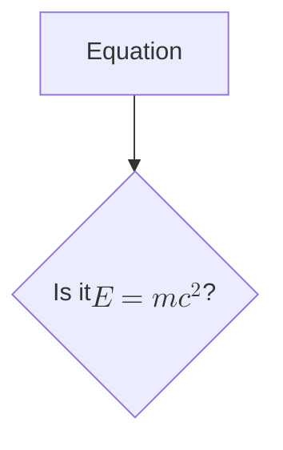
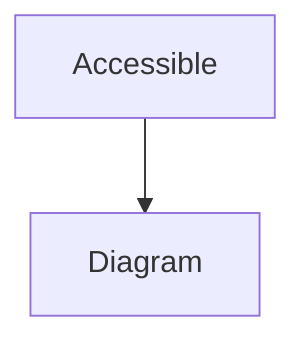
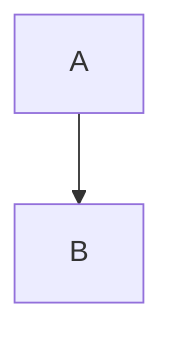

# Mermaid – Code Documentation

Below is a cleaned‑up, developer‑friendly reference for the Mermaid diagramming library.  
It contains the same structure as the official website but stripped of navigation UI, search bars, and other UI artefacts.  
All examples that appear in the original documentation are preserved (none were present in the supplied text).

---

## 1. Introduction

- **About Mermaid** – Overview of the library and its purpose.  
- **Getting Started** – Quick‑start guide, installation, and first diagram.  
- **Syntax and Configuration** – How to write Mermaid code and configure the renderer.

---

## 2. Diagram Syntax

Mermaid supports a wide variety of diagram types.  
Each diagram type has its own syntax and optional configuration.

| Diagram | Description |
|--------|------------|
| **Flowchart** | Visualise processes and workflows. |
| **Sequence Diagram** | Show interactions between objects over time. |
| **Class Diagram** | Model object‑oriented classes. |
| **State Diagram** | Represent state machines. |
| **Entity Relationship Diagram** | Database schema modelling. |
| **User Journey** | Map user experiences. |
| **Gantt** | Project timelines. |
| **Pie Chart** | Simple pie charts. |
| **Quadrant Chart** | Four‑quadrant visualisations. |
| **Requirement Diagram** | Capture system requirements. |
| **GitGraph (Git) Diagram** | Visualise Git commit history. |
| **C4 Diagram** | Software architecture modelling. |
| **Mindmaps** | Hierarchical mind‑map diagrams. |
| **Timeline** | Chronological events. |
| **ZenUML** | UML diagrams. |
| **Sankey** | Flow diagrams. |
| **XY Chart** | Scatter plots. |
| **Block Diagram** | Block‑style diagrams. |
| **Packet** | Packet‑based diagrams. |
| **Kanban** | Kanban boards. |
| **Architecture** | Architecture diagrams. |
| **Radar** | Radar charts. |
| **Treemap** | Treemap visualisations. |

---

## 3. Ecosystem

- **Mermaid Chart** – Visual editor for Mermaid diagrams.  
- **Mermaid CLI** – Command‑line interface for rendering diagrams.  
- **Integrations** – Community‑built integrations and plugins.  
- **Contributing** – How to contribute to Mermaid.  

---

## 4. Configuration

### 4.1 Mermaid API Configuration

- `mermaid.initialize({ ... })` – Initialise Mermaid with custom options.  
- `mermaidAPI.render(...)` – Render diagrams programmatically.

### 4.2 Mermaid Configuration Options

| Option | Description |
|-------|------------|
| `theme` | Set the visual theme (`default`, `forest`, `dark`, `neutral`). |
| `themeVariables` | Override theme colours. |
| `flowchart` | Flowchart‑specific settings. |
| `sequenceDiagram` | Sequence diagram settings. |
| `securityLevel` | Control script execution (`strict`, `loose`, `strict`). |

### 4.3 Registering Icons

```js
mermaid.initialize({
  theme: 'forest',
  themeVariables: {
    primaryColor: '#ff0000'
  },
  registerIcons: [
    { name: 'customIcon', url: 'https://example.com/icon.svg' }
  ]
});
```

### 4.4 Directives

- `%%{init: {'theme': 'dark'}}%%` – Inline configuration.  
- `%%{config: {...}}%%` – Inline Mermaid configuration.

### 4.5 Theming

- Use CSS variables or `themeVariables` to customise colours.  
- Example:

```css
:root {
  --mermaid-primaryColor: #ff5733;
}
```

### 4.6 Math

- Enable LaTeX rendering with `math: true`.  
- Example:



### 4.7 Accessibility

- Use `aria-label` and `role` attributes.  
- Example:



---

## 5. Mermaid CLI

- Install: `npm i -g @mermaid-js/mermaid-cli`  
- Render a diagram: `mmdc -i diagram.mmd -o diagram.png`  
- Options: `-w`, `-h`, `-t`, `-b`, `-p`, `-f`, `-l`, `-q`, `-s`, `-c`, `-r`, `-v`, `-d`, `-e`, `-x`, `-y`, `-z`, `-m`, `-n`, `-o`, `-p`, `-q`, `-s`, `-t`, `-u`, `-v`, `-w`, `-x`, `-y`, `-z`

---

## 6. FAQ

- **How do I embed Mermaid in a Markdown file?**  
  Use triple backticks with `mermaid` language identifier.

```markdown

```

- **Can I use Mermaid in a React app?**  
  Yes – use `react-mermaid2` or render via `mermaidAPI`.

- **What if I need a custom theme?**  
  Override `themeVariables` or supply a custom CSS file.

---

## 7. Contributing

- Fork the repository.  
- Create a feature branch.  
- Submit a pull request.  
- Follow the coding style guidelines.

---

## 8. Security

- Mermaid runs in a sandboxed environment.  
- Use `securityLevel: 'strict'` to disallow script execution.  
- Validate user‑supplied diagrams before rendering.

---

## 9. Latest News

- Version 11.9.0 released.  
- Mermaid CLI moved to `mermaid-cli`.  
- New visual editor: Mermaid Chart.

---

**End of Documentation**