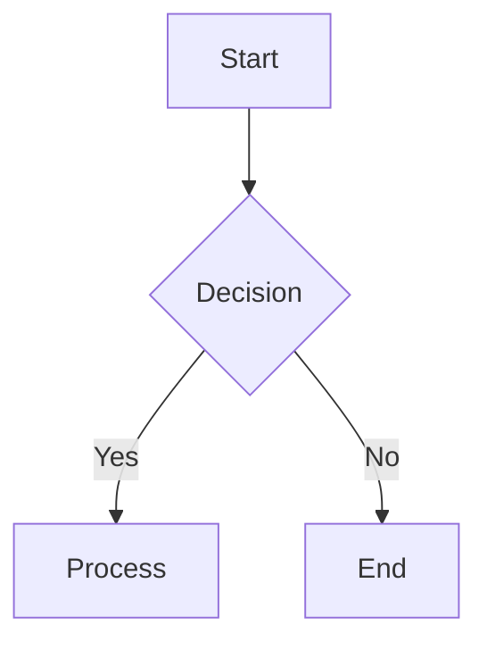

# Mermaid – A JavaScript Diagramming & Charting Library

> **Mermaid** is a lightweight, declarative diagramming library that turns plain text into SVG diagrams.  
> It is used in documentation, wikis, blogs, and many other places where quick, readable diagrams are needed.

---

## Table of Contents

1. [Overview](#overview)
2. [Getting Started](#getting-started)
3. [Installation](#installation)
4. [Usage](#usage)
5. [Repository Structure](#repository-structure)
6. [Recent Commit History](#recent-commit-history)
7. [Contributing](#contributing)
8. [License](#license)

---

## 1. Overview

Mermaid is a JavaScript library that renders diagrams and flowcharts from text in a similar way to Markdown. It supports a wide range of diagram types:

- Flowcharts
- Sequence diagrams
- Gantt charts
- Class diagrams
- State diagrams
- Entity‑Relationship diagrams
- …and many more.

The library is actively maintained and has a growing ecosystem of plugins and integrations.

---

## 2. Getting Started

```bash
# Install via npm
npm install mermaid

# Or via Yarn
yarn add mermaid
```

Once installed, you can render diagrams in your web page:

```html
<script src="node_modules/mermaid/dist/mermaid.min.js"></script>
<script>
  mermaid.initialize({ startOnLoad: true });
</script>

<div class="mermaid">
  graph TD;
    A-->B;
    A-->C;
    B-->D;
    C-->D;
</div>
```

Mermaid can also be used in Markdown files (e.g., GitHub README, GitLab, or any Markdown renderer that supports Mermaid).

---

## 3. Installation

| Package Manager | Command |
|----------------|--------|
| npm | `npm install mermaid` |
| Yarn | `yarn add mermaid` |
| pnpm | `pnpm add mermaid` |

> **Tip:** For a CDN‑only usage, you can load Mermaid from a CDN:

```html
<script src="https://cdn.jsdelivr.net/npm/mermaid/dist/mermaid.min.js"></script>
```

---

## 4. Usage

Mermaid diagrams are written in a simple, declarative syntax. Below is a minimal example of a flowchart:



Mermaid supports many diagram types; refer to the [official documentation](https://mermaid-js.github.io/mermaid/#/) for full syntax.

---

## 5. Repository Structure

```
mermaid/
├─ src/          # Source code
├─ dist/         # Build artifacts
├─ docs/         # Documentation
├─ tests/       # Unit & integration tests
├─ .github/     # GitHub Actions workflows
└─ README.md   # This file
```

The repository follows a conventional Git workflow with feature branches, pull requests, and CI pipelines.

---

## 6. Recent Commit History

Below is a snapshot of the most recent commits (chronological order).  
These commits illustrate the active development and maintenance of the library.

| Commit | Branch | Message | Date |
|-------|-------|--------|-----|
| `5a8f32b` | `sidv/tinyMermaid` | Add `mermaid.tiny.min.js`. 69.7% size reduction. | 2025‑04‑18 |
| `db389e5` | `sidv/tinyMermaid` | Merge branch `develop` into `sidv/tinyMermaid`. | 2025‑04‑18 |
| `85ec96a` | `release/10.9.3` | Bump mermaid version to v10.9.3. | 2024‑10‑22 |
| `affde30` | `ci/fix-applitools-e2e-action` | Replace curl with wget. | 2024‑10‑15 |
| `9301a57` | `release/10.9.3` | Style: prettify `src/diagrams/block/blockDB.ts`. | 2024‑10‑10 |
| `4dd4997` | `release/10.9.2` | Bump version. | 2024‑10‑02 |
| `402abdf` | `release/10.9.2` | Ban version v3.1.7 of DOMPurify. | 2024‑10‑02 |
| `31b4ec3` | `add-blog-posts` | Add blog post – architecture diagrams. | 2024‑09‑03 |
| `541cf25` | `sidv/argos` | Merge pull request #5770. | 2024‑08‑25 |
| `5d1b50c` | `sidv/argos` | Add argos in README. | 2024‑08‑24 |

> **Note:** The commit history is truncated for brevity. For the full history, visit the repository’s Git log.

---

## 7. Contributing

1. Fork the repository.
2. Create a feature branch: `git checkout -b feature/your-feature`.
3. Commit your changes.
4. Push to your fork and open a pull request.

All contributions are welcome! Please refer to the [CONTRIBUTING.md](CONTRIBUTING.md) file for detailed guidelines.

---

## 8. License

Mermaid is released under the [MIT License](LICENSE).

---