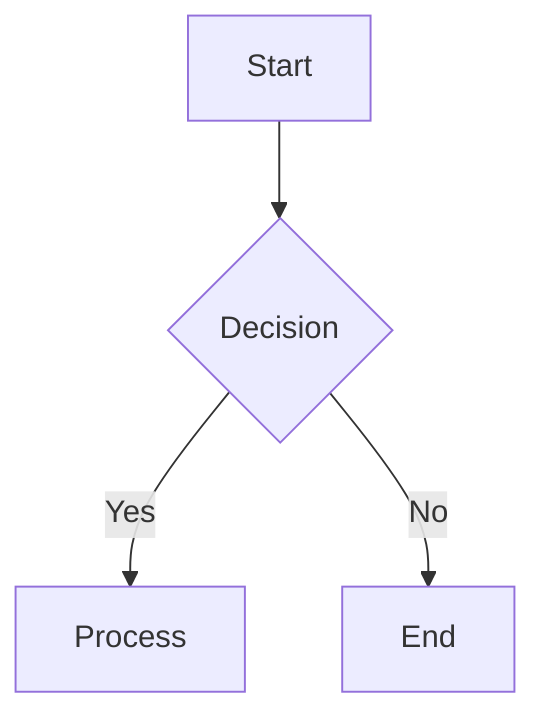
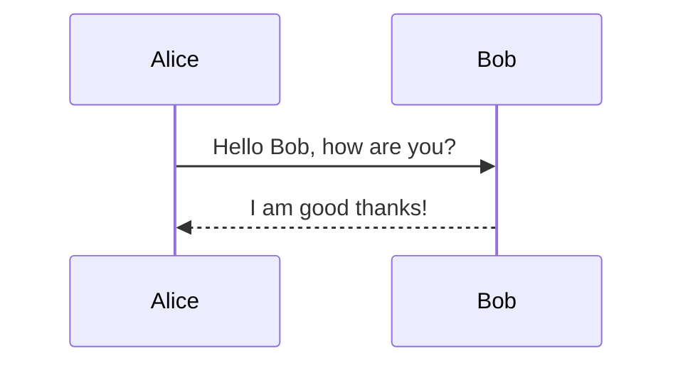
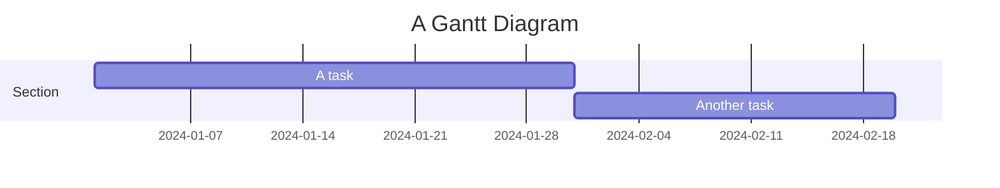
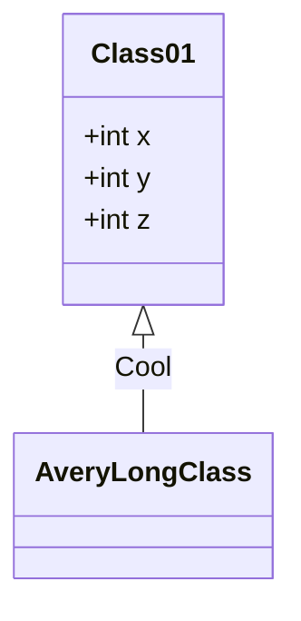
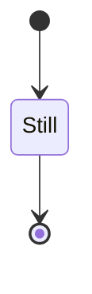
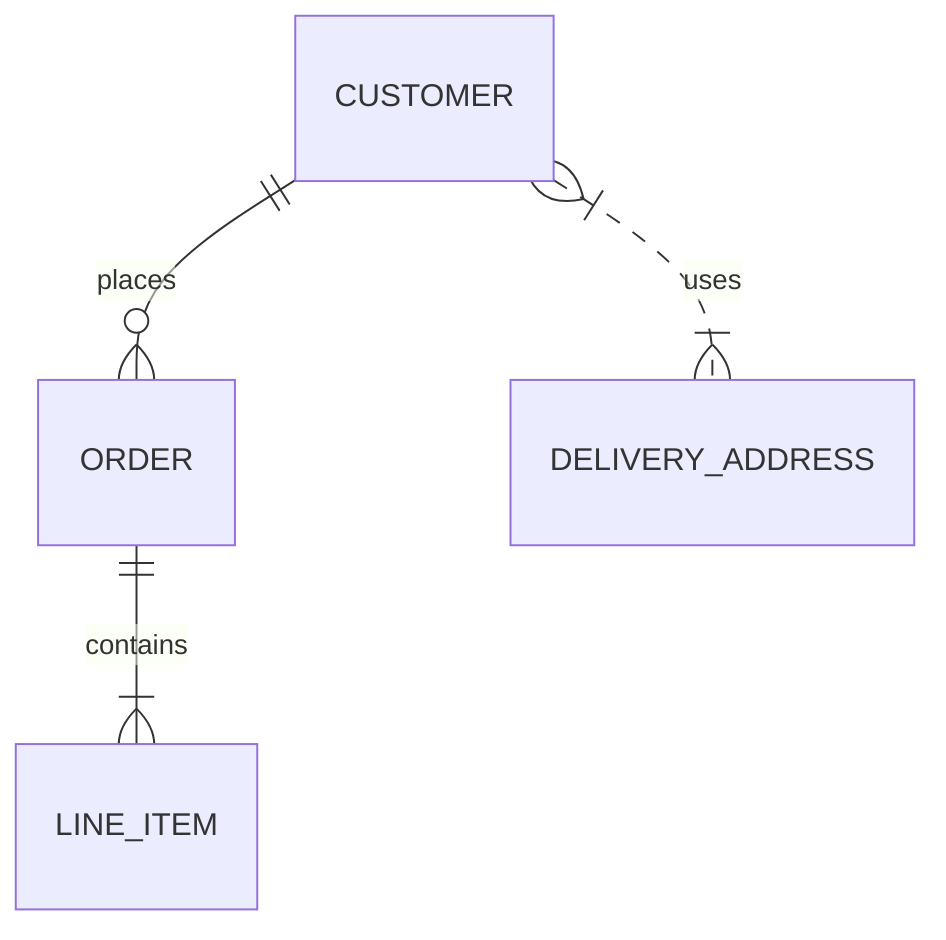

# Tiny Mermaid – Code Documentation

Tiny Mermaid is a lightweight, CDN‑friendly subset of the full Mermaid library.  
It contains only the core diagram types that are most commonly used in
web pages and is optimized for quick loading in the browser.

> **NOTE** – Tiny Mermaid is *not* intended to be installed via npm.  
> Use the full `mermaid` package if you need lazy loading, Katex rendering,
> or any of the removed diagram types.

---

## 1. Supported Diagram Types

| Diagram | Supported? |
|--------|-----------|
| Flowchart | ✅ |
| Sequence | ✅ |
| Gantt | ✅ |
| Class | ✅ |
| State | ✅ |
| ER | ✅ |
| **Removed** | |
| Mindmap | ❌ |
| Architecture | ❌ |
| Katex | ❌ |
| Lazy loading | ❌ |

---

## 2. CDN Usage

Tiny Mermaid is delivered via a CDN.  
Replace `<MERMAID_MAJOR_VERSION>` with the major version you want to
use (e.g. `11`).

```html
<!-- Generic format -->
<script src="https://cdn.jsdelivr.net/npm/@mermaid-js/tiny@<MERMAID_MAJOR_VERSION>/dist/mermaid.tiny.js"></script>

<!-- Pinning major version -->
<script src="https://cdn.jsdelivr.net/npm/@mermaid-js/tiny@11/dist/mermaid.tiny.js"></script>

<!-- Pinning a specific version -->
<script src="https://cdn.jsdelivr.net/npm/@mermaid-js/tiny@11.6.0/dist/mermaid.tiny.js"></script>
```

> **Tip** – Pinning a specific version guarantees that your
> application will not break when a new major release is published.

---

## 3. Initializing Mermaid

After loading the script, initialize Mermaid with the desired
configuration.  
The following example shows a minimal configuration:

```js
// Configure Mermaid
mermaid.initialize({
  startOnLoad: true,   // Render diagrams on page load
  theme: 'default', // or 'dark', 'forest', etc.
});
```

---

## 4. Example Diagrams

Below are a few example diagrams that work with Tiny Mermaid.

### 4.1 Flowchart



### 4.2 Sequence Diagram



### 4.3 Gantt Chart



### 4.4 Class Diagram



### 4.5 State Diagram



### 4.6 Entity‑Relationship Diagram



---

## 5. Limitations & Workarounds

| Feature | Status | Workaround |
|--------|-------|-----------|
| Mindmap | Not supported | Use a full Mermaid build |
| Architecture Diagram | Not supported | Use a full Mermaid build |
| Katex rendering | Not supported | Use a full Mermaid build |
| Lazy loading | Not supported | Use a full Mermaid build |

If you need any of the removed features, install the full Mermaid
package via npm:

```bash
npm install mermaid
```

---

## 6. Contributing

See the repository’s `CONTRIBUTING.md` for guidelines on how to
contribute to Tiny Mermaid.

---

## 7. License

Tiny Mermaid is released under the MIT license.  
See the `LICENSE` file in the repository for details.

---