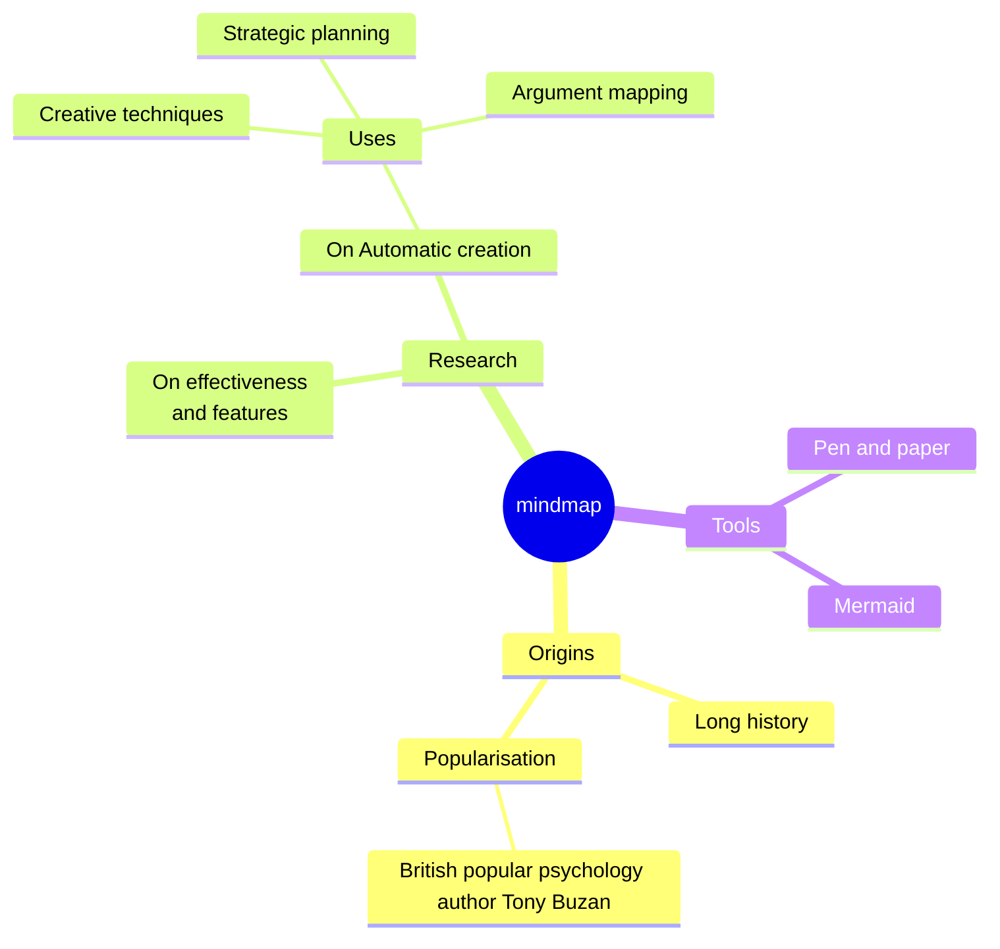
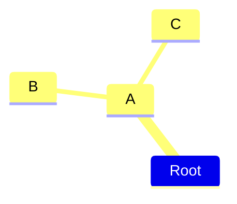
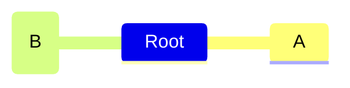
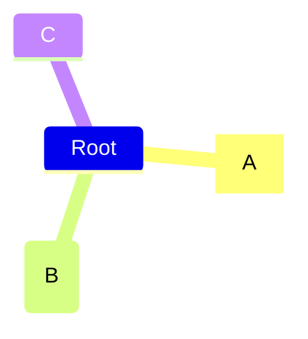
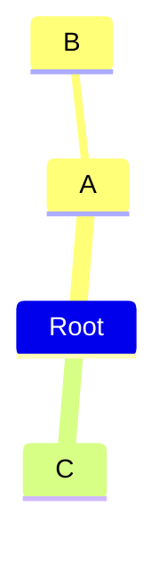

# Mermaid Mindmap Documentation

> **Note** – Mindmaps are an experimental diagram type in Mermaid.  
> The syntax is stable, but icon integration and lazy‑loading behaviour may change in future releases.

---

## 1. Overview

A *mind map* is a diagram that visually organizes information into a hierarchy, showing relationships among pieces of the whole.  
Typical usage: a single central concept with branches for major ideas and sub‑ideas.

---

## 2. Basic Syntax

Mindmaps are defined with the `mindmap` keyword followed by an indented outline.  
Indentation determines the hierarchy level.



> **Result** – A mind map with three top‑level branches: *Origins*, *Research*, *Tools*.

---

## 3. Hierarchy Levels

Indentation defines levels. Example with three levels:



* `Root` – level 0  
* `A` – level 1  
* `B`, `C` – level 2

---

## 4. Node Shapes

Mindmap nodes can use the same shapes as flowcharts.  
The syntax is `<id><shape>text</shape>`.

| Shape | Syntax | Example |
|------|-------|--------|
| Square | `id[I am a square]` |  |
| Rounded square | `id(I am a rounded square)` |  |
| Circle | `id((I am a circle))` |  |
| Bang | `id))I am a bang((` |  |
| Cloud | `id)I am a cloud(` |  |
| Hexagon | `id{{I am a hexagon}}` |  |
| Default | `I am the default shape` |  |

---

## 5. Icons

Icons are added with the experimental `::icon()` syntax.  
The icon font must be loaded by the host page.



> **Tip** – Load Font Awesome or Material Design icons in your page before rendering.

---

## 6. CSS Classes

Classes are added with triple‑colon syntax, similar to flowcharts.



* `urgent` – custom class (e.g., red background)  
* `large` – custom class (e.g., larger font)

Classes must be defined in your stylesheet.

---

## 7. Indentation Rules

* Only relative indentation matters.  
* If a node’s indentation is ambiguous, Mermaid chooses the nearest ancestor with smaller indentation.

Example:



`C` becomes a sibling of `B` because it shares the same indentation as `A`.

---

## 8. Markdown Strings

Markdown strings (`"``"` delimiters) allow rich text and automatic wrapping.

```mermaid
mindmap
  id1["`**Root** with
a second line
Unicode works too: 🤓`"]
  id2["`The dog in **the** hog... a *very long text* that wraps to a new line`"]
  id3[Regular labels still works]
```

* **Bold** – `**text**`  
* *Italic* – `*text*`  
* Newlines are inserted with `\n` or actual line breaks inside the backticks.

---

## 9. Integration with a Web Page

### 9.1 Pre‑9.4.0

```html
<script type="module">
  import mermaid from 'https://cdn.jsdelivr.net/npm/mermaid@9.3.0/dist/mermaid.esm.min.mjs';
  import mindmap from 'https://cdn.jsdelivr.net/npm/@mermaid-js/mermaid-mindmap@9.3.0/dist/mermaid-mindmap.esm.min.mjs';
  await mermaid.registerExternalDiagrams([mindmap]);
</script>
```

### 9.2 9.4.0 and Later

```html
<script type="module">
  import mermaid from 'https://cdn.jsdelivr.net/npm/mermaid@11/dist/mermaid.esm.min.mjs';
</script>
```

> **Lazy Loading** – Mindmaps are loaded asynchronously to keep Mermaid’s bundle size small.

---

## 10. Summary

* **Syntax** – `mindmap` + indented outline.  
* **Hierarchy** – Indentation defines parent/child relationships.  
* **Shapes** – Use flowchart shapes.  
* **Icons & Classes** – Experimental `::icon()` and `:::` syntax.  
* **Markdown** – Supports rich text and auto‑wrapping.  
* **Integration** – Use async loading for optimal bundle size.

Feel free to experiment and contribute to the evolving Mermaid mindmap feature!