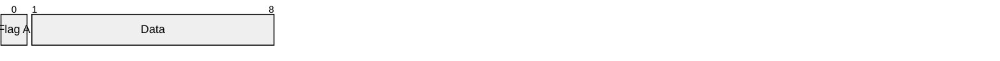
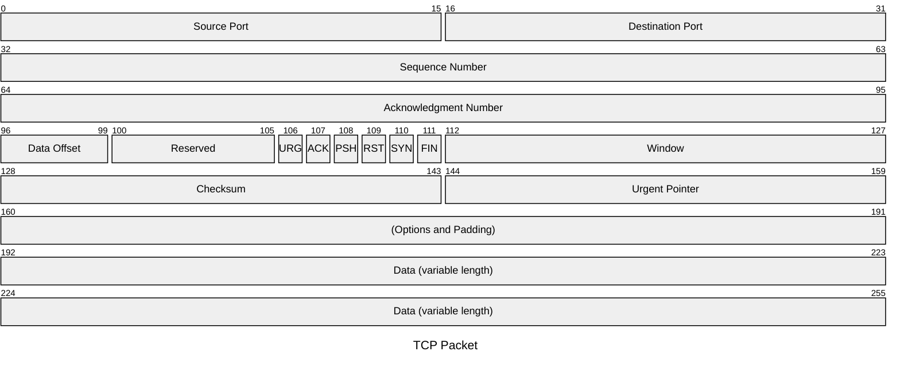
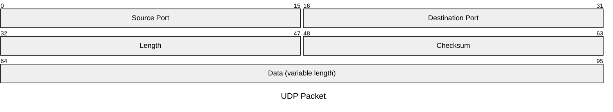

# Packet Diagram – Mermaid Documentation

> **Note**  
> This page contains the official Mermaid syntax for creating *Packet Diagrams* (available from Mermaid v11.0.0+).  
> All examples shown below are fully functional and can be copied directly into a Mermaid editor.

---

## 1. Overview

A **Packet Diagram** is a visual representation of the structure and contents of a network packet.  
It is especially useful for:

- Developers
- Network engineers
- Educators
- Students

The diagram shows each field’s bit range and a short description.

---

## 2. Syntax

### 2.1 Bit‑Range Formats

| Format | Meaning | Example |
|-------|--------|--------|
| `start-end` | Explicit start and end bits (inclusive) | `0-15: "Source Port"` |
| `+<count>` | Relative to the previous field; automatically starts after the last bit | `+8: "Checksum"` |
| `start` | Single‑bit field | `106: "URG"` |

> **Tip** – Mixing formats is allowed; the parser will resolve the bit positions automatically.

### 2.2 Bits Syntax (v11.7.0+)

When you need to specify a field size without caring about the exact start bit, use the `+<count>` syntax.  
The parser will place the field immediately after the previous one.

---

## 3. Examples

### 3.1 TCP Packet

> **Rendered Diagram**  
> (Copy the code above into a Mermaid editor to view the diagram.)

---

### 3.2 UDP Packet

> **Rendered Diagram**  
> (Copy the code above into a Mermaid editor to view the diagram.)

---

## 4. Configuration

Mermaid’s packet diagram can be customized via the global Mermaid configuration.  
Refer to the [Mermaid Configuration Guide](https://mermaid.js.org/config/) for details on themes, colors, and other options.

---

## 5. Further Reading

- [Mermaid Official Docs](https://mermaid.js.org/)
- [Mermaid Live Editor](https://mermaid.live/)
- [Mermaid API](https://mermaid.js.org/api/)

---

*End of Packet Diagram Documentation*