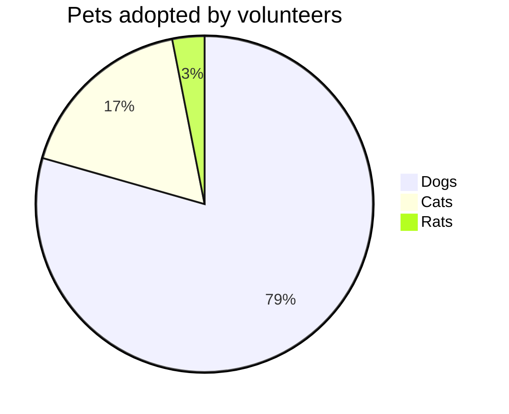
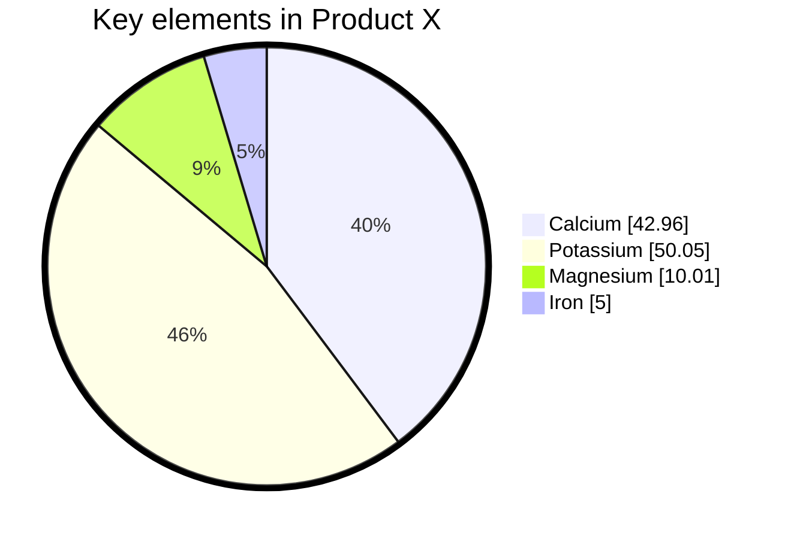

# Mermaid Pie Chart Documentation

Mermaid can render **pie charts** (also called circle charts) that display numerical proportions as slices of a circle.  
The following sections describe the syntax, provide examples, and list configurable options.

---

## 1. Overview

A pie chart is a circular statistical graphic divided into slices.  
Each slice’s arc length (and therefore its central angle and area) is proportional to the quantity it represents.

---

## 2. Syntax


| Element | Description | Optional |
|--------|------------|---------|
| `pie` | Keyword that starts the diagram | – |
| `showData` | Renders the numeric values next to the legend | **Yes** |
| `title` | Gives the chart a title | **Yes** |
| `"<label>"` | Slice label (must be quoted) | – |
| `:` | Separator between label and value | – |
| `<value>` | Positive numeric value (up to two decimal places) | – |

*Slices are drawn clockwise in the order they appear.*

---

## 3. Example



Result:

```
79%  Dogs
17%  Cats
3%   Rats
```

---

## 4. Configuration

Mermaid allows customizing pie charts via the `config` block.  
Only the parameters shown below are relevant for pie charts.



### Configuration Parameters

| Parameter | Description | Default |
|----------|------------|--------|
| `textPosition` | Axial position of slice labels (0.0 = center, 1.0 = outside edge) | `0.75` |

---

## 5. Summary

- Use the `pie` keyword to start a pie chart.
- Add `showData` to display numeric values.
- Provide a `title` if desired.
- List slices as `"label" : value` pairs.
- Customize appearance with the `config` block.

Feel free to copy the examples above and adapt them to your own data.