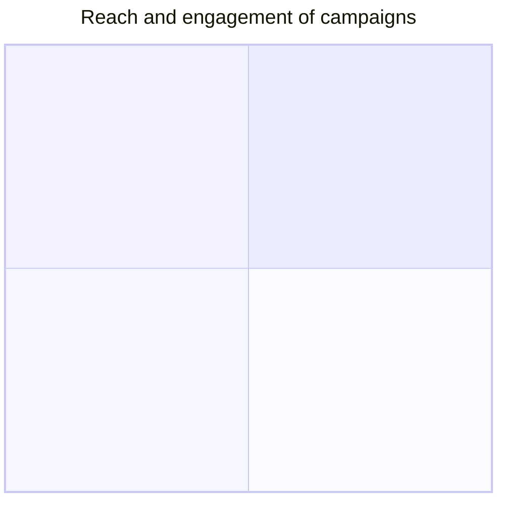
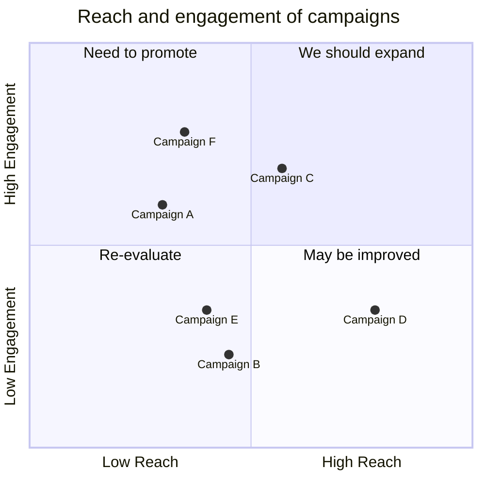
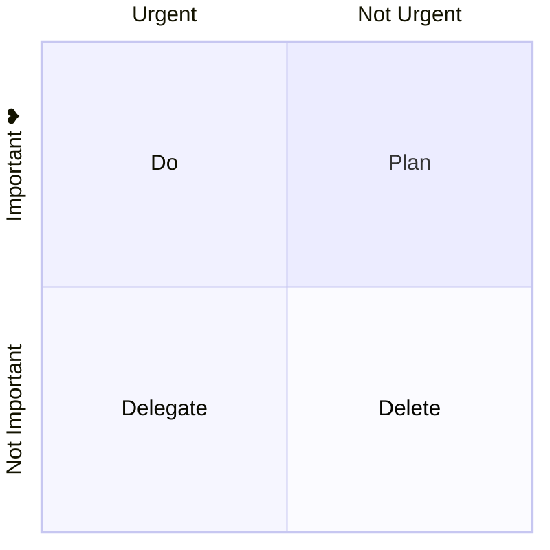
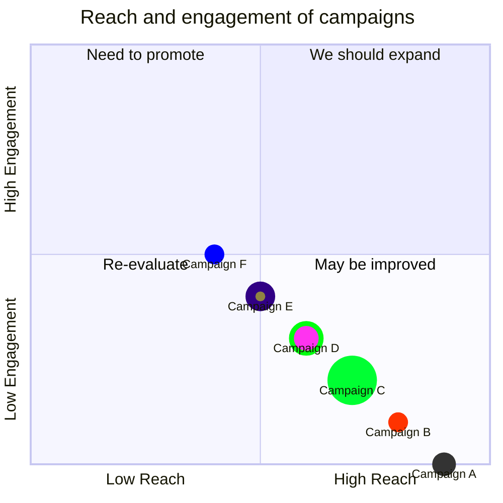

# Mermaid Quadrant Chart Documentation

> **Note** – All examples below are valid Mermaid code and can be pasted into a Mermaid‑enabled editor (e.g. Mermaid Live, Mermaid CLI, or any Markdown renderer that supports Mermaid).

---

## 1. Overview

A **Quadrant Chart** visualises data points on a 2‑D grid divided into four quadrants.  
- **X‑axis** represents one variable (left → right).  
- **Y‑axis** represents another variable (bottom → top).  
- Each quadrant can contain a label and a set of points.

Points are defined in the range **0 – 1** for both axes.

---

## 2. Syntax

```mermaid
quadrantChart
    title <short description>
    x-axis <left text> --> <right text>
    y-axis <bottom text> --> <top text>
    quadrant-1 <text for top‑right>
    quadrant-2 <text for top‑left>
    quadrant-3 <text for bottom‑left>
    quadrant-4 <text for bottom‑right>
    <PointName>: [<x>, <y>]
```

### 2.1 Title



The title is always rendered at the top of the chart.

### 2.2 X‑Axis

```mermaid
x-axis Low Reach --> High Reach
```

- `<left text>` → left side of the X‑axis.  
- `<right text>` → right side of the X‑axis.  
- If only `<left text>` is supplied, only the left label is shown.

### 2.3 Y‑Axis

```mermaid
y-axis Low Engagement --> High Engagement
```

- `<bottom text>` → bottom side of the Y‑axis.  
- `<top text>` → top side of the Y‑axis.  
- If only `<bottom text>` is supplied, only the bottom label is shown.

### 2.4 Quadrant Labels

```mermaid
quadrant-1 We should expand
quadrant-2 Need to promote
quadrant-3 Re‑evaluate
quadrant-4 May be improved
```

| Quadrant | Position | Label |
|---------|---------|------|
| 1 | Top‑right | `quadrant-1` |
| 2 | Top‑left | `quadrant-2` |
| 3 | Bottom‑left | `quadrant-3` |
| 4 | Bottom‑right | `quadrant-4` |

### 2.5 Points

```mermaid
Campaign A: [0.3, 0.6]
Campaign B: [0.45, 0.23]
Campaign C: [0.57, 0.69]
Campaign D: [0.78, 0.34]
Campaign E: [0.40, 0.34]
Campaign F: [0.35, 0.78]
```

- Syntax: `<PointName>: [<x>, <y>]`  
- `x` and `y` are floats between 0 and 1.

---

## 3. Full Example



---

## 4. Chart Configuration

| Parameter | Description | Default |
|----------|------------|--------|
| `chartWidth` | Width of the chart | `500` |
| `chartHeight` | Height of the chart | `500` |
| `titlePadding` | Padding around the title | `10` |
| `titleFontSize` | Font size of the title | `20` |
| `quadrantPadding` | Padding outside all quadrants | `5` |
| `quadrantTextTopPadding` | Top padding for quadrant text | `5` |
| `quadrantLabelFontSize` | Font size of quadrant labels | `16` |
| `quadrantInternalBorderStrokeWidth` | Inner border width | `1` |
| `quadrantExternalBorderStrokeWidth` | Outer border width | `2` |
| `xAxisLabelPadding` | Padding for X‑axis labels | `5` |
| `xAxisLabelFontSize` | Font size of X‑axis labels | `16` |
| `xAxisPosition` | Position of X‑axis (`top` or `bottom`) | `top` |
| `yAxisLabelPadding` | Padding for Y‑axis labels | `5` |
| `yAxisLabelFontSize` | Font size of Y‑axis labels | `16` |
| `yAxisPosition` | Position of Y‑axis (`left` or `right`) | `left` |
| `pointTextPadding` | Padding between point and its label | `5` |
| `pointLabelFontSize` | Font size of point labels | `12` |
| `pointRadius` | Radius of points | `5` |

### Example of Custom Configuration



---

## 5. Theme Variables

| Variable | Description |
|---------|-------------|
| `quadrant1Fill` | Fill color of top‑right quadrant |
| `quadrant2Fill` | Fill color of top‑left quadrant |
| `quadrant3Fill` | Fill color of bottom‑left quadrant |
| `quadrant4Fill` | Fill color of bottom‑right quadrant |
| `quadrant1TextFill` | Text color of top‑right quadrant |
| `quadrant2TextFill` | Text color of top‑left quadrant |
| `quadrant3TextFill` | Text color of bottom‑left quadrant |
| `quadrant4TextFill` | Text color of bottom‑right quadrant |
| `quadrantPointFill` | Points fill color |
| `quadrantPointTextFill` | Points text color |
| `quadrantXAxisTextFill` | X‑axis text color |
| `quadrantYAxisTextFill` | Y‑axis text color |
| `quadrantInternalBorderStrokeFill` | Inner border color |
| `quadrantExternalBorderStrokeFill` | Outer border color |
| `quadrantTitleFill` | Title color |

---

## 6. Point Styling

Points can be styled directly or via CSS‑style classes.

### 6.1 Direct Styling

```mermaid
quadrantChart
  ...
  Campaign A: [0.9, 0.0] radius: 12
  Campaign B: [0.8, 0.1] color: #ff3300, radius: 10
  Campaign C: [0.7, 0.2] radius: 25, color: #00ff33, stroke-color: #10f0f0
  Campaign D: [0.6, 0.3] radius: 15, stroke-color: #00ff0f, stroke-width: 5px ,color: #ff33f0
```

### 6.2 Class Styling

```mermaid
quadrantChart
  ...
  Campaign A:::class1: [0.9, 0.0]
  Campaign B:::class2: [0.8, 0.1]
  Campaign C:::class3: [0.7, 0.2]
  Campaign D:::class3: [0.7, 0.2]
  classDef class1 color: #109060
  classDef class2 color: #908342, radius : 10, stroke-color: #310085, stroke-width: 10px
  classDef class3 color: #f00fff, radius : 10
```

**Order of Preference**

1. Direct styles  
2. Class styles  
3. Theme styles

---

## 7. Full Styling Example



---

### End of Documentation

Feel free to copy any of the examples above into your Mermaid‑enabled environment to see the Quadrant Chart in action.