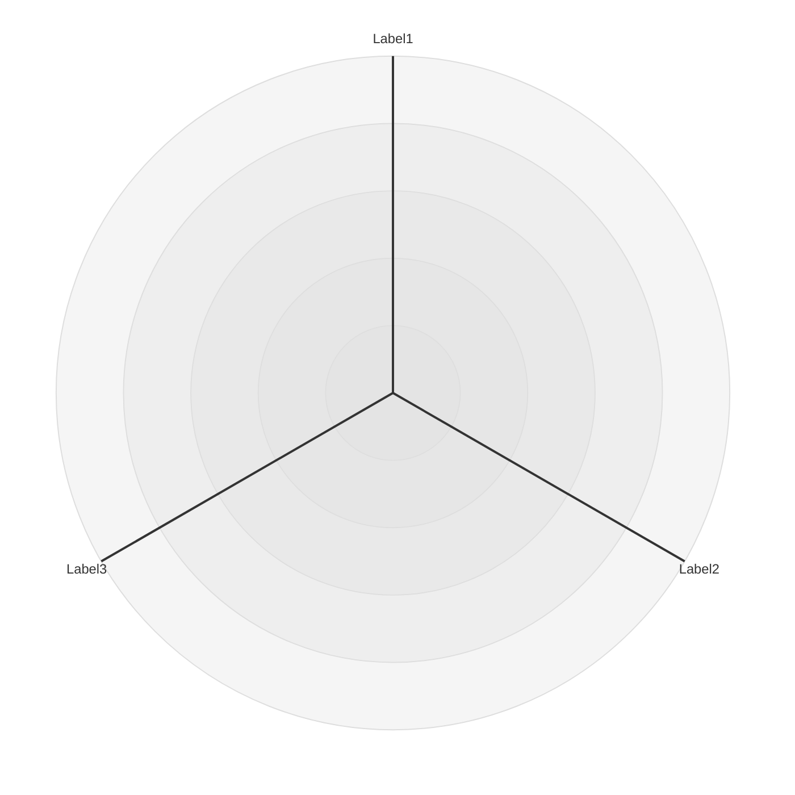
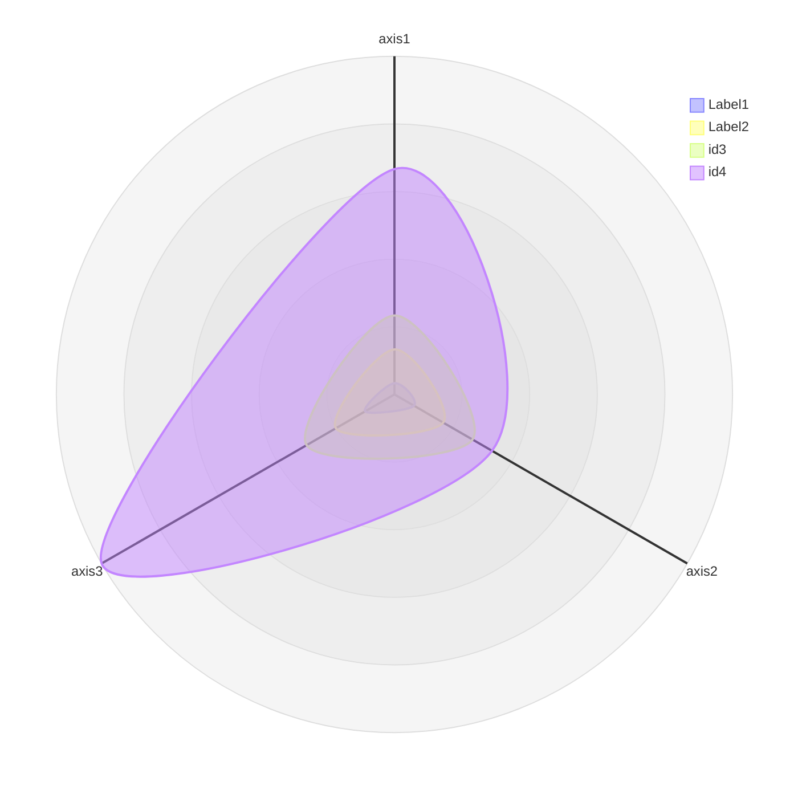
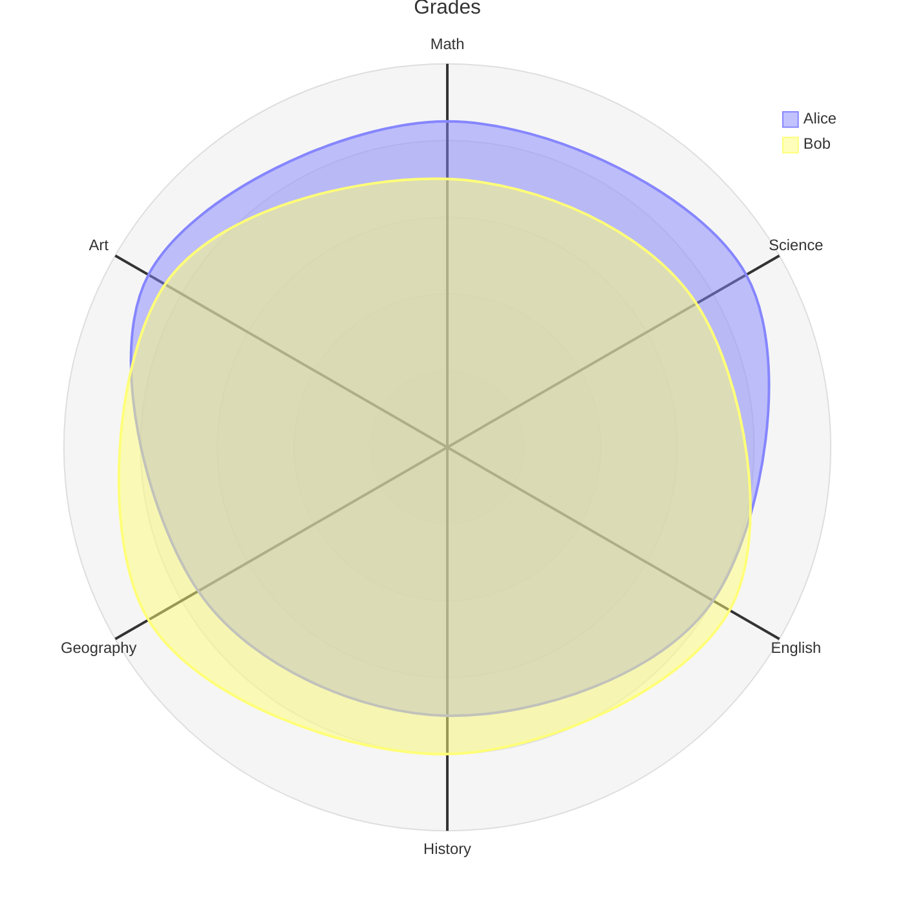
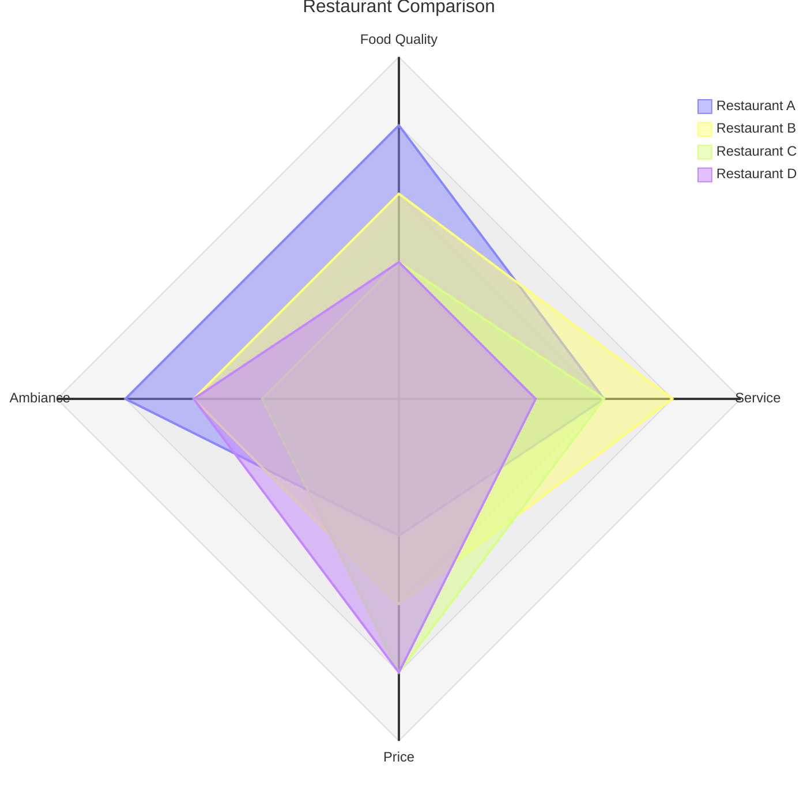
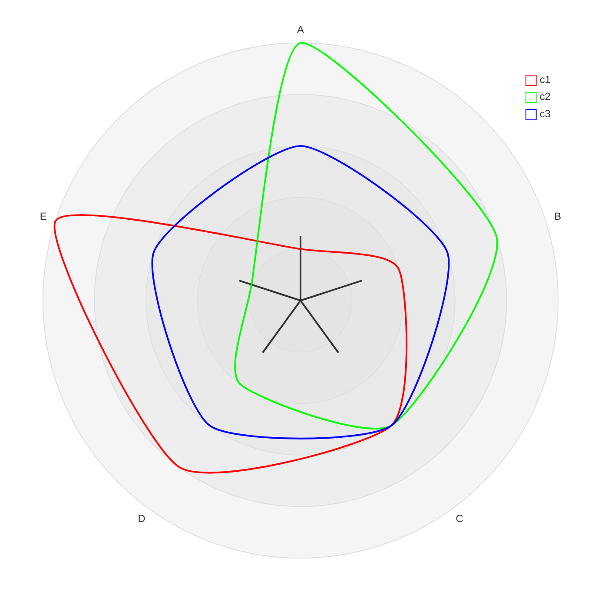

# Radar Diagram (v11.6.0+)

A radar diagram (also called a radar chart, spider chart, star chart, cobweb chart, polar chart, or Kiviat diagram) is a simple way to plot low‑dimensional data in a circular format.  
It is especially useful for developers, data scientists, and engineers who need to compare the performance of multiple entities across multiple dimensions.

---

## 1.  Syntax Overview


| Keyword | Description |
|--------|------------|
| `title` | Optional title rendered at the top of the diagram. |
| `axis` | Defines an axis. Each axis has an ID and an optional label. |
| `curve` | Defines a data series. Each curve has an ID, an optional label, and a list of values. |
| `showLegend` | Show/hide the legend (default: `true`). |
| `max` | Maximum value for scaling. |
| `min` | Minimum value for scaling (default: `0`). |
| `graticule` | Graticule type: `circle` or `polygon` (default: `circle`). |
| `ticks` | Number of concentric circles/polygons (default: `5`). |

---

## 2.  Axis



Multiple axes can be defined on a single line.

---

## 3.  Curve



* If values are listed in order, they are matched to the axes in the order they were defined.  
* Key‑value pairs can be used to specify values for specific axes.

---

## 4.  Options

| Option | Description | Default |
|-------|------------|--------|
| `showLegend` | Show or hide the legend. | `true` |
| `max` | Maximum value for scaling. | Calculated from data if omitted. |
| `min` | Minimum value for scaling. | `0` |
| `graticule` | Graticule type (`circle` or `polygon`). | `circle` |
| `ticks` | Number of concentric circles/polygons. | `5` |

---

## 5.  Configuration

Refer to the [configuration guide](#) for details.  
Typical parameters:

| Parameter | Description | Default |
|----------|------------|--------|
| `width` | Diagram width | `600` |
| `height` | Diagram height | `600` |
| `marginTop` | Top margin | `50` |
| `marginBottom` | Bottom margin | `50` |
| `marginLeft` | Left margin | `50` |
| `marginRight` | Right margin | `50` |
| `axisScaleFactor` | Axis scale factor | `1` |
| `axisLabelFactor` | Axis label position factor | `1.05` |
| `curveTension` | Rounded curve tension | `0.17` |

---

## 6.  Theme Variables

### Global Theme Variables

```yaml
config:
  themeVariables:
    cScale0: "#FF0000"
    cScale1: "#00FF00"
```

Radar charts support color scales `cScale${i}` where `i` ranges from `0` to the maximum number of colors in the theme (usually 12).

### Radar‑Specific Variables

```yaml
config:
  themeVariables:
    radar:
      axisColor: "#FF0000"
      axisStrokeWidth: 1
      axisLabelFontSize: 12px
      curveOpacity: 0.7
      curveStrokeWidth: 2
      graticuleColor: "#000000"
      graticuleOpacity: 0.5
      graticuleStrokeWidth: 1
      legendBoxSize: 10
      legendFontSize: 14px
```

---

## 7.  Examples

### 7.1  Grades



### 7.2  Restaurant Comparison



### 7.3  Custom Configuration



---

## 8.  Further Reading

* [Mermaid API Configuration](#)
* [Mermaid CLI](#)
* [FAQ](#)

---