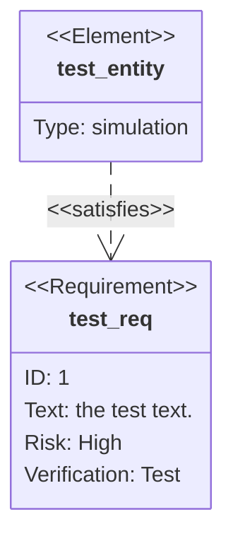
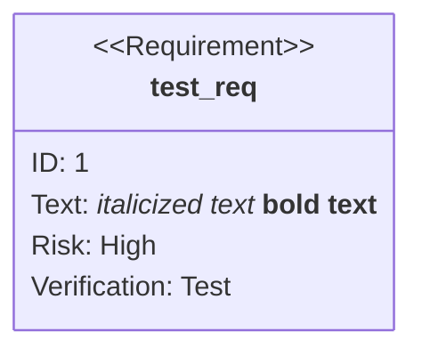
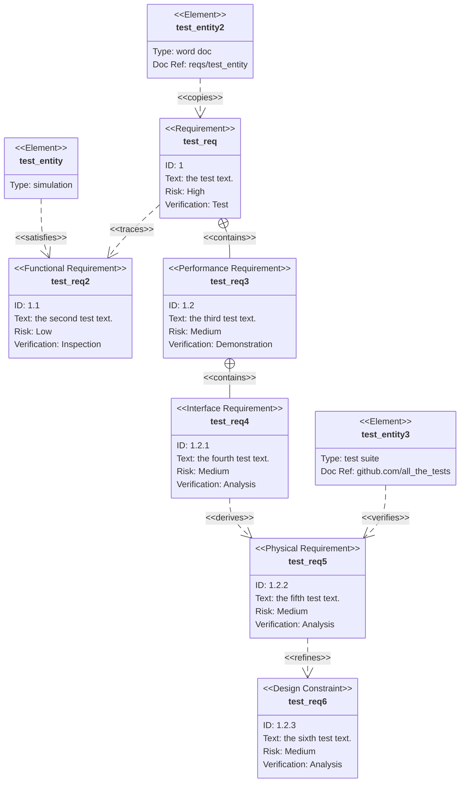
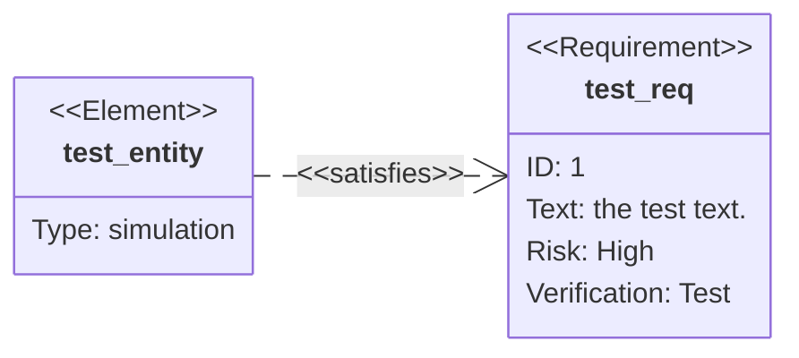
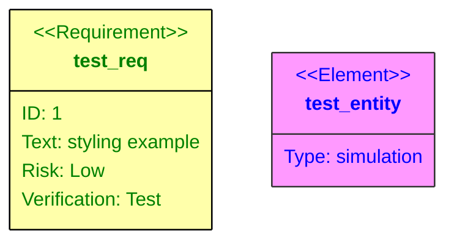
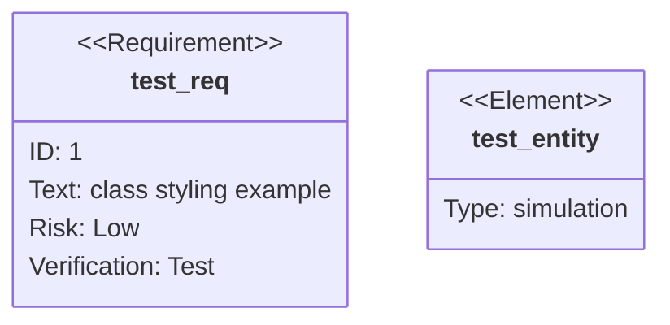
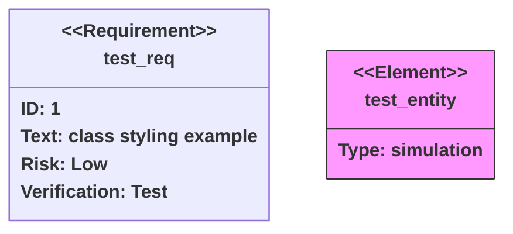

# Mermaid Requirement Diagram Documentation

Mermaid’s **Requirement Diagram** visualises SysML‑style requirements and their relationships to other elements.  
The syntax follows the SysML v1.6 specification and is intentionally lightweight.

---

## 1. Overview

A requirement diagram contains three kinds of nodes:

| Node type | Description |
|----------|------------|
| **Requirement** | A SysML requirement (functional, interface, performance, etc.) |
| **Element** | A lightweight reference to a document or artefact |
| **Relationship** | A directed link between two nodes |

---

## 2. Syntax

```mermaid
requirementDiagram
```

### 2.1 Requirement

```mermaid
requirement <name> {
    id: <id>
    text: <text>
    risk: <risk>
    verifymethod: <method>
}
```

| Keyword | Allowed values |
|--------|---------------|
| `type` | `requirement`, `functionalRequirement`, `interfaceRequirement`, `performanceRequirement`, `physicalRequirement`, `designConstraint` |
| `risk` | `Low`, `Medium`, `High` |
| `verifymethod` | `Analysis`, `Inspection`, `Test`, `Demonstration` |

> **Note** – All identifiers (`name`, `id`, `text`) may be quoted or unquoted.  
> If you use unquoted text, avoid keywords that could be parsed as a new directive.

### 2.2 Element

```mermaid
element <name> {
    type: <type>
    docref: <reference>
}
```

Both `type` and `docref` are user‑defined strings.

### 2.3 Relationship

```mermaid
{source} - <type> -> {destination}
```

or

```mermaid
{destination} <- <type> - {source}
```

Relationship types:

| Type | Meaning |
|-----|--------|
| `contains` | A requirement contains another |
| `copies` | One requirement copies another |
| `derives` | One requirement derives from another |
| `satisfies` | An element satisfies a requirement |
| `verifies` | An element verifies a requirement |
| `refines` | One requirement refines another |
| `traces` | One requirement traces another |

---

## 3. Examples

### 3.1 Minimal Diagram



### 3.2 Markdown Formatting in Text



### 3.3 Full Feature Set



### 3.4 Direction



---

## 4. Styling

### 4.1 Direct Styling



### 4.2 Class Definitions



### 4.3 Default Class

```mermaid
requirementDiagram

classDef default fill:#f9f,stroke:#333,stroke-width:4px;
```

### 4.4 Applying Classes



---

## 5. Summary

- **Nodes**: `requirement`, `element`, `relationship`
- **Relationships**: `contains`, `copies`, `derives`, `satisfies`, `verifies`, `refines`, `traces`
- **Styling**: Direct `style` or reusable `classDef` + `class`/`:::` syntax
- **Direction**: `TB`, `BT`, `LR`, `RL`

Use the examples above as templates for your own requirement diagrams. Happy diagramming!