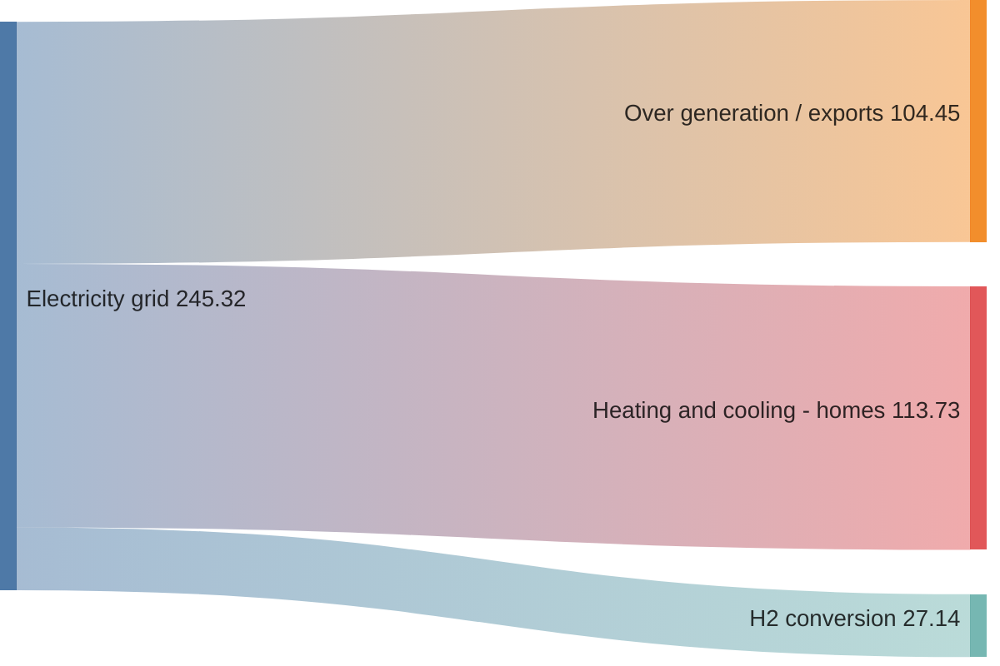
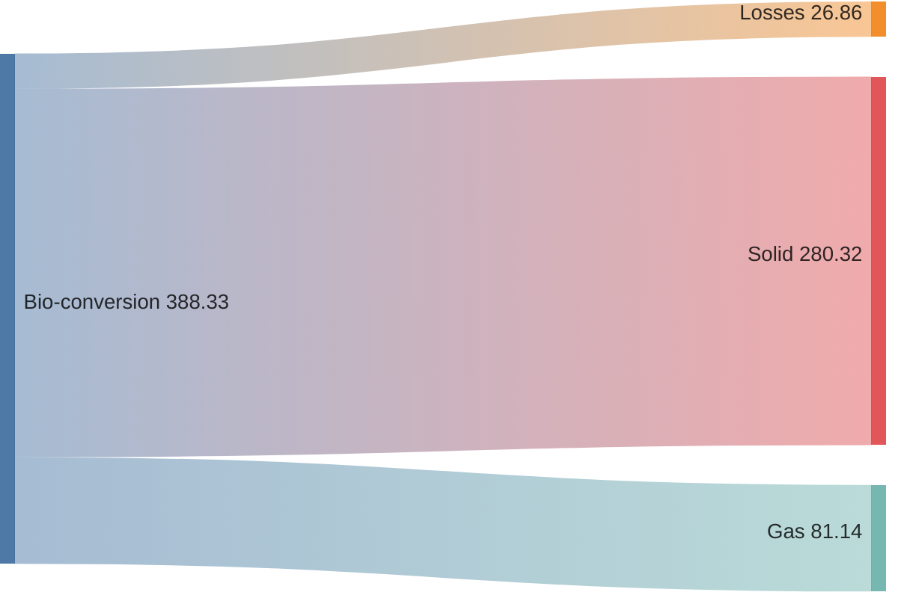
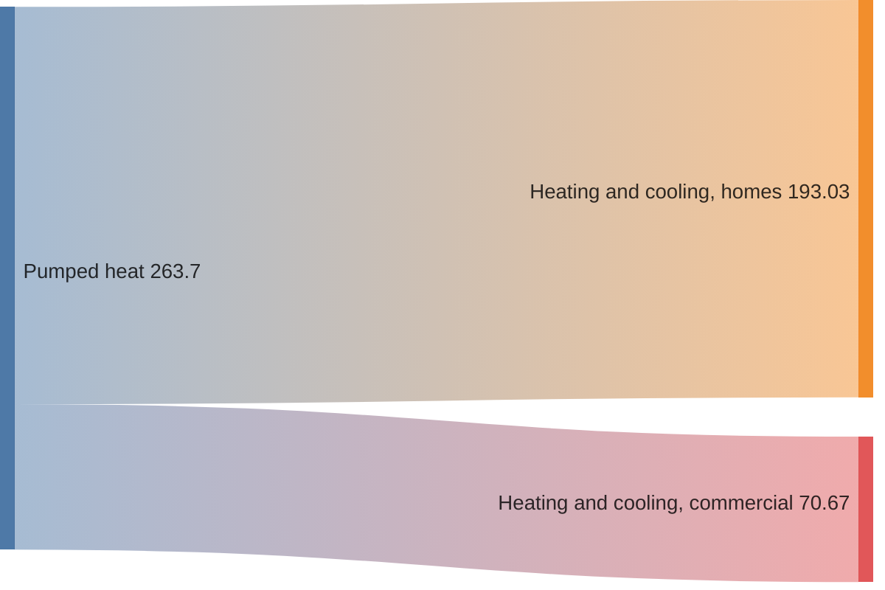
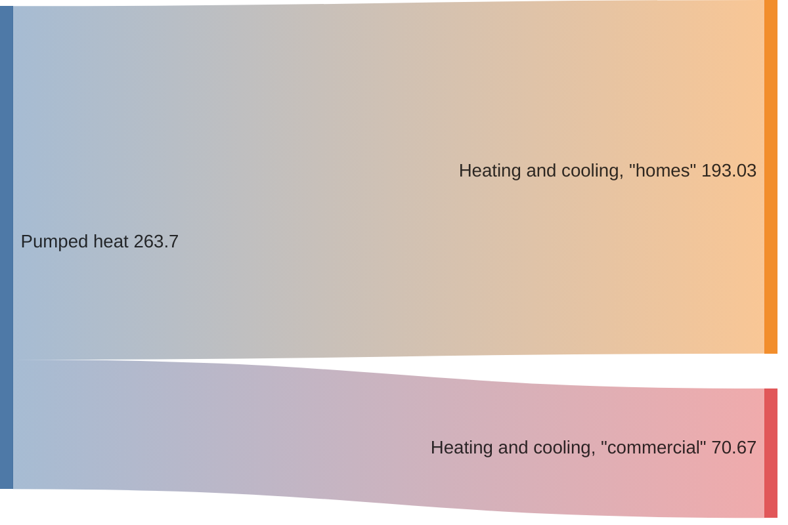
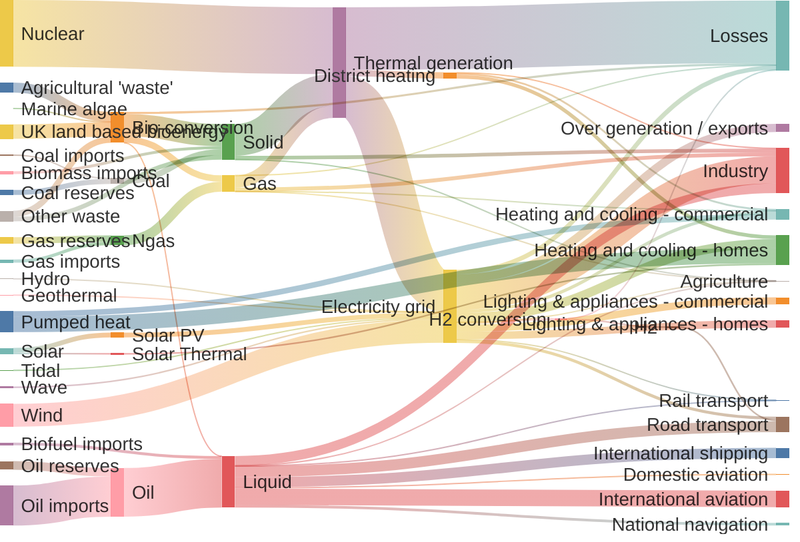

# Mermaid Sankey Diagram Documentation

> **Note** – The Sankey diagram is an experimental feature in Mermaid (v10.3.0+).  
> Its syntax is close to plain CSV and will be extended in the future.

---

## 1. Overview

A Sankey diagram visualises flows from one set of values to another.  
In Mermaid the diagram is created with the `sankey-beta` keyword followed by CSV‑style data.

---

## 2. Syntax



* **Three columns only** – `source`, `target`, `value`.  
* Empty lines are allowed for readability.  
* Commas inside a node name must be wrapped in double quotes.  
* Double quotes inside a quoted string are escaped by doubling them.

---

## 3. Examples

### 3.1 Basic Example


### 3.2 Empty Lines



### 3.3 Commas in Node Names



### 3.4 Double Quotes in Node Names



### 3.5 Full Example (from Observable)



---

## 4. Configuration

You can customise the diagram via Mermaid’s configuration API.

```html
<script>
  const config = {
    startOnLoad: true,
    securityLevel: 'loose',
    sankey: {
      width: 800,
      height: 400,
      linkColor: 'source',   // source | target | gradient | hex
      nodeAlignment: 'left', // justify | center | left | right
    },
  };
  mermaid.initialize(config);
</script>
```

### 4.1 Link Coloring

| `linkColor` value | Effect |
|------------------|--------|
| `source` | Link adopts the source node’s color |
| `target` | Link adopts the target node’s color |
| `gradient` | Link shows a gradient between source and target colors |
| `#hexcode` | Custom hex color |

### 4.2 Node Alignment

| `nodeAlignment` | Layout |
|-----------------|-------|
| `justify` | Nodes spread evenly |
| `center` | Nodes centered |
| `left` | Nodes left‑aligned |
| `right` | Nodes right‑aligned |

---

## 5. FAQ

* **Can I use more than three columns?**  
  No – the CSV must contain exactly three columns: source, target, value.

* **Can I hide node values?**  
  Yes, set `showValues: false` in the diagram configuration.

* **Is the Sankey diagram stable?**  
  It is experimental; expect future changes.

---

**Happy diagramming!**