# Mermaid Sequence Diagram Documentation

> **Note** – All examples from the original Mermaid documentation are preserved verbatim.

---

## 1. Overview

A **sequence diagram** is an interaction diagram that shows how processes operate with one another and in what order.  
Mermaid can render sequence diagrams using the `sequenceDiagram` keyword.

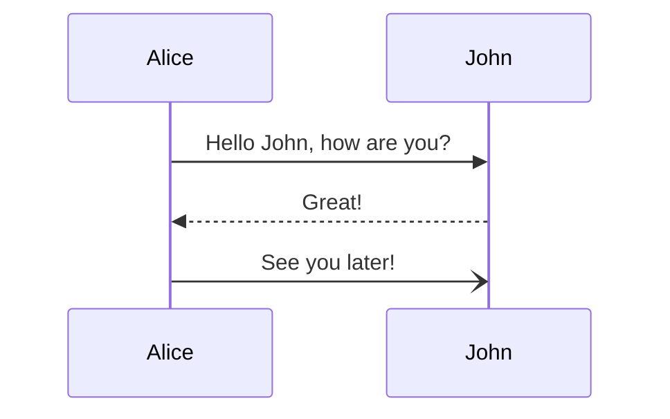
```mermaid
sequenceDiagram
    Alice->>John: Hello John, how are you?
    John-->>Alice: Great!
    Alice-)John: See you later!
```

---

## 2. Syntax

### 2.1 Participants

Participants can be declared implicitly or explicitly.

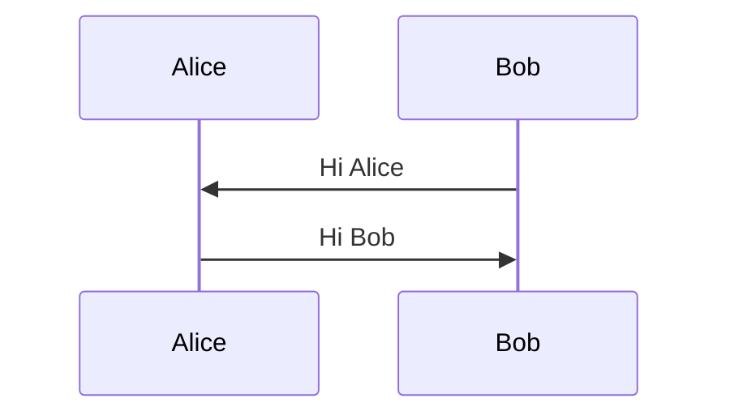
```mermaid
sequenceDiagram
    participant Alice
    participant Bob
    Bob->>Alice: Hi Alice
    Alice->>Bob: Hi Bob
```

If you want a different order than the appearance order, declare them first.

### 2.2 Actors

Use the `actor` keyword to render an actor symbol instead of a rectangle.

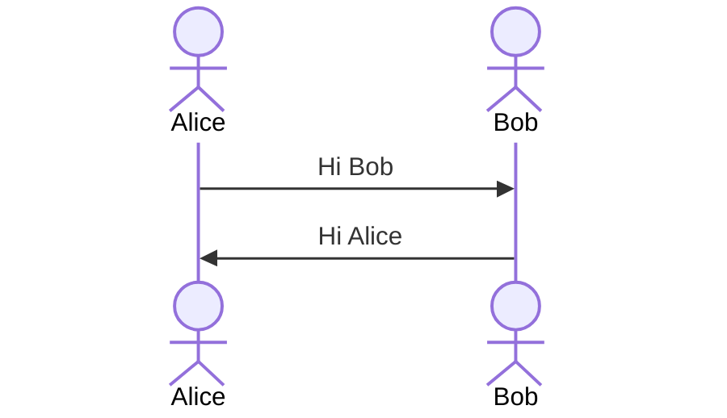
```mermaid
sequenceDiagram
    actor Alice
    actor Bob
    Alice->>Bob: Hi Bob
    Bob->>Alice: Hi Alice
```

### 2.3 Aliases

Give a participant a convenient identifier and a descriptive label.

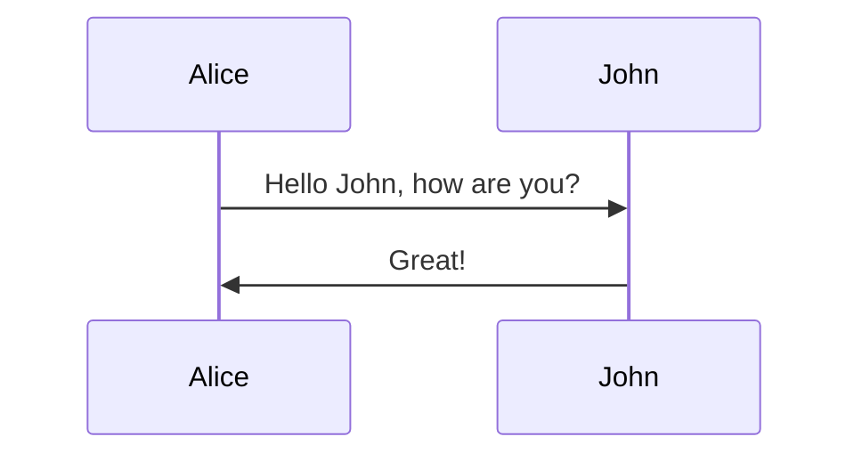
```mermaid
sequenceDiagram
    participant A as Alice
    participant J as John
    A->>J: Hello John, how are you?
    J->>A: Great!
```

### 2.4 Actor Creation & Destruction (v10.3.0+)

Create or destroy actors with directives.

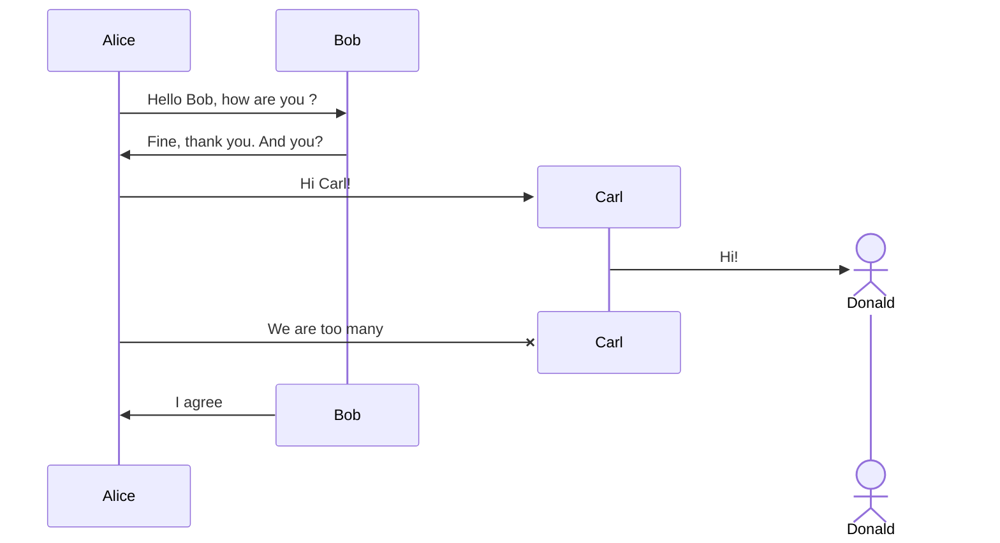
```mermaid
sequenceDiagram
    Alice->>Bob: Hello Bob, how are you ?
    Bob->>Alice: Fine, thank you. And you?
    create participant Carl
    Alice->>Carl: Hi Carl!
    create actor D as Donald
    Carl->>D: Hi!
    destroy Carl
    Alice-xCarl: We are too many
    destroy Bob
    Bob->>Alice: I agree
```

> **Error** – If you receive  
> `The destroyed participant participant-name does not have an associated destroying message after its declaration.`  
> Update Mermaid to **v10.7.0+**.

### 2.5 Grouping / Box

Group actors vertically with optional color and description.

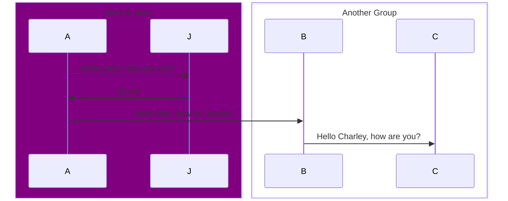
```mermaid
sequenceDiagram
    box Purple Alice & John
    participant A
    participant J
    end
    box Another Group
    participant B
    participant C
    end
    A->>J: Hello John, how are you?
    J->>A: Great!
    A->>B: Hello Bob, how is Charley?
    B->>C: Hello Charley, how are you?
```

---

## 3. Messages

Messages are written as:

```
[Actor][Arrow][Actor]:Message text
```

### 3.1 Arrow Types

| Arrow | Description |
|------|-------------|
| `->` | Solid line without arrow |
| `-->` | Dotted line without arrow |
| `->>` | Solid line with arrowhead |
| `-->>` | Dotted line with arrowhead |
| `<<->>` | Solid line with bidirectional arrowheads (v11.0.0+) |
| `<<-->>` | Dotted line with bidirectional arrowheads (v11.0.0+) |
| `-x` | Solid line with a cross at the end |
| `--x` | Dotted line with a cross at the end |
| `-)` | Solid line with an open arrow at the end (async) |
| `--)` | Dotted line with an open arrow at the end (async) |

### 3.2 Activations

Activate/deactivate an actor:

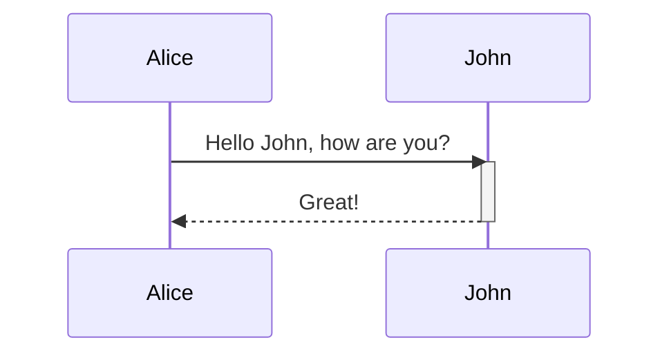
```mermaid
sequenceDiagram
    Alice->>John: Hello John, how are you?
    activate John
    John-->>Alice: Great!
    deactivate John
```

Shortcut notation:

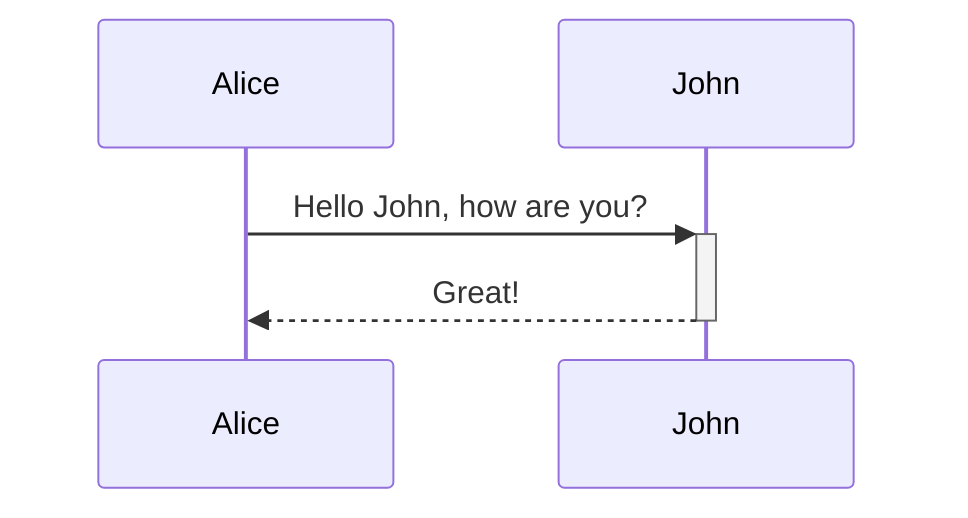
```mermaid
sequenceDiagram
    Alice->>+John: Hello John, how are you?
    John-->>-Alice: Great!
```

Activations can be stacked:

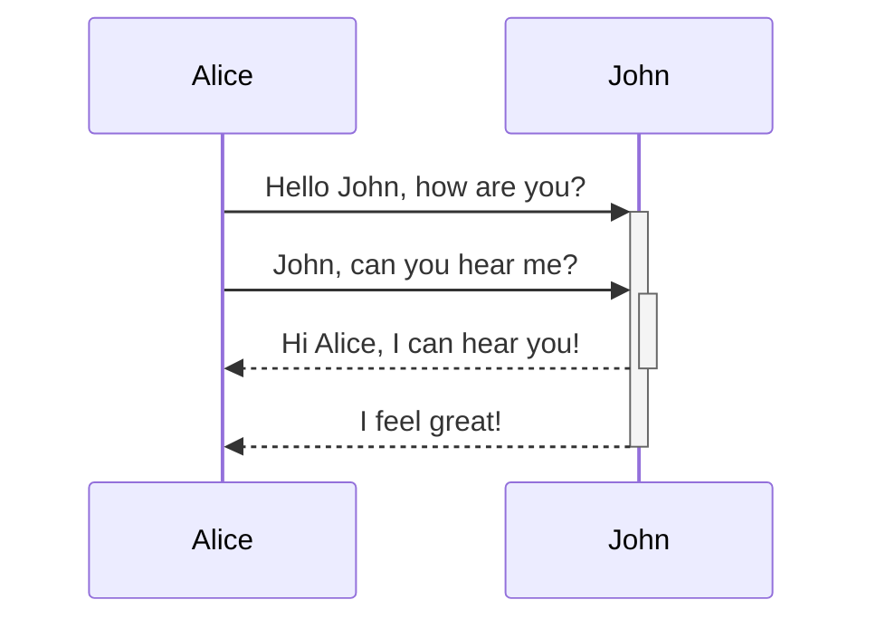
```mermaid
sequenceDiagram
    Alice->>+John: Hello John, how are you?
    Alice->>+John: John, can you hear me?
    John-->>-Alice: Hi Alice, I can hear you!
    John-->>-Alice: I feel great!
```

---

## 4. Notes

Add notes to a diagram:

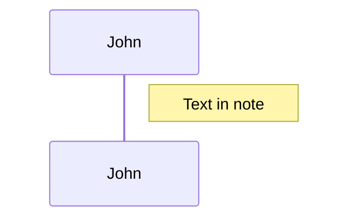
```mermaid
sequenceDiagram
    participant John
    Note right of John: Text in note
```

Spanning two participants:

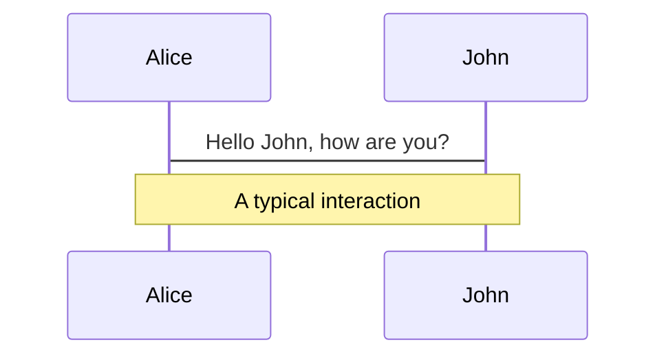
```mermaid
sequenceDiagram
    Alice->John: Hello John, how are you?
    Note over Alice,John: A typical interaction
```

Line breaks can be inserted with `<br/>`:

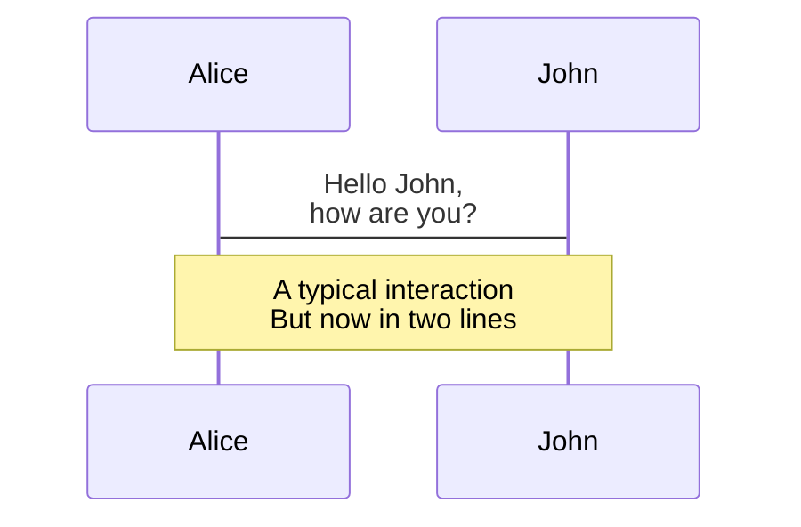
```mermaid
sequenceDiagram
    Alice->John: Hello John,<br/>how are you?
    Note over Alice,John: A typical interaction<br/>But now in two lines
```

---

## 5. Loops

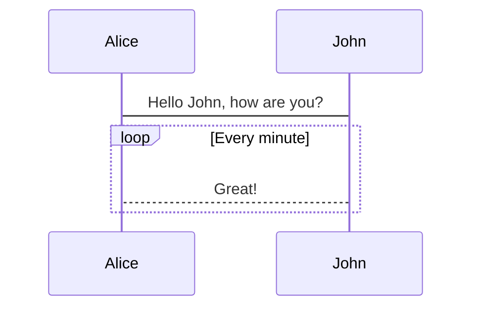
```mermaid
sequenceDiagram
    Alice->John: Hello John, how are you?
    loop Every minute
        John-->Alice: Great!
    end
```

---

## 6. Alternatives

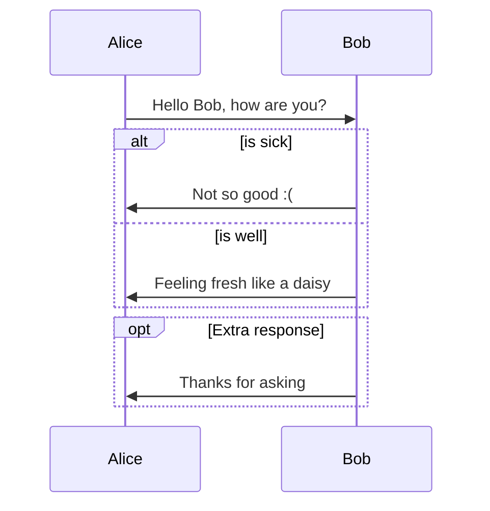
```mermaid
sequenceDiagram
    Alice->>Bob: Hello Bob, how are you?
    alt is sick
        Bob->>Alice: Not so good :(
    else is well
        Bob->>Alice: Feeling fresh like a daisy
    end
    opt Extra response
        Bob->>Alice: Thanks for asking
    end
```

---

## 7. Parallel

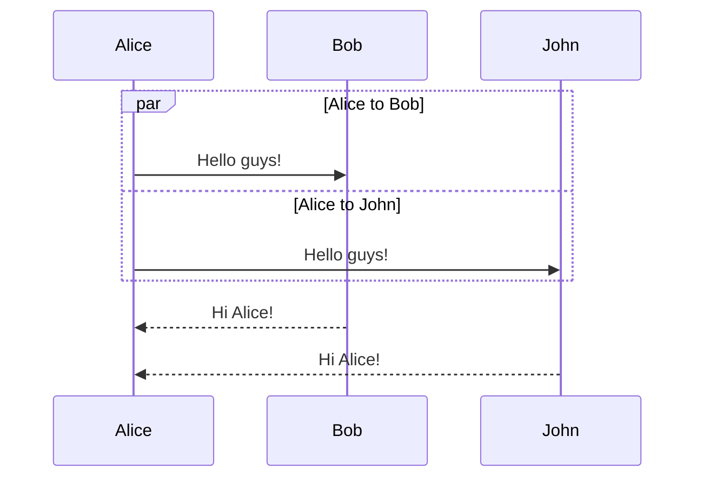
```mermaid
sequenceDiagram
    par Alice to Bob
        Alice->>Bob: Hello guys!
    and Alice to John
        Alice->>John: Hello guys!
    end
    Bob-->>Alice: Hi Alice!
    John-->>Alice: Hi Alice!
```

Nested parallel blocks are also supported.

---

## 8. Critical Region

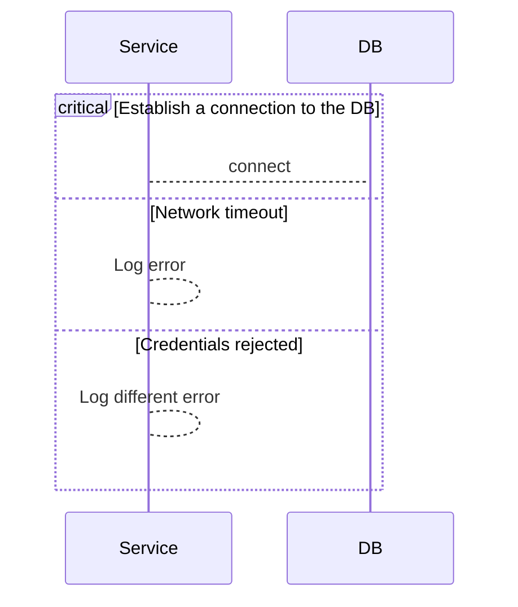
```mermaid
sequenceDiagram
    critical Establish a connection to the DB
        Service-->DB: connect
    option Network timeout
        Service-->Service: Log error
    option Credentials rejected
        Service-->Service: Log different error
    end
```

---

## 9. Break

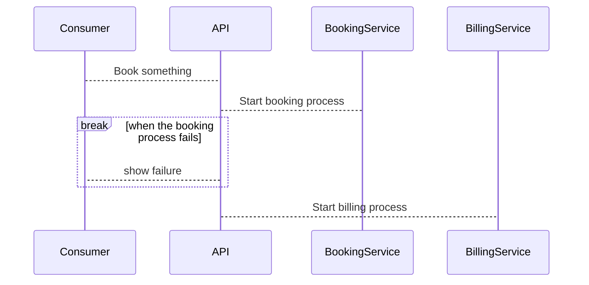
```mermaid
sequenceDiagram
    Consumer-->API: Book something
    API-->BookingService: Start booking process
    break when the booking process fails
        API-->Consumer: show failure
    end
    API-->BillingService: Start billing process
```

---

## 10. Background Highlighting

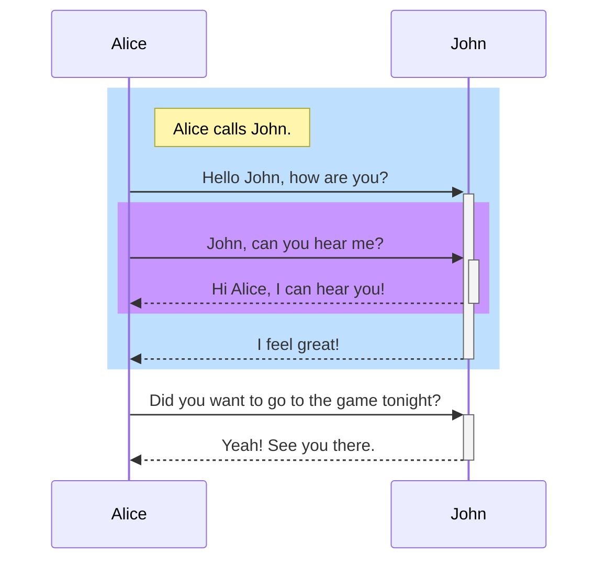
```mermaid
sequenceDiagram
    participant Alice
    participant John

    rect rgb(191, 223, 255)
    note right of Alice: Alice calls John.
    Alice->>+John: Hello John, how are you?
    rect rgb(200, 150, 255)
    Alice->>+John: John, can you hear me?
    John-->>-Alice: Hi Alice, I can hear you!
    end
    John-->>-Alice: I feel great!
    end
    Alice ->>+ John: Did you want to go to the game tonight?
    John -->>- Alice: Yeah! See you there.
```

---

## 11. Comments

Comments are ignored by the parser. They must start with `%%` and occupy a whole line.

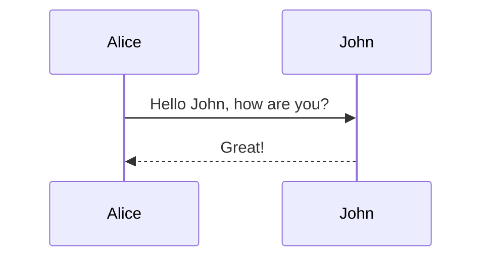
```mermaid
sequenceDiagram
    Alice->>John: Hello John, how are you?
    %% this is a comment
    John-->>Alice: Great!
```

---

## 12. Escaping Characters

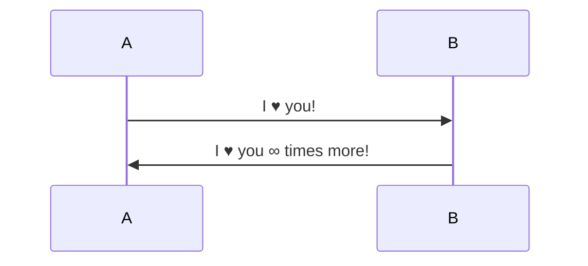
```mermaid
sequenceDiagram
    A->>B: I #9829; you!
    B->>A: I #9829; you #infin; times more!
```

Use `#59;` to include a semicolon in message text.

---

## 13. Sequence Numbers

Turn on sequence numbers:

```mermaid
sequenceDiagram
    autonumber
    Alice->>John: Hello John, how are you?
    loop HealthCheck
        John->>John: Fight against hypochondria
    end
    Note right of John: Rational thoughts!
    John-->>Alice: Great!
    John->>Bob: How about you?
    Bob-->>John: Jolly good!
```

---

## 14. Actor Menus

Add popup‑menus to actors.

```mermaid
sequenceDiagram
    participant Alice
    participant John
    link Alice: Dashboard @ https://dashboard.contoso.com/alice
    link Alice: Wiki @ https://wiki.contoso.com/alice
    link John: Dashboard @ https://dashboard.contoso.com/john
    link John: Wiki @ https://wiki.contoso.com/john
    Alice->>John: Hello John, how are you?
    John-->>Alice: Great!
    Alice-)John: See you later!
```

Advanced JSON syntax:

```mermaid
sequenceDiagram
    participant Alice
    participant John
    links Alice: {"Dashboard": "https://dashboard.contoso.com/alice", "Wiki": "https://wiki.contoso.com/alice"}
    links John: {"Dashboard": "https://dashboard.contoso.com/john", "Wiki": "https://wiki.contoso.com/john"}
    Alice->>John: Hello John, how are you?
    John-->>Alice: Great!
    Alice-)John: See you later!
```

---

## 15. Styling

Classes are defined in `src/themes/sequence.scss`.  
Key classes:

| Class | Description |
|------|------------|
| `actor` | Actor box |
| `actor-top` | Actor figure at top |
| `actor-bottom` | Actor figure at bottom |
| `text.actor` | Actor text |
| `actor-line` | Vertical line for actor |
| `messageLine0` | Solid message line |
| `messageLine1` | Dotted message line |
| `messageText` | Message text |
| `note` | Note box |
| `noteText` | Note text |
| `loopText` | Loop text |
| ... | (see full list in original docs) |

Sample stylesheet:

```css
body {
  background: white;
}

.actor {
  stroke: #ccccff;
  fill: #ececff;
}
text.actor {
  fill: black;
  stroke: none;
  font-family: Helvetica;
}
...
```

---

## 16. Configuration

Adjust rendering margins via `mermaid.sequenceConfig` or CLI JSON.

```javascript
mermaid.sequenceConfig = {
  diagramMarginX: 50,
  diagramMarginY: 10,
  boxTextMargin: 5,
  noteMargin: 10,
  messageMargin: 35,
  mirrorActors: true,
};
```

Possible parameters:

| Parameter | Description | Default |
|----------|------------|--------|
| `mirrorActors` | Render actors below the diagram | `false` |
| `bottomMarginAdj` | Adjust bottom margin | `1` |
| `actorFontSize` | Font size for actor description | `14` |
| `actorFontFamily` | Font family for actor description | `"Open Sans", sans-serif` |
| `noteFontSize` | Font size for actor‑attached notes | `14` |
| `messageFontSize` | Font size for messages | `16` |
| ... | (see full list in original docs) |

---

### End of Documentation

All examples from the original Mermaid documentation have been retained and formatted for clarity.