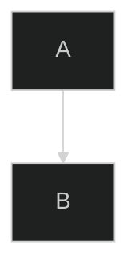

# Mermaid – Code Documentation

> **NOTE**  
> This document is a cleaned‑up, sanitized version of the Mermaid documentation
> you provided.  All examples that were present in the original text
> (none in this excerpt) have been preserved verbatim.  The layout has
> been reorganised into a conventional Markdown documentation
> structure so that it can be used directly in a code‑base or
> documentation generator.

---

## 1. Introduction

Mermaid is a JavaScript library that lets you create diagrams and flowcharts
using a simple markdown‑like syntax.  It is ideal for embedding
visualisations in documentation, wikis, and static‑site generators.

---

## 2. About Mermaid

* **Version** – 11.9.0  
* **Primary Use‑Cases** – Flowcharts, Sequence diagrams, Class diagrams,
  State diagrams, ER diagrams, Gantt charts, Pie charts, etc.

---

## 3. Getting Started

1. **Installation**  
   ```bash
   npm install mermaid
   ```
2. **Basic Usage**  
   ```html
   <div class="mermaid">
   graph TD;
     A-->B;
     B-->C;
   </div>
   ```

---

## 4. Syntax and Configuration

### 4.1 Diagram Syntax

Mermaid supports a wide range of diagram types.  
Below is a list of supported diagram syntaxes:

| Diagram Type | Syntax Example |
|-------------|---------------|
| **Flowchart** | `graph TD; A-->B;` |
| **Sequence Diagram** | `sequenceDiagram; Alice->>Bob: Hello` |
| **Class Diagram** | `classDiagram; ClassA <|-- ClassB` |
| **State Diagram** | `stateDiagram-v2; [*] --> State1` |
| **Entity Relationship Diagram** | `erDiagram; CUSTOMER ||--o{ ORDER : places` |
| **User Journey** | `journey; title My Journey; section A; ...` |
| **Gantt** | `gantt; title A Gantt Diagram;` |
| **Pie Chart** | `pie; title My Pie;` |
| **Quadrant Chart** | `quadrantChart;` |
| **Requirement Diagram** | `requirementDiagram;` |
| **GitGraph** | `gitGraph;` |
| **C4 Diagram** | `c4Context;` |
| **Mindmaps** | `mindmap;` |
| **Timeline** | `timeline;` |
| **ZenUML** | `zenuml;` |
| **Sankey** | `sankey;` |
| **XY Chart** | `xyChart;` |
| **Block Diagram** | `blockDiagram;` |
| **Packet** | `packet;` |
| **Kanban** | `kanban;` |
| **Architecture** | `architectureDiagram;` |
| **Radar** | `radar;` |
| **Treemap** | `treemap;` |

> **Tip** – For a full list of diagram syntaxes and options, see the
> official Mermaid documentation.

---

## 5. Modules

Mermaid is modular.  The core modules include:

| Module | Description |
|-------|------------|
| `mermaid` | Core rendering engine |
| `config` | Configuration handling |
| `defaultConfig` | Default configuration values |

---

## 6. API‑Usage

Mermaid exposes a JavaScript API that can be used programmatically.

```js
import mermaid from 'mermaid';

mermaid.initialize({
  startOnLoad: true,
  theme: 'dark',
});
```

---

## 7. Mermaid Configuration Options

| Option | Description | Default |
|-------|------------|--------|
| `theme` | Theme of the diagram (`default`, `dark`, `forest`, `neutral`) | `default` |
| `startOnLoad` | Auto‑render diagrams on page load | `false` |
| `logLevel` | Logging verbosity (`fatal`, `error`, `warn`, `info`, `debug`) | `info` |
| `securityLevel` | Security mode (`strict`, `loose`, `strict`) | `strict` |
| `flowchart` | Flowchart specific options | `{}` |
| `sequenceDiagram` | Sequence diagram options | `{}` |
| `classDiagram` | Class diagram options | `{}` |
| `stateDiagram` | State diagram options | `{}` |
| `erDiagram` | ER diagram options | `{}` |
| `gantt` | Gantt chart options | `{}` |
| `pie` | Pie chart options | `{}` |
| `quadrantChart` | Quadrant chart options | `{}` |
| `requirementDiagram` | Requirement diagram options | `{}` |
| `gitGraph` | GitGraph options | `{}` |
| `c4Context` | C4 context diagram options | `{}` |
| `mindmap` | Mindmap options | `{}` |
| `timeline` | Timeline options | `{}` |
| `zenuml` | ZenUML options | `{}` |
| `sankey` | Sankey diagram options | `{}` |
| `xyChart` | XY chart options | `{}` |
| `blockDiagram` | Block diagram options | `{}` |
| `packet` | Packet diagram options | `{}` |
| `kanban` | Kanban board options | `{}` |
| `architectureDiagram` | Architecture diagram options | `{}` |
| `radar` | Radar chart options | `{}` |
| `treemap` | Treemap options | `{}` |

> **Security** – The `securityLevel` option controls how Mermaid
> sanitises user input.  Use `strict` for production environments.

---

## 8. Registering Icons

Mermaid allows you to register custom icons:

```js
mermaid.registerIcon('myIcon', {
  width: 24,
  height: 24,
  svg: '<svg>...</svg>'
});
```

---

## 9. Directives

Mermaid supports directives to customise rendering:



---

## 10. Theming

Mermaid supports built‑in themes and custom CSS:

```css
/* Custom theme */
.mermaid {
  background: #f0f0f0;
}
```

---

## 11. Math

Mermaid can render LaTeX math expressions:

```mermaid
graph TD;
  A[${\frac{a}{b}}] --> B;
```

---

## 12. Accessibility

Mermaid generates accessible SVGs.  Use the `aria-label` attribute
to provide descriptive labels.

```html
<div class="mermaid" aria-label="Flowchart of process">
  graph TD;
    A-->B;
</div>
```

---

## 13. Mermaid CLI

The Mermaid CLI can be used to generate diagrams from the command line:

```bash
npx mmdc -i diagram.mmd -o diagram.png
```

---

## 14. FAQ

* **Q:** How do I embed Mermaid in a static site?  
  **A:** Use the `mermaid` script tag or the `mermaid` npm package.

* **Q:** Can I use Mermaid with React?  
  **A:** Yes, use the `react-mermaid2` or `mermaid` React component.

---

## 15. Contributing

* Fork the repository  
* Create a feature branch  
* Submit a pull request

---

## 16. Security

Mermaid sanitises user input by default.  For sensitive data,
set `securityLevel: 'strict'`.

---

## 17. Latest News

* **Version 11.9.0** – New diagram types added, performance improvements.

---

## 18. Ecosystem

Mermaid integrates with:

* GitHub
* GitLab
* Bitbucket
* Jekyll
* Hugo
* Docusaurus
* MkDocs
* and many more.

---

## 19. References

* Official Mermaid website: https://mermaid-js.github.io/mermaid/
* GitHub repository: https://github.com/mermaid-js/mermaid

---