# Mermaid State Diagram Documentation

> This document describes how to create and style state diagrams with Mermaid.  
> All examples from the official Mermaid documentation are preserved.

---

## 1. Introduction

A **state diagram** describes the behavior of a system in terms of a finite set of states and the transitions between them.  
Mermaid’s syntax is largely compatible with PlantUML, making it easy to share diagrams between the two tools.

---

## 2. Basic Syntax

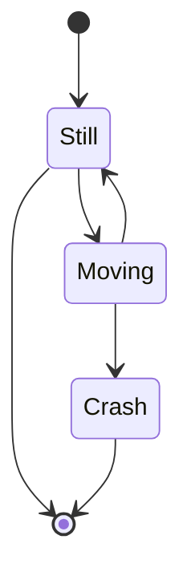

* `[*]` denotes the start or end state.  
* `-->` defines a transition.  
* `stateDiagram-v2` is the newer renderer; `stateDiagram` is the older one.

---

## 3. States

### 3.1 Simple State

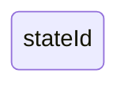

### 3.2 State with Description

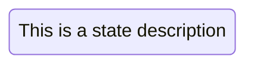

or


---

## 4. Transitions

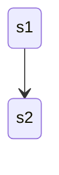

Add a label to a transition:

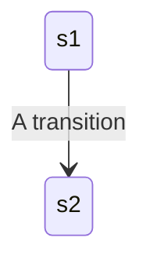

---

## 5. Start and End States

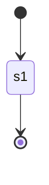

---

## 6. Composite States

Composite (nested) states are defined with the `state` keyword and a block `{}`.

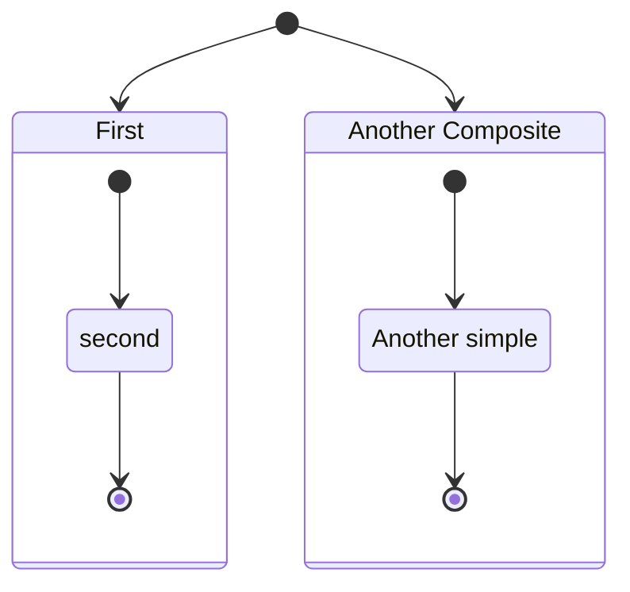

Nested composites:

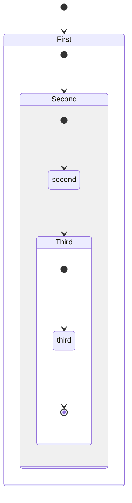

Transitions between composite states:

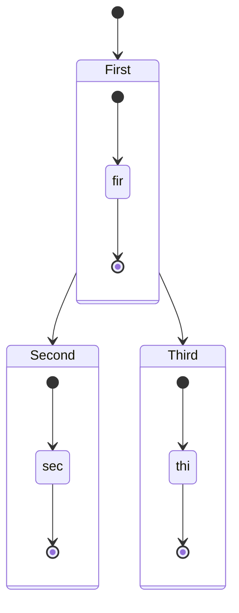

*Transitions between internal states of different composites are not allowed.*

---

## 7. Choice

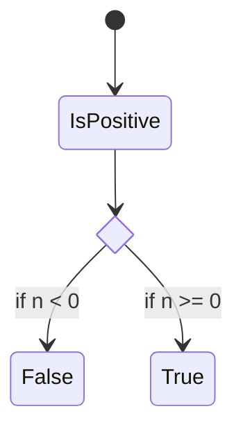

---

## 8. Forks

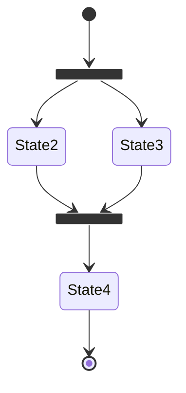

---

## 9. Notes

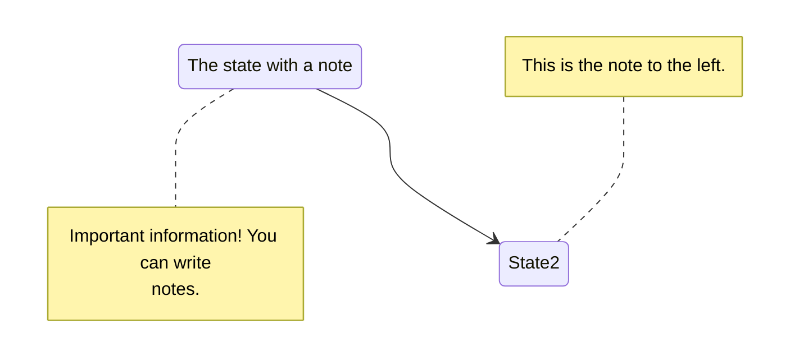

---

## 10. Concurrency

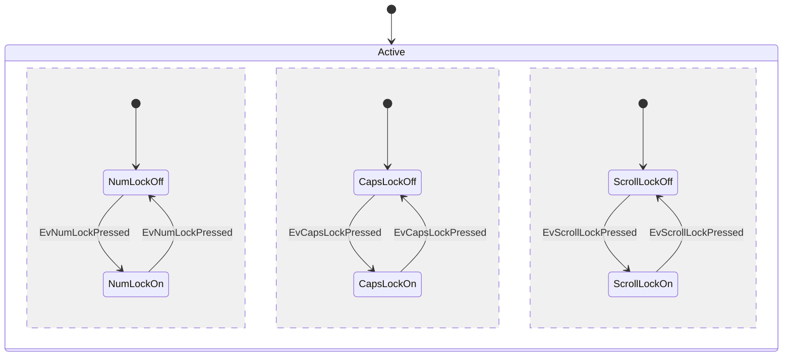

---

## 11. Direction

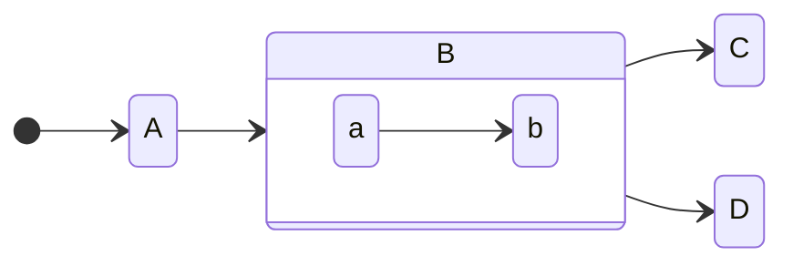

---

## 12. Comments


Comments start with `%%` and occupy the entire line.

---

## 13. Styling with `classDef`

### 13.1 Define a Style

```mermaid
classDef movement font-style:italic;
classDef badBadEvent fill:#f00,color:white,font-weight:bold,stroke-width:2px,stroke:yellow;
```

### 13.2 Apply a Style

#### 13.2.1 `class` Statement

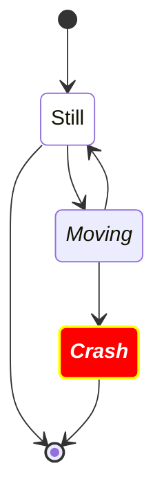

#### 13.2.2 `:::` Operator


> **Limitations**  
> * Cannot be applied to start or end states.  
> * Cannot be applied to or within composite states.  
> These restrictions are slated for removal in future releases.

---

## 14. Spaces in State Names

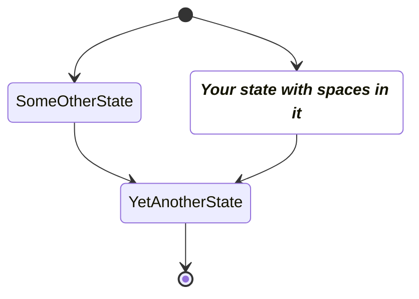

---

## 15. Summary

- **States** can be simple or composite.  
- **Transitions** are arrows (`-->`) optionally labeled.  
- **Special states**: `[*]` for start/end.  
- **Choice**, **fork**, **join**, **notes**, and **concurrency** are supported.  
- **Styling** via `classDef` and `class` or `:::`.  
- **Direction** and **comments** are available.  

Use the examples above as templates for your own Mermaid state diagrams.