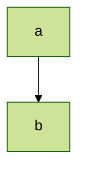
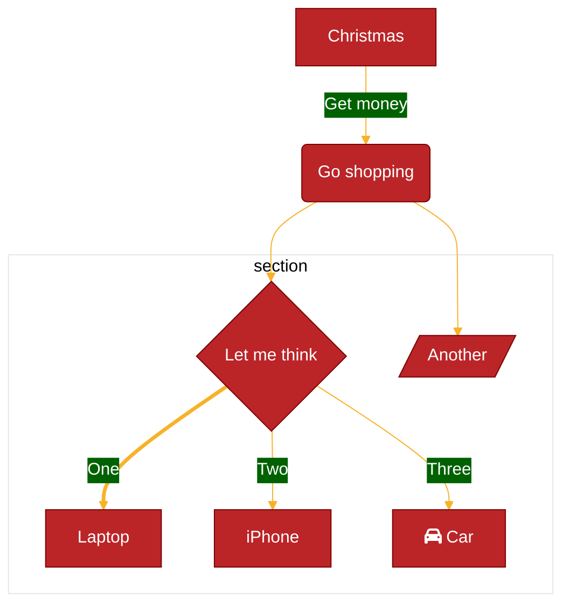

# Mermaid Theme Configuration

This guide explains how to customize Mermaid diagrams using themes and theme variables.  
All examples from the official Mermaid documentation are preserved.

---

## 1. Available Themes

| Theme | Description |
|------|------------|
| `default` | The default theme for all diagrams. |
| `neutral` | Great for black‑and‑white documents that will be printed. |
| `dark` | Designed for dark‑mode or dark‑colored elements. |
| `forest` | Contains shades of green. |
| `base` | The only theme that can be modified. Use it as the base for customizations. |

---

## 2. Site‑wide Theme

To set a theme for **all** diagrams on a page, call `mermaid.initialize`:

```js
mermaid.initialize({
  securityLevel: 'loose',
  theme: 'base',
});
```

---

## 3. Diagram‑Specific Themes

You can override the site‑wide theme for a single diagram using front‑matter configuration:



> **Note**: Only the `base` theme can be customized. The following section explains how to use `themeVariables` for customizations.

---

## 4. Customizing Themes with `themeVariables`

To create a custom theme, modify `themeVariables` via front‑matter.  
The base theme must be used.

| Variable | Type | Description |
|---------|------|------------|
| `themeVariables` | Object | Contains `primaryColor`, `primaryTextColor`, `lineColor`, etc. |

### Example



---

## 5. Color and Color Calculation

Mermaid derives certain colors automatically.  
For example, `primaryBorderColor` is derived from `primaryColor`.  
Only hex colors are recognized; color names (e.g., `red`) are not.

---

## 6. Theme Variables

| Variable | Default | Description |
|---------|--------|------------|
| `darkMode` | `false` | Enables dark‑mode color calculations. |
| `background` | `#f4f4f4` | Base background color. |
| `fontFamily` | `trebuchet ms, verdana, arial` | Font family for diagram text. |
| `fontSize` | `16px` | Font size in pixels. |
| `primaryColor` | `#fff4dd` | Background color for nodes. |
| `primaryTextColor` | `#ddd/#333` | Text color on `primaryColor`. |
| `secondaryColor` | *derived* | |
| `primaryBorderColor` | *derived* | |
| `secondaryBorderColor` | *derived* | |
| `secondaryTextColor` | *derived* | |
| `tertiaryColor` | *derived* | |
| `tertiaryBorderColor` | *derived* | |
| `tertiaryTextColor` | *derived* | |
| `noteBkgColor` | `#fff5ad` | Note background. |
| `noteTextColor` | `#333` | Note text. |
| `noteBorderColor` | *derived* | |
| `lineColor` | *derived* | |
| `textColor` | *derived* | |
| `mainBkg` | *derived* | |
| `errorBkgColor` | `tertiaryColor` | |
| `errorTextColor` | `tertiaryTextColor` | |

---

## 7. Flowchart Variables

| Variable | Default | Description |
|---------|--------|------------|
| `nodeBorder` | `primaryBorderColor` | Node border. |
| `clusterBkg` | `tertiaryColor` | Subgraph background. |
| `clusterBorder` | `tertiaryBorderColor` | Subgraph border. |
| `defaultLinkColor` | `lineColor` | Link color. |
| `titleColor` | `tertiaryTextColor` | Title color. |
| `edgeLabelBackground` | *derived* | |
| `nodeTextColor` | `primaryTextColor` | Node text. |

---

## 8. Sequence Diagram Variables

| Variable | Default | Description |
|---------|--------|------------|
| `actorBkg` | `mainBkg` | Actor background. |
| `actorBorder` | `primaryBorderColor` | Actor border. |
| `actorTextColor` | `primaryTextColor` | Actor text. |
| `actorLineColor` | `actorBorder` | Actor line. |
| `signalColor` | `textColor` | Signal color. |
| `signalTextColor` | `textColor` | Signal text. |
| `labelBoxBkgColor` | `actorBkg` | Label box background. |
| `labelBoxBorderColor` | `actorBorder` | Label box border. |
| `labelTextColor` | `actorTextColor` | Label text. |
| `loopTextColor` | `actorTextColor` | Loop text. |
| `activationBorderColor` | *derived* | Activation border. |
| `activationBkgColor` | `secondaryColor` | Activation background. |
| `sequenceNumberColor` | *derived* | Sequence number color. |

---

## 9. Pie Diagram Variables

| Variable | Default | Description |
|---------|--------|------------|
| `pie1` | `primaryColor` | Section 1 fill. |
| `pie2` | `secondaryColor` | Section 2 fill. |
| `pie3` | *derived* | Section 3 fill. |
| `pie4` | *derived* | Section 4 fill. |
| `pie5` | *derived* | Section 5 fill. |
| `pie6` | *derived* | Section 6 fill. |
| `pie7` | *derived* | Section 7 fill. |
| `pie8` | *derived* | Section 8 fill. |
| `pie9` | *derived* | Section 9 fill. |
| `pie10` | *derived* | Section 10 fill. |
| `pie11` | *derived* | Section 11 fill. |
| `pie12` | *derived* | Section 12 fill. |
| `pieTitleTextSize` | `25px` | Title text size. |
| `pieTitleTextColor` | `taskTextDarkColor` | Title text color. |
| `pieSectionTextSize` | `17px` | Section label size. |
| `pieSectionTextColor` | `textColor` | Section label color. |
| `pieLegendTextSize` | `17px` | Legend label size. |
| `pieLegendTextColor` | `taskTextDarkColor` | Legend label color. |
| `pieStrokeColor` | `black` | Section border color. |
| `pieStrokeWidth` | `2px` | Section border width. |
| `pieOuterStrokeWidth` | `2px` | Outer circle border width. |
| `pieOuterStrokeColor` | `black` | Outer circle border color. |
| `pieOpacity` | `0.7` | Section opacity. |

---

## 10. State Colors

| Variable | Default | Description |
|---------|--------|------------|
| `labelColor` | `primaryTextColor` | |
| `altBackground` | `tertiaryColor` | Background for deep composite states. |

---

## 11. Class Colors

| Variable | Default | Description |
|---------|--------|------------|
| `classText` | `textColor` | Text color in class diagrams. |

---

## 12. User Journey Colors

| Variable | Default | Description |
|---------|--------|------------|
| `fillType0` | `primaryColor` | |
| `fillType1` | `secondaryColor` | |
| `fillType2` | *derived* | |
| `fillType3` | *derived* | |
| `fillType4` | *derived* | |
| `fillType5` | *derived* | |
| `fillType6` | *derived* | |
| `fillType7` | *derived* | |

---

**End of Mermaid Theme Configuration Guide**