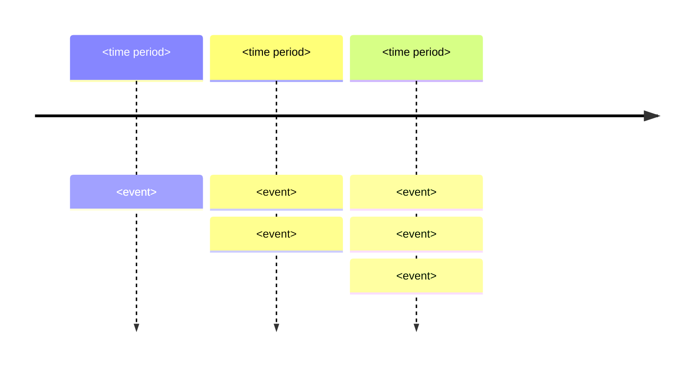
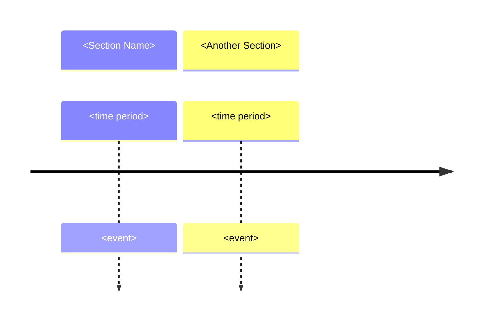
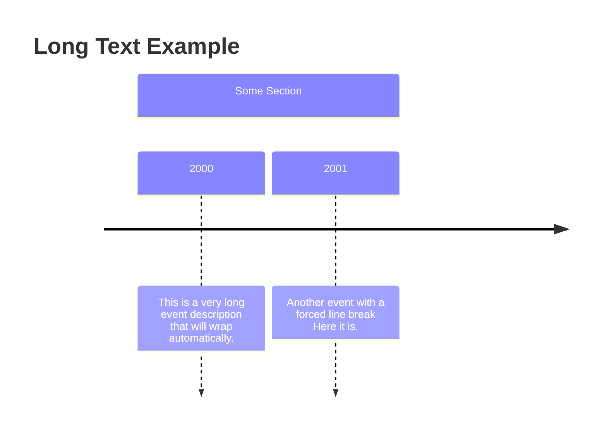
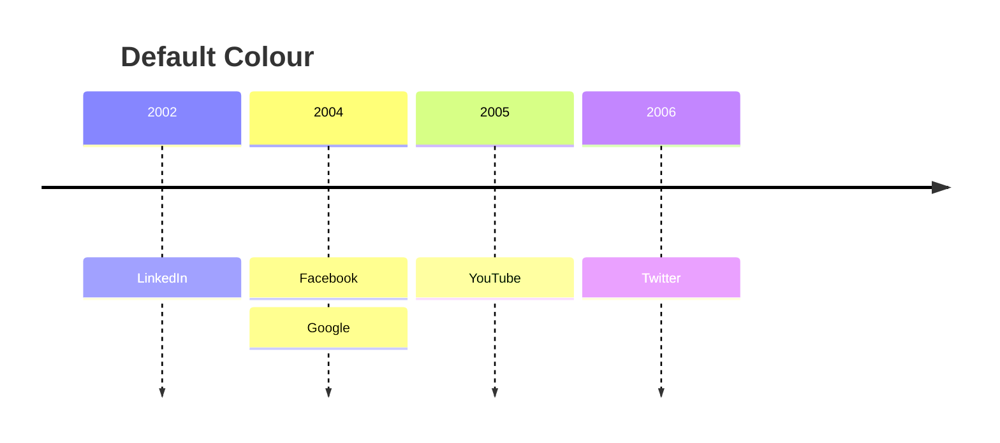
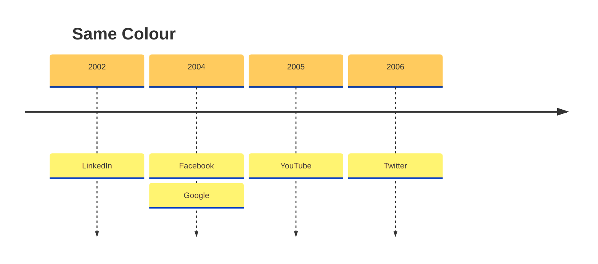
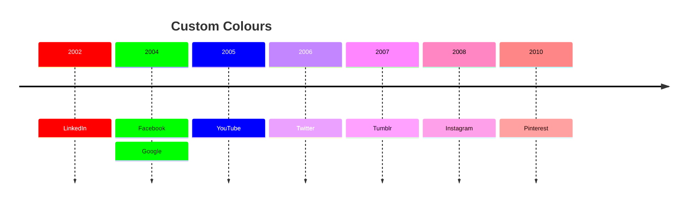
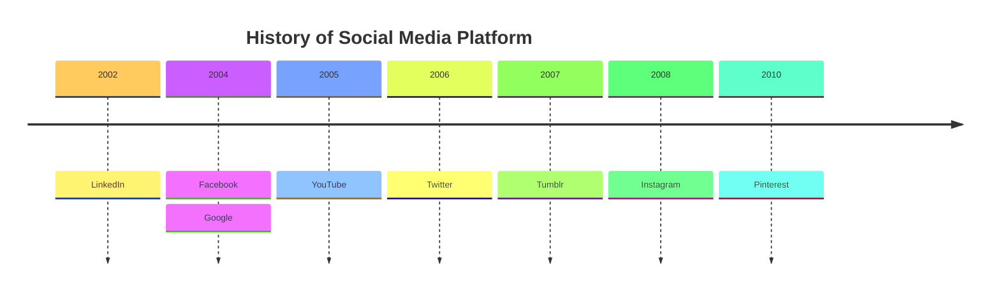
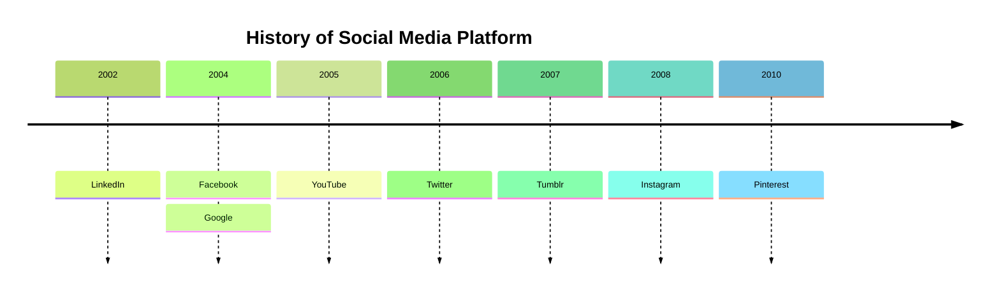
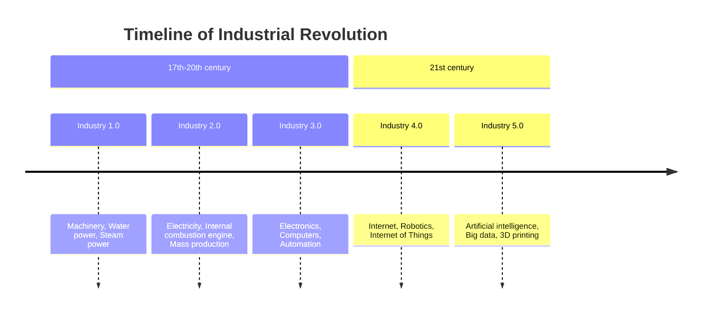

# Mermaid Timeline Diagram – Code Documentation

---

## 1. Overview

A **Timeline** diagram is an experimental Mermaid diagram type that visualises a chronology of events, dates, or periods of time.  
It is rendered as a horizontal line with labelled time‑periods and events.  
The syntax is stable; only the icon integration is experimental.

---

## 2. Syntax



* `timeline` – keyword that starts the diagram.  
* `title` – optional keyword to set the diagram title.  
* `<time period>` – any text (not limited to numbers).  
* `<event>` – any text.  
* Multiple events per time‑period are separated by `:`.  
* Events can be continued on the next line by starting the line with `:`.

---

## 3. Grouping (Sections / Ages)

Sections group time‑periods.  
All following time‑periods belong to the current section until a new section is declared.



If no section is defined, all time‑periods belong to a default section.

---

## 4. Text Wrapping

* Long text is automatically wrapped.  
* `<br>` forces a line break.



---

## 5. Styling

### 5.1 Default Colour Scheme

Each time‑period (and its events) gets its own colour scheme when no section is defined.



### 5.2 Disable Multi‑Colour

All time‑periods share the same colour scheme.



### 5.3 Custom Colour Scheme

Use `cScale0 … cScale11` (background) and `cScaleLabel0 … cScaleLabel11` (foreground) theme variables.



---

## 6. Themes

Mermaid supports several pre‑defined themes.  
Set the theme via the `theme` option in the configuration.

| Theme | Example |
|-------|--------|
| `base` |  |
| `forest` |  |
| `dark` |  |
| `default` |  |
| `neutral` |  |

### 6.1 Base Theme Example



### 6.2 Forest Theme Example



*(Repeat for `dark`, `default`, `neutral` – same diagram, different theme.)*

---

## 7. Integration with a Web Page

```html
<script type="module">
  import mermaid from 'https://cdn.jsdelivr.net/npm/mermaid@11/dist/mermaid.esm.min.mjs';
</script>
```

Mermaid’s Timeline uses experimental lazy loading & async rendering.  
Refer to the live editor for the full implementation.

---

## 8. Full Example – Industrial Revolution Timeline



---

### End of Documentation